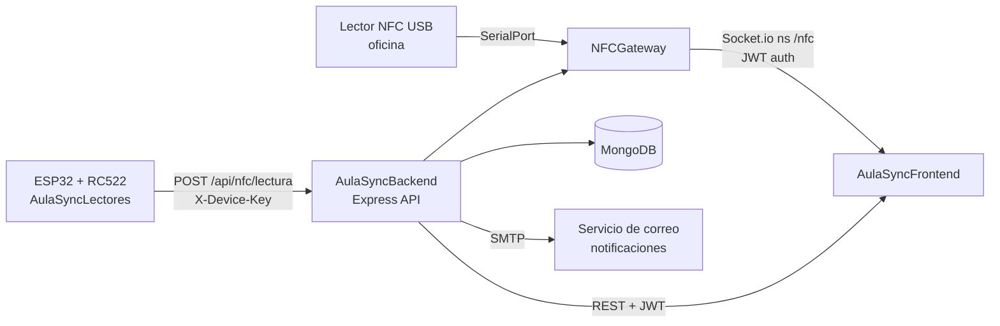
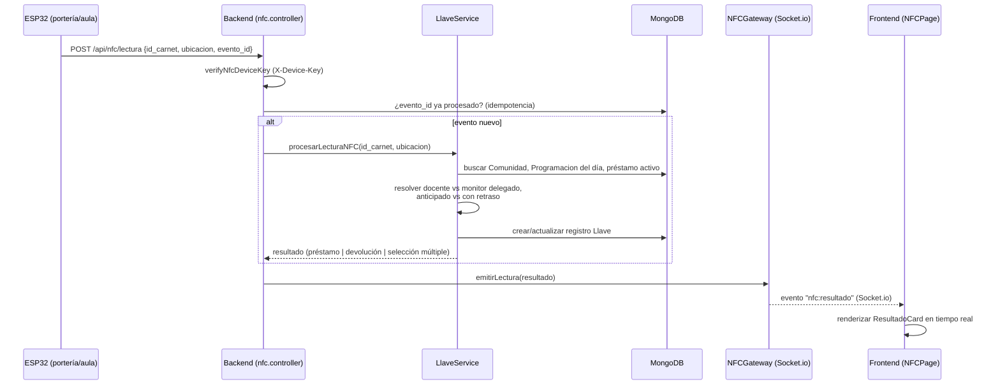

# AulaSync — Arquitectura general del sistema

Sistema de gestión de salones, llaves y equipos de la UCO con identificación por tarjeta NFC/RFID, compuesto por 3 repositorios independientes.

## Componentes

| Repo | Rama en uso | Stack | Rol |
|---|---|---|---|
| `AulaSyncLectores` | `main` (sin `develop`) | ESP32 + RC522 (C++/Arduino) | Firmware de campo: lee tarjetas y las reporta por HTTP |
| `AulaSyncBackend` | `develop` | Node/Express + MongoDB + Socket.io | API REST, lógica de negocio, WebSocket |
| `AulaSyncFrontend` | `develop` | React + Vite | Panel de administración y operación |

Documentación detallada por módulo: [`backend/README.md`](./backend/README.md) · [`frontend/README.md`](./frontend/README.md)

## Diagrama de componentes

## Flujo end-to-end: lectura de tarjeta → resultado en pantalla

## Dos canales de entrada NFC (backend)

1. **HTTP remoto** — dispositivos ESP32 en campo, autenticados por `X-Device-Key` estática. Sin sesión de usuario.
2. **Serie local** — un lector USB conectado al propio servidor, para uso de oficina; expuesto a los clientes frontend vía Socket.io con JWT y un protocolo de "cola de intención" (TTL 60s, FIFO) para que solo un usuario a la vez controle el lector físico compartido.

Ambos canales convergen en la misma lógica de negocio (`LlaveService`) y el mismo mecanismo de notificación (`NFCGateway` → WebSocket → frontend).

## Identidad y autenticación (dos sistemas distintos, no confundir)

- **Usuarios del sistema** (`admin_programacion` / `auxiliar_programacion`): login con usuario/contraseña, JWT access (8h) + refresh (7d) rotativo, usado por el frontend.
- **Comunidad** (docentes, estudiantes, personal): identificados por `numero_documento`/`id_carnet`, no tienen cuenta ni contraseña — se identifican físicamente con su tarjeta NFC. Es la entidad de negocio central referenciada por `Programacion`, `Llave`, `Reserva`, `Monitor`.
- **Dispositivos ESP32**: clave estática compartida (`X-Device-Key`), sin JWT, sin identidad individual por dispositivo.

## Proceso automático de fondo

Cron cada 5 minutos en el backend (`notificacion.scheduler.js`): sincroniza reservas vencidas → detecta llaves en mora (comparando hora de fin de clase en TZ `America/Bogota` contra `tiempo_maximo_prestamo_minutos` configurable por bloque) → encola notificaciones por correo con reintento y backoff exponencial → escala a `Novedad` automática si se agotan los recordatorios.

## Notas de estado del repositorio

