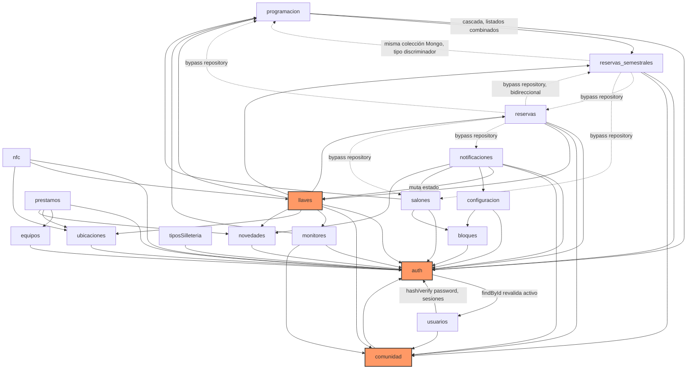

# Auditoría técnica — AulaSyncBackend

Documentación de arquitectura y auditoría por módulo del backend de AulaSync (Express + Mongoose, vertical slicing por feature: `src/features/<dominio>/routes→controller→service→repository→schema`). Cada archivo cubre propósito, modelo de datos, diagramas de clases y de secuencia, puntos de inflexión de negocio, dependencias cruzadas y riesgos de auditoría.

## Índice de módulos

| Módulo | Resumen |
|---|---|
| [`auth`](./auth.md) | Autenticación JWT (access+refresh con rotación), sesiones embebidas en el usuario, middlewares `requireAuth`/`requireAdmin`/`requireAux` usados por todo el sistema. |
| [`usuarios`](./usuarios.md) | Usuarios internos del sistema (admin/auxiliar), reutiliza el schema Mongoose definido en `auth`; sin hard delete, solo activación/desactivación. |
| [`comunidad`](./comunidad.md) | Catálogo maestro de personas de la universidad (docentes/estudiantes/empleados), sincronizado por lote desde sistema externo vía endpoint público sin autenticación. |
| [`programacion`](./programacion.md) | Programación académica regular (horario de clases), colección compartida con `reservas_semestrales` mediante campo discriminador `tipo`. |
| [`reservas_semestrales`](./reservas_semestrales.md) | Franjas horarias recurrentes semanales vigentes por semestre; persiste en la misma colección física que `programacion`. |
| [`reservas`](./reservas.md) | Reservas puntuales de salones con flujo de aprobación, entrega de llave asociada y check-in NFC; sincroniza estados vencidos vía cron. |
| [`llaves`](./llaves.md) | Núcleo del sistema: préstamo/devolución de llaves de salones vía NFC o manual, con arquitectura CQRS ligera (archivos planos, sin subcarpetas) y resolución automática docente/monitor. |
| [`equipos`](./equipos.md) | Catálogo de inventario de equipos electrónicos prestables (proyectores, controles); expuesto en `/api/inventario`. |
| [`prestamos`](./prestamos.md) | Préstamo/devolución de equipos (dominio separado de `llaves`, sin código compartido); sin concepto de mora/vencimiento. |
| [`nfc`](./nfc.md) | Punto de entrada HTTP para lectores ESP32; orquestador delgado que delega toda decisión de negocio a `llaves` y `ubicaciones`. |
| [`monitores`](./monitores.md) | Delegación de autoridad: vincula un estudiante monitor con un docente titular para heredar acceso a préstamo de llaves cuando el docente no tiene clase propia. |
| [`notificaciones`](./notificaciones.md) | Motor de envío/auditoría de correos transaccionales (vencimiento de llaves, reservas no reclamadas); es quien muta el estado de `llaves` y dispara `novedades` por mora. |
| [`novedades`](./novedades.md) | Bitácora de incidencias sobre llaves/equipos, manual o generada automáticamente por `notificaciones` ante demora crítica. |
| [`configuracion`](./configuracion.md) | Parámetros de tiempo máximo de préstamo y recordatorios por bloque edilicio, consumidos por el motor de `notificaciones`. |
| [`catalogos`](./catalogos.md) | `bloques`, `tiposSilleteria`, `salones`, `ubicaciones` — catálogos base; `ubicaciones` es el único con lógica de dominio real (autorización de operaciones NFC). |

## Diagrama de dependencias entre módulos

**Lectura del diagrama**: flechas sólidas = dependencia limpia vía service/repository. Flechas punteadas (`-.->`) = acceso directo a un schema/modelo ajeno, saltándose la capa de repositorio/servicio del módulo dueño (documentado como riesgo en cada módulo afectado). `auth` y `comunidad` son las dependencias más transversales (blast radius alto); `llaves` es el núcleo funcional del sistema y el de mayor complejidad de negocio.

## Hallazgos transversales más relevantes

- **Sin cobertura de tests en todo el backend**: confirmado módulo por módulo (CodeGraph reporta "no covering tests found" en cada uno); no existe ningún archivo `*.test.js`/`*.spec.js` en el repositorio.
- **Bypass sistemático de capas (violación de vertical slicing)**: varios módulos (`reservas`, `reservas_semestrales`, `notificaciones`) acceden a schemas Mongoose de otros features directamente en vez de pasar por su repository/service — genera lógica de negocio duplicada y con comportamiento divergente entre implementaciones paralelas (ver `llaves.md` §7 y `reservas_semestrales.md` §6).
- **Lógica de solapamiento de horarios triplicada** entre `programacion`, `reservas` y `reservas_semestrales`, sin abstracción compartida.
- **Relaciones por nombre/clave en texto plano, no por `ObjectId`**, entre los catálogos base (`bloques`, `salones`, `ubicaciones`) y el resto del sistema — sin cascada de renombrado ni validación de huérfanos al eliminar.
- **Ausencia de transacciones Mongo** en operaciones críticas de `llaves` y `prestamos` — riesgo de condiciones de carrera en preéstamos concurrentes del mismo recurso.
- **Endpoint público sin autenticación** (`POST /api/comunidad/sync`) sin controles compensatorios (IP allowlist, secreto compartido, rate limit específico).
- **Autenticación de dispositivos NFC por clave única compartida**, sin identidad por dispositivo ni revocación individual.
