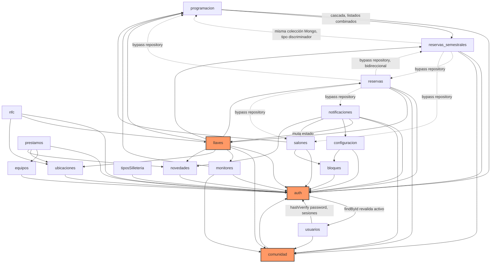

# Documentación técnica — LlaveroBack

Arquitectura y trazado por módulo del backend (Express + Knex sobre PostgreSQL, sin ORM; vertical slicing por feature: `src/features/<dominio>/routes→controller→service→repository`). Cada archivo cubre propósito, modelo de datos, diagramas de clases y de secuencia, puntos de inflexión de negocio, dependencias cruzadas y riesgos.

No hay archivos `*.schema.js`: los modelos Mongoose desaparecieron con la migración a Postgres. El esquema vive en `migrations/` y los repositorios traducen entre el payload del API y las columnas reales.

## Índice de módulos

| Módulo | Resumen |
|---|---|
| [`auth`](./auth.md) | Autenticación JWT (access + refresh con rotación) y login Office 365; sesiones en tabla propia `usuario_sesiones`; middlewares `requireAuth`/`requireAdmin`/`requireAux`. |
| [`usuarios`](./usuarios.md) | CRUD administrativo sobre `usuarios`; cuatro roles, incluido `porteria`. Sin hard delete. |
| [`porteros`](./porteros.md) | Permisos por bloque del rol `porteria` (`portero_bloques`) — el gate de autorización que reemplazó a `ubicaciones` en la migración 009. |
| [`comunidad`](./comunidad.md) | Catálogo maestro de personas de la universidad, sincronizado por lote desde un sistema externo. |
| [`programacion`](./programacion.md) | Programación académica; herencia por tabla con `regulares`, `semestrales` y `fantasma` sobre una cabecera común. |
| [`reservas_semestrales`](./reservas_semestrales.md) | Franjas recurrentes por semestre; subtipo `semestral` de `programacion`. |
| [`reservas`](./reservas.md) | Reservas puntuales con aprobación, entrega de llave y check-in; solapamiento impedido por restricción de exclusión en la base. |
| [`llaves`](./llaves.md) | Núcleo: préstamo y devolución de llaves, en una sola fila por registro. Autorización por rol y bloque. |
| [`equipos`](./equipos.md) | Inventario de equipos prestables; expuesto en `/api/inventario`. |
| [`prestamos`](./prestamos.md) | Préstamo y devolución de equipos, en tablas separadas y con línea por equipo. |
| [`monitores`](./monitores.md) | Delegación por clase: un monitor puede reclamar la llave de una programación concreta. |
| [`notificaciones`](./notificaciones.md) | Motor de correos transaccionales con reintentos; muta el estado de `llaves` y dispara `novedades` por mora. |
| [`novedades`](./novedades.md) | Bitácora de incidencias sobre llaves, equipos o el aula; con catálogo de elemento afectado y estados monótonos. |
| [`configuracion`](./configuracion.md) | Tiempo máximo de préstamo y recordatorios, por bloque. |
| [`catalogos`](./catalogos.md) | `bloques`, `tiposSilleteria`, `salones`, `ubicaciones` (histórico) y `elementos-afectados`. |
| [`nfc`](./nfc.md) | **Retirado.** El feature ya no existe; se conserva como referencia histórica. |

## Diagrama de dependencias entre módulos

**Lectura del diagrama**: flechas sólidas = dependencia limpia vía service/repository. Flechas punteadas (`-.->`) = acceso directo a un schema/modelo ajeno, saltándose la capa de repositorio/servicio del módulo dueño (documentado como riesgo en cada módulo afectado). `auth` y `comunidad` son las dependencias más transversales (blast radius alto); `llaves` es el núcleo funcional del sistema y el de mayor complejidad de negocio.

## Hallazgos transversales más relevantes

- **Sin cobertura de tests en todo el backend**: confirmado módulo por módulo (CodeGraph reporta "no covering tests found" en cada uno); no existe ningún archivo `*.test.js`/`*.spec.js` en el repositorio.
- **Bypass de capas (violación de vertical slicing)**: varios módulos consultan tablas de otros features armando el query en su propio repositorio en vez de pasar por el repository/service dueño — genera lógica duplicada y divergente entre implementaciones paralelas (ver `llaves.md` §7 y `reservas_semestrales.md` §6).
- **Lógica de solapamiento de horarios triplicada** entre `programacion`, `reservas` y `reservas_semestrales`, sin abstracción compartida.
- **Snapshots de texto conviviendo con las FK**: las relaciones son claves foráneas reales y el borrado en blando está protegido por `trg_block_soft_delete`, pero muchas tablas guardan además el nombre copiado al momento del registro (`aula`, `docente_nombre`, `equipo_nombre`, `novedades.salon`). En los históricos es deliberado; en `novedades.salon` es accidental y queda desincronizado si el salón se renombra.
- **Ausencia de transacciones Mongo** en operaciones críticas de `llaves` y `prestamos` — riesgo de condiciones de carrera en preéstamos concurrentes del mismo recurso.
- **Endpoint público sin autenticación** (`POST /api/comunidad/sync`) sin controles compensatorios (IP allowlist, secreto compartido, rate limit específico).
- **Autenticación de dispositivos NFC por clave única compartida**, sin identidad por dispositivo ni revocación individual.
