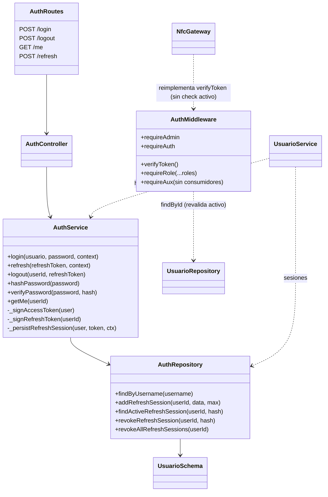
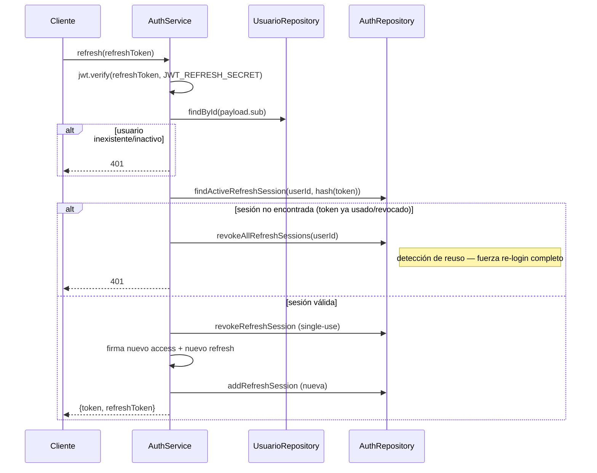
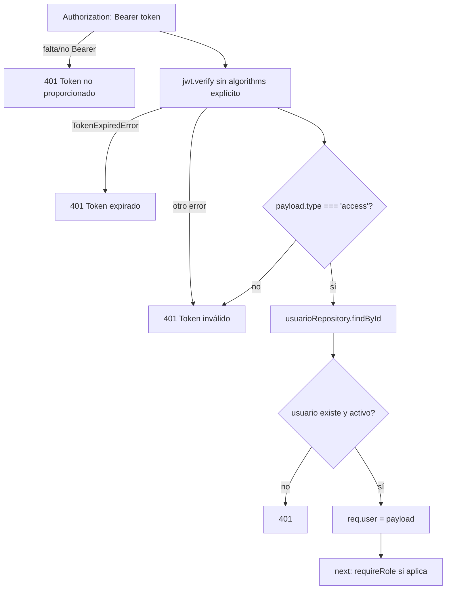

# Módulo `auth`

## 1. Propósito

Centraliza autenticación/autorización de la API: emisión y verificación de JWT (access + refresh), login institucional Office 365, sesiones de refresh en la tabla `usuario_sesiones`, y middlewares de guardia de rutas (`requireAuth`, `requireAdmin`, `requireAux`) usados por prácticamente todos los demás features. Es dueño de la tabla `usuarios`, sobre la que el feature `usuarios/` hace el CRUD administrativo.

## 2. Modelo de datos

Tablas `usuarios` y `usuario_sesiones` (migración `003_usuarios.js`, ampliada por la 009). Las sesiones dejaron de ser un array embebido en el documento del usuario y pasaron a tabla propia.

### `usuarios`

| Columna | Tipo | Detalle |
|---|---|---|
| `id`, `created_at`, `updated_at`, `deleted_at` | — | columnas universales |
| `usuario` | text NOT NULL | único entre los no borrados |
| `nombre` | text NOT NULL | |
| `email` | text NOT NULL | único entre los no borrados |
| `contacto` | text | |
| `rol` | text NOT NULL | CHECK: `admin_programacion`, `auxiliar_programacion`, `superadmin`, `porteria` |
| `hash_password` | text NULL | **nullable**: las cuentas Office 365 no tienen contraseña local |
| `activo` | bool | default `true` |
| `numero_documento` | text | vínculo opcional a `comunidad`, sin FK |
| `proveedor_auth` | text NOT NULL | CHECK: `local`, `office365`; default `local` |

### `usuario_sesiones`

`usuario_id` (FK a `usuarios`), `token_hash`, `user_agent`, `ip` (tipo `inet`), `expires_at`, `revoked_at`. Rotación de refresh tokens.

### Índices

```
ux_usuarios_usuario             (usuario)    WHERE deleted_at IS NULL
ux_usuarios_email               (email)      WHERE deleted_at IS NULL
ux_usuario_sesiones_token_hash  (token_hash) WHERE deleted_at IS NULL
idx_usuario_sesiones_usuario_id (usuario_id)
idx_usuario_sesiones_expires_at (expires_at)
```

Los únicos son **parciales**: aplican solo a filas vivas, para que el borrado en blando no bloquee reutilizar un usuario o email. El lookup de refresh token tiene índice propio.

`passwordSchema` (Zod): min 8, max 72, requiere mayúscula, minúscula, dígito y carácter especial. Solo aplica a cuentas `local`.

## 3. Diagrama de clases / dependencias



## 4. Flujos principales

### 4.1 Login

```mermaid
sequenceDiagram
    participant C as Cliente
    participant R as auth.routes
    participant S as AuthService
    participant Repo as AuthRepository
    participant DB as MongoDB

    C->>R: POST /login {usuario,password}
    R->>R: authLimiter (10/15min) + validate(loginSchema)
    R->>S: login(usuario,password,context)
    S->>Repo: findByUsername (select +hash_password)
    alt no existe o !activo
        S-->>C: 401 "Usuario o contraseña incorrectos" (mensaje genérico)
    end
    S->>S: bcrypt.compare(password, hash)
    alt no coincide
        S-->>C: 401 mismo mensaje genérico
    end
    S->>S: _signAccessToken (JWT 8h) + _signRefreshToken (JWT 7d, jti único)
    S->>Repo: addRefreshSession (guarda SHA-256 del refresh, no el token en claro; máx 5 sesiones)
    S-->>C: {token, refreshToken, usuario}
```

### 4.2 Refresh con rotación y detección de reuso



### 4.3 verifyToken (middleware de cada request protegida)



## 5. Puntos de inflexión

- **Mensajes genéricos en login**: usuario inexistente e inactivo dan el mismo error que password incorrecto — correcto para evitar enumeración de usuarios.
- **Rate limiting asimétrico**: `authLimiter` 10/15min en `/login`, `refreshLimiter` 20/15min en `/refresh`; `/logout` **no tiene limiter**.
- **Revalidación de `activo` en cada request**: `verifyToken` consulta la BD en cada petición (no solo confía en el JWT), por lo que desactivar un usuario invalida su acceso a la API REST inmediatamente — pero el JWT en sí sigue siendo válido hasta expirar si se usa fuera del middleware (ver riesgo en §7).
- **Reuso de refresh token detectado → revoca TODAS las sesiones** (defensa estándar contra robo/replay de refresh token).
- **Rotación single-use**: cada refresh invalida el token usado y emite uno nuevo.
- **Tope de sesiones concurrentes**: `JWT_MAX_SESSIONS` (default 5) — purga sesiones revocadas/expiradas en cada login/refresh sin dejar rastro histórico.
- **Logout no invalida el access token** (JWT stateless, comentario explícito en el código) — solo revoca refresh. El access sigue válido hasta 8h.
- **Cálculo de expiración de sesión frágil**: `_resolveRefreshExpiryDate` solo distingue sufijo `'h'` vs. todo lo demás como días — si `JWT_REFRESH_EXPIRES_IN` se configura en minutos/semanas, el `expires_at` guardado queda desalineado del `expiresIn` real usado por `jwt.sign`.
- **Password nunca se re-valida contra política fuerte en login** (solo en creación/cambio) — correcto, para no romper logins existentes.

## 6. Dependencias externas/cruzadas

**Usa**: `usuarios/usuario.repository.js` (`findById` en `refresh` y en `verifyToken`).

**Lo usan**:
- `src/app.js` monta `/api/auth`.
- `usuarios/usuario.service.js` — `hashPassword`/`verifyPassword`.
- `usuarios/` opera sobre la misma tabla `usuarios`; `ROLES` y `passwordSchema` viven en `auth/auth.constants.js`.
- **17 módulos** consumen `requireAuth` (prácticamente todas las rutas del sistema); **12 módulos** consumen `requireAdmin`.
- `requireAux` está definido pero **sin consumidores** en todo el repo.
- `shared/websocket/nfc.gateway.js` **reimplementa** la verificación JWT para el canal Socket.IO en vez de reutilizar `verifyToken` — ver riesgo §7.

## 7. Riesgos y observaciones de auditoría

- **Divergencia de seguridad HTTP vs WebSocket**: `nfc.gateway.js` valida firma/tipo del JWT pero **no consulta la BD ni valida `activo`** — un usuario desactivado con access token aún vigente (hasta 8h) puede seguir conectado al canal NFC/WebSocket aunque ya no pueda usar la API REST.
- **Duplicación de lógica de verificación JWT** en 2 lugares (`auth.middleware.js` y `nfc.gateway.js`), con constantes `JWT_ISSUER`/`JWT_AUDIENCE` repetidas literalmente en 3 archivos.
- **`jwt.verify` sin restricción explícita de `algorithms`** en los 3 puntos donde se usa — no es una vulnerabilidad crítica con `jsonwebtoken@^9`, pero es una desviación de buena práctica defensiva.
- **`_resolveRefreshExpiryDate` frágil ante formatos no-horas/días** en la env var de expiración de refresh.
- **`requireAux` código muerto** — o feature pendiente de aplicar en rutas que hoy solo distinguen `requireAuth`/`requireAdmin`.
- **`/logout` sin rate limiter** — inconsistencia menor frente al resto del módulo.
- **Sin auditoría histórica de sesiones**: sesiones revocadas/expiradas se purgan del array en cada login/refresh sin dejar rastro.
- **Búsqueda de sesión O(n) en memoria** sobre el array embebido en vez de query indexada — impacto mínimo dado el tope de 5 sesiones.
- **Puntos positivos confirmados**: no hay secretos hardcodeados (`.env.example` solo placeholders); manejo de errores async correcto vía `express-async-errors` + `error.handler.js`.
