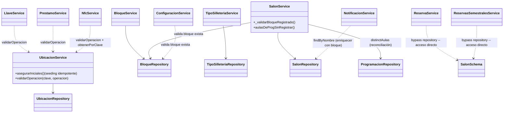
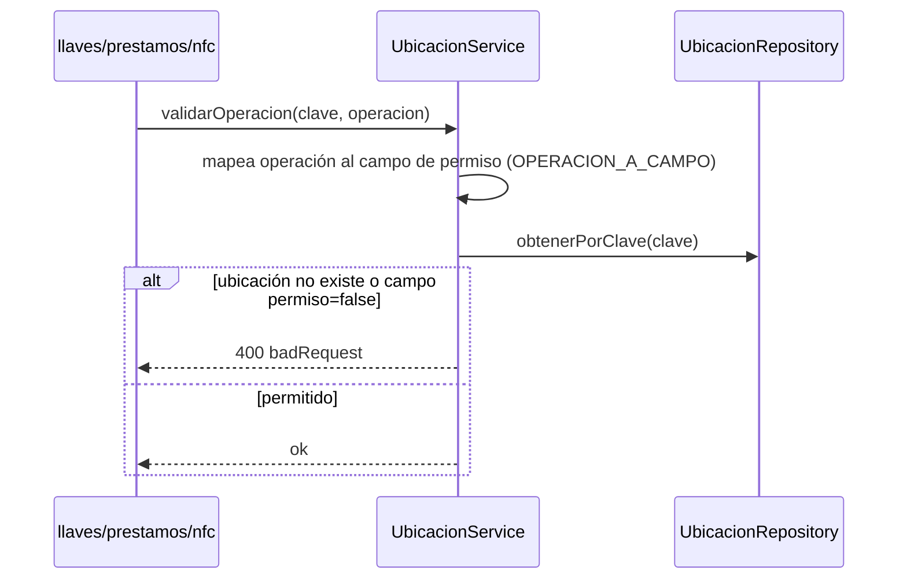

# Módulos catálogo: `bloques`, `tiposSilleteria`, `salones`, `ubicaciones`

Se agrupan por ser CRUDs mayormente simples y estructuralmente análogos, salvo `ubicaciones`, que sí contiene lógica de dominio real (seeding idempotente + autorización de operaciones NFC) y se documenta con mayor detalle.

## 1. Propósito

- **`bloques`**: catálogo de bloques/edificios de la universidad.
- **`tiposSilleteria`**: catálogo de tipos de mobiliario de salones.
- **`salones`**: catálogo de salones/aulas — el más "central" de los 4, referencia a `bloques` y es referenciado por `reservas`, `reservas_semestrales`, `notificaciones`.
- **`ubicaciones`**: catálogo de ubicaciones operativas físicas (oficina, portería) donde ocurren operaciones NFC de identificación/préstamo/devolución — es la puerta de autorización real usada por `llaves`, `prestamos` y `nfc`.

## 2. Modelos de datos

### `Bloque` — `bloque.schema.js:4-17`, colección `bloques`
`nombre_bloque` (String, required, unique, index), `fecha_creacion`/`fecha_actualizacion` (Date, default now).

### `TipoSilleteria` — `tipo_silleteria.schema.js:4-17`, colección `tipos_silleteria`
`nombre` (String, required, unique, index), `fecha_creacion`/`fecha_actualizacion`.

### `Salon` — `salon.schema.js:4-17`, colección `salones`
`nombre_salon` (String, required, unique, index), `nombre_bloque` (String, required, index — FK por **nombre**, no ObjectId), `capacidad_estudiantes` (Number, required, min 1), `tipo_silleteria` (String, required — FK por nombre, **sin validar**), `fecha_creacion`/`fecha_actualizacion`.

### `Ubicacion` — `ubicacion.schema.js:4-67`, colección `ubicaciones_operativas`
`clave` (String, required, unique, trim, lowercase — identificador funcional), `nombre`, `descripcion` (default `''`), `activa` (Boolean, default true, index), `permite_identificacion`/`permite_prestamo_llaves`/`permite_devolucion_llaves`/`permite_prestamo_equipos` (Boolean, default false — flags de permiso), `creado_por`/`actualizado_por` (auditoría de actor), `fecha_creacion`/`fecha_actualizacion`.

Todas las relaciones entre estos 4 catálogos y el resto del sistema son **por nombre/clave en texto plano**, no por `ObjectId`/`ref`.

## 3. Diagrama de clases / dependencias

## 4. Flujo destacado: `ubicaciones.validarOperacion` (autorización NFC)

Seeding al arrancar: `server.js` invoca `asegurarIniciales()`, que hace upsert (`$setOnInsert`) de las ubicaciones default (oficina + portería superior) — memoizado con una promesa para evitar reseeds concurrentes, también invocado antes de cada operación de lectura/escritura del módulo como guard de idempotencia.

## 5. Puntos de inflexión

- **`salones` valida el bloque referenciado exista** (`_validarBloqueRegistrado`), pero **no valida el tipo de silletería** contra su propio catálogo — inconsistencia entre dos relaciones con la misma forma (string denormalizado + catálogo dedicado). `tiposSilleteria` es un catálogo puramente decorativo, sin consumidores reales fuera de su propio módulo.
- **`salones` expone `aulasDeProgSinRegistrar()`**: cruza `programacion.distinctAulas()` contra salones registrados para detectar aulas usadas en programación académica sin registro de salón — utilidad de reconciliación de datos, no CRUD puro.
- **`ubicaciones.clave` es mutable vía PATCH**: si se renombra la clave de "oficina" (usada como constante hardcodeada `UBICACIONES.OFICINA` en `shared/constants/nfc.constants` y como default en `prestamo.schema.js`), todas las búsquedas futuras `obtenerPorClave(UBICACIONES.OFICINA)` fallarían con 404, rompiendo identificación/préstamo/devolución NFC en producción sin que el código detecte la desincronización.
- **Ninguno de los 4 catálogos valida referencias antes de `eliminar`** — riesgo sistémico de huérfanos.
- **Sin cascada de renombrado**: renombrar un bloque o salón no propaga el cambio a las colecciones que copiaron el nombre (`reservas`, `reservas_semestrales`, `configuracion`, `programacion`) — quedan desincronizadas silenciosamente.

## 6. Dependencias externas/cruzadas

- **`bloques`** lo usan: `salones` (`_validarBloqueRegistrado`), `configuracion` (`guardar` exige bloque existente). Referenciado como string libre sin validar por `reservas`, `reservas_semestrales`, `programacion`, `notificaciones`.
- **`tiposSilleteria`**: sin consumidores reales fuera de su propio módulo — candidato a subutilizado.
- **`salones`** lo usan: `notificaciones` (`findByNombre`), `reservas` y `reservas_semestrales` (**acceso directo al schema**, bypass de `SalonRepository`/`SalonService`).
- **`ubicaciones`** lo usan: `llaves`, `prestamos`, `nfc` (`validarOperacion`/`obtenerPorClave`) — es la puerta de autorización real del flujo NFC completo.

## 7. Riesgos y observaciones de auditoría

- **Patrón transversal en los 4 módulos**: ninguno valida referencias antes de eliminar (riesgo de huérfanos), y las relaciones son todas por nombre/clave en texto plano sin cascada de renombrado — riesgo de integridad referencial sistémico, no aislado a un módulo.
- **Violación de vertical slicing**: `reserva.service.js` y `reservas_semestrales.service.js` importan el modelo `Salon` directamente en vez de usar `SalonRepository`/`SalonService`.
- **`tiposSilleteria` no se valida contra `salones`**: cualquier texto se acepta como `tipo_silleteria` en un salón, sin garantía de integridad contra el catálogo dedicado.
- **`ubicaciones.eliminar` no impide borrar ubicaciones "default"/críticas** ni verifica préstamos/llaves activos referenciándola — el único fallback es que `asegurarIniciales()` la recrearía en el próximo *restart* del servidor, dejando una ventana de fallo hasta entonces.
- **Sin tests**: cero cobertura confirmada en los 4 módulos.
