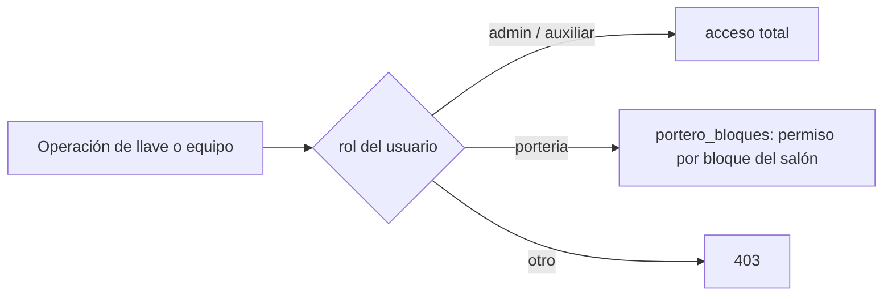

# Módulos catálogo: `bloques`, `tiposSilleteria`, `salones`, `ubicaciones`, `elementos-afectados`

Se agrupan por ser CRUDs estructuralmente análogos: tabla con columnas universales, borrado en blando y una guarda que impide borrar una fila todavía referenciada.

## 1. Propósito

- **`bloques`**: bloques/edificios de la universidad.
- **`tiposSilleteria`**: tipos de mobiliario de salones.
- **`salones`**: salones/aulas — el más central; referencia a `bloques` y `tipos_silleteria`, y es referenciado por `reservas`, `reservas_semestrales`, `notificaciones`, `novedades`.
- **`ubicaciones`** (`ubicaciones_operativas`): **histórico**. Fue la puerta de autorización del flujo NFC hasta la migración 009; hoy solo aporta el snapshot de ubicación en registros viejos. Ver §4.
- **`elementos-afectados`**: qué puede dañarse en un aula (silla, ventana, tablero…). Alimenta `novedades`. Migración 023.

## 2. Modelos de datos

Todas las tablas comparten `id uuid`, `created_at`, `updated_at`, `deleted_at`.

| Tabla | Columnas propias |
|---|---|
| `bloques` | `nombre_bloque` |
| `tipos_silleteria` | `nombre` |
| `salones` | `nombre_salon`, `bloque_id` → `bloques`, `capacidad_estudiantes`, `tipo_silleteria_id` → `tipos_silleteria` |
| `ubicaciones_operativas` | `clave` (lowercase), `nombre`, `descripcion`, `activa`, `permite_identificacion`, `permite_prestamo_llaves`, `permite_devolucion_llaves`, `permite_prestamo_equipos`, `creado_por`, `actualizado_por` |
| `elementos_afectados` | `clave` (lowercase), `nombre`, `descripcion`, `activo`, `orden` |

**Las relaciones son FK reales**, no strings denormalizados:

```
salones_bloque_id_fkey           FK (bloque_id)          → bloques(id)          ON DELETE RESTRICT
salones_tipo_silleteria_id_fkey  FK (tipo_silleteria_id) → tipos_silleteria(id) ON DELETE RESTRICT
```

La migración a Postgres reemplazó las referencias por nombre del modelo Mongo original. El API HTTP sigue aceptando y devolviendo nombres (`nombre_bloque`, `tipo_silleteria`) — los repositorios traducen.

## 3. Guarda de borrado en blando

El borrado es lógico (`deleted_at`), así que una FK `ON DELETE RESTRICT` no alcanza: nada impediría marcar como borrado un bloque que todavía tiene salones. Por eso existe el trigger `trg_block_soft_delete`, que corre `block_soft_delete_with_active_children(tabla_hija, columna_fk)` antes de cada `UPDATE` que ponga `deleted_at`.

Tablas protegidas:

```
bloques · comunidad · devoluciones · elementos_afectados · equipos · prestamos
programacion_semestres · programaciones · registros_llaves · reservas · salones
tipos_silleteria · ubicaciones_operativas · usuarios
```

La integridad referencial de estos catálogos la sostiene la base, no la capa de servicio.

## 4. `ubicaciones_operativas`: histórico

`ubicacion.service.js` todavía expone `validarOperacion(clave, operacion)`, que mapea una operación a su campo de permiso y rechaza si está en `false`. **Ningún módulo la llama.** La migración 009 la reemplazó por autorización de rol + bloque:



Consecuencias que siguen vivas en el código:

- `validarOperacion` es **código muerto**.
- Los campos `ubicacion_prestamo`/`ubicacion_devolucion` de `registros_llaves` y `prestamos` quedaron congelados en `oficina_centro_servicios_docentes`: todos los caminos de escritura caen a ese default. La UI ya no los muestra como punto de atención — usa el usuario gestor. Ver [llaves](./llaves.md).
- La entrada `Porteria Superior` del catálogo tiene `permite_prestamo_llaves: false`, así que nunca aparecía como opción de entrega aunque se la eligiera.

`asegurarIniciales()` sigue sembrando las dos ubicaciones default al arrancar, memoizado con una promesa para evitar reseeds concurrentes. Mismo patrón usa `elementoAfectado.service.js`.

## 5. Puntos de inflexión

- **`salones` expone `aulasDeProgSinRegistrar()`**: cruza las aulas usadas en programación académica contra los salones registrados para detectar faltantes. Reconciliación de datos, no CRUD.
- **`clave` mutable vía PATCH** en `ubicaciones_operativas` y `elementos_afectados`: las claves se usan como constantes (`UBICACIONES.OFICINA`) y como filtro de API. Renombrarlas desincroniza sin que el código lo detecte.
- **Catálogos con `orden`**: `elementos_afectados` ordena por `orden` y no alfabéticamente, para que lo más reportado quede arriba en el Select del formulario de novedades.
- **Desactivar en vez de borrar**: cuando la guarda de soft-delete rechaza un borrado, el camino correcto es marcar `activo = false`. El histórico necesita seguir resolviendo el nombre.

## 6. Dependencias cruzadas

- **`bloques`**: lo usan `salones` (FK), `configuracion` (exige bloque existente) y `portero_bloques` (permisos de portería).
- **`tiposSilleteria`**: solo `salones` (FK).
- **`salones`**: lo usan `notificaciones`, `reservas`, `reservas_semestrales`, `novedades` (`salon_id`) y `llaves` (para resolver el bloque al validar permisos de portería).
- **`ubicaciones`**: sin consumidores activos; solo lecturas de snapshot histórico.
- **`elementos-afectados`**: `novedades` (`elemento_afectado_id`).

## 7. Riesgos y observaciones

- **`validarOperacion` es código muerto** y su presencia sugiere una autorización que ya no ocurre ahí.
- **Sin cascada de renombrado en los campos denormalizados que quedan**: `novedades.salon` y los snapshots de nombre en `prestamo_equipos` copian el texto al momento del registro; renombrar el original no los actualiza. Es deliberado en los snapshots de préstamo, accidental en `novedades.salon`.
- **`tiposSilleteria` sigue siendo un catálogo de bajo uso**: solo lo consume `salones`.
- **Sin tests**: cero cobertura en los cinco módulos.
