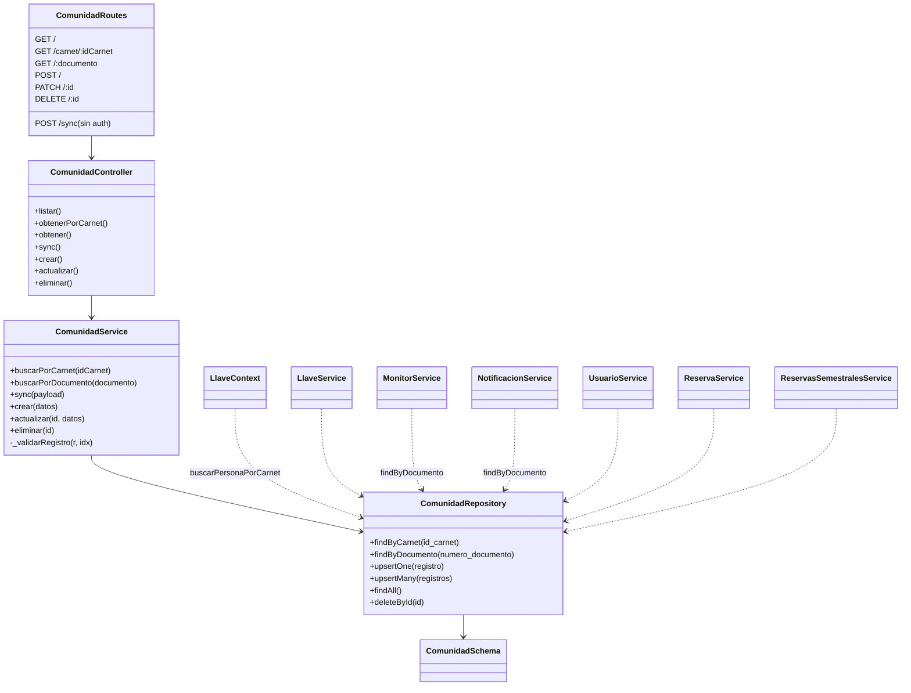

# Módulo `comunidad`

## 1. Propósito

Catálogo maestro de personas de la universidad (docentes, estudiantes, empleados), sincronizado masivamente desde un sistema externo y consultado por identidad en dos ejes: número de documento y carnet NFC (`id_carnet`). Es la fuente de verdad de identidad que consumen los flujos de préstamo de llaves por lectura NFC, monitores, notificaciones y reservas semestrales.

## 2. Modelo de datos

Tabla `comunidad` (migración `002_catalogos.js`).

| Columna | Tipo | Detalle |
|---|---|---|
| `id`, `created_at`, `updated_at`, `deleted_at` | — | columnas universales |
| `numero_documento` | text NOT NULL | único entre los no borrados |
| `nombre` | text NOT NULL | |
| `tipo` | text NOT NULL | CHECK: `docente`, `estudiante`, `empleado` |
| `facultad` | text | |
| `correo` | text | |
| `id_carnet` | text | **no único** — ver §5 |
| `numero_contacto` | text | |
| `es_estudiante` | bool NOT NULL | default `false` |
| `es_empleado` | bool NOT NULL | default `false` |

`tipo` guarda la categoría principal, mientras que `es_estudiante`/`es_empleado` permiten que una persona sea las dos cosas a la vez — el caso del empleado que además estudia, que un enum de un solo valor no puede representar.

### Índices

```
ux_comunidad_numero_documento  (numero_documento) WHERE deleted_at IS NULL
idx_comunidad_tipo             (tipo)
idx_comunidad_id_carnet        (id_carnet)         -- no único
idx_comunidad_nombre_trgm      GIN (immutable_unaccent(nombre) gin_trgm_ops)
```

El índice trigram sostiene la búsqueda por nombre sin acentos. `immutable_unaccent` debe calificar el esquema (`public.unaccent`) o Postgres falla al inlinear la función durante el `CREATE INDEX` — ver migración `001_extensions_and_functions.js`.

## 3. Diagrama de clases / dependencias



## 4. Flujos principales

### 4.1 Sincronización masiva `POST /sync`

```mermaid
sequenceDiagram
    participant Ext as Sistema externo
    participant R as comunidad.routes
    participant C as ComunidadController
    participant S as ComunidadService
    participant Repo as ComunidadRepository
    participant DB as MongoDB

    Ext->>R: POST /api/comunidad/sync (sin token)
    R->>C: sync(req,res)
    C->>S: sync(payload)
    alt payload.registro (1 elemento)
        S->>S: _validarRegistro(r)
        alt inválido
            S-->>C: 400 ApiError
        end
        S->>Repo: upsertOne(registro)
        Repo->>DB: findOneAndUpdate({numero_documento}, $set, upsert:true)
    else payload.registros (array)
        S->>S: registros.map(_validarRegistro) (síncrono, sin try/catch por elemento)
        note right of S: un solo registro inválido aborta TODO el batch (400)
        S->>Repo: upsertMany(registros)
        Repo->>DB: bulkWrite(ordered:false, upsert:true por numero_documento)
        note right of DB: si hay colisión a mitad de lote, error no capturado sube como 409 genérico; parte del lote puede haber quedado persistida (estado parcial invisible)
    end
    S-->>C: {sincronizados, insertados, actualizados}
    C-->>Ext: 200 ok
```

### 4.2 Resolución por carnet NFC (usada por `llaves`)

```mermaid
sequenceDiagram
    participant Llaves as llave.context.js
    participant Repo as ComunidadRepository
    participant DB as MongoDB

    Llaves->>Repo: findByCarnet(id_carnet)
    Repo->>DB: findOne({id_carnet})
    alt no existe
        Repo-->>Llaves: null
        Llaves-->>Llaves: flujo "persona no encontrada"
    else existe
        Repo-->>Llaves: persona (primer match; id_carnet no es único)
    end
```

## 5. Puntos de inflexión

- **Sync todo-o-nada**: `_validarRegistro` se aplica con `.map()` síncrono (`comunidad.service.js:68`) — si un solo registro del array falla la validación, la petición completa se rechaza con 400 y ningún registro se guarda, aunque el resto fuera válido.
- **Upsert sin distinción explícita insertar/actualizar**: se delega enteramente a Mongo (`findOneAndUpdate`/`bulkWrite` con `upsert:true` sobre `numero_documento`), sin lógica de negocio intermedia.
- **Reporte de errores documentado pero no implementado**: el Swagger de `/sync` documenta un campo `errores: [...]` (`comunidad.routes.js:148-151`) que el código nunca produce — desajuste doc/implementación.
- **`id_carnet` no único**: dos personas pueden compartir el mismo carnet (por error de carga o reasignación no limpiada). `findByCarnet` usa `findOne`, así que devuelve silenciosamente el primer match sin alertar de la ambigüedad — riesgo directo para el flujo NFC de llaves, que confía en esa resolución para decidir quién retira/entrega.
- **Ausencia de `runValidators`** en escrituras vía repositorio (`upsertOne`/`upsertMany`) — la validación de `enum` en `tipo` sólo la garantiza el service, no el schema en escritura.
- **Creación manual (`POST /`) sí rechaza duplicados** con 409 explícito (`comunidad.service.js:41-42`), a diferencia del comportamiento silencioso de `/sync` — inconsistencia de semántica entre los dos caminos de creación.
- **Borrado físico** (no soft-delete) en `DELETE /:id`.

## 6. Dependencias externas/cruzadas

**Usa**: ninguna dependencia hacia otros módulos de features (es un módulo base).

**Lo usan** (todos acceden directamente al repositorio, saltándose la capa de servicio — no reutilizan validaciones del `ComunidadService`):

- `llaves` — `llave.context.js:4,43-45` (`buscarPersonaPorCarnet`), `llave.service.js` (flujo de préstamo por NFC).
- `monitores` — `monitor.service.js:24,27` (`findByDocumento`).
- `notificaciones` — `notificacion.service.js:242,286` (`findByDocumento`).
- `usuarios` — `usuario.service.js:25-32` (enriquecimiento de listado).
- `reservas` — `reserva.service.js`, `reserva.repository.js`.
- `reservas_semestrales` — `reservas_semestrales.service.js:224,490-513`.

## 7. Riesgos y observaciones de auditoría

- **`POST /sync` público sin ninguna mitigación** (`comunidad.routes.js:162`): sin `requireAuth`, sin API key/secreto compartido, sin allowlist de IP, sin rate limiter (`nfcLimiter`/`authLimiter` existen en `rate.limiter.js` pero no se aplican aquí). Permite a cualquier actor no autenticado sobrescribir `id_carnet` de cualquier persona y así potencialmente suplantar identidad en el flujo NFC de llaves, o degradar el servicio con payloads inválidos en bucle.
- **Estado parcial invisible en sync masivo**: con `ordered:false` en `bulkWrite`, un error a mitad de lote puede dejar parte de los registros persistidos mientras el cliente recibe un error genérico interpretándolo como fallo total.
- **La validación de forma vive solo en el service**: el repositorio escribe lo que le pasen. Los CHECK de la tabla cubren `tipo`, pero el resto de las reglas (formato de correo, normalización de documento) se pierden si se llama al repositorio sin pasar por el service.
- **Sin validación de formato** para `numero_documento` ni `id_carnet` (acepta cualquier string tras `trim`).
- **Módulos consumidores acoplados al repositorio, no al service** — cualquier cambio de contrato en `ComunidadRepository` impacta directamente a 6+ módulos sin pasar por la capa de negocio del propio dominio.
