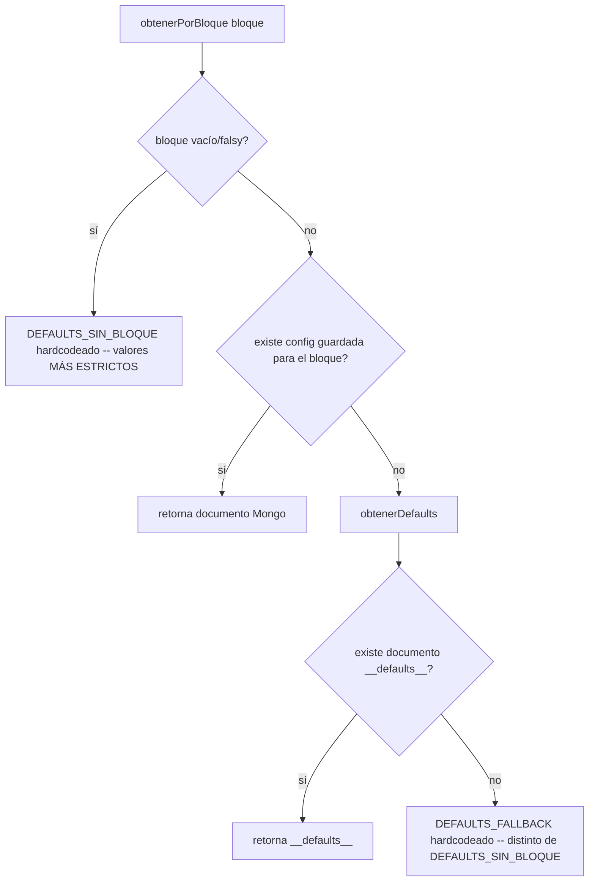
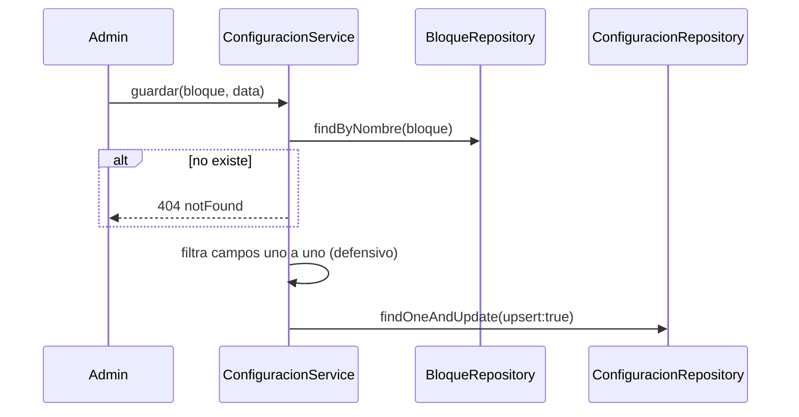

# Módulo `configuracion`

## 1. Propósito

Gestiona parámetros de **préstamo de llaves y notificaciones de vencimiento por bloque** edilicio. Alcance estrecho: cuatro parámetros que regulan cuánto tiempo puede tener alguien una llave prestada antes de generar recordatorios/novedad, por bloque. No es configuración global genérica del sistema.

## 2. Modelo de datos

`src/features/configuracion/configuracion.schema.js:4-38`, colección **`configuracion_bloques`**, `timestamps:true`, `versionKey:false`. No es documento único — es colección clave-valor por bloque, donde `nombre_bloque` es la clave (único). Un registro especial `nombre_bloque:'__defaults__'` actúa como pseudo-singleton de valores por defecto globales, coexistiendo en la misma colección.

| Campo | Tipo | Default | Validación |
|---|---|---|---|
| `nombre_bloque` | String | — | required, unique, trim |
| `tiempo_maximo_prestamo_minutos` | Number | 120 | min 5 (sin tope superior en Mongoose) |
| `intervalo_recordatorio_minutos` | Number | 30 | min 5 (sin tope superior en Mongoose) |
| `max_recordatorios` | Number | 5 | min 1, max 20 |
| `notificaciones_activas` | Boolean | true | — |

## 3. Diagrama de clases / dependencias

```mermaid
classDiagram
    class ConfiguracionRoutes
    class ConfiguracionController
    class ConfiguracionService {
        +listar() +obtenerDefaults() +obtenerPorBloque(bloque)
        +guardar(bloque,data) +guardarDefaults() +eliminar()
    }
    class ConfiguracionRepository
    class ConfiguracionSchema
    class BloqueRepository

    ConfiguracionRoutes --> ConfiguracionController --> ConfiguracionService
    ConfiguracionService --> ConfiguracionRepository --> ConfiguracionSchema
    ConfiguracionService --> BloqueRepository : valida existencia del bloque antes de guardar
    NotificacionService ..> ConfiguracionService : obtenerPorBloque (motor de vencimiento)
    ReservaRepository ..> ConfiguracionService : obtenerPorBloque (flag notificaciones_activas)
```

## 4. Flujos principales

### 4.1 Resolución de configuración en cascada



### 4.2 Escritura (solo ADMIN)



## 5. Puntos de inflexión

- **Sin caché en memoria**: cada llamada golpea Mongo directamente — el scheduler de notificaciones evalúa préstamo por préstamo cada 5 minutos, generando N queries repetidas por ciclo para el mismo bloque.
- **Doble capa de validación desalineada**: Zod en rutas limita `max(1440)` en los minutos, pero el schema Mongoose no tiene tope superior — si se escribe directo a Mongo (seed/script) se puede violar el límite de Zod.
- **Cascada de defaults en 3 niveles inconsistentes entre sí**: `DEFAULTS_FALLBACK` (120/30/5) vs. `DEFAULTS_SIN_BLOQUE` (60/15/2, más estricto) vs. documento Mongo `__defaults__` — sin bootstrap automático que persista `__defaults__` al arrancar la app. Dos rutas de "sin bloque específico" pueden devolver valores numéricos distintos.

## 6. Dependencias externas/cruzadas

**Usa**: `bloques` (`bloqueRepository.findByNombre`, valida existencia antes de configurar).

**Lo usan**:
- `reservas/reserva.repository.js` — lee solo `notificaciones_activas` en `bulkCompletarVencidas`.
- `notificaciones/notificacion.service.js` — consumidor principal: 4+ puntos de uso dentro de `verificarYEncolarNotificaciones` y `procesarColaNotificaciones` (gate de vencimiento, tope de recordatorios, cadencia, plantillas HTML). **Resuelve la config dos veces por notificación procesada** sin compartir resultado entre ambas resoluciones.

## 7. Riesgos y observaciones de auditoría

- **Sin tests**: cero cobertura confirmada; lógica de cascada de defaults no trivial y sin protección de tests.
- **Inconsistencia de límites Zod vs Mongoose** — solo protege si se escribe vía API.
- **Dos conjuntos de defaults divergentes** sin comentario que explique la intención — riesgo de que un cambio futuro en uno no se replique en el otro.
- **N+1 queries en el scheduler** — sin caché, escala linealmente con préstamos activos concurrentes.
- **`guardarDefaults` no filtra campos** a diferencia de `guardar`, que sí lo hace explícitamente — confía enteramente en la validación Zod de la ruta.
- **Autorización correcta**: lectura abierta a cualquier autenticado, escritura/borrado restringidos a ADMIN — sin hallazgos de fuga de privilegios.
