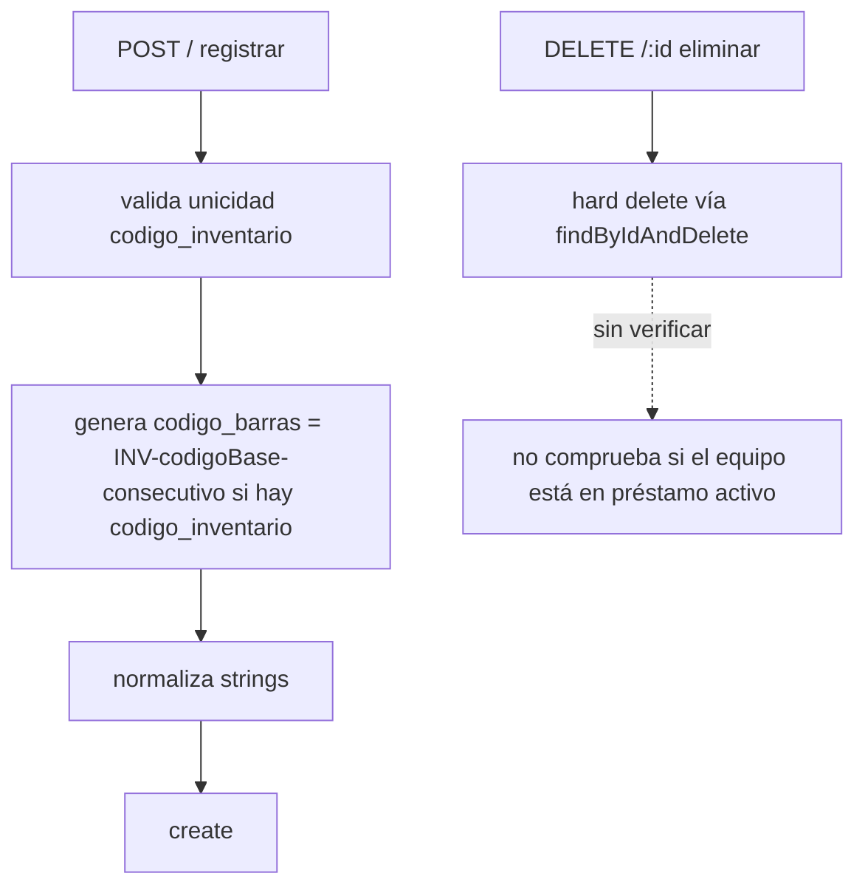
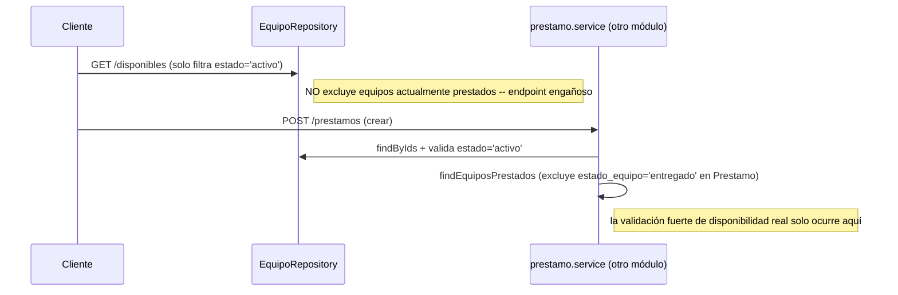

# Módulo `equipos`

## 1. Propósito

Catálogo de inventario de equipos electrónicos prestables (proyectores, controles remotos, etc.). CRUD de catálogo con búsqueda por texto y código de barras, consumido exclusivamente por el módulo `prestamos` para validar disponibilidad y registrar el detalle de cada equipo prestado. Desacoplado de salones — no tiene ubicación fija.

**Nota de nomenclatura**: la ruta pública se monta como `/api/inventario` (`app.js:58`), aunque la carpeta/feature, la colección Mongo y el modelo se llaman "equipo(s)" consistentemente en todo el código. Es la única divergencia entre nombre interno y prefijo REST — probablemente decisión de producto (el usuario final ve "inventario").

## 2. Modelo de datos

`Equipo` — `src/features/equipos/equipo.schema.js:8-25`, colección `equipos`.

| Campo | Tipo / reglas |
|---|---|
| `nombre` | String, required, trim |
| `marca` | String, default `''`, trim |
| `consecutivo` | Number, required |
| `codigo_inventario` | String, required:false, default null, **unique, sparse**, trim |
| `codigo_barras` | String, default `''`, trim |
| `descripcion` | String, default `''` |
| `estado` | enum `['activo','inactivo','mantenimiento']`, default `'activo'` |
| `fecha_creacion`/`fecha_actualizacion` | Date, default `Date.now` |

Índices: `codigo_barras: 1`, `estado: 1`, + único-sparse implícito de `codigo_inventario`.

**El enum de `estado` no incluye `prestado`/`dañado`/`de_baja`**, y **no existe campo de ubicación/salón asignado** — el equipo es catálogo puro; la ubicación es atributo de la transacción de préstamo (`ubicacion_prestamo` en `Prestamo`), no del equipo.

## 3. Diagrama de clases / dependencias

```mermaid
classDiagram
    class EquipoRoutes
    class EquipoController
    class EquipoService {
        +registrar() +actualizar() +eliminar()
        +listar() +disponibles() +buscarPorTexto()
    }
    class EquipoRepository {
        extends BaseRepository
        +findDisponibles() +findByCodigoBarras()
    }
    class EquipoSchema
    class BaseRepository

    EquipoRoutes --> EquipoController --> EquipoService
    EquipoService --> EquipoRepository --> EquipoSchema
    EquipoRepository --|> BaseRepository
    PrestamoService ..> EquipoRepository : findByIds (única dependencia externa)
```

## 4. Flujos principales

### 4.1 Alta y baja de equipo



### 4.2 Cálculo de disponibilidad real (fuera de este módulo)



## 5. Puntos de inflexión

- **No hay máquina de estados real de "prestado"**: el campo `estado` del equipo (`activo/inactivo/mantenimiento`) nunca cambia al prestarse/devolverse. El ciclo `entregado`/`devuelto` vive denormalizado dentro de `Prestamo.equipos[]`, no en el documento `Equipo`.
- **`GET /disponibles` es engañoso**: solo filtra `estado:'activo'`, sin excluir equipos actualmente en préstamo — la validación fuerte solo ocurre dentro de `PrestamoService.crear`.
- **Regeneración de `codigo_barras`** al cambiar `codigo_inventario` o `consecutivo` en actualización.
- **`actualizar()` sirve también para cambiar `estado`** — no hay endpoint dedicado ni máquina de estados; se puede "desactivar" un equipo que está en préstamo activo sin ninguna comprobación.

## 6. Dependencias externas/cruzadas

**Usa**: `shared/db/base.repository.js`, `shared/utils/normalize.helper.js`, `auth.middleware` (`requireAuth`).

**Lo usan**: únicamente `prestamos/prestamo.service.js` (`equipoRepository.findByIds`) — dependencia unidireccional, correcto para vertical slicing. Ningún otro módulo (salones, ubicaciones) referencia `equipos`.

## 7. Riesgos y observaciones de auditoría

- **Sin RBAC en escritura**: todas las rutas usan `requireAuth` puro, sin `requireRole` — cualquier usuario autenticado activo puede crear/actualizar/**eliminar** equipos.
- **Hard delete sin verificación de préstamo activo**: se puede eliminar físicamente un equipo actualmente prestado; el `Prestamo` quedaría referenciando un `equipo_id` inexistente (mitigado parcialmente por el snapshot denormalizado de nombre/marca/código en `prestamo.equipos[]`).
- **`estado` mutable sin restricción de transición** — se puede desactivar un equipo en préstamo activo sin comprobación.
- **`/disponibles` no filtra préstamos activos** (ver §4.2) — riesgo funcional de mostrar como disponible un equipo que no lo está.
- **Inconsistencia Zod vs Swagger**: el schema Zod de creación no exige `codigo_inventario`, mientras el Swagger lo marca `required` — documentación pública desalineada del contrato real.
- **`codigo_barras` no tiene índice único**, solo simple — si `codigo_inventario` es null, múltiples equipos pueden compartir `codigo_barras:''`, y `findByCodigoBarras('')` devolvería un match arbitrario.
- **Sin paginación** en `findAll()`/`disponibles()`.
- **Sin cobertura de tests** confirmada.
