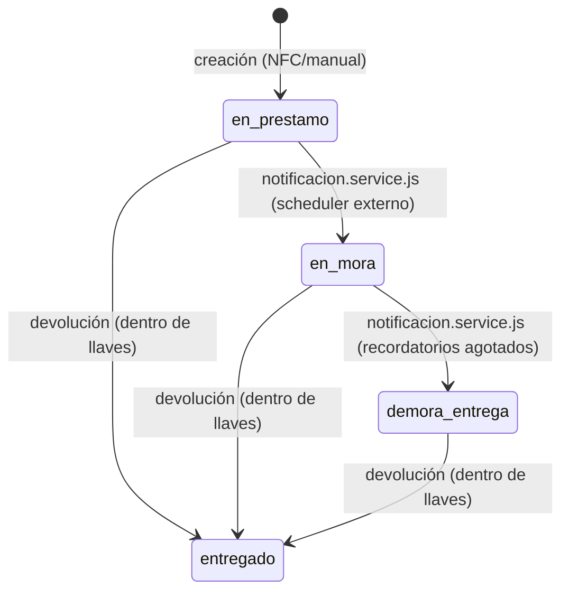
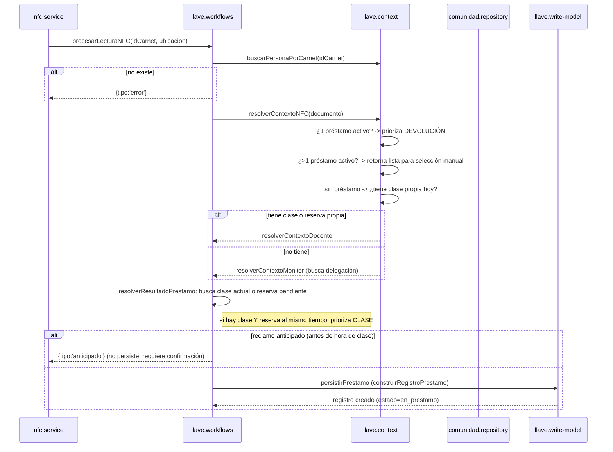
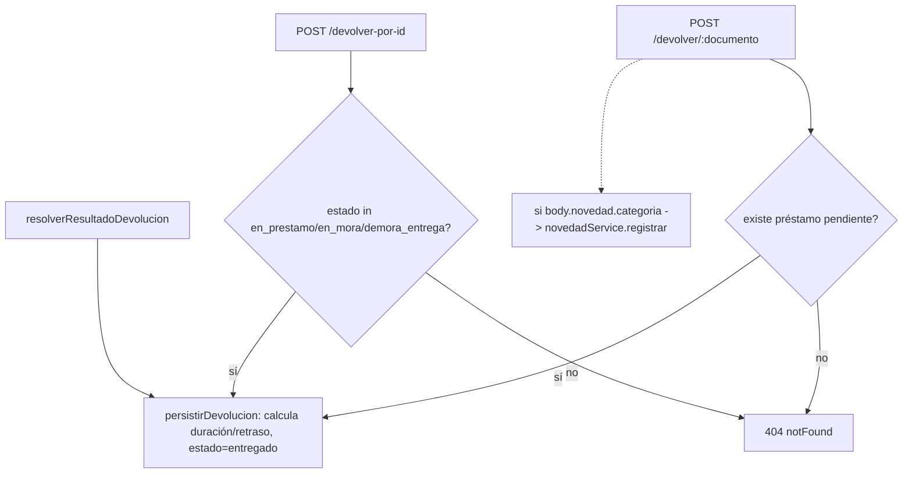
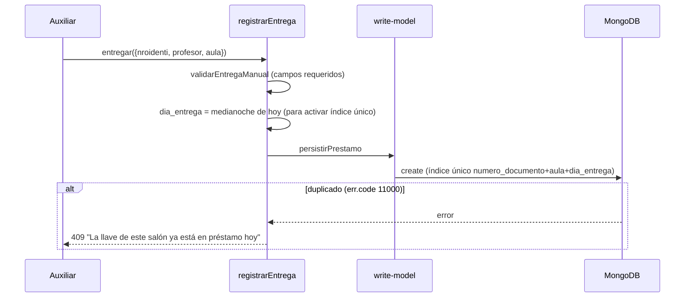

# Módulo `llaves`

## 1. Propósito

Gestiona el préstamo y devolución física de llaves de salones, disparado por lectura NFC de carnet (ESP32) o por acción manual de un auxiliar de oficina. Resuelve automáticamente si la persona que hace tap NFC debe **recibir** una llave (según su programación académica, reserva semestral, o asignación de monitor) o **devolver** una que ya tiene, y mantiene un historial paginado con estados de mora calculados por un scheduler externo (`notificaciones`).

**Aclaración estructural**: la "arquitectura CQRS" descrita en el enunciado no existe como subcarpetas (`context/domain/workflows/read-model/write-model`) — es CQRS ligero por **convención de nombres de archivo**, todos planos dentro de `src/features/llaves/`: `llave.routes.js`, `llave.controller.js`, `llave.service.js` (fachada + DI), `llave.workflows.js` (casos de uso), `llave.context.js` (resolución NFC), `llave.domain.js` (funciones puras), `llave.read-model.js` (queries formateadas), `llave.write-model.js` (comandos de escritura), `llave.repository.js`, `llave.schema.js`. No hay clases de dominio, agregados ni value objects tipados.

## 2. Modelo de datos

`Llave` — `src/features/llaves/llave.schema.js:4-47`, colección `registros_llaves`. El schema modela el **préstamo/evento**, no una entidad "llave física" con inventario propio.

| Campo | Tipo | Notas |
|---|---|---|
| `numero_documento` | String, required, index | docente titular |
| `docente`, `dia`, `horario`, `aula`, `facultad`, `materia` | String | contexto de la clase |
| `fecha_hora_entrega` | Date, index | |
| `fecha_hora_devolucion` | Date | null hasta devolución |
| `duracion`, `tiempo_retraso`, `tiempo_retraso_devolucion` | String | |
| `se_reclamo_a_tiempo`, `retraso_entrega` | Boolean | |
| `tipo_entrega`/`tipo_devolucion` | enum `['manual','carnet','']` | |
| `origen_registro` | enum `['individual','programacion','reserva_semestral','']` | |
| `ubicacion_prestamo`/`ubicacion_devolucion` | String | |
| `quien_reclama` | enum `['docente','monitor','otra_persona','']` | |
| `quien_entrega` | enum `['docente','monitor','']` | |
| `numero_documento_reclama/entrega`, `nombre_reclama/entrega` | String | |
| **`estado`** | enum `['en_prestamo','en_mora','demora_entrega','entregado']`, default `'en_prestamo'`, index | **máquina de estados** |
| `dia_entrega` | Date, index | fecha sin hora, solo para el índice único |

Índices: `numero_documento`, `fecha_hora_entrega`, `estado`, `dia_entrega` (simples) + **`{numero_documento, aula, dia_entrega}` único + sparse** (líneas 50-53), comentado como "previene entregar la misma llave dos veces el mismo día" — **pero ver §5, no cubre todos los flujos**.

### Máquina de estados



Sin transición hacia atrás ni estado `perdida`/`en_reparacion`/`disponible`. Cada préstamo es un documento nuevo — no hay "re-préstamo" del mismo registro. Comentario explícito en `llave.domain.js:333-335`: *"Los estados (en_mora, demora_entrega) son escritos por el scheduler según la configuración del admin; ya no se calculan con un hardcode visual."*

## 3. Diagrama de clases / dependencias

```mermaid
classDiagram
    class LlaveRoutes
    class LlaveController
    class LlaveService {
        DI de comunidad/reservas/context/write-model
        +procesarNFC() +devolver() +entregar()
        +confirmarAnticipado() +historial() +exportarHistorial()
    }
    class LlaveContext {
        +resolverContextoNFC()
        +resolverContextoDocente()
        +resolverContextoMonitor()
        +buscarPersonaPorCarnet()
    }
    class LlaveWorkflows {
        +procesarLecturaNFC()
        +confirmarPrestamoAnticipado()
        +registrarEntrega() +registrarDevolucion()
        +registrarDevolucionPorId()
    }
    class LlaveDomain {
        funciones puras: builders, matching, cálculo de estado
    }
    class LlaveReadModel {
        +obtenerHistorialFormateado()
        +formatearPendientes()
        auto-corrección de origen_registro
    }
    class LlaveWriteModel {
        +persistirPrestamo() +persistirDevolucion()
    }
    class LlaveRepository
    class LlaveSchema

    LlaveRoutes --> LlaveController --> LlaveService
    LlaveService --> LlaveContext
    LlaveService --> LlaveWorkflows
    LlaveWorkflows --> LlaveDomain
    LlaveWorkflows --> LlaveWriteModel --> LlaveRepository --> LlaveSchema
    LlaveService --> LlaveReadModel --> LlaveRepository
    LlaveContext --> ComunidadRepository : buscarPersonaPorCarnet
    LlaveContext --> ProgramacionRepository : findByDia
    LlaveContext --> MonitorRepository : findByDocumentoMonitor
    LlaveContext --> ReservasSemestralesRepository
    LlaveService --> ReservaRepository : checkin NFC pendiente
    LlaveService --> PorterosService : tienePermiso(usuario, bloque, operacion)
    NfcService ..> LlaveService : procesarLecturaNFC (entry point real)
    NotificacionService ..> LlaveRepository : escribe estado en_mora/demora_entrega
    ReservaService ..> LlaveSchema : bypass repository -- acceso directo
```

## 4. Flujos principales

### 4.1 Préstamo vía NFC



### 4.2 Devolución vía NFC / manual / por ID



### 4.3 Entrega manual con índice único



## 5. Puntos de inflexión

- **Sin transacciones Mongo en ninguna operación crítica** (confirmado, cero uso de `session`/`startTransaction` en el módulo).
- **Índice único de duplicados no cubre los flujos NFC**: el índice sparse `{numero_documento, aula, dia_entrega}` solo se activa cuando `dia_entrega` está seteado — y **solo `registrarEntrega` (manual) lo setea**. `construirRegistroPrestamo`, usado por NFC y `confirmarPrestamoAnticipado`, no incluye `dia_entrega`. Consecuencia: **dos lecturas NFC simultáneas del mismo docente/aula pueden crear préstamos duplicados sin protección de base de datos**, solo protección aplicativa por lectura previa no atómica (TOCTOU).
- **Decisión deliberada de no bloquear préstamos múltiples**: comentario explícito en `llave.workflows.js:272-275` — *"Ya no bloqueamos: el docente puede tener múltiples llaves"* — el sistema permite intencionalmente varios préstamos activos simultáneos por docente.
- **Idempotencia NFC vive fuera del módulo**: `nfc.service.js` usa `eventoId` para no reprocesar el mismo evento físico, pero no protege contra dos eventos NFC distintos casi simultáneos (cae en el riesgo anterior).
- **Prioridad devolución sobre préstamo**: si hay exactamente 1 préstamo activo, siempre se interpreta el tap como devolución.
- **Prioridad clase sobre reserva** cuando ambas coinciden en tiempo, decisión explícita en el código.
- **Auto-corrección silenciosa de `origen_registro`**: en cada consulta de pendientes, si un préstamo marcado `individual` coincide retroactivamente con la programación oficial, se re-etiqueta a `programacion` con un `try/catch` que ignora fallos silenciosamente.
- **Sin reporte de pérdida/daño en este módulo**: no existe estado `perdida`/`en_reparacion`. La única vía relacionada es adjuntar una `novedad` al devolver, delegada 100% a `novedades`.
- **Sin transferencia de titularidad explícita**: otra persona (monitor/"otra_persona") puede recibir/entregar vía `quien_reclama`/`quien_entrega`, pero la llave sigue asociada al `numero_documento` del docente titular.

## 6. Dependencias externas/cruzadas

**Usa**: `comunidad` (repository, identificación por carnet), `programacion` (repository, clases del día), `monitores` (repository, delegación), `reservas_semestrales` (repository), `reservas` (repository, checkin NFC), `porteros` (service, `tienePermiso` — gate de rol+bloque desde la migración 009), `salones` (repository, para resolver el bloque del aula), `auth` (middleware).

**Lo usan**:
- `nfc` — `nfc.service.js` dispara `llaveService.procesarLecturaNFC` en cada lectura (entry point principal).
- `programacion` — `llaveRepository.findByFecha` para deduplicar UI de clases con llave ya entregada.
- `reservas` — `reserva.service.js` y `reserva.repository.js` **importan el schema `Llave` directamente**, sin pasar por el repositorio del módulo (ver riesgo).
- `notificaciones` — `notificacion.service.js` **escribe** `estado: 'en_mora'`/`'demora_entrega'` directamente vía `llaveRepository.update` — es el "scheduler" mencionado en los comentarios de dominio.

No existe módulo `prestamos` compartido con `llaves` — son dominios completamente separados (ver `prestamos.md`).

## 7. Riesgos y observaciones de auditoría

- **Sin transacciones Mongo**: crear un préstamo y actualizar la reserva asociada son dos escrituras separadas no atómicas — un fallo intermedio deja una llave "huérfana" sin la reserva marcada como `llave_entregada`.
- **Índice único no cubre los flujos NFC** (ver §5) — riesgo real de duplicados bajo concurrencia en el camino más usado del sistema.
- **Violación de encapsulación CQRS desde `reservas`**: `reserva.service.js`/`reserva.repository.js` manipulan el modelo `Llave` directamente, duplicando la lógica de construcción de registro de préstamo y de devolución con **diferencias de comportamiento** respecto a `llave.domain.js` (ej. `tiempo_retraso_devolucion` queda hardcodeado en `''` en la versión de `reservas`) — dos implementaciones paralelas del mismo caso de uso que pueden divergir.
- **`Llave.create` en `reserva.service.js` sin manejo de `err.code === 11000`** (a diferencia de `llave.workflows.js`, que sí lo captura) — aunque en la práctica es irrelevante mientras el índice no se active en ese flujo.
- **Filtro de `estado` en historial paginado se aplica en memoria**, no en la query Mongo — cuando hay paginación y filtro simultáneos, se trae todo el resultado sin paginar y se filtra/pagina en JS, ineficiente en historiales grandes.
- **Auto-corrección con `try/catch` vacío**: side-effect de escritura dentro de una operación de lectura, con fallos silenciados sin logging.
- **Sin cobertura de tests**: CodeGraph marcó "no covering tests found" en todos los símbolos principales del módulo (el más complejo del sistema).
- **Acoplamiento por string, no por referencia**: `aula` es texto libre comparado contra `Salon.nombre_salon` en otros módulos, sin `ObjectId` — un rename de salón rompe silenciosamente el histórico.
- **No hay entidad "llave física"/inventario**: el schema modela el préstamo, no un catálogo de llaves con ciclo de vida propio — si el negocio requiere rastrear la llave física entre préstamos, ese requerimiento no está cubierto.
