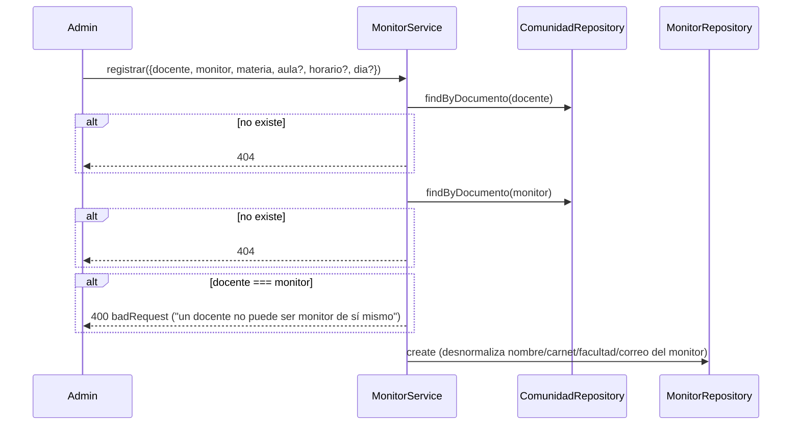
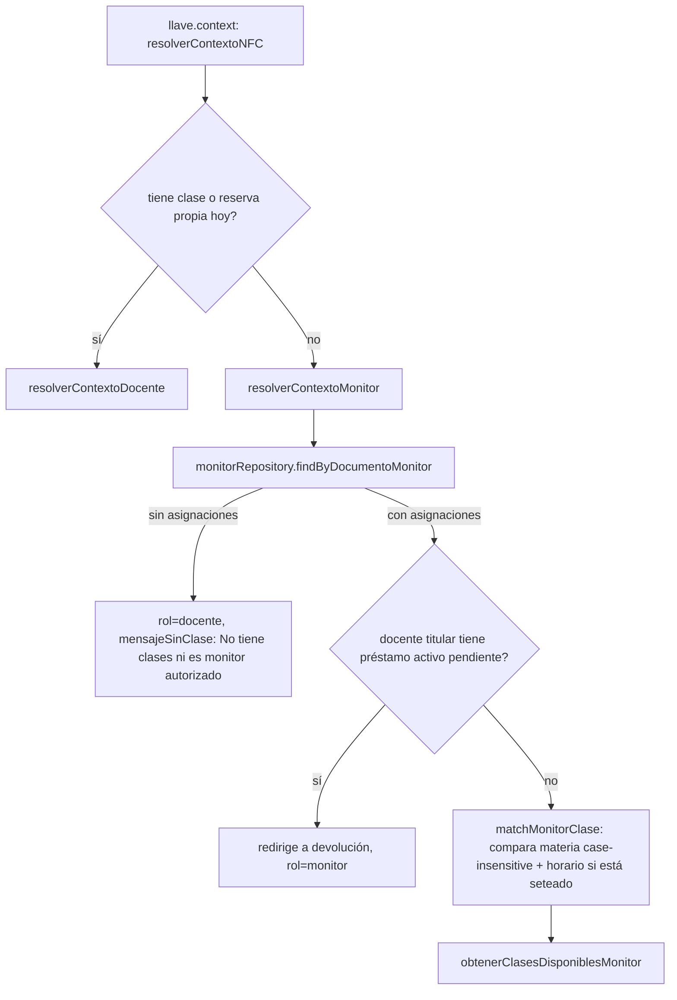

# Módulo `monitores`

## 1. Propósito

Tabla de asignación/delegación: vincula a un estudiante (monitor) con un docente titular para una materia concreta, con aula/horario/día opcionales. Ser "monitor" es una condición puramente relacional (existencia de un registro activo), no un atributo de la persona en `comunidad`. Su función de negocio central: permitir que un estudiante delegado pueda prestar/devolver llaves en nombre de un docente ausente, heredando acceso a las clases programadas de ese docente.

## 2. Modelo de datos

Tabla `monitores` (migración `005_llaves_monitores.js`).

| Columna | Detalle |
|---|---|
| `docente_comunidad_id` → `comunidad` | docente que delega |
| `monitor_comunidad_id` → `comunidad` | persona que recibe la delegación |
| `monitor_nombre`, `monitor_id_carnet`, `monitor_facultad`, `monitor_correo` | snapshots del monitor |
| `programacion_id` → `programaciones` | acota la delegación a una clase concreta |
| `activo` | bool, default `true` |

La delegación es por clase, no global: un monitor habilitado para una programación no puede reclamar la llave de otra. Los snapshots permiten que el histórico siga mostrando los datos del monitor aunque su ficha en `comunidad` cambie.

## 3. Diagrama de clases / dependencias

```mermaid
classDiagram
    class MonitorRoutes
    class MonitorController
    class MonitorService {
        +registrar() +eliminar() +listar() +clasesDocente()
        +buscarMonitorPorCarnet() [sin caller]
        +buscarMonitorPorDocumento()
    }
    class MonitorRepository {
        extends BaseRepository
        +findByDocumentoMonitor()
    }
    class MonitorSchema
    class ComunidadRepository
    class ProgramacionRepository

    MonitorRoutes --> MonitorController --> MonitorService
    MonitorService --> MonitorRepository --> MonitorSchema
    MonitorService --> ComunidadRepository : valida existencia docente/monitor
    MonitorService --> ProgramacionRepository : findByDocumento
    LlaveContext ..> MonitorRepository : findByDocumentoMonitor -- consumidor real de la delegación
```

## 4. Flujos principales

### 4.1 Asignación de monitor



### 4.2 Resolución "sin clase propia → monitor delegado" (vive en `llaves`, no aquí)



## 5. Confirmación de la lógica de delegación

Confirmado en `src/features/llaves/llave.context.js`: la bifurcación clave está en `resolverContextoNFC` (líneas 80-84) — si la persona escaneada no tiene clase/reserva propia hoy, cae a `resolverContextoMonitor`, que consulta `monitores` vía `findByDocumentoMonitor`. El matching de materia/horario ocurre en `llave.domain.js` (`matchMonitorClase`): exige coincidencia de materia (case-insensitive); si la asignación tiene `dia` Y `horario` seteados, exige también coincidencia exacta de horario; si no, cualquier horario de esa materia es válido.

**Reglas de delegación confirmadas**:
- Un monitor solo hereda acceso a las clases de los docentes a los que está explícitamente asignado, nunca a todas las clases.
- Si el docente titular ya tiene un préstamo activo pendiente de devolver, el monitor no puede iniciar un nuevo préstamo — el sistema lo redirige a devolución.
- No hay validación de horario de la propia "monitoría" contra la hora actual del reloj — el cruce es solo materia (+ horario declarado opcional) contra la programación de hoy.

## 6. Dependencias externas/cruzadas

**Usa**: `comunidad.repository` (`findByDocumento`), `programacion.repository` (`findByDocumento`), `shared/db/base.repository.js`.

**Lo usan**: exclusivamente `llaves/llave.context.js` (`findByDocumentoMonitor`) — el consumidor real de la lógica de delegación. `nfc` no importa `monitores` directamente; llega indirectamente vía `llave.workflows` → `llave.context`.

## 7. Riesgos y observaciones de auditoría

- **Índice único sin considerar `activo`**: el índice único `(docente, monitor, materia, dia, horario)` no filtra por `activo:true`. Como `eliminar` hace soft-delete, volver a registrar exactamente la misma combinación tras "eliminar" un monitor **falla con duplicate key error** — riesgo funcional real, no solo teórico, sin `partialFilterExpression`.
- **Código muerto**: `buscarMonitorPorCarnet` (service) no tiene ningún caller en todo el repo — no está enrutado ni se llama desde `llaves`/`nfc`.
- **Sin transacción atómica en `registrar`**: dos lecturas de `comunidad` más un `create` sin sesión — carrera teórica posible.
- **Sin tests**: cero cobertura confirmada, incluyendo la ruta crítica de delegación de llaves.
- **Autorización de escritura débil**: `POST /` y `DELETE /:id` solo exigen `requireAuth` sin verificar rol/permiso — cualquier usuario autenticado puede registrar o eliminar asignaciones de monitor de terceros.
- **Datos desnormalizados sin resincronización**: nombre/facultad/correo/carnet del monitor se copian al registrar y nunca se actualizan si cambian en `comunidad` — un monitor con carnet reemplazado deja de matchear en el flujo NFC hasta que se re-registre manualmente.
- **Sin validación cruzada aula/horario contra `programacion`** en el registro — inconsistencias solo se descubren en tiempo de ejecución, degradando silenciosamente a "sin clases disponibles".
