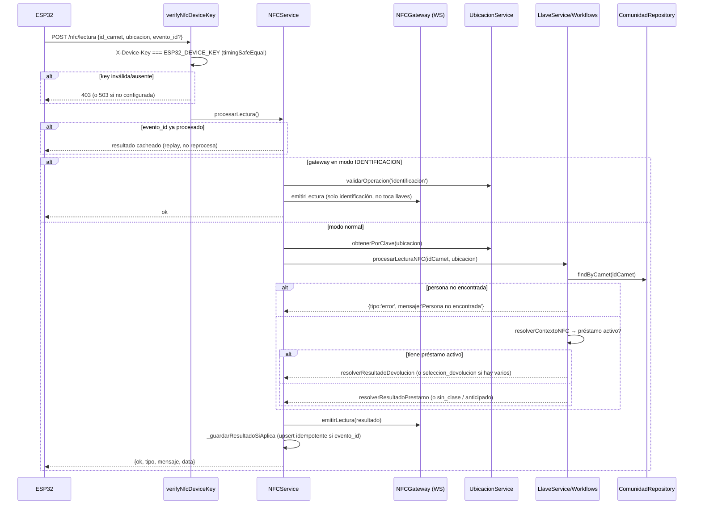

# Módulo `nfc`

## 1. Propósito

Puerta de entrada HTTP para lectores físicos ESP32/NFC. Expone 2 endpoints REST que reciben lecturas de carnet y devuelven el resultado de negocio (préstamo/devolución de llave o solo identificación) para que el dispositivo lo muestre/actúe. El módulo **no contiene lógica de negocio de llaves** — es un orquestador delgado que delega a `llaves` y `ubicaciones`, y persiste solo un log de idempotencia de eventos.

## 2. Modelo de datos

`NFCEvento` — `src/features/nfc/nfc.schema.js:4-19`, colección `nfc_eventos`, `versionKey:false`.

| Campo | Tipo | Notas |
|---|---|---|
| `evento_id` | String, required, unique, index, trim | clave de idempotencia |
| `id_carnet` | String, required, trim | |
| `ubicacion` | String, default `''` | |
| `ok` | Boolean, default `false` | |
| `tipo_resultado` | String, default `''` | `prestamo`, `devolucion`, `error`, `sin_clase`, `anticipado`, `identificacion` |
| `mensaje_resultado`, `payload_resultado` (Mixed) | | resultado completo del flujo |
| `procesado_en` | Date, default `Date.now` | |

No existe modelo de "dispositivos registrados" en BD — solo una clave compartida (`ESP32_DEVICE_KEY`). El modelo **no registra todas las lecturas**, solo eventos con `evento_id` (opcional en el body) — sirve para deduplicar reintentos, no como bitácora de auditoría completa.

## 3. Diagrama de clases / dependencias

```mermaid
classDiagram
    class NFCRoutes {
        POST /lectura (nfcLimiter + verifyNfcDeviceKey)
        GET /status (requireAuth)
    }
    class NFCController
    class NFCService {
        +procesarLectura(id_carnet, ubicacion, opts)
        -_generarMensaje()
        -_guardarResultadoSiAplica()
    }
    class NFCRepository
    class NFCEventoSchema
    class NFCMiddleware {
        +verifyNfcDeviceKey (X-Device-Key vs env, timingSafeEqual)
    }
    class NFCGateway {
        SerialPort físico + socket.io namespace /nfc
        +getModoActivo() +emitirLectura()
    }
    class UbicacionService
    class LlaveService

    NFCRoutes --> NFCController --> NFCService
    NFCService --> NFCRepository --> NFCEventoSchema
    NFCService --> NFCGateway : emite a frontend
    NFCService --> UbicacionService : valida ubicación/permiso
    NFCService --> LlaveService : procesarLecturaNFC (decisión de negocio)
    LlaveService --> LlaveWorkflows --> LlaveContext --> ComunidadRepository : identificar persona
```

## 4. Flujo end-to-end de un tap NFC



## 5. Puntos de inflexión

- **Autenticación del ESP32**: clave única compartida por todos los dispositivos, comparada con `crypto.timingSafeEqual` — sin whitelist de IP, sin tabla de dispositivos en BD, sin identidad por dispositivo. Si `ESP32_DEVICE_KEY` no está configurada → `503`; si no coincide → `403`.
- **`GET /nfc/status` usa auth distinta** (`requireAuth`, JWT humano) — para el frontend, no el ESP32.
- **Decisión préstamo vs. devolución totalmente automática y contextual**, sin que el dispositivo indique intención — decidida por `contexto.prestamoActivo` en `llave.workflows.js`. El "modo identificación" (activado por el frontend vía WebSocket) desvía todo el flujo y no toca llaves.
- **Persona no registrada en comunidad** → `tipo:'error'` → controller responde `404`.
- **Rate limiting**: `nfcLimiter` 120 lecturas/minuto por defecto, aplicado **antes** de verificar la device key (limita también intentos de fuerza bruta de la key, pero comparte balde entre todos los dispositivos).
- **Sin logging de errores de negocio**: solo `logger.info` al inicio — ningún `logger.error`/`warn` en ramas de error del service.
- **Idempotencia/replay**: mismo `evento_id` reenviado devuelve resultado cacheado sin reprocesar (buena práctica ante reintentos del ESP32).
- **`evento_id` opcional**: si el firmware no lo envía, se pierde tanto idempotencia como registro persistente del intento.

## 6. Dependencias externas/cruzadas

**Usa**: `llaves` (`llave.service.js` → `procesarLecturaNFC`), `ubicaciones` (`validarOperacion`, `obtenerPorClave`), `shared/websocket/nfc.gateway.js`, `shared/constants/nfc.constants.js`, `shared/middlewares/rate.limiter.js` (`nfcLimiter`), `auth.middleware` (`requireAuth` solo en `/status`).

**Lo usan**: solo `src/app.js` monta las rutas — es un punto de entrada puro, sin consumidores internos entre features.

## 7. Riesgos y observaciones de auditoría

- **Autenticación de dispositivo débil**: clave compartida única sin rotación por dispositivo, sin whitelist de IP, sin registro de dispositivos en BD — un secreto filtrado compromete todos los lectores indefinidamente, sin expiración ni revocación individual (mitigado parcialmente por `timingSafeEqual`, que evita timing attacks).
- **Sin registro de intentos no autorizados**: un 403 por device key inválida no genera log ni alerta — imposible detectar fuerza bruta salvo por el rate limiter genérico.
- **`evento_id` opcional debilita la auditoría**: un firmware mal configurado (o key filtrada) puede generar lecturas sin dejar rastro persistente.
- **Sin logging de errores de negocio** — dificulta observabilidad operativa (ej. detectar patrones de carnets no encontrados).
- **Sin cobertura de tests** confirmada en todo el flujo crítico ESP32→llaves.
- **Diseño correcto de separación de responsabilidades**: el módulo NFC no decide negocio, delega apropiadamente a `llaves` — reduce superficie de riesgo propia.
