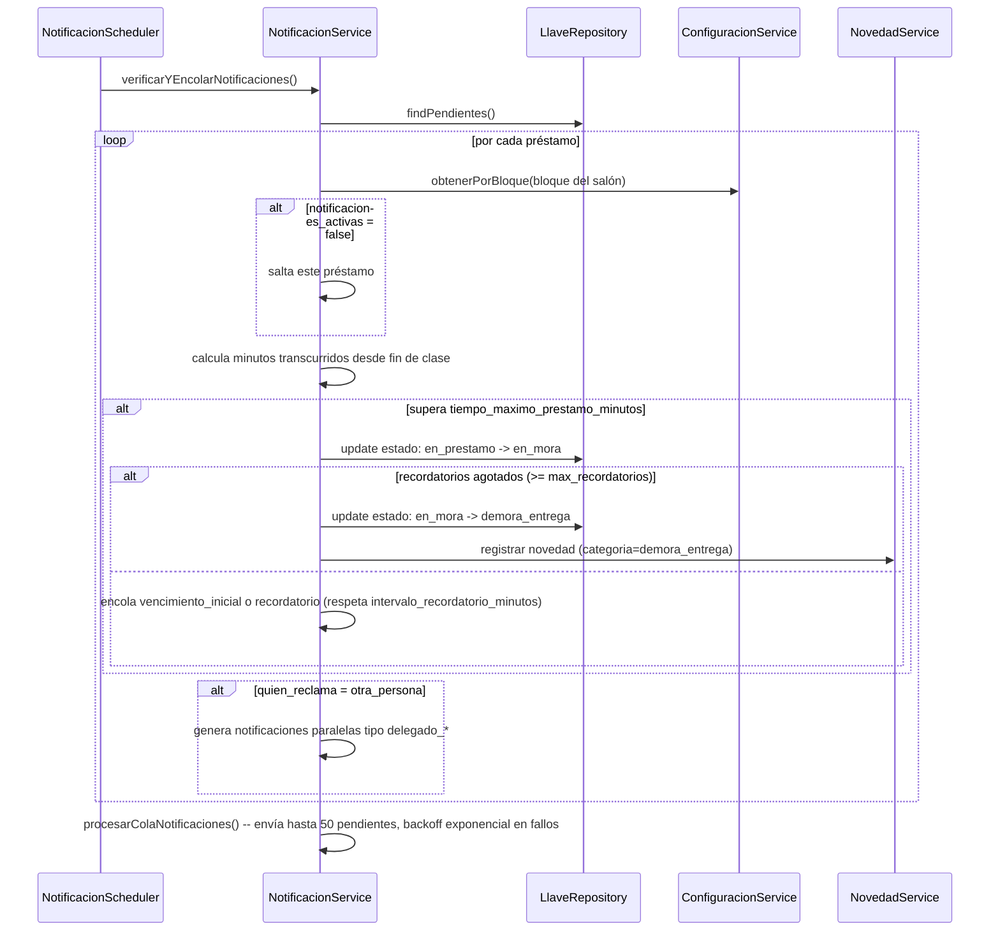
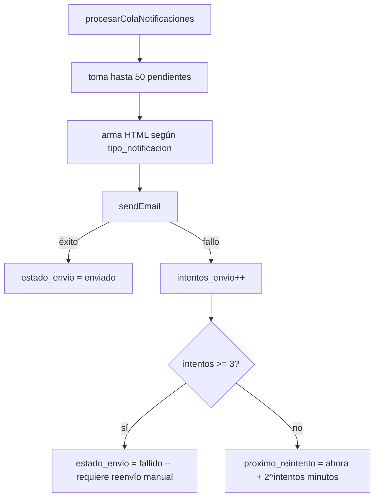

# Módulo `notificaciones`

## 1. Propósito

Motor de envío y auditoría de **correos electrónicos transaccionales** relacionados con préstamos de llaves y reservas de salones. Cada "notificación" es un registro persistido de un email enviado (o pendiente de enviar), no un mensaje in-app leído/no-leído. No hay bandeja de notificaciones de usuario, ni websockets, ni push — solo REST + cron.

## 2. Modelo de datos

`src/features/notificaciones/notificacion.schema.js:4-65`, colección `notificaciones`, sin `versionKey`.

| Campo | Detalle |
|---|---|
| `destinatario_nombre`, `destinatario_documento`, `destinatario_correo` | required |
| `tipo_mensaje` | enum `['predeterminado','personalizado']` |
| `asunto` (required), `mensaje` | |
| `llave_id` | ref `Llave` |
| `prestamo_llave_id` | ObjectId **sin `ref`** (inconsistencia) |
| `reserva_id` | ref `Reserva` |
| `salon` | |
| `tipo_notificacion` | enum `['manual','vencimiento_inicial','recordatorio','reserva_no_reclamada','delegado_vencimiento','delegado_recordatorio']`, default `'manual'` |
| `es_delegado`, `nombre_docente_representado` | delegación (persona recibe llave en representación de otro) |
| `numero_recordatorio` | |
| `estado_envio` | enum `['pendiente','enviado','fallido','descartado']`, default `'pendiente'` |
| `intentos_envio`, `proximo_reintento`, `error_envio` | control de reintentos |
| `enviado_por`, `fecha_envio` | auditoría |
| `fecha_hora_prestamo`, `reserva_fecha/hora_inicio/hora_fin`, `horario_clase`, `materia` | snapshot denormalizado |

Índices: `{fecha_envio:-1}`, `{destinatario_documento, fecha_envio:-1}`, `{estado_envio, proximo_reintento}` (cola de reintentos), `{prestamo_llave_id, tipo_notificacion, numero_recordatorio}` único+sparse (evita duplicar recordatorio), `{reserva_id, tipo_notificacion}` único+sparse (evita duplicar aviso de no-reclamo).

## 3. Diagrama de clases / dependencias

```mermaid
classDiagram
    class NotificacionRoutes
    class NotificacionController
    class NotificacionService {
        +verificarYEncolarNotificaciones()
        +procesarColaNotificaciones()
        +enviarNotificacionesDevolucion()
        +enviarNotificacionManualReservas()
        +reenviar() +descartar()
    }
    class NotificacionRepository {
        +createMany() +findPendientesEnvio() +findHistorial()
    }
    class NotificacionScheduler {
        node-cron */5 * * * *
    }
    class NotificacionSchema
    class ConfiguracionService
    class LlaveRepository
    class ComunidadRepository
    class SalonSchema
    class NovedadService

    NotificacionScheduler --> NotificacionService : cron cada 5 min
    NotificacionRoutes --> NotificacionController --> NotificacionService
    NotificacionService --> NotificacionRepository --> NotificacionSchema
    NotificacionService --> ConfiguracionService : umbrales por bloque
    NotificacionService --> LlaveRepository : findPendientes + MUTA estado de la llave
    NotificacionService --> ComunidadRepository : resolver correo destinatario
    NotificacionService --> SalonSchema : resolver bloque
    NotificacionService --> NovedadService : crea Novedad al llegar a demora_entrega
    ReservaRepository ..> NotificacionSchema : bypass -- acceso directo (bulkCompletarVencidas)
    NotificacionService ..> ReservaSchema : acceso directo (bypass repository) en envío manual
```

## 4. Flujos principales

### 4.1 Motor automático de vencimiento (cron cada 5 min)



### 4.2 Envío con reintentos (backoff exponencial)



## 5. Puntos de inflexión

- **Solo REST + cron, no push/websocket** — cron cada 5 minutos con `node-cron`.
- **Batching**: `insertMany({ordered:false})` para encolar, y `sendBulkEmails` para envío manual masivo; procesamiento de cola en lotes de 50.
- **Reintentos con backoff exponencial**: 3 intentos máx, `2^intentos` minutos de espera, luego queda `fallido` permanente hasta reenvío manual.
- **Sin limpieza/expiración (TTL)**: no existe índice TTL ni job de purga — `fallido`/`descartado` se acumulan indefinidamente.
- **Deduplicación por índice único+sparse**, no por lógica aplicativa explícita — depende de capturar correctamente el error 11000 en `insertMany`.
- **`notificaciones` muta el estado de `llaves`**: es este módulo, no `llaves`, quien escribe las transiciones `en_prestamo→en_mora→demora_entrega`.
- **`novedades` se dispara desde aquí**, no al revés: al llegar a `demora_entrega`, crea una Novedad con chequeo de idempotencia por `prestamo_ref`.

## 6. Dependencias externas/cruzadas

**Usa**: `configuracion` (umbrales por bloque), `llaves` (lee préstamos pendientes y **muta su estado**), `comunidad` (correo del destinatario), `salones` (bloque del salón), `novedades` (crea novedades por demora).

**Consumidores/disparadores cruzados**:
- `reservas/reserva.repository.js` — `bulkCompletarVencidas()` importa el schema `Notificacion` **directamente** (bypass de repository/service) y crea la notificación `reserva_no_reclamada`. Invocado por `reserva.service.js:sincronizarEstadosVencidos()`, a su vez llamado por `notificacion.scheduler.js`.
- `notificacion.service.js` importa el schema `Reserva` directamente en `enviarNotificacionManualReservas`.
- `server.js` arranca `notificacionScheduler.iniciar()` al boot.

**No consumen este módulo**: `llaves` no importa `notificaciones` — la relación es unidireccional (`notificaciones → llaves`).

## 7. Riesgos y observaciones de auditoría

- **Bypass de capas (violación de vertical slicing)**: `reserva.repository.js` importa el schema `Notificacion` de otro feature directamente, rompiendo el aislamiento — cambios de schema pueden romper `reservas` sin aparecer como dependencia obvia.
- **Lógica de negocio duplicada**: resolución de bloque/configuración/correo del solicitante reimplementada en `reserva.repository.js` en paralelo a la misma lógica en `notificacion.service.js`.
- **Sin cobertura de tests**: el módulo de mayor riesgo no cubierto, dado que contiene la lógica crítica de vencimientos, transiciones de estado de llave, backoff y deduplicación.
- **Sin TTL/purga** — crecimiento no acotado de la colección.
- **Manejo de errores silencioso**: `catch(_){}` vacío en `reserva.repository.js` al crear notificación de no-reclamo.
- **`prestamo_llave_id` sin `ref`** a diferencia de `llave_id`/`reserva_id` — impide `.populate()`.
- **Clase de servicio con demasiadas responsabilidades**: envío de email, orquestación de estado de llaves, creación de novedades y armado de plantillas HTML mezclados en una sola clase — dificulta testear el motor de vencimiento aislado del envío de correo.
- **Doble mecanismo de "notificado"**: `novedades` tiene su propio flag `notificacion_admin_enviada` que no se sincroniza con este módulo — riesgo de reportes inconsistentes.
