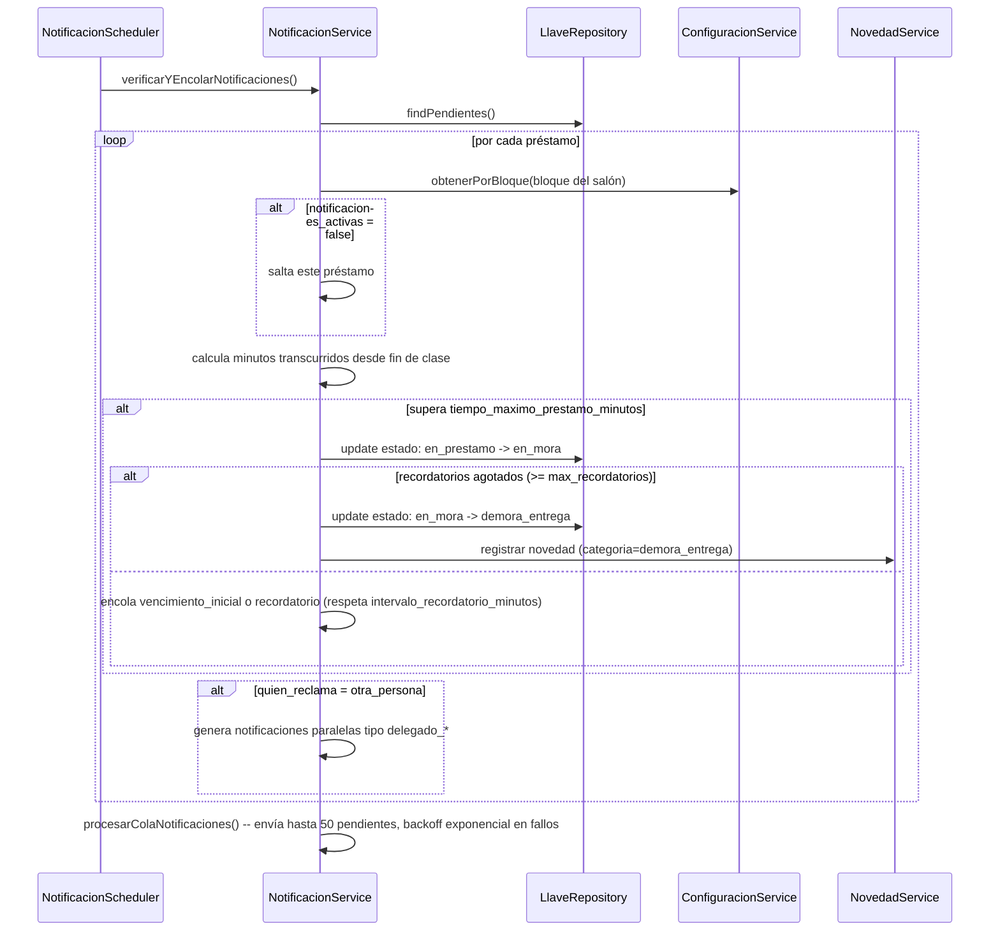
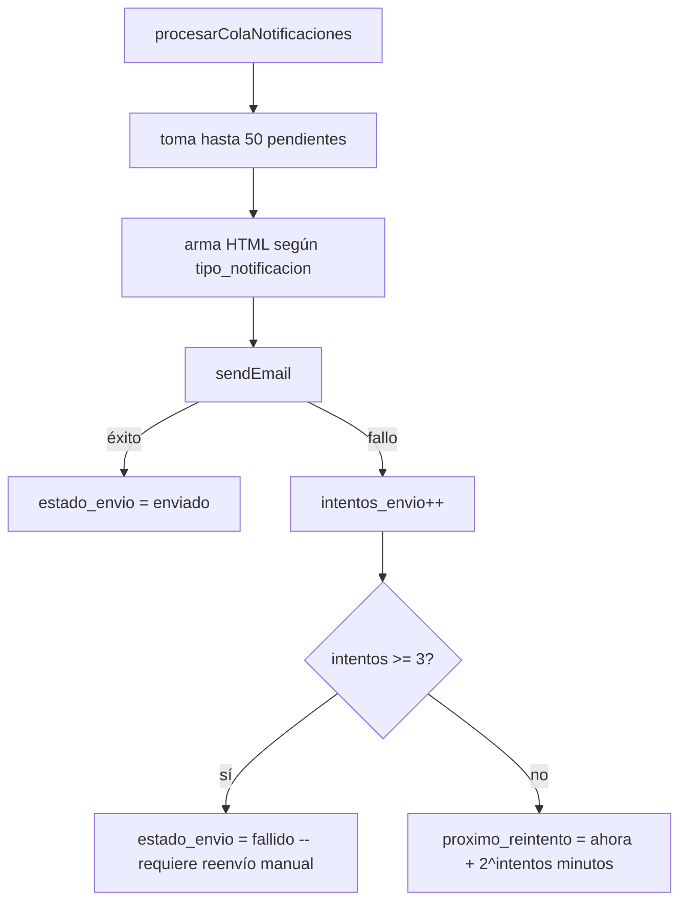

# Módulo `notificaciones`

## 1. Propósito

Motor de envío y auditoría de **correos electrónicos transaccionales** relacionados con préstamos de llaves y reservas de salones. Cada "notificación" es un registro persistido de un email enviado (o pendiente de enviar), no un mensaje in-app leído/no-leído. No hay bandeja de notificaciones de usuario, ni websockets, ni push — solo REST + cron.

## 2. Modelo de datos

Tabla `notificaciones` (migración `007_reservas_nfc_notificaciones_novedades.js`).

### Destinatario y contenido

`destinatario_nombre`, `destinatario_documento`, `destinatario_correo`, `numero_contacto_destinatario`, `tipo_mensaje` (default `predeterminado`), `asunto`, `mensaje`.

### Origen

`llave_id` → `registros_llaves`, `reserva_id` → `reservas`, `salon_id` → `salones` (+ `salon` snapshot), `tipo_notificacion` (default `manual`), `numero_recordatorio` (cuántos van para el mismo préstamo).

Delegación: `es_delegado` y `nombre_docente_representado`, para cuando reclama un monitor en nombre del docente.

### Envío y reintentos

| Columna | Detalle |
|---|---|
| `estado_envio` | default `pendiente` |
| `intentos_envio` | contador |
| `proximo_reintento` | timestamptz — el scheduler la toma cuando vence |
| `error_envio` | último error |
| `enviado_por`, `fecha_envio` | |

### Contexto congelado

`fecha_hora_prestamo`, `reserva_fecha`, `reserva_hora_inicio`, `reserva_hora_fin`, `horario_clase`, `materia` se copian al crear la notificación para que el correo diga lo mismo aunque el préstamo cambie después.

`MAIL_DRY_RUN` decide si se envía de verdad. Por defecto es dry-run fuera de producción: el relay es el institucional y las bases de desarrollo tienen direcciones reales, así que enviar tiene que ser una decisión explícita.

## 3. Diagrama de clases / dependencias

```mermaid
classDiagram
    class NotificacionRoutes
    class NotificacionController
    class NotificacionService {
        +verificarYEncolarNotificaciones()
        +procesarColaNotificaciones()
        +enviarNotificacionesDevolucion()
        +enviarNotificacionManualReservas()
        +reenviar() +descartar()
    }
    class NotificacionRepository {
        +createMany() +findPendientesEnvio() +findHistorial()
    }
    class NotificacionScheduler {
        node-cron */5 * * * *
    }
    class NotificacionSchema
    class ConfiguracionService
    class LlaveRepository
    class ComunidadRepository
    class SalonSchema
    class NovedadService

    NotificacionScheduler --> NotificacionService : cron cada 5 min
    NotificacionRoutes --> NotificacionController --> NotificacionService
    NotificacionService --> NotificacionRepository --> NotificacionSchema
    NotificacionService --> ConfiguracionService : umbrales por bloque
    NotificacionService --> LlaveRepository : findPendientes + MUTA estado de la llave
    NotificacionService --> ComunidadRepository : resolver correo destinatario
    NotificacionService --> SalonSchema : resolver bloque
    NotificacionService --> NovedadService : crea Novedad al llegar a demora_entrega
    ReservaRepository ..> NotificacionSchema : bypass -- acceso directo (bulkCompletarVencidas)
    NotificacionService ..> ReservaSchema : acceso directo (bypass repository) en envío manual
```

## 4. Flujos principales

### 4.1 Motor automático de vencimiento (cron cada 5 min)



### 4.2 Envío con reintentos (backoff exponencial)



## 5. Puntos de inflexión

- **Solo REST + cron, no push/websocket** — cron cada 5 minutos con `node-cron`.
- **Batching**: `insertMany({ordered:false})` para encolar, y `sendBulkEmails` para envío manual masivo; procesamiento de cola en lotes de 50.
- **Reintentos con backoff exponencial**: 3 intentos máx, `2^intentos` minutos de espera, luego queda `fallido` permanente hasta reenvío manual.
- **Sin limpieza/expiración (TTL)**: no existe índice TTL ni job de purga — `fallido`/`descartado` se acumulan indefinidamente.
- **Deduplicación por índice único+sparse**, no por lógica aplicativa explícita — depende de capturar correctamente el error 11000 en `insertMany`.
- **`notificaciones` muta el estado de `llaves`**: es este módulo, no `llaves`, quien escribe las transiciones `en_prestamo→en_mora→demora_entrega`.
- **`novedades` se dispara desde aquí**, no al revés: al llegar a `demora_entrega`, crea una Novedad con chequeo de idempotencia por `prestamo_ref`.

## 6. Dependencias externas/cruzadas

**Usa**: `configuracion` (umbrales por bloque), `llaves` (lee préstamos pendientes y **muta su estado**), `comunidad` (correo del destinatario), `salones` (bloque del salón), `novedades` (crea novedades por demora).

**Consumidores/disparadores cruzados**:
- `reservas/reserva.repository.js` — `bulkCompletarVencidas()` importa el schema `Notificacion` **directamente** (bypass de repository/service) y crea la notificación `reserva_no_reclamada`. Invocado por `reserva.service.js:sincronizarEstadosVencidos()`, a su vez llamado por `notificacion.scheduler.js`.
- `notificacion.service.js` importa el schema `Reserva` directamente en `enviarNotificacionManualReservas`.
- `server.js` arranca `notificacionScheduler.iniciar()` al boot.

**No consumen este módulo**: `llaves` no importa `notificaciones` — la relación es unidireccional (`notificaciones → llaves`).

## 7. Riesgos y observaciones de auditoría

- **Bypass de capas (violación de vertical slicing)**: `reserva.repository.js` importa el schema `Notificacion` de otro feature directamente, rompiendo el aislamiento — cambios de schema pueden romper `reservas` sin aparecer como dependencia obvia.
- **Lógica de negocio duplicada**: resolución de bloque/configuración/correo del solicitante reimplementada en `reserva.repository.js` en paralelo a la misma lógica en `notificacion.service.js`.
- **Sin cobertura de tests**: el módulo de mayor riesgo no cubierto, dado que contiene la lógica crítica de vencimientos, transiciones de estado de llave, backoff y deduplicación.
- **Sin TTL/purga** — crecimiento no acotado de la colección.
- **Manejo de errores silencioso**: `catch(_){}` vacío en `reserva.repository.js` al crear notificación de no-reclamo.
- **`prestamo_llave_id` sin `ref`** a diferencia de `llave_id`/`reserva_id` — impide `.populate()`.
- **Clase de servicio con demasiadas responsabilidades**: envío de email, orquestación de estado de llaves, creación de novedades y armado de plantillas HTML mezclados en una sola clase — dificulta testear el motor de vencimiento aislado del envío de correo.
- **Doble mecanismo de "notificado"**: `novedades` tiene su propio flag `notificacion_admin_enviada` que no se sincroniza con este módulo — riesgo de reportes inconsistentes.
