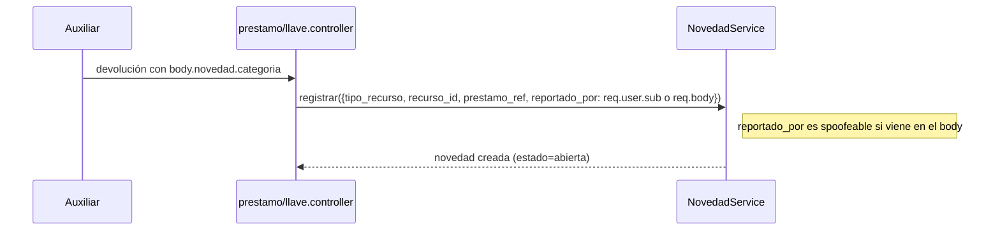
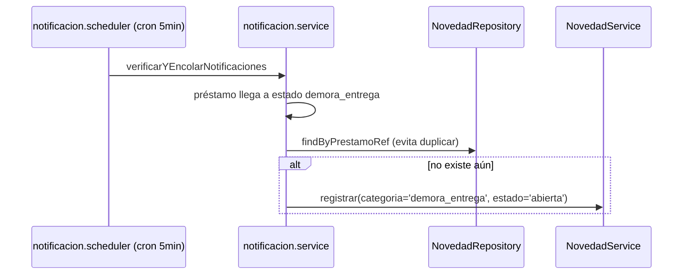
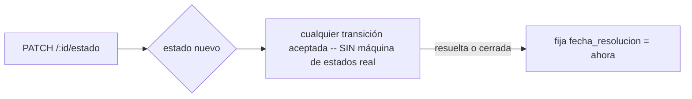

# Módulo `novedades`

## 1. Propósito

Registra incidencias/reportes sobre recursos prestables (llaves o equipos): daño físico, mal funcionamiento, pérdida, demora en la entrega, u "otro". Actúa como bitácora de novedades tanto manuales (reportadas por un auxiliar al momento de la devolución) como automáticas (generadas por el motor de notificaciones cuando un préstamo entra en mora crítica). No gestiona salones como entidad propia — `salon` es un string libre de contexto.

## 2. Modelo de datos

`src/features/novedades/novedad.schema.js:4-43`, colección `novedades`, `timestamps:true`, `versionKey:false`.

| Campo | Detalle |
|---|---|
| `tipo_recurso` | enum `['llave','equipo']`, required, index |
| `recurso_id` | ObjectId, default null — **sin `ref`**, no populate posible |
| `prestamo_ref` | ObjectId, default null — referencia al préstamo origen, sin `ref` |
| `reportado_por` | String, required, index — documento del usuario |
| `reportado_por_nombre` | String, default `''` |
| `salon` | String, default `''` — texto libre, no ref |
| `categoria` | enum `['sin_novedad','daño_fisico','no_funciona','perdida','otro','demora_entrega']`, required |
| `descripcion` | String, maxlength 500 |
| `estado` | enum `['abierta','en_revision','resuelta','cerrada']`, default `'abierta'`, index |
| `resolucion` | String, default `''` |
| `fecha_reporte` | Date, default `Date.now`, index |
| `fecha_resolucion` | Date, default null |
| `notificacion_admin_enviada` | Boolean, default `false` — **campo muerto**, ver §7 |

Índice compuesto: `{tipo_recurso, recurso_id}`.

## 3. Diagrama de clases / dependencias

```mermaid
classDiagram
    class NovedadRoutes
    class NovedadController
    class NovedadService {
        +registrar() +actualizarEstado() +obtener() +listar() +estadisticas()
    }
    class NovedadRepository
    class NovedadSchema

    NovedadRoutes --> NovedadController --> NovedadService
    NovedadService --> NovedadRepository --> NovedadSchema
    PrestamoController ..> NovedadService : registrar (al devolver equipo, si viene novedad en body)
    LlaveController ..> NovedadService : registrar (al devolver llave, mismo patrón)
    NotificacionService ..> NovedadRepository : findByPrestamoRef (idempotencia)
    NotificacionService ..> NovedadService : registrar (novedad automática por demora)
```

## 4. Flujos principales

### 4.1 Creación manual (post-devolución)



### 4.2 Generación automática por mora (desde `notificaciones`)



### 4.3 Cambio de estado (solo admin)



## 5. Puntos de inflexión

- **Quién puede reportar**: cualquier usuario `requireAuth` (sin restricción de rol). `reportado_por` puede sobrescribirse desde el body — **no se fuerza siempre al usuario autenticado**, es spoofeable.
- **Cambio de estado solo admin, sin máquina de estados real**: cualquier transición entre los 4 estados es aceptada (incluida reabrir una `cerrada` o saltar directo de `abierta` a `cerrada`).
- **Relación con `notificaciones` es unidireccional inversa**: `novedades` no notifica a nadie al crearse; es `notificaciones` quien **consume** `novedades`, creando novedades automáticas por demora con chequeo de idempotencia vía `prestamo_ref`.
- **`recurso_id`/`prestamo_ref` sin `ref` de Mongoose ni validación de existencia** contra `llaves`/`equipos` según `tipo_recurso`.
- **`salon` como texto libre** copiado del préstamo/registro — sin garantía de consistencia si el nombre del salón cambia.

## 6. Dependencias externas/cruzadas

**Usa**: `shared/utils/pagination.helper`, `shared/utils/logger`, `shared/errors/api.error`, `auth.middleware` (`requireAdmin`/`requireAuth`).

**Lo usan**:
- `prestamos/prestamo.controller.js` — al devolver equipo con `novedad.categoria` en el body.
- `llaves/llave.controller.js` — mismo patrón al devolver llave.
- `notificaciones/notificacion.service.js` — generación automática por demora + chequeo de idempotencia (`findByPrestamoRef`).

## 7. Riesgos y observaciones de auditoría

- **Sin cobertura de tests**: confirmado en todo el módulo, incluida la generación automática de novedades por mora.
- **`reportado_por` spoofeable**: el controller prioriza `req.body.reportado_por` sobre `req.user?.documento`, permitiendo reportar a nombre de otro documento.
- **Sin `ref` de Mongoose ni validación de existencia** en `recurso_id`/`prestamo_ref` — se puede registrar una novedad con referencia inexistente.
- **Sin máquina de estados**: cualquier transición entre los 4 estados es válida.
- **Listado sin paginación por defecto es ilimitado** — riesgo de payload sin cotas en producción con volumen alto.
- **Campo `notificacion_admin_enviada` muerto**: declarado en el schema pero nunca leído/escrito — funcionalidad de notificación al admin nunca completada.
- **Duplicación de lógica de creación "post-devolución"**: mismo patrón casi idéntico repetido en `prestamo.controller.js` y `llave.controller.js` en vez de centralizarse en `novedadService`.
- **Documentación OpenAPI desactualizada**: el enum documentado de `categoria` omite `demora_entrega`, que sí existe en el schema y en el enum Zod real.
