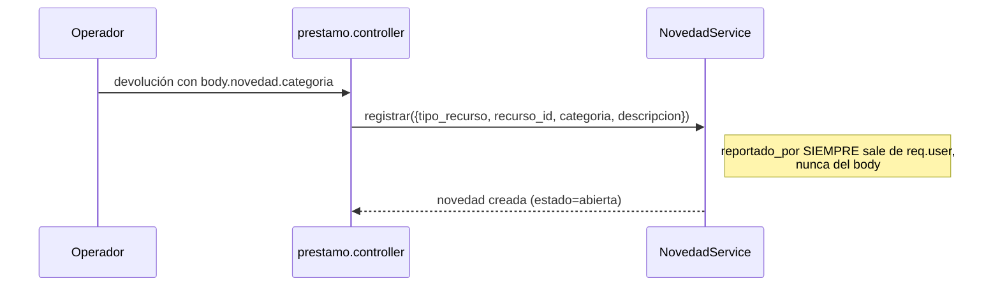
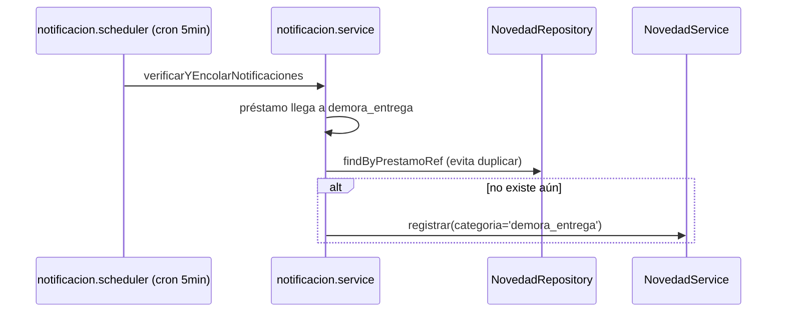
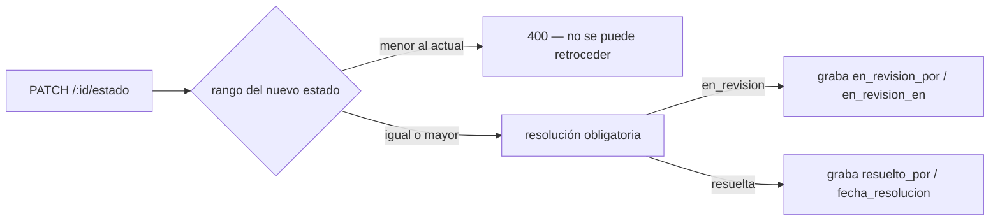

# Módulo `novedades`

## 1. Propósito

Registra incidencias sobre llaves, equipos o el aula misma: daño físico, mal funcionamiento, pérdida, demora en la entrega, u "otro". Actúa como bitácora tanto manual (reportada al momento de la devolución) como automática (generada por el motor de notificaciones cuando un préstamo entra en mora crítica).

## 2. Modelo de datos

Tabla `novedades` (migración `007_reservas_nfc_notificaciones_novedades.js`, modificada por la 010, 011, 016 y 023). El repositorio traduce entre el payload de negocio del API y las columnas reales, igual que `llave.repository.js`.

| Columna | Tipo | Detalle |
|---|---|---|
| `id`, `created_at`, `updated_at`, `deleted_at` | — | columnas universales; borrado en blando |
| `llave_id` | uuid NULL | FK a `registros_llaves` |
| `equipo_id` | uuid NULL | FK a `equipos` |
| `prestamo_id` | uuid NULL | FK a `prestamos`; existe pero ningún flujo la puebla todavía |
| `reportado_por` | text | documento de quien reporta |
| `reportado_por_comunidad_id` | uuid NULL | FK resuelta desde `reportado_por` |
| `reportado_por_nombre` | text | |
| `salon`, `salon_id` | text / uuid NULL | texto libre + FK resuelta cuando el nombre coincide |
| `categoria` | text | CHECK: `sin_novedad`, `daño_fisico`, `no_funciona`, `perdida`, `otro`, `demora_entrega` |
| `elemento_afectado_id` | uuid NULL | FK a `elementos_afectados` (023) — qué se dañó |
| `cantidad_afectada` | int | default 1, CHECK `> 0` — cuántas unidades |
| `descripcion` | varchar(500) | |
| `estado` | text | CHECK: `abierta`, `en_revision`, `resuelta` |
| `resolucion` | text | |
| `en_revision_por` / `en_revision_en` | text / timestamptz | quién y cuándo pasó a revisión |
| `resuelto_por` | text | |
| `fecha_reporte` / `fecha_resolucion` | timestamptz | |
| `notificacion_admin_enviada` | bool | **campo muerto**, ver §6 |

`CHECK ck_novedades_recurso_exclusivo: num_nonnulls(llave_id, equipo_id) <= 1`. La 011 lo relajó de `= 1` a `<= 1` para permitir la **novedad general**: un daño al aula sin préstamo ni equipo involucrado.

El API expone `tipo_recurso` (`llave` | `equipo` | `general`) y `recurso_id`, derivados en el `SELECT` desde cuál de las dos FK está poblada. Son campos calculados, no columnas.

## 3. Diagrama de dependencias

```mermaid
classDiagram
    class NovedadRoutes
    class NovedadController
    class NovedadService {
        +registrar() +actualizarEstado() +obtenerPorId() +listar() +estadisticas()
    }
    class NovedadRepository
    class ElementoAfectadoService

    NovedadRoutes --> NovedadController --> NovedadService
    NovedadService --> NovedadRepository
    NovedadRepository --> ElementoAfectadoService : resolverId (acepta id o clave)
    PrestamoController ..> NovedadService : registrar (al devolver equipo con novedad en el body)
    NotificacionService ..> NovedadRepository : findByPrestamoRef (idempotencia)
    NotificacionService ..> NovedadService : registrar (novedad automática por demora)
```

## 4. Flujos principales

### 4.1 Creación manual



### 4.2 Generación automática por mora



### 4.3 Cambio de estado (solo admin)



## 5. Puntos de inflexión

- **Estados monótonos**: `RANGO_ESTADO` (`abierta` 0 → `en_revision` 1 → `resuelta` 2) impide retroceder. Migración 016. La 010 había fusionado antes el estado `cerrada` con `resuelta`.
- **Autoría no falsificable**: `reportado_por`/`reportado_por_nombre` se derivan de `req.user` en el controller, ignorando lo que venga en el body.
- **Resolución obligatoria** en cualquier cambio de estado, incluido pasar a `en_revision`.
- **Elemento afectado como catálogo, no enum**: la 023 introdujo `elementos_afectados` para que el "qué se dañó" sea agregable. Las estadísticas suman `cantidad_afectada`, no cuentan filas — tres sillas rotas son un reporte pero tres sillas. Ver [catálogos](./catalogos.md).
- **Relación con `notificaciones` es inversa**: `novedades` no notifica a nadie al crearse; es `notificaciones` quien crea novedades automáticas por demora, con idempotencia vía `findByPrestamoRef`.
- **`salon` como texto libre** copiado del contexto, con `salon_id` resuelto por nombre — sin garantía de consistencia si el salón se renombra.

## 6. Riesgos y observaciones

- **Sin cobertura de tests** en todo el módulo, incluida la generación automática por mora.
- **Campo `notificacion_admin_enviada` muerto**: existe en la tabla y en el passthrough del repositorio, pero ningún flujo lo lee ni lo escribe.
- **`prestamo_id` sin poblar**: la FK existe desde la 007 pero ningún camino la usa. `findByPrestamoRef` filtra por `llave_id`, no por ella — el nombre es herencia de Mongo y es engañoso.
- **Listado sin paginación explícita es ilimitado** — sin cotas de payload con volumen alto.
- **Lógica de creación post-devolución duplicada** en `prestamo.controller.js` con un `require` dinámico dentro del método, en vez de centralizarse en el service.
- **Solo se puede colgar una novedad de una llave con préstamo activo**: una llave rota en el tablero o devuelta antes de reportarse no tiene dónde engancharse; queda como novedad general y se pierde el vínculo con esa llave.
