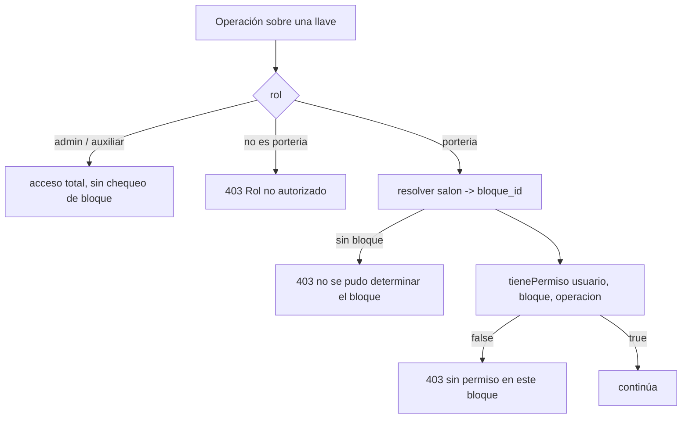

# Módulo `porteros`

## 1. Propósito

Administra los usuarios con rol `porteria` y sus permisos por bloque. Es **el gate de autorización de las operaciones de llaves y de recepción de equipos** desde la migración 009, que reemplazó el esquema anterior basado en `ubicaciones_operativas`.

El cambio acompañó la salida del hardware: los lectores dejaron de ser un dispositivo serie compartido detrás de un gateway y pasaron a ser RFID USB tipo teclado emulado, uno por puesto. Portería necesitó entonces una cuenta propia con permisos acotados, en vez de que la operación se autorizara por la ubicación declarada en el payload del request — algo que el cliente podía elegir libremente.

## 2. Modelo de datos

Tabla `portero_bloques` (migración `009_porteria.js`).

| Columna | Tipo | Detalle |
|---|---|---|
| `id`, `created_at`, `updated_at`, `deleted_at` | — | columnas universales |
| `usuario_id` → `usuarios` | uuid NOT NULL | ON DELETE RESTRICT |
| `bloque_id` → `bloques` | uuid NOT NULL | ON DELETE RESTRICT |
| `permite_identificacion` | bool | default `false` |
| `permite_prestamo_llaves` | bool | default `false` |
| `permite_devolucion_llaves` | bool | default `false` |
| `permite_recepcion_equipos` | bool | default `false` |

```
ux_portero_bloques_usuario_bloque  (usuario_id, bloque_id) WHERE deleted_at IS NULL
idx_portero_bloques_usuario_id     (usuario_id)
idx_portero_bloques_bloque_id      (bloque_id)
```

El único es parcial: una fila por par usuario/bloque entre las vivas, sin que el borrado en blando impida reasignar después.

El rol `porteria` se agregó al CHECK de `usuarios.rol`, que hoy admite `admin_programacion`, `auxiliar_programacion`, `superadmin` y `porteria`.

**Recepción, no préstamo.** El cuarto permiso se llama `permite_recepcion_equipos` y no `permite_prestamo_equipos` a propósito: portería nunca puede prestar equipos, solo recibirlos de vuelta. La migración 012 renombró la columna para que el nombre reflejara el único uso real que le quedaba.

## 3. API

| Método | Ruta | Acceso |
|---|---|---|
| `GET` | `/api/porteros` | admin |
| `POST` | `/api/porteros` | admin |
| `PUT` | `/api/porteros/:usuarioId/bloques` | admin |
| `DELETE` | `/api/porteros/:usuarioId` | admin |
| `GET` | `/api/porteros/mis-bloques` | autenticado — devuelve vacío si no sos portería |

Los porteros se crean **sin contraseña local**: entran por Office 365, igual que el superadmin que `server.js` bootstrapea. `crear()` valida el dominio del correo contra `isDominioAutorizado` antes de dar de alta.

## 4. Cómo se consulta el permiso



`OPERACION_A_CAMPO` mapea la operación a su columna:

```
identificacion     → permite_identificacion
prestamo_llaves    → permite_prestamo_llaves
devolucion_llaves  → permite_devolucion_llaves
recepcion_equipos  → permite_recepcion_equipos
```

Dos variantes del chequeo:

- **`tienePermiso(usuarioId, bloqueId, operacion)`** — la normal. Llaves siempre tiene un salón, y del salón sale el bloque.
- **`tienePermisoGlobal(usuarioId, operacion)`** — usada por equipos, que en el modelo actual **no están ligados a ningún bloque**. Basta con tener el permiso habilitado en al menos uno.

Esa segunda variante es una concesión al modelo de datos, no una decisión de diseño: si en algún momento los equipos se asocian a un bloque, debería desaparecer.

## 5. Puntos de inflexión

- **Admin y auxiliar no pasan por acá**: el gate corta antes, con acceso total. Los permisos por bloque son exclusivamente para `porteria`.
- **La misma portería devuelve**: una llave entregada por un usuario portería solo puede ser devuelta por esa misma cuenta. La regla mira `gestionado_por_rol` del registro, no si el campo es NULL — porque el gestor se guarda siempre, sea portería, admin o auxiliar. Ver [llaves](./llaves.md).
- **Cada cuenta portero es un puesto físico**, no una persona: es lo que hace razonable que la devolución quede atada a la cuenta que entregó.
- **`GET /mis-bloques` no discrimina por rol en la ruta**: responde a cualquier autenticado y devuelve vacío si no es portería, resolviéndolo en el servicio sin tocar la base.

## 6. Riesgos y observaciones

- **Sin tests** en el módulo, incluido el gate de autorización — que es código de seguridad.
- **`tienePermisoGlobal` afloja la granularidad** para equipos: un portero con permiso en un solo bloque puede recibir cualquier equipo.
- **Borrar un portero con historial**: `portero_bloques` referencia `usuarios` con `ON DELETE RESTRICT` y los registros de llaves guardan `gestionado_por_usuario_id`, así que la baja real está bloqueada por diseño. Desactivar es el camino.
