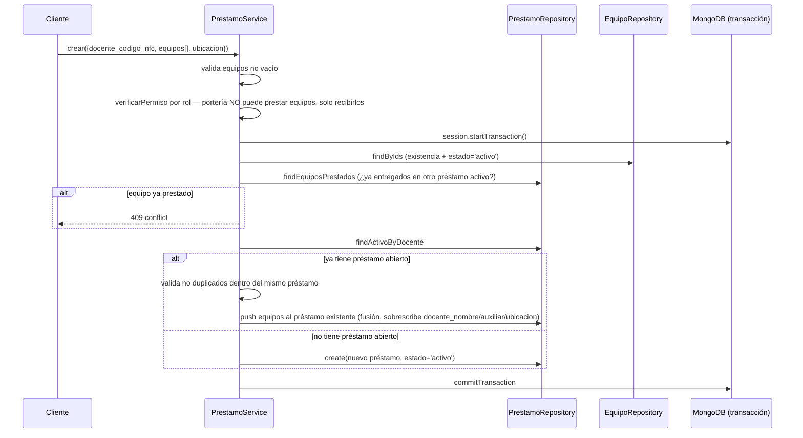
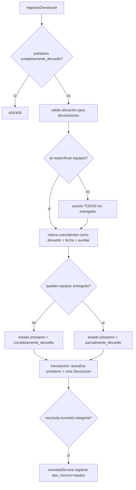

# Módulo `prestamos`

## 1. Propósito

Gestiona préstamos de **equipos** (proyectores, controles, etc.) — dominio completamente separado del módulo `llaves` (que maneja préstamo de llaves con su propia arquitectura CQRS). No comparten código; son dos sistemas de préstamo independientes con máquinas de estado distintas.

## 2. Modelo de datos

`src/features/prestamos/prestamo.schema.js` — define `Prestamo` (colección `prestamos`) y `Devolucion` (colección `devoluciones`), sin archivo `model` separado.

**`detalleEquipoSchema`** (subdocumento embebido, `_id:false`, líneas 9-24):

| Campo | Detalle |
|---|---|
| `equipo_id` | ObjectId ref `Equipo`, required |
| `equipo_nombre`, `equipo_marca`, `equipo_codigo`, `equipo_codigo_barras` | String, default `''` |
| `equipo_consecutivo` | Number, default `0` |
| `estado_equipo` | enum `['entregado','devuelto']`, default `'entregado'` — máquina de estados del ítem |
| `fecha_entrega` | Date, default `Date.now` |
| `fecha_devolucion` | Date, default `null` |
| `auxiliar_que_recibio_devolucion`, `tipo_entrega` (enum `['manual','carnet','']`) | |

**`prestamoSchema`** (colección `prestamos`, líneas 26-44):

| Campo | Detalle |
|---|---|
| `docente_codigo_nfc` | String, required, indexado |
| `docente_nombre`, `auxiliar_prestamista` (default `'Auxiliar'`), `ubicacion_prestamo` | |
| `solicitante_tipo` | enum `['docente','estudiante','empleado','']` |
| `docente_responsable_codigo`/`nombre` | caso estudiante bajo responsabilidad de un docente |
| `equipos` | array de `detalleEquipoSchema` |
| `estado` | enum `['activo','parcialmente_devuelto','completamente_devuelto']`, default `'activo'`, indexado — máquina de estados del préstamo |
| `fecha_prestamo` | Date, default `Date.now` |

**No existe campo de fecha límite/plazo de devolución** — el préstamo de equipos no tiene concepto de "vencido" ni mora, a diferencia de `llaves`.

**`devolucionSchema`** (colección `devoluciones`, líneas 61-73): `prestamo_id` (ref, required, indexado), `equipos_devueltos` (subdocumento: `equipo_id`, `nombre`, `cantidad` default 1, `estado` default `'bueno'`), `auxiliar_que_recibio`, `fecha_devolucion`, `es_devolucion_completa`.

## 3. Diagrama de clases / dependencias

```mermaid
classDiagram
    class PrestamoRoutes
    class PrestamoController
    class PrestamoService {
        +crear() +agregarEquipo() +registrarDevolucion()
        +listar() +activos() +porDocente()
        -_cargarEquiposDisponibles() -_validarDisponibilidad()
        -_validarNoDuplicadosEnPrestamo()
    }
    class PrestamoRepository
    class DevolucionRepository
    class PrestamoSchema
    class DevolucionSchema
    class EquipoRepository
    class UbicacionService
    class NovedadService

    PrestamoRoutes --> PrestamoController --> PrestamoService
    PrestamoService --> PrestamoRepository --> PrestamoSchema
    PrestamoService --> DevolucionRepository --> DevolucionSchema
    PrestamoService --> EquipoRepository : findByIds
    PrestamoService --> PorterosService : tienePermiso (recepción de equipos)
    PrestamoController --> NovedadService : registrar (require dinámico, si viene novedad en body)
```

## 4. Flujos principales

### 4.1 Creación de préstamo (con fusión implícita)



### 4.2 Devolución



## 5. Puntos de inflexión

- **Máquina de estados del préstamo**: `activo → parcialmente_devuelto → completamente_devuelto`, gobernada por conteo de ítems `entregado` restantes — sin transición hacia atrás ni cancelación.
- **Máquina de estados del ítem**: `entregado → devuelto`, sin estados intermedios (dañado/perdido se maneja aparte vía `novedades`).
- **Disponibilidad calculada, no almacenada**: no hay flag de "prestado" en el propio documento `Equipo` — se deriva completamente de una consulta sobre la colección `prestamos` (equipo con `estado_equipo:'entregado'` en algún préstamo activo/parcial).
- **Sin cálculo de mora/vencimiento**: no existe `fecha_devolucion_esperada` ni plazo — ningún scheduler revisa vencimientos de equipos (a diferencia de `llaves`, que sí tiene `en_mora`/`demora_entrega`).
- **Sin restricción de rol**: todas las rutas usan `requireAuth` puro (`[verifyToken]`), sin `requireRole` — cualquier usuario autenticado, no solo auxiliares, puede prestar/agregar/devolver.
- **Fusión implícita no documentada en Swagger**: si un docente ya tiene préstamo `activo`, un nuevo `crear()` hace `push` de equipos al existente en vez de crear un segundo registro — comportamiento que puede sorprender a consumidores de la API.
- **Relación con `novedades`, no con `notificaciones`**: al devolver, si viene `novedad.categoria` en el body, se crea una novedad `tipo_recurso:'equipo'` — no hay recordatorios de devolución para equipos.

## 6. Dependencias externas/cruzadas

**Usa**: `equipos/equipo.repository.js` (`findByIds`), `porteros/porteros.service.js` (`tienePermiso`), `shared/constants/nfc.constants.js`, `novedades/novedad.service.js` (`registrar`, require dinámico dentro del método).

**Lo usan**: solo `src/app.js` monta las rutas en `/api/prestamos` — es un slice terminal sin consumidores internos. Confirma que `llaves` y `prestamos` no comparten código.

## 7. Riesgos y observaciones de auditoría

- **Condición de carrera real en validación de disponibilidad**: la comprobación "¿está ya prestado?" es una lectura simple dentro de la transacción, sin bloqueo optimista/pesimista ni índice único parcial sobre `equipos.equipo_id + estado_equipo:'entregado'` — riesgo de doble préstamo del mismo equipo bajo concurrencia (dos operarios simultáneos).
- **Sin control de rol en las rutas** — cualquier usuario autenticado puede prestar/devolver, a diferencia de otros módulos que sí usan `requireAux`/`requireAdmin`.
- **Sin campo de plazo/vencimiento**: brecha funcional si el negocio espera que los equipos también venzan como las llaves.
- **`listar()` sin paginación** — trae toda la colección sin límite.
- **Fusión implícita de préstamos abiertos no documentada en OpenAPI.**
- **Sin cobertura de tests** confirmada.
- **Manejo de errores en `_validarUbicacionOperacion`**: reemplaza cualquier error sin `statusCode` por un mensaje genérico 400, lo que podría enmascarar errores reales (ej. ubicación no encontrada).
