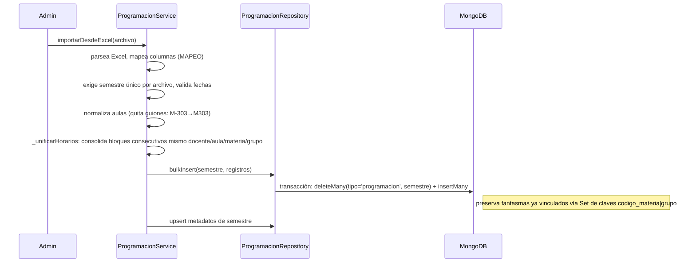
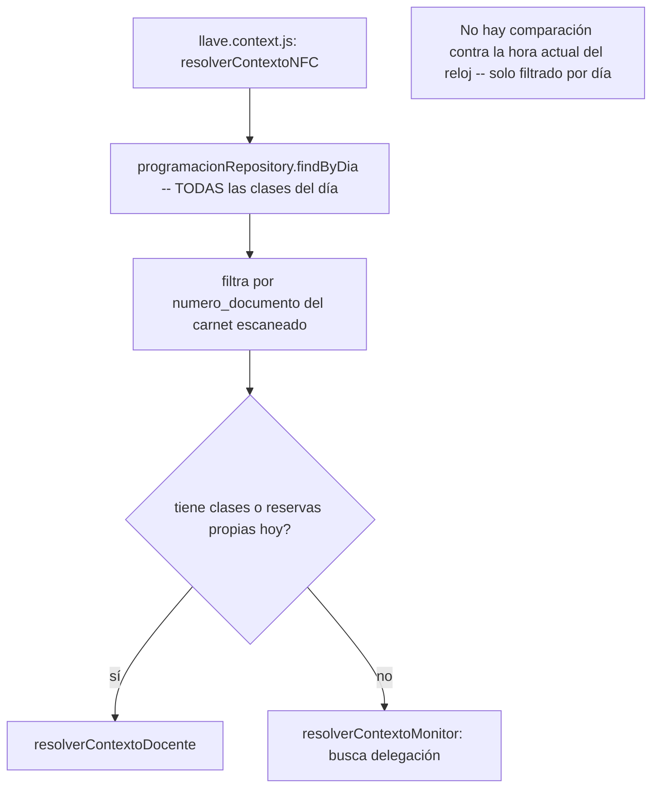

# Módulo `programacion`

## 1. Propósito

Gestiona la programación académica regular (horario de clases de docentes por salón) que alimenta el sistema de préstamo de llaves NFC. Comparte colección Mongo y schema con `reservas_semestrales` (ver módulo dedicado) mediante un campo discriminador `tipo`.

## 2. Modelos de datos

### `Programacion` — `src/features/programacion/programacion.schema.js:4-62`, colección `programacion`

Schema **polimórfico compartido** entre programación regular, reservas semestrales y grupos "fantasma":

| Campo | Detalle | Línea |
|---|---|---|
| `tipo` | enum `['programacion','semestral','fantasma']`, required, default `'programacion'` | 7 |
| `semestre`, `fecha_inicio_semestre`, `fecha_fin_semestre` | vigencia | 8-12 |
| `numero_documento` (required), `docente`, `dia`, `horario`, `hora_inicio`, `hora_fin`, `aula`, `facultad`, `materia`, `codigo_materia`, `grupo`, `nivel_grupo` | datos de la clase | 13-24 |
| `estudiantes_prematriculados/matriculados/total_estudiantes` | | 25-27 |
| `fantasma_de` | código de materia principal cuando `tipo='fantasma'` | 30 |
| `consecutivo`, `i_cancelada`, `fecha_cancelacion`, `motivo_cancelacion` | exclusivos de `tipo='semestral'` | 32-35 |
| `grupo_id`, `creado_manualmente`, `tipo_solicitante` (enum docente/estudiante), `responsable_documento`, `responsable_nombre`, `nombre_bloque` | reservas manuales | 37-42 |

Índices (líneas 50-59): `tipo`, `semestre`, `semestre+tipo`, `semestre+dia`, `tipo+dia`, `dia`, `numero_documento`, `aula`, `grupo_id`, `semestre+fantasma_de`. **No hay índice compuesto `dia+aula+hora_inicio+hora_fin`**.

### `Semestre` — `programacion.semestre.schema.js:8-31`, colección `programacion_semestres`

`codigo_raw`, `codigo` (único), `anio`, `periodo` (enum `[1,2]`), `fecha_inicio`, `fecha_fin`, `fecha_carga`, `cargado_por`, `total_registros`.

## 3. Diagrama de clases / dependencias

```mermaid
classDiagram
    class ProgramacionRoutes
    class ProgramacionController
    class ProgramacionService {
        +importarDesdeExcel()
        +listarPorDia(dia)
        +eliminarSemestre()
        +exportar()
        +validarFantasma() vincularFantasma() desvincularFantasma()
    }
    class ProgramacionRepository {
        +findByDia() findByDocumento() bulkInsert()
    }
    class SemestreRepository
    class ProgramacionSchema
    class ReservasSemestralesService

    ProgramacionRoutes --> ProgramacionController --> ProgramacionService
    ProgramacionService --> ProgramacionRepository --> ProgramacionSchema
    ProgramacionService --> SemestreRepository
    ProgramacionService --> ReservasSemestralesService : eliminar cascada, exportar combinado
    LlaveContext ..> ProgramacionRepository : findByDia (resolución NFC)
    MonitorService ..> ProgramacionRepository : findByDocumento
    SalonService ..> ProgramacionRepository : distinctAulas
    ReservaService ..> ProgramacionSchema : bypass repository, consulta directa
    ReservasSemestralesRepository ..> ProgramacionSchema : misma colección, tipo='semestral'
```

## 4. Flujos principales

### 4.1 Carga masiva por Excel



### 4.2 Resolución NFC "clase actual" (consumida por `llaves`)



## 5. Puntos de inflexión

- **No existe función central "clase en curso"**: el sistema filtra clases por día completo, no por franja horaria activa respecto a la hora actual. La única lógica horaria real (`llave.domain.js:34-47`, `horarioCubiertoPorPrestamo`) compara contra préstamos ya procesados hoy (evita duplicados), no contra el reloj.
- **Lógica de solapamiento de horarios triplicada**: reimplementada de forma independiente en `reservas_semestrales.service.js` (`validarConflictos`, `salonesDisponibles`, `disponibilidadPorDia`), en `reserva.service.js` (`_buscarConflictos`, `disponibilidad`, `salonesDisponibles`) y parcialmente en `programacion.service.js` — sin abstracción compartida.
- **Sin manejo de festivos/calendario académico**: `getDiaActual()` usa `new Date().getDay()` crudo; un feriado martes sigue mostrando clases de "Martes".
- **Relación bidireccional con `reservas_semestrales`**: `programacion.service.js` orquesta borrado en cascada y exportación combinada llamando a `reservasSemestralesService`; a su vez `reservas_semestrales` usa `programacion.semestre.repository` y el schema `Programacion` directamente.
- **Dos routers montados bajo el mismo prefijo `/api/programacion`** (`programacionRoutes` y `reservasSemestralesRoutes`) — no es error, son namespaces disjuntos (`/`, `/semestres`, `/dia/:dia` vs `/semestres/:codigo/reservas-semestrales`, `/reservas-semestrales/*`).

## 6. Dependencias externas/cruzadas

**Usa**: `reservas_semestrales.service.js` (cascada/exportación), `llave.repository.js` (`findByFecha`), `shared/utils/excel.parser`, `date.helper`, `normalize.helper`.

**Lo usan**:
- `llaves` — `llave.context.js` (`findByDia`, resolución NFC), `llave.read-model.js` (`findByDia`, auto-corrección de historial).
- `monitores` — `monitor.service.js` (`findByDocumento`).
- `salones` — `salon.service.js` (`distinctAulas`, detecta aulas sin registrar).
- `reservas` — `reserva.service.js` importa `Programacion` schema directamente (bypass del repository).
- `reservas_semestrales` — `Programacion` schema + `programacion.semestre.repository`.

## 7. Riesgos y observaciones de auditoría

- **Vacío de diseño real**: sin filtro de "clase en curso" por hora — un docente con clase a las 7am podría reclamar la llave de una clase de las 18h el mismo día sin que el backend lo distinga por hora.
- **Sin manejo de festivos/calendario académico.**
- **Lógica de disponibilidad de salón triplicada** entre 2-3 módulos sin abstracción compartida — riesgo de divergencia futura.
- **Sin cobertura de tests** confirmada (CodeGraph: "no covering tests found").
- **Código muerto**: `_esRegistroValido` (`programacion.service.js:447-449`) definido pero nunca invocado.
- **Parámetros fantasma en API**: `fecha_inicio_vigencia`/`fecha_fin_vigencia` se extraen del request pero no se usan en el destructuring del service — posible resto de refactor incompleto.
- **Bypass de repository**: `reserva.service.js` importa `Programacion` schema directamente en vez de pasar por `programacion.repository.js`.
- **Acoplamiento fuerte de colección compartida**: `tipo` como único discriminador entre datos semánticamente distintos — frágil ante queries futuras sin ese filtro.
