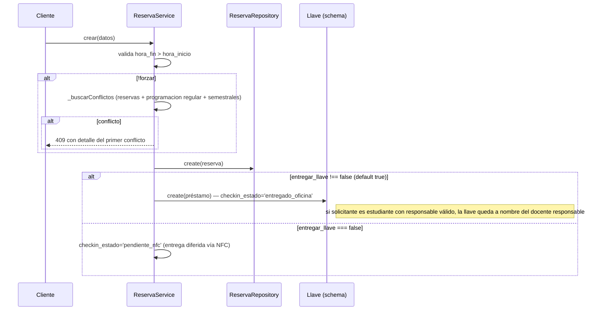
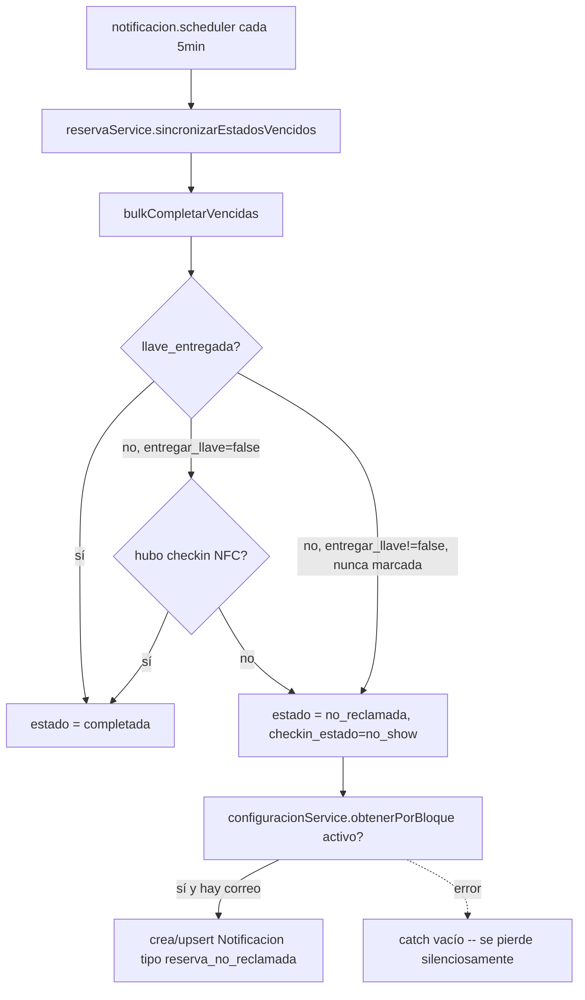

# Módulo `reservas`

## 1. Propósito

Gestiona reservas puntuales (ad-hoc, de una fecha/horario específico) de salones. Cubre validación de disponibilidad, creación con entrega opcional de llave física, aprobación/rechazo administrativo, cancelación, edición, consulta de disponibilidad por slots, y sincronización automática de estados vencidos con generación de notificaciones. Es el punto de integración entre "reservas" y "llaves/NFC".

## 2. Modelo de datos

Tabla `reservas` (migración `007_reservas_nfc_notificaciones_novedades.js`).

### Solicitud

`solicitante_comunidad_id` → `comunidad` (+ `solicitante_nombre` snapshot), `tipo_solicitante` (default `docente`), `responsable_comunidad_id`/`responsable_nombre` para cuando el solicitante necesita respaldo, `bloque_id`, `salon_id`, `fecha` (`date`), `hora_inicio`/`hora_fin` (`time`), `motivo`, `estado` (default `pendiente`), `creado_por_rol`.

### Aprobación

`aprobado_por_usuario_id` → `usuarios`, `aprobado_por_nombre`.

### Llave y check-in

| Columna | Detalle |
|---|---|
| `entregar_llave` | default `true`; hay reservas que no requieren llave |
| `llave_entregada` | bool |
| `registro_llave_id` → `registros_llaves` | el registro que se creó al entregarla |
| `checkin_estado` | default `pendiente_nfc` |
| `checkin_canal`, `checkin_at` | por dónde y cuándo se confirmó la presencia |

### Exclusión de solapamiento

La migración 018 agrega una restricción de exclusión que impide reservar el mismo salón en franjas que se pisan. La garantía es de la base, no de una verificación previa en el servicio: dos solicitudes concurrentes no pueden colarse.

## 3. Diagrama de clases / dependencias

```mermaid
classDiagram
    class ReservaRoutes
    class ReservaController
    class ReservaService {
        +crear() +validar() +aprobar() +rechazar()
        +cancelar() +editar() +listar()
        +disponibilidad() +disponibilidadSmart() +salonesDisponibles()
        -_buscarConflictos()
        -_registrarDevolucionAutomaticaPorCancelacion()
    }
    class ReservaRepository {
        +findConflictos() +bulkCompletarVencidas() +sincronizarEstadosVencidos()
    }
    class ReservaSchema
    class ProgramacionSchema
    class LlaveSchema
    class SalonSchema
    class NotificacionSchema
    class ComunidadRepository
    class ConfiguracionService

    ReservaRoutes --> ReservaController --> ReservaService
    ReservaService --> ReservaRepository --> ReservaSchema
    ReservaService --> ProgramacionSchema : conflictos vs clases fijas/semestrales
    ReservaService --> LlaveSchema : crea/consulta préstamo de llave
    ReservaService --> ComunidadRepository : enriquecer correos
    ReservaService --> SalonSchema : salones disponibles
    ReservaRepository --> NotificacionSchema : notificación no-reclamada
    ReservaRepository --> ConfiguracionService : flag notificaciones_activas
    LlaveWorkflows ..> ReservaRepository : checkin NFC pendiente
    NotificacionScheduler ..> ReservaService : sincronizarEstadosVencidos (cron 5min)
    ReservasSemestralesService ..> ReservaSchema : bypass repository
```

## 4. Flujos principales

### 4.1 Creación de reserva



### 4.2 Sincronización de estados vencidos (cron cada 5 min)



## 5. Puntos de inflexión

- **Detección de conflictos triple**: reservas activas del mismo salón (filtro en memoria tras traer candidatas), programación académica fija (`Programacion tipo='programacion'`), y reservas semestrales (`Programacion tipo='semestral', i_cancelada≠1`) — las tres fuentes en la misma función `_buscarConflictos`.
- **Aritmética de minutos para solapamiento** (`toMin`) — fix deliberado documentado en comentario para evitar comparación lexicográfica de strings de hora.
- **Aprobar/rechazar solo admin, desde `pendiente`** — sin efectos secundarios (no libera slot explícitamente, no dispara notificación).
- **Cancelar/editar sin control de propiedad**: cualquier usuario `requireAuth` puede cancelar o editar la reserva de **cualquier otro** solicitante — no se compara `req.user` contra `solicitante_documento`.
- **Cancelación con devolución automática de llave**: si `llave_entregada`, busca el préstamo por `llave_prestamo_id` o, en fallback, por `aula+documento+fecha` (compatibilidad con reservas antiguas) y lo marca devuelto si está `en_prestamo`.
- **`disponibilidadSmart`**: si hay clase programada pero la llave no fue reclamada, marca el slot como disponible (`motivo:'programacion_sin_llave'`) — asume que el docente no llegó.
- **Transiciones automáticas por vencimiento**: `pendiente`/`aprobada` → `completada` o `no_reclamada` según si hubo entrega/checkin — no hay transición manual a esos estados ni reversión desde `rechazada`/`cancelada`/`completada`/`no_reclamada`.
- **Sin validación de fecha pasada al crear** (sí se valida en `editar`) — inconsistencia.
- **Sin límite de anticipación máxima** para reservar.
- **Notificaciones automáticas solo en `no_reclamada`**: aprobar/rechazar no dispara ninguna notificación.

## 6. Dependencias externas/cruzadas

**Usa**: `Programacion` schema (conflictos), `Llave` schema (crear/consultar/actualizar préstamo), `comunidadRepository` (correos), `Salon` schema, `Notificacion` schema, `configuracionService`.

**Lo usan**:
- `llaves` — `llave.workflows.js` usa `reservaRepository` (`findReservaPendienteNFCByDocumento`, `findReservaById`, `marcarReservaCheckinNFC`) — integración central de check-in NFC.
- `notificaciones` — `notificacion.scheduler.js` invoca `sincronizarEstadosVencidos()` cada 5 min.
- `notificaciones` — `notificacion.service.js` importa el modelo `Reserva` directamente (bypass de repository).
- `reservas_semestrales` — importa el modelo `Reserva` directamente para calcular salones ocupados por reservas puntuales — **relación bidireccional** confirmada.

## 7. Riesgos y observaciones de auditoría

- **Sin cobertura de tests** (CodeGraph: "no covering tests found" para `ReservaService`, `ReservaController`, `_fechaHoraFinReserva`).
- **Autorización insuficiente en cancelar/editar** — cualquier usuario autenticado puede modificar reservas ajenas.
- **Sin validación de fecha pasada al crear.**
- **Sin límite de anticipación máxima.**
- **`findConflictos` sin filtro de fecha en la query Mongo**: trae todas las reservas activas del salón y filtra en memoria comparando zona horaria — no escala bien.
- **Efecto colateral de escritura en operación de lectura**: `listar()` siempre ejecuta `sincronizarEstadosVencidos()` — cada `GET /reservas` puede escribir en BD y crear notificaciones, con riesgo de condición de carrera con el cron paralelo.
- **Manejo de errores silencioso** (`catch(_){}`) en generación de notificación de no-reclamo.
- **Bypass de repository**: `notificacion.service.js` y `reservas_semestrales.service.js` importan el modelo `Reserva` directamente.
- **Índice único parcial no evita solapamientos parciales** — toda la protección real recae en lógica de aplicación, sin transacción ni bloqueo optimista: ventana de condición de carrera entre check y create bajo concurrencia.
