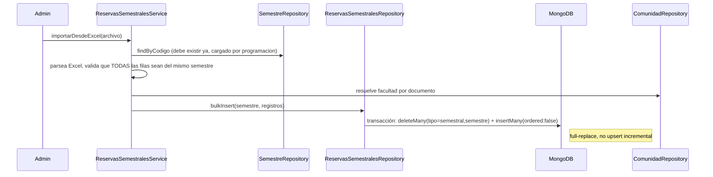
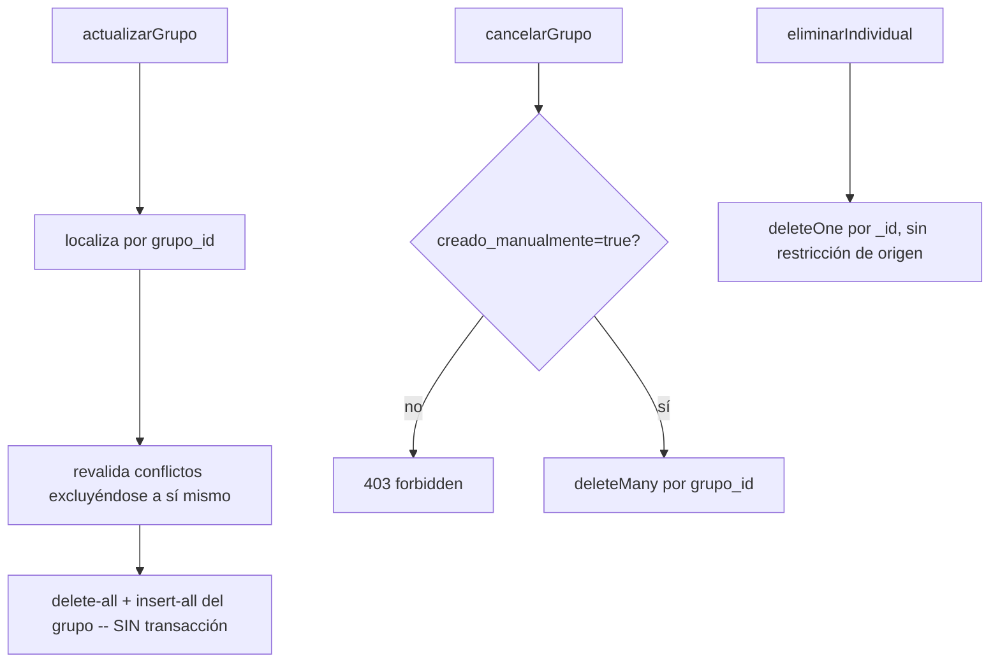

# Módulo `reservas_semestrales`

## 1. Propósito y diferenciación

Gestiona franjas horarias **recurrentes semanales** (ej. "todos los Lunes 07:00–09:00 en salón M303") vigentes durante todo un rango de fechas de semestre — no reserva una fecha puntual, reserva un patrón día-de-semana + hora que se repite mientras el semestre esté vigente. Se cargan por Excel institucional o se crean manualmente vía UI.

Comparación:
- **`programacion`**: clases oficiales cargadas por Excel institucional (`tipo:'programacion'`) y grupos fantasma (`tipo:'fantasma'`).
- **`reservas_semestrales`**: franjas recurrentes NO oficiales, persistidas como `tipo:'semestral'` **en la misma colección Mongo `programacion`**.
- **`reservas`** (puntuales): colección Mongo **separada** (`collection:'reservas'`), reserva una fecha calendario concreta, con flujo de aprobación y check-in NFC.

## 2. Modelo de datos

No tiene tabla propia: es el subtipo `semestral` de la herencia de [`programacion`](./programacion.md). La cabecera vive en `programaciones` y lo específico en `programaciones_semestrales`, que comparte la PK (`programacion_id`).

Columnas exclusivas del subtipo:

| Columna | Detalle |
|---|---|
| `consecutivo` | numeración de la solicitud |
| `grupo_id` | agrupa las franjas de una misma solicitud, para cancelarlas juntas |
| `cancelada`, `fecha_cancelacion`, `motivo_cancelacion` | la cancelación es un flag, no un borrado |
| `creado_manualmente` | distingue lo cargado por Excel de lo dado de alta a mano |
| `tipo_solicitante`, `responsable_id`, `responsable_nombre` | quién pide y quién responde |
| `bloque_id` | bloque de la reserva |

De la cabecera compartida usa `semestre_id`, `docente_id`, `dia`, `horario`, `hora_inicio`/`hora_fin`, `salon_id`, `aula`, `facultad` y `materia`. Las lecturas van contra la vista `v_programaciones`, que ya resuelve el JOIN entre cabecera y subtipo.

`cancelada` es booleano. En el modelo Mongo original era un número sin default, lo que obligaba a comparar con cuidado; la migración lo normalizó.

## 3. Diagrama de clases / dependencias

```mermaid
classDiagram
    class ReservasSemestralesRoutes
    class ReservasSemestralesController
    class ReservasSemestralesService {
        +importarDesdeExcel()
        +crearManual() +actualizarGrupo()
        +cancelarGrupo() +eliminarIndividual()
        +validarConflictos() +disponibilidadPorDia() +salonesDisponibles()
    }
    class ReservasSemestralesRepository {
        bulkInsert (transacción: deleteMany+insertMany)
    }
    class ProgramacionSchema
    class SemestreRepository
    class ComunidadRepository
    class SalonSchema
    class ReservaSchema
    class MonitorRepository

    ReservasSemestralesRoutes --> ReservasSemestralesController --> ReservasSemestralesService
    ReservasSemestralesService --> ReservasSemestralesRepository --> ProgramacionSchema
    ReservasSemestralesService --> ProgramacionSchema : acceso directo (bypass repository parcial)
    ReservasSemestralesService --> SemestreRepository : metadata de semestre
    ReservasSemestralesService --> ComunidadRepository : resolver facultad
    ReservasSemestralesService --> SalonSchema : salones disponibles
    ReservasSemestralesService --> ReservaSchema : cruzar disponibilidad con reservas puntuales
    ReservasSemestralesService --> MonitorRepository : alta automática de monitores
    ProgramacionService ..> ReservasSemestralesService : cascada al eliminar semestre, listados combinados
    LlaveContext ..> ReservasSemestralesRepository : findByDia (clases equivalentes para préstamo de llave)
```

## 4. Flujos principales

### 4.1 Importación por Excel (full-replace por semestre)



### 4.2 Creación manual con alta automática de monitor

```mermaid
flowchart TD
    A[crearManual: franjas[]] --> B[valida hora_fin > hora_inicio]
    B --> C[validarConflictos por franja]
    C -->|conflicto y !forzar| D[409 con detalle por franja]
    C -->|ok| E[grupo_id = randomUUID]
    E --> F[insertMany franjas]
    F --> G{franja.monitor_documento o estudiante+responsable?}
    G -->|sí| H[monitorRepository.create -- efecto colateral silencioso, ignora error 11000]
    G -->|no| I[fin]
```

### 4.3 Actualización y cancelación de grupo



## 5. Hallazgo crítico: comparte colección física con `programacion`

`reservas_semestrales` y `programacion` comparten la **misma cabecera física** (`programaciones`), con `tipo` como discriminador y una tabla por subtipo que comparte la PK. Esto explica por qué `app.js` monta ambos routers bajo el mismo prefijo `/api/programacion` (líneas 56 y 70) — no es error de nomenclatura, refleja que ambos módulos son vistas distintas sobre la misma tabla física, con namespaces de rutas disjuntos (`/reservas-semestrales/*` vs. rutas raíz de `programacion`).

## 6. Lógica de solapamiento triplicada (hallazgo de mayor relevancia)

La validación de conflictos de horario está **reimplementada de forma independiente en tres lugares**, sin código compartido:
1. `reservas_semestrales.service.js` — `validarConflictos`, `disponibilidadPorDia`, `salonesDisponibles`, cada una con su propia función local `toMin`/`solapan`.
2. `reservas/reserva.service.js` — importa `Programacion` directamente y reimplementa las mismas comparaciones en `_buscarConflictos`, `actualizar`, `disponibilidad`, `salonesDisponibles` (esta última con agregación Mongo, un cuarto enfoque distinto).
3. `programacion.service.js` delega parcialmente en `reservasSemestralesService` solo para *listar*, no para *validar*.

Los criterios de comparación difieren sutilmente entre módulos (normalización de tildes/guiones aplicada en unos, no en otros) — fuente real de bugs de "el sistema dice que el salón está libre en un flujo pero ocupado en otro" para el mismo dato subyacente.

## 7. Dependencias externas/cruzadas

**Usa**: `programacion.semestre.repository` (metadata de semestres), `comunidad.repository` (facultad del solicitante), `Programacion` schema (acceso directo), `Salon` schema (salones disponibles), `Reserva` schema (cruzar disponibilidad con puntuales), `monitor.repository` (alta automática).

**Lo usan**:
- `programacion.service.js` — borrado en cascada al eliminar semestre, listado combinado por día, exportación combinada.
- `llaves/llave.context.js` — `findByDia` directamente (no vía service) en resolución de contexto NFC y confirmación de clase — trata las reservas semestrales como clases equivalentes a efectos de préstamo de llave.

**Dependencia bidireccional confirmada** con `reservas`: `reservas_semestrales` importa `Reserva` schema, y `reserva.service.js` consulta `Programacion` con `tipo:'semestral'` — ambos módulos leen datos del otro sin pasar por las capas de servicio correspondientes.

## 8. Riesgos y observaciones de auditoría

- **Sin tests**: cero cobertura confirmada para controller, service y repository.
- **Transacción parcial**: `bulkInsert` usa transacción correctamente, pero `crearManual`/`actualizarGrupo` hacen delete+insert **sin transacción** — un fallo entre ambas operaciones deja el grupo en estado inconsistente.
- **Efecto colateral silencioso**: crear una reserva manual como estudiante puede dar de alta un monitor académico sin que sea evidente para el usuario.
- **`exportar` excluye campos que no aplican realmente a `semestral`** — sugiere lista `CAMPOS_EXCLUIDOS` copiada sin revisar.
- **`i_cancelada` sin enum/boolean estricto**, valor crudo inyectado desde Excel sin validar rango.
- **`dia` como texto libre sin enum** en el schema compartido — obliga a los tres módulos a usar regex tolerantes en tiempo de consulta, causa raíz de la lógica duplicada del punto 6.
- **Bypass de repository/service ajeno**: acceso directo al schema `Programacion`/`Reserva`/`Salon` desde varios módulos rompe el aislamiento vertical-slice.
