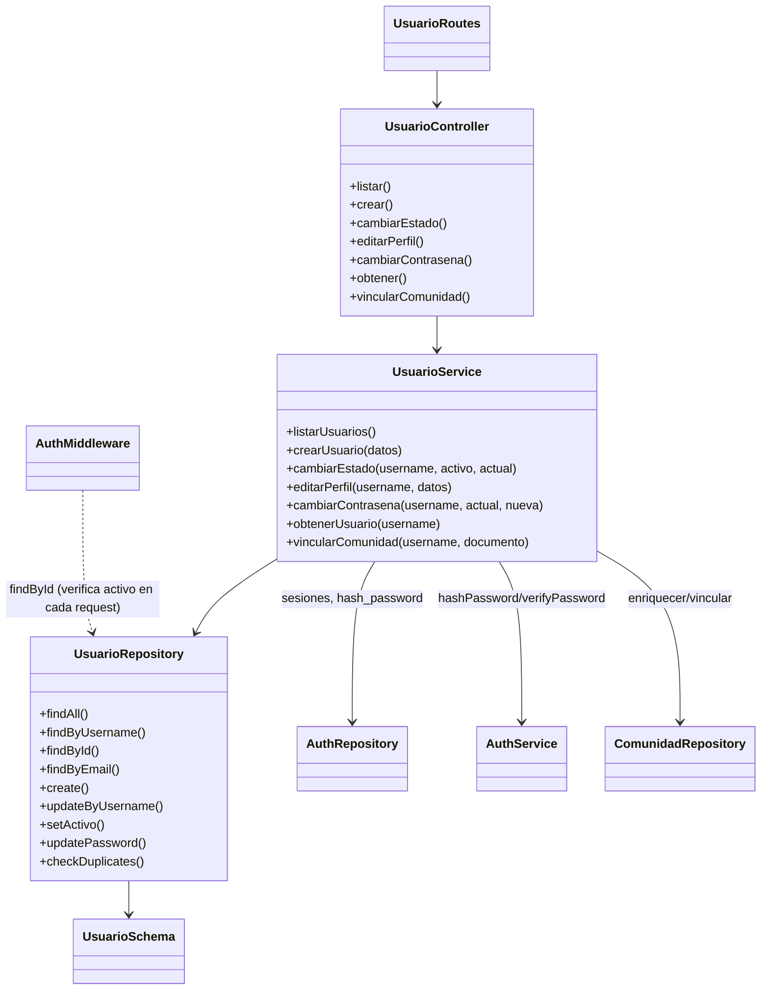
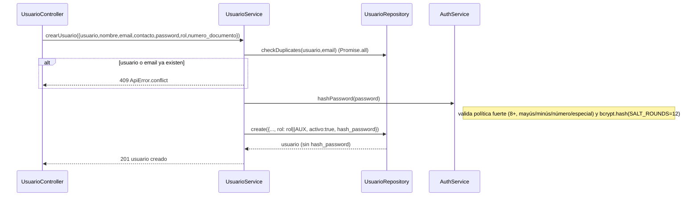
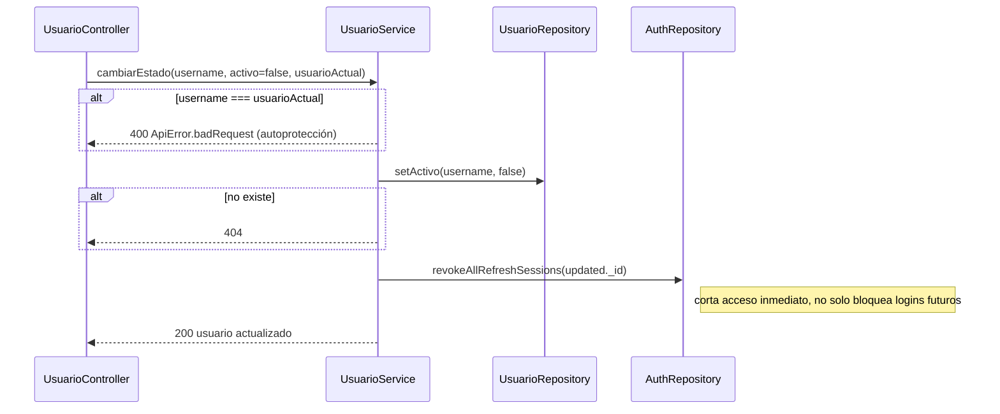
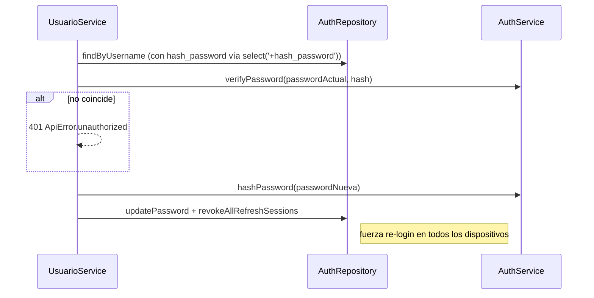

# Módulo `usuarios`

## 1. Propósito

Gestiona los usuarios internos del sistema (staff con acceso a AulaSync: administradores y auxiliares de programación) — distinto de `comunidad` (personas externas: docentes/estudiantes/empleados). Un usuario del sistema puede vincularse opcionalmente a un registro de `comunidad` vía `numero_documento`. El comentario de cabecera (`usuario.service.js:3-4`) indica que es un puerto desde una aplicación Python previa (`auth_service.py`).

## 2. Modelo de datos

`src/features/usuarios/usuario.schema.js` **no define schema propio** — re-exporta el de `auth` (`usuario.schema.js:5-6`). El schema real vive en `src/features/auth/auth.schema.js:27-89`, colección `usuarios`, `versionKey: false`.

| Campo | Tipo / reglas | Línea |
|---|---|---|
| `usuario` | String, required, **unique**, trim, min 3/max 50 | auth.schema.js:29-36 |
| `nombre` | String, required, trim, min 2 | :37-42 |
| `email` | String, required, **unique**, trim, lowercase, regex `/^\S+@\S+\.\S+$/` | :43-50 |
| `contacto` | String, default `''`, trim | :51-55 |
| `rol` | String, enum `Object.values(ROLES)`, required | :56-60 |
| `hash_password` | String, required, **`select:false`** | :61-65 |
| `activo` | Boolean, default `true` | :66-69 |
| `numero_documento` | String, default `''`, trim (vínculo opcional a `comunidad`, sin índice ni unique) | :70-74 |
| `sesiones` | `[sesionSchema]`, default `[]`, **`select:false`** | :75-79 |
| `fecha_creacion` | Date, default `Date.now` | :80-83 |

`sesionSchema` (auth.schema.js:15-25, `_id:false`): `token_hash` (required), `user_agent`, `ip`, `created_at`, `expires_at` (required), `revoked_at` — refresh-token rotation embebido en el propio documento.

`ROLES` (auth.schema.js:10-13): `ADMIN: 'admin_programacion'`, `AUX: 'auxiliar_programacion'` (solo 2 roles; los "monitores" son otro dominio distinto).

`passwordSchema` (Zod, auth.schema.js:93-100): min 8, max 72, requiere mayúscula, minúscula, número y carácter especial.

Índices: solo los implícitos por `unique` en `usuario` y `email`.

## 3. Diagrama de clases / dependencias

## 4. Flujos principales

### 4.1 Creación de usuario

### 4.2 Desactivación de usuario (soft delete + revocación de sesiones)

### 4.3 Cambio de contraseña propia

## 5. Puntos de inflexión

- **No hay hard delete**: no existe `delete`/`remove` en controller, service, repository ni routes — el único mecanismo es `activo: false`.
- **Doble estándar de validación de password**: el Zod de rutas (`crearUsuarioSchema`, `usuario.routes.js:13-21`, y `contrasenaSchema:33-36`) solo exige `min(6)`, pero `authService.hashPassword` exige 8+ con complejidad — una petición puede pasar la validación de ruta y fallar después en el service con un mensaje distinto (inconsistencia de contrato, no bug de seguridad).
- **Autoprotección de desactivación**: un usuario no puede desactivarse a sí mismo (`usuario.service.js:80-82`), pero no hay endpoint para cambiar el rol de un usuario existente una vez creado — el rol es inmutable vía API tras la creación.
- **`editarPerfil` no permite tocar `rol` ni `activo`** — protección implícita contra escalación de privilegios vía ese endpoint (reforzada porque usa `requireAuth`, no `requireAdmin`).
- **Password nunca se retorna**: 3 capas — `select:false` en schema, destructuring explícito en `create()`/`updateByUsername()` del repositorio, y `_sanitizeUser` en `auth.service.js`.
- **Revocación de sesiones como efecto colateral** ante eventos sensibles: desactivación de cuenta y cambio de password.
- **Vinculación con comunidad**: pasar `numero_documento` vacío desvincula; si no está vacío, valida que exista en `comunidad` antes de asociar (`usuario.service.js:163-167`).
- **`checkDuplicates` no es atómico con `create`**: ventana de carrera teórica bajo alta concurrencia, mitigada por índices únicos de Mongo pero sin captura explícita de la excepción de duplicado en `crearUsuario` (podría propagar como 500 en vez de 409 bajo condición de carrera).

## 6. Dependencias externas/cruzadas

**Usa**: `auth.repository` (sesiones, hash visible), `auth.service` (hash/verify password), `comunidad.repository` (enriquecimiento y vinculación).

**Lo usan**:
- `src/app.js:15` monta las rutas.
- `auth.service.js:7` — `usuarioRepository.findById()` en `refresh()` y `getMe()`.
- `auth.middleware.js:8,33-36` — `usuarioRepository.findById()` en `verifyToken()`, valida que el usuario del JWT siga activo en cada request. **Acoplamiento bidireccional** con `auth` (auth depende de usuarios.repository y usuarios depende de auth.repository/service).
- Otros módulos (`llaves`, `prestamos`, `ubicaciones`) **no importan `usuarios` directamente**; consumen datos denormalizados vía `req.user` poblado por `auth.middleware` desde el JWT, guardando copias sueltas de nombre/id (`reportado_por`, `auxiliar_prestamista`, etc.) sin `ref: 'Usuario'` en el schema — no hay integridad referencial de Mongoose entre estos módulos y `usuarios`.

## 7. Riesgos y observaciones de auditoría

- **Sin tests**: no existe ningún archivo `.test.js`/`.spec.js` en todo el repositorio.
- **Doble estándar de validación de password** entre capa de ruta (Zod) y capa de servicio — ver §5.
- **Sin rate limiting** en `PATCH /contrasena`.
- **No hay endpoint para cambiar rol** de un usuario existente — funcionalidad ausente o decisión de diseño no documentada.
- **Sin auditoría de cambios**: no hay `creado_por`/`actualizado_por`/`fecha_actualizacion` en el schema — solo `fecha_creacion`. Cambios de estado, perfil, password y vinculación no dejan rastro persistente de qué admin los ejecutó.
- **Acoplamiento bidireccional `auth` ↔ `usuarios`** dificulta el aislamiento real del vertical slice.
- **`numero_documento` sin índice ni unicidad** pese a usarse como clave de vinculación cruzada — riesgo de performance y de que dos usuarios queden vinculados al mismo registro de comunidad.
- **`checkDuplicates` no atómico con `create`** — ver §5.
- **Sin integridad referencial de Mongoose** (`ref`) entre `llaves`/`prestamos` y `usuarios` — toda trazabilidad de autoría es copia denormalizada de texto, no relación viva.
