# Documentación técnica — LlaveroFront

Trazado por feature del frontend (React + Vite, arquitectura feature-first). Cada archivo cubre propósito, componentes, dependencias, servicios API, flujos de usuario, puntos de inflexión y riesgos de una feature de `src/features/`.

## Índice de features

| Feature | Ruta | Resumen |
|---|---|---|
| [auth](./auth.md) | `/login`, `/auth-callback` | Login Office 365, `authStore` (zustand+persist), `ProtectedRoute` por rol e interceptor axios de refresh. |
| [perfil](./perfil.md) | `/perfil` | Datos propios y cambio de contraseña (solo cuentas locales). |
| [catalogos](./catalogos.md) | `/salones` | CRUD de salones, ubicaciones, bloques y tipos de silletería. |
| [programacion](./programacion.md) | `/programacion` | Importación de horarios desde Excel, vistas por semestre. |
| [ocupacion](./ocupacion.md) | `/ocupacion` | Dashboard de ocupación de aulas por jornada, día, facultad y bloque. |
| [gestion-salones](./gestion-salones.md) | `/gestion-salones` | Reservas individuales de salones; absorbe `/llaves` y `/reservas`. |
| [reservas-semestrales](./reservas-semestrales.md) | `/reservas-semestrales` | Reservas recurrentes por semestre con múltiples franjas. |
| [historial](./historial.md) | `/historial` | Registro y exportación de entregas/devoluciones de llave; lectura de carnet. |
| [equipos](./equipos.md) | `/equipos` | Inventario con estado cruzado contra préstamos abiertos y códigos de barras. |
| [prestamos](./prestamos.md) | `/prestamos` | Préstamo y devolución de equipos, con búsqueda de persona por carnet. |
| [porteros](./porteros.md) | `/porteros` | Alta de cuentas de portería y asignación de permisos por bloque. |
| [monitores](./monitores.md) | `/monitores` | Registro de monitores y auxiliares académicos. |
| [notificaciones](./notificaciones.md) | `/notificaciones` | Centro de notificaciones (Enviar / Historial / Configuración). |
| [novedades](./novedades.md) | `/novedades` | Incidencias sobre llaves, equipos o el aula, con catálogo de elemento afectado. |
| [comunidad](./comunidad.md) | `/comunidad` | CRUD de personas, restringido a ADMIN. |
| [configuracion](./configuracion.md) | `/configuracion` | Parámetros de préstamo y recordatorios por bloque. |
| [usuarios](./usuarios.md) | `/usuarios` | Alta y gestión de cuentas, restringido a ADMIN. |
| [llaves](./llaves.md) | — | Módulo API de dominio (`llavesApi.js`) consumido por historial, programación, novedades y notificaciones. `LlavesPage.jsx` **no está enrutada**: `/llaves` redirige a `/gestion-salones`. |
| [nfc](./nfc.md) | — | **Retirado.** El feature ya no existe en el código. |

## Notas de navegación

Tres rutas son redirecciones a otra pantalla, no vistas propias:

```
/llaves               → /gestion-salones
/reservas             → /gestion-salones
/notificaciones-llaves → /notificaciones
```

`LlavesPage.jsx` sigue en el repo pero ningún módulo la importa — solo aparece citada en un comentario de `HistorialPage.jsx`. Cualquier cambio de comportamiento sobre llaves tiene que ir a `HistorialPage` o a `gestion-salones`, no ahí.

## Diagrama de dependencias de alto nivel

```mermaid
graph TD
    subgraph Stores["Estado global (zustand)"]
        authStore[authStore]
        nfcStore[nfcStore]
    end

    subgraph Shared["src/shared"]
        axios[axios.client.js]
        DataTable[DataTable]
        Layout[Layout / Sidebar / TopBar]
        ProtectedRoute[ProtectedRoute]
        FileUploader[FileUploader]
        useAuthHook[useAuth]
    end

    subgraph Core["Núcleo llaves/NFC"]
        llaves[llaves: llavesApi.js]
        nfc[nfc: NFCPage + useNFCSocket]
        historial[historial]
    end

    subgraph Reservas["Programación y reservas"]
        programacion[programacion]
        gestionSalones[gestion-salones / reservas]
        reservasSem[reservas-semestrales]
    end

    subgraph Equipamiento["Equipos y préstamos"]
        equipos[equipos]
        prestamos[prestamos]
        monitores[monitores]
    end

    subgraph Comunicacion["Notificaciones y comunidad"]
        notificaciones[notificaciones]
        novedades[novedades]
        comunidad[comunidad]
        configuracion["configuracion (huérfana)"]
    end

    subgraph Admin["Administración"]
        usuarios[usuarios]
        catalogos[catalogos: salones/ubicaciones/bloques/tiposSilleteria]
        auth[auth]
        perfil[perfil]
    end

    auth --> authStore
    auth --> axios
    ProtectedRoute --> authStore

    nfc --> nfcStore
    nfc --> llaves
    monitores --> nfcStore

    programacion --> llaves
    programacion --> reservasSem
    programacion --> FileUploader
    gestionSalones --> catalogos
    reservasSem --> catalogos

    historial --> llaves
    novedades --> llaves
    notificaciones --> llaves

    prestamos --> equipos
    prestamos --> comunidad

    notificaciones -.duplica.-> configuracion

    Layout --> authStore
    DataTable --> equipos
    DataTable --> usuarios
    DataTable --> catalogos

    everything[Todas las páginas protegidas] --> Layout
    everything --> ProtectedRoute
```



## Hallazgos transversales de auditoría

- **Código huérfano/legacy confirmado**: `src/features/llaves/LlavesPage.jsxxx` y `NotificacionesTab.jsx` (no enrutados; `llavesApi.js` sigue vivo y muy reutilizado), y `src/features/configuracion/ConfiguracionPage.jsxxx` (reemplazado por `notificaciones/tabs/ConfiguracionTab.jsx`; `/configuracion` redirige en `src/App.jsxxx:49`). `salones/GestionSalonesPage.js -> src/features/gestion-salones/GestionSalonesPage.jsx-salones/GestionSalonesPage.jsx` es un wrapper de 5 líneas sobre `features/reservas`.
- **Lógica duplicada entre features**: búsqueda de persona por documento/carnet/NFC repetida casi idéntica en `PrestamosPage.jsx`, `MonitoresPage.jsx`, `ReservasPage.jsx` y `ReservasSemestralesPage.jsx`; regla de "equipo en préstamo" duplicada entre `EquiposPage.jsx` y `PrestamosPage.jsx`.
- **Endpoints/hooks sin consumidor**: acciones `aprobar`/`rechazar` de reservas individuales y cuatro hooks de `reservasSemestralesApi` exportados pero no usados en ningún componente.
- **Inconsistencia de patrones de UI**: coexisten tres mecanismos de notificación al usuario (SweetAlert2 directo, wrapper `showSuccess`/`showError`, y `toast` de sonner) sin un estándar único.
- **Autorización solo en cliente**: en varios módulos (novedades, cambio de estado, alta de usuarios) el control de rol ADMIN se aplica únicamente en la UI, sin verificación visible de que el backend revalide el rol.
- **NFC/WebSocket**: riesgo de `socket.off()` sin handler específico que puede anular listeners de otros consumidores del socket singleton; funciones `iniciar`/`detener` de `useNFCSocket` y `llavesApi.procesarNFC` sin invocación detectada.

Ver el detalle completo, con citas `archivo:línea` y diagramas Mermaid de flujo, en el archivo de cada feature.
