# Auditoría técnica — Frontend AulaSync

Índice de la documentación técnica del frontend de AulaSync (React + Vite, arquitectura feature-first). Cada archivo cubre propósito, componentes, diagrama de dependencias, servicios API, flujos de usuario, puntos de inflexión, dependencias cruzadas y riesgos de auditoría de una feature de `src/features/`.

Repo auditado: `/home/danso/proyectos/uco/AulaSyncFrontend` (rama `develop`).

## Índice de features

| Feature | Resumen |
|---|---|
| [auth](./auth.md) | Login, `authStore` (zustand+persist), `ProtectedRoute` por rol e interceptor axios de refresh de token; refresco duplicado y hook `useAuth` sin consumidores. |
| [perfil](./perfil.md) | Edición de datos propios y cambio de contraseña vía `usuariosApi`; bug de UX por falta de prop `error` en el campo de nueva contraseña. |
| [catalogos](./catalogos.md) | CRUD agrupado de salones, ubicaciones, bloques y tipos de silletería; acoplamiento bloque↔salón por nombre en lugar de ID. |
| [programacion](./programacion.md) | Importación de horarios desde Excel, vista admin por semestres vs. vista auxiliar de semestre vigente, entrega de llave al iniciar clase. |
| [gestion-salones](./gestion-salones.md) | Reservas individuales de salones (`/gestion-salones` es un wrapper de `features/reservas`); endpoints aprobar/rechazar sin caller detectado. |
| [reservas-semestrales](./reservas-semestrales.md) | Reservas recurrentes por semestre con múltiples franjas horarias; cuatro hooks de API exportados sin uso. |
| [nfc](./nfc.md) | Consola del lector NFC/ESP32 compartido: protocolo de intención/cola por WebSocket; riesgo de limpieza cruzada de listeners del socket singleton. |
| [llaves](./llaves.md) | Módulo API de dominio de llaves (`llavesApi.js`), reutilizado por historial/nfc/programación/novedades/notificaciones; UI propia (`LlavesPage`) confirmada como código muerto. |
| [historial](./historial.md) | Registro y exportación de entregas/devoluciones de llave; devolución con ubicación hardcodeada a "Oficina". |
| [equipos](./equipos.md) | Inventario de equipos con estado cruzado contra préstamos abiertos y generación de códigos de barras. |
| [prestamos](./prestamos.md) | Flujo de préstamo/devolución de equipos, dependiente de `equiposApi` y `comunidadApi`, sin integración NFC. |
| [monitores](./monitores.md) | Registro de monitores/auxiliares académicos; único módulo del bloque con integración NFC real. |
| [notificaciones](./notificaciones.md) | Centro de notificaciones (tabs Enviar/Historial/Configuración) con doble polling; `ConfiguracionTab` es la versión activa de la configuración. |
| [novedades](./novedades.md) | Registro de incidencias sobre llaves/equipos; control de rol ADMIN solo en cliente, sin guard de ruta. |
| [comunidad](./comunidad.md) | CRUD de personas restringido a ADMIN; llamadas API imperativas fuera de React Query en búsquedas por carnet/documento. |
| [configuracion](./configuracion.md) | Página huérfana no enrutada (`/configuracion` redirige a `/notificaciones`); versión anterior y más simple de `ConfiguracionTab`. |
| [usuarios](./usuarios.md) | Alta y gestión de cuentas restringida a ADMIN; sin selector de rol en creación y política de contraseña validada solo en cliente. |

## Diagrama de dependencias de alto nivel

```mermaid
graph TD
    subgraph Stores["Estado global (zustand)"]
        authStore[authStore]
        nfcStore[nfcStore]
    end

    subgraph Shared["src/shared"]
        axios[axios.client.js]
        DataTable[DataTable]
        Layout[Layout / Sidebar / TopBar]
        ProtectedRoute[ProtectedRoute]
        FileUploader[FileUploader]
        useAuthHook[useAuth]
    end

    subgraph Core["Núcleo llaves/NFC"]
        llaves[llaves: llavesApi.js]
        nfc[nfc: NFCPage + useNFCSocket]
        historial[historial]
    end

    subgraph Reservas["Programación y reservas"]
        programacion[programacion]
        gestionSalones[gestion-salones / reservas]
        reservasSem[reservas-semestrales]
    end

    subgraph Equipamiento["Equipos y préstamos"]
        equipos[equipos]
        prestamos[prestamos]
        monitores[monitores]
    end

    subgraph Comunicacion["Notificaciones y comunidad"]
        notificaciones[notificaciones]
        novedades[novedades]
        comunidad[comunidad]
        configuracion["configuracion (huérfana)"]
    end

    subgraph Admin["Administración"]
        usuarios[usuarios]
        catalogos[catalogos: salones/ubicaciones/bloques/tiposSilleteria]
        auth[auth]
        perfil[perfil]
    end

    auth --> authStore
    auth --> axios
    ProtectedRoute --> authStore

    nfc --> nfcStore
    nfc --> llaves
    monitores --> nfcStore

    programacion --> llaves
    programacion --> reservasSem
    programacion --> FileUploader
    gestionSalones --> catalogos
    reservasSem --> catalogos

    historial --> llaves
    novedades --> llaves
    notificaciones --> llaves

    prestamos --> equipos
    prestamos --> comunidad

    notificaciones -.duplica.-> configuracion

    Layout --> authStore
    DataTable --> equipos
    DataTable --> usuarios
    DataTable --> catalogos

    everything[Todas las páginas protegidas] --> Layout
    everything --> ProtectedRoute
```

## Hallazgos transversales de auditoría

- **Código huérfano/legacy confirmado**: `src/features/llaves/LlavesPage.jsx` y `NotificacionesTab.jsx` (no enrutados; `llavesApi.js` sigue vivo y muy reutilizado), y `src/features/configuracion/ConfiguracionPage.jsx` (reemplazado por `notificaciones/tabs/ConfiguracionTab.jsx`; `/configuracion` redirige en `src/App.jsx:49`). `src/features/gestion-salones/GestionSalonesPage.jsx` es un wrapper de 5 líneas sobre `features/reservas`.
- **Lógica duplicada entre features**: búsqueda de persona por documento/carnet/NFC repetida casi idéntica en `PrestamosPage.jsx`, `MonitoresPage.jsx`, `ReservasPage.jsx` y `ReservasSemestralesPage.jsx`; regla de "equipo en préstamo" duplicada entre `EquiposPage.jsx` y `PrestamosPage.jsx`.
- **Endpoints/hooks sin consumidor**: acciones `aprobar`/`rechazar` de reservas individuales y cuatro hooks de `reservasSemestralesApi` exportados pero no usados en ningún componente.
- **Inconsistencia de patrones de UI**: coexisten tres mecanismos de notificación al usuario (SweetAlert2 directo, wrapper `showSuccess`/`showError`, y `toast` de sonner) sin un estándar único.
- **Autorización solo en cliente**: en varios módulos (novedades, cambio de estado, alta de usuarios) el control de rol ADMIN se aplica únicamente en la UI, sin verificación visible de que el backend revalide el rol.
- **NFC/WebSocket**: riesgo de `socket.off()` sin handler específico que puede anular listeners de otros consumidores del socket singleton; funciones `iniciar`/`detener` de `useNFCSocket` y `llavesApi.procesarNFC` sin invocación detectada.

Ver el detalle completo, con citas `archivo:línea` y diagramas Mermaid de flujo, en el archivo de cada feature.
