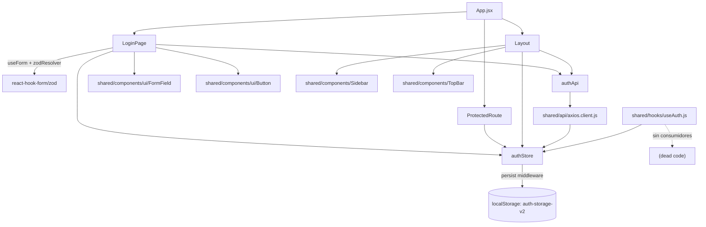
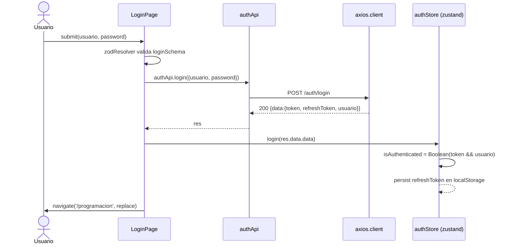
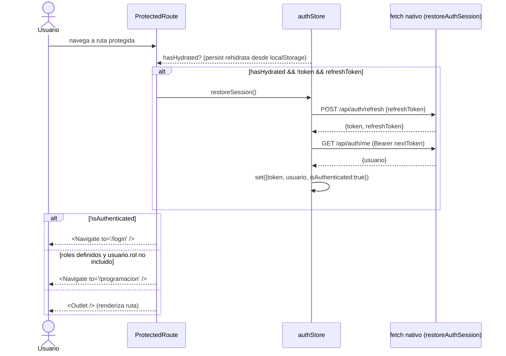
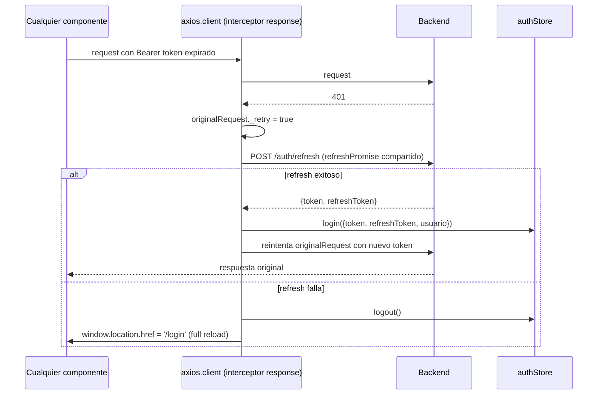

# Auth

## 1. Propósito

Gestiona el inicio de sesión, la persistencia de la sesión (JWT + refresh token) y el control de acceso por rol para toda la aplicación. Es la feature de la que dependen, directa o indirectamente, prácticamente todas las demás: el cliente HTTP inyecta el token de esta store en cada petición y `ProtectedRoute` bloquea el acceso a rutas sin sesión válida.

## 2. Componentes principales

- **`LoginPage`** (`src/features/auth/LoginPage.jsxxx:17`): formulario de login (usuario/contraseña) con `react-hook-form` + `zod`. Si ya hay sesión activa, redirige a `/programacion` (`src/features/auth/LoginPage.jsxxx:23-27`).
- **`authStore`** (`src/features/auth/authStore.js:39`): store `zustand` con middleware `persist` (localStorage, key `auth-storage-v2`). Solo persiste `refreshToken` (`partialize`, línea 100-102); `token` y `usuario` se recalculan en memoria en cada carga vía `restoreSession`.
- **`authApi`** (`src/features/auth/authApi.js:3`): wrapper de endpoints de autenticación sobre `apiClient`.
- **`ProtectedRoute`** (`src/shared/components/ProtectedRoute.jsxxx:9`): guarda de rutas; controla hidratación, redirección a `/login` y filtrado por rol (`roles` prop).
- **`useAuth`** (`src/shared/hooks/useAuth.js:3`): hook wrapper sobre `useAuthStore` que expone `usuario, token, isAuthenticated, login, logout`. **Sin consumidores en el repo** (ver §8).
- **`Layout`** (`src/shared/components/Layout.jsxxx:8`): no es parte de la feature pero orquesta el logout (llama `authApi.logout` y `authStore.logout`).

## 3. Diagrama de dependencias

## 4. Servicios API

`authApi` (`src/features/auth/authApi.js:3-8`):

| Método | Ruta | Uso | Hook/caller |
|---|---|---|---|
| POST | `/auth/login` | Login con `{usuario, password}` | `LoginPage.onSubmit` (`LoginPage.jsx:39`) |
| POST | `/auth/logout` | Invalida refresh token en backend | `Layout.handleLogout` (`Layout.jsx:15`) |
| GET | `/auth/me` | Obtiene usuario autenticado actual | usada dentro de `restoreAuthSession` vía `fetch` directo, no vía `authApi.me` (ver §6) |
| POST | `/auth/refresh` | Renueva `token`/`refreshToken` | usada dos veces con implementaciones distintas: `authStore.restoreAuthSession` (fetch nativo) y el interceptor 401 de `axios.client.js` (axios crudo) |

No hay hooks de React Query en esta feature — todo se resuelve con llamadas imperativas (`await authApi.xxx()`), a diferencia del resto de features que exponen `useXxx()` sobre `@tanstack/react-query`. No hay polling/`refetchInterval`.

## 5. Flujos principales

### Login

### Restauración de sesión al abrir la app (ProtectedRoute)

### Expiración de token durante una petición (401 en caliente)

## 6. Puntos de inflexión

- **Doble implementación de refresh**: `authStore.restoreAuthSession` (`authStore.js:4-37`) reimplementa con `fetch` nativo la misma lógica que el interceptor de `axios.client.js:21-61` hace con `axios`. Ambas construyen la URL base a partir de `import.meta.env.VITE_API_URL` por separado; no reutilizan `authApi.refresh`/`authApi.me`.
- **Guardas de hidratación**: `restoreSession` corta temprano si `state.isHydrating && !state.hasHydrated` (`authStore.js:68-70`) para evitar carreras entre el `onRehydrateStorage` de `persist` y el `useEffect` de `ProtectedRoute`.
- **Redirección con recarga completa**: en caso de fallo de refresh, tanto el interceptor como (indirectamente) el flujo de sesión usan `window.location.href = '/login'` en lugar de navegación de React Router — provoca una recarga completa de la SPA.
- **Filtro por rol genérico**: `ProtectedRoute` solo soporta OR simple sobre `roles.includes(usuario?.rol)` (`ProtectedRoute.jsx:39`); no hay jerarquía de roles ni composición de permisos.
- **`refreshPromise` como candado**: el interceptor usa una variable de módulo (`axios.client.js:11,34`) para deduplicar refresh concurrentes entre múltiples peticiones 401 simultáneas — patrón singleton fuera de React, correcto pero implícito.
- **Rutas de auth excluidas del interceptor**: `isAuthRoute` (`axios.client.js:25`) evita que un 401 en `/auth/login` dispare el flujo de refresh/logout (evitaría bucle en el propio login).

## 7. Dependencias cruzadas

- `authStore` es consumida directamente por: `LoginPage`, `Layout`, `ProtectedRoute`, `useAuth`, `axios.client.js`, y transitivamente por **PerfilPage** (lee `usuario`, llama `updateUsuario`).
- `axios.client.js` es el punto de entrada HTTP de **todas** las features (`salonesApi`, `ubicacionesApi`, `bloquesApi`, `tiposSilleteriaApi`, `usuariosApi`, etc.), por lo que cualquier cambio en el manejo de token/refresh impacta globalmente.
- `ROLES` (`src/shared/constants.js:1-4`) se usa en `App.jsx:52` para restringir `/usuarios`, `/comunidad`, `/salones`, `/ubicaciones` a `ROLES.ADMIN`.
- `Sidebar`/`TopBar` (no auditados en detalle aquí) reciben `usuario` y `onLogout` desde `Layout`.

## 8. Riesgos u observaciones de auditoría

- **Código muerto**: `src/shared/hooks/useAuth.js` no tiene ningún import/consumidor en el repo (`grep` confirma cero referencias fuera del propio archivo). Es un wrapper redundante sobre `useAuthStore`.
- **Duplicación de lógica de refresh**: dos implementaciones independientes (`authStore.restoreAuthSession` con `fetch` vs. interceptor de `axios.client.js` con `axios`) para el mismo flujo — riesgo de divergencia si se corrige un bug en una y no en la otra.
- **`authApi.me` sin uso**: `authApi.me` (`authApi.js:6`) está definida pero `restoreAuthSession` llama `GET /auth/me` vía `fetch` crudo en vez de usar este método.
- **Manejo de error genérico en login**: `LoginPage.onSubmit` solo captura `err.response?.data?.message` (`LoginPage.jsx:43`); no distingue 401 (credenciales inválidas) de errores de red o 5xx, mostrando el mismo tipo de mensaje inline.
- **Persistencia parcial silenciosa**: si `localStorage` está deshabilitado o falla, `persist` no reporta error visible al usuario; la sesión simplemente no sobrevive a un refresh de página.
- **`window.location.href` para logout forzado**: descarta el estado de React/Router en memoria de forma abrupta; funcional pero no es SPA-friendly (pierde cualquier estado no persistido de otras features en curso).
