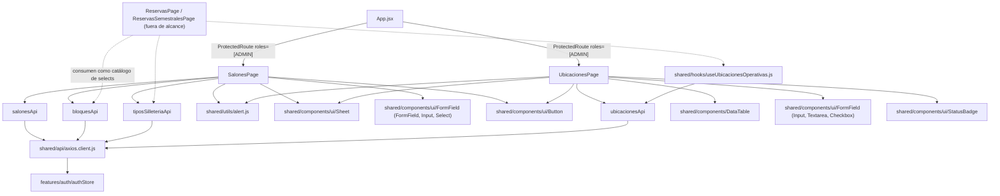
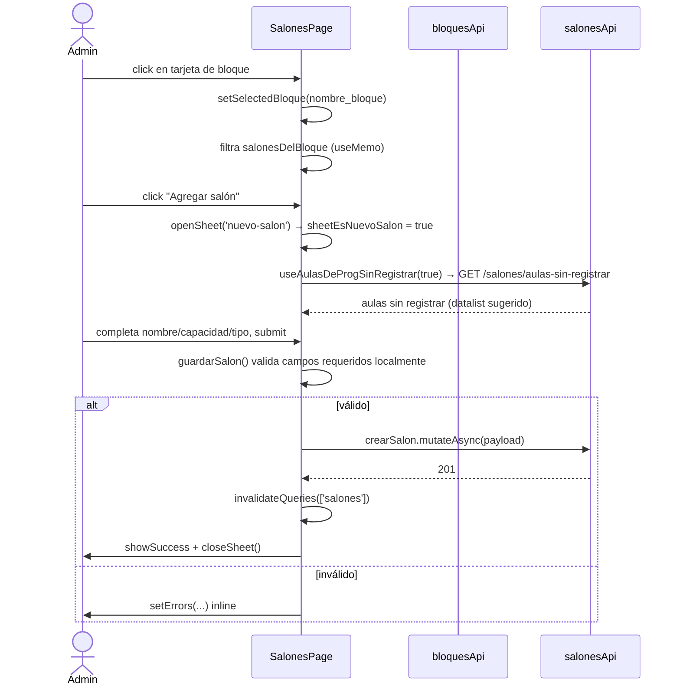
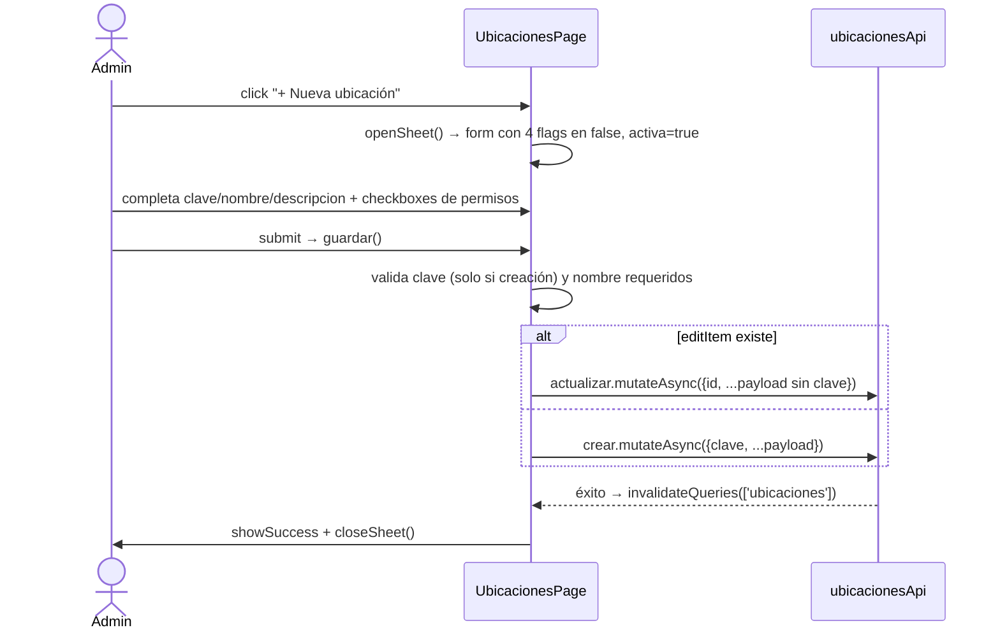

# Catálogos: Salones, Ubicaciones, Bloques y Tipos de Silletería

## 1. Propósito

Administra los catálogos maestros que alimentan al resto del sistema de reservas/préstamos: los **salones** físicos (agrupados por **bloque**, con capacidad y **tipo de silletería**) y las **ubicaciones operativas** (puntos autorizados para identificación NFC, préstamo/devolución de llaves y préstamo de equipos). `bloques` y `tiposSilleteria` no tienen página propia: son catálogos de apoyo que solo se editan como sub-flujos dentro de `SalonesPage`, y se consumen como listas de selección (`<select>`) desde otras features (reservas, reservas semestrales).

## 2. Componentes principales

- **`SalonesPage`** (`src/features/salones/SalonesPage.jsx:50`): vista maestro-detalle con drill-down. Nivel 1: grid de bloques con conteo de salones (`bloquesSalones`, línea 93-106). Nivel 2 (al seleccionar un bloque): grid de salones de ese bloque (`salonesDelBloque`, línea 108-121), con búsqueda por nombre/tipo/capacidad. Gestiona además, en el mismo componente, dos catálogos adicionales vía `Sheet` lateral: CRUD de bloques y CRUD de tipos de silletería (edición inline en lista, líneas 574-653).
- **`UbicacionesPage`** (`src/features/ubicaciones/UbicacionesPage.jsx:44`): CRUD tabular (`DataTable`) de ubicaciones operativas, con banner informativo de que solo el admin puede gestionarlas (línea 172-175) y columna de "permisos" derivada de 4 flags booleanos (`PermisosCell`, línea 23-42).
- **`salonesApi`** (`src/features/salones/salonesApi.js:4`), **`ubicacionesApi`** (`src/features/ubicaciones/ubicacionesApi.js:4`), **`bloquesApi`** (`src/features/bloques/bloquesApi.js:4`), **`tiposSilleteriaApi`** (`src/features/tiposSilleteria/tiposSilleteriaApi.js:4`): módulos co-localizados `constant + hooks React Query`, sin página propia para los dos últimos.

## 3. Diagrama de dependencias



## 4. Servicios API

### `salonesApi` (`src/features/salones/salonesApi.js:4-10`)

| Método | Ruta | Hook | Notas |
|---|---|---|---|
| GET | `/salones` | `useSalones({enabled})` | queryKey `['salones']` |
| POST | `/salones` | `useCrearSalon()` | invalida `['salones']` |
| PATCH | `/salones/:id` | `useActualizarSalon()` | invalida `['salones']` |
| DELETE | `/salones/:id` | `useEliminarSalon()` | invalida `['salones']` |
| GET | `/salones/aulas-sin-registrar` | `useAulasDeProgSinRegistrar(enabled)` | queryKey `['salones','aulas-sin-registrar']`, `staleTime: 60000`, solo `enabled` cuando el sheet de "nuevo salón" está abierto (`sheetEsNuevoSalon`) |

### `bloquesApi` (`src/features/bloques/bloquesApi.js:4-9`)

| Método | Ruta | Hook | Notas |
|---|---|---|---|
| GET | `/bloques` | `useBloques()` | queryKey `['bloques']` |
| POST | `/bloques` | `useCrearBloque()` | invalida `['bloques']` **y** `['salones']` |
| PATCH | `/bloques/:id` | `useActualizarBloque()` | invalida `['bloques']` y `['salones']` |
| DELETE | `/bloques/:id` | `useEliminarBloque()` | invalida `['bloques']` y `['salones']` |

### `tiposSilleteriaApi` (`src/features/tiposSilleteria/tiposSilleteriaApi.js:4-9`)

| Método | Ruta | Hook | Notas |
|---|---|---|---|
| GET | `/tipos-silleteria` | `useTiposSilleteria()` | queryKey `['tipos-silleteria']` |
| POST | `/tipos-silleteria` | `useCrearTipoSilleteria()` | invalida `['tipos-silleteria']` (no invalida `['salones']`, ver §6) |
| PATCH | `/tipos-silleteria/:id` | `useActualizarTipoSilleteria()` | invalida `['tipos-silleteria']` |
| DELETE | `/tipos-silleteria/:id` | `useEliminarTipoSilleteria()` | invalida `['tipos-silleteria']` |

### `ubicacionesApi` (`src/features/ubicaciones/ubicacionesApi.js:4-12`)

| Método | Ruta | Hook | Notas |
|---|---|---|---|
| GET | `/ubicaciones?incluir_inactivas=true` | `useUbicaciones({incluirInactivas, enabled})` | queryKey `['ubicaciones', {incluirInactivas}]`; `UbicacionesPage` siempre pide `incluirInactivas: true` |
| GET | `/ubicaciones/:clave` | `ubicacionesApi.obtener` | **sin hook de React Query**; no se usa dentro del alcance auditado |
| POST | `/ubicaciones` | `useCrearUbicacion()` | invalida `['ubicaciones']` (invalida todo el grupo por prefijo) |
| PATCH | `/ubicaciones/:id` | `useActualizarUbicacion()` | invalida `['ubicaciones']` |
| DELETE | `/ubicaciones/:id` | `useEliminarUbicacion()` | invalida `['ubicaciones']` |

Ninguno de los cuatro módulos usa `refetchInterval` — no hay polling; la frescura depende exclusivamente de invalidación tras mutaciones.

## 5. Flujos principales

### Drill-down y creación de salón (con autocompletar desde programación)



### Eliminar bloque con validación de dependencia

```mermaid
sequenceDiagram
    actor Admin
    participant SP as SalonesPage
    participant BApi as bloquesApi

    Admin->>SP: click "Eliminar bloque"
    SP->>SP: onEliminarBloque(bloque)
    SP->>SP: enUso = salones.some(s => s.nombre_bloque === bloque.nombre_bloque)
    alt enUso === true
        SP->>Admin: showError('No se puede eliminar un bloque que está asignado a salones')
        Note over SP: corta el flujo ANTES de pedir confirmación; validación 100% client-side
    else enUso === false
        SP->>Admin: showConfirm('Eliminar bloque', ...)
        Admin-->>SP: isConfirmed
        alt confirmado
            SP->>BApi: eliminarBloque.mutateAsync(bloque._id)
            BApi-->>SP: 200 → invalida ['bloques'] y ['salones']
            SP->>Admin: showSuccess
        end
    end
```

### CRUD de ubicación operativa



## 6. Puntos de inflexión

- **Doble filtro de bloque por texto**: la barra de búsqueda en la vista de bloques filtra tanto por nombre de bloque como (con prioridad, `salonEncontradoEnBloque`, líneas 124-129 y 362-390) detecta coincidencia exacta de **nombre de salón** para ofrecer un atajo directo al bloque contenedor — dos comportamientos de búsqueda distintos sobre el mismo input.
- **Búsqueda combinada por capacidad numérica**: dentro de un bloque, el mismo input de búsqueda intenta interpretar el texto como número (`parseInt`) y filtra salones con `capacidad_estudiantes >= capNum` además de matchear texto en nombre/tipo (`SalonesPage.jsx:108-121`) — comportamiento no obvio para el usuario si escribe un número que coincide parcialmente con un nombre de salón.
- **Validación de eliminación de bloque solo en cliente**: `onEliminarBloque` decide localmente si el bloque "está en uso" comparando contra la lista de `salones` ya cargada en memoria (línea 189-193), sin round-trip al backend — puede haber condición de carrera si otro usuario crea un salón en ese bloque justo antes.
- **Eliminación de tipo de silletería sin bloqueo**: a diferencia de bloques, `onEliminarTipo` no verifica si algún salón usa ese tipo; el mensaje de confirmación advierte que "los salones que lo usan conservarán su valor actual" (`SalonesPage.jsx:239-241`) — es una decisión de producto explícita (permite eliminar el catálogo sin migrar datos), pero es asimétrica respecto al tratamiento de bloques.
- **Edición inline de tipos de silletería** dentro del mismo `Sheet`: usa estado local (`editandoTipoId`, `editandoTipoNombre`) en vez de abrir un sub-formulario, con atajos de teclado Enter/Escape (líneas 605-628) — patrón distinto al resto de formularios de la página (que usan el `form` genérico del sheet).
- **`clave` inmutable tras creación**: en `UbicacionesPage`, el campo `clave` se deshabilita (`disabled={!!editItem}`, línea 194) y se excluye del payload al editar (línea 89) — es la clave de negocio usada como falta de PK editable, consistente con su uso como identificador semántico en `UBICACIONES`/`UBICACIONES_LABEL` (`shared/constants.js`).
- **Rol admin hardcodeado en el copy, no en lógica de UI**: el banner "Solo el administrador puede..." (`UbicacionesPage.jsx:172-175`) es puramente informativo — el control de acceso real ocurre en `App.jsx:52-57` vía `ProtectedRoute roles={[ROLES.ADMIN]}`, no en el componente de página.

## 7. Dependencias cruzadas

- Las cuatro rutas (`/salones`, `/ubicaciones`, y transitivamente `bloques`/`tiposSilleteria` sin ruta propia) están protegidas por `ProtectedRoute roles={[ROLES.ADMIN]}` (`App.jsx:52-57`) — dependen de `authStore.usuario.rol` para renderizar.
- `bloquesApi` y `tiposSilleteriaApi` son consumidos como catálogos de solo-lectura (`useBloques()`, `useTiposSilleteria()`) desde otras features fuera de este alcance (reservas, reservas semestrales) para poblar `<select>` — cualquier cambio en su forma de respuesta (`r.data.data.bloques` / `r.data.data.tipos`) impacta esas features también.
- `useUbicacionesOperativas` (`src/shared/hooks/useUbicacionesOperativas.js:5`) envuelve `useUbicaciones({incluirInactivas:false})` y deriva listas filtradas por permiso (`prestamoLlavesOptions`, `devolucionLlavesOptions`, `prestamoEquiposOptions`, `identificacionOptions`) más valores por defecto (fallback a `UBICACIONES.OFICINA` si no hay ninguna ubicación con el permiso correspondiente, líneas 39-41) — es el punto de integración real entre `ubicacionesApi` y el resto del sistema de préstamos/NFC, aunque `UbicacionesPage` en sí no lo usa (solo pide la lista completa directamente).
- `salonesApi.aulasDeProgSinRegistrar` acopla la creación de salones a datos existentes en el módulo de "programación" (fuera de alcance) — sugiere salones ya referenciados en horarios pero aún no dados de alta en el catálogo.
- Todas las mutaciones comparten `showSuccess`/`showError`/`showConfirm` de `shared/utils/alert.js`, y todas las tarjetas/tablas usan los mismos primitivos `Sheet`, `FormField`, `Button`, `StatusBadge`/`DataTable` de `shared/components`.

## 8. Riesgos u observaciones de auditoría

- **Invalidación de cache asimétrica**: crear/editar/eliminar un **bloque** invalida tanto `['bloques']` como `['salones']` (correcto, porque el nombre del bloque es un campo denormalizado en cada salón), pero crear/editar/eliminar un **tipo de silletería** solo invalida `['tipos-silleteria']` y no `['salones']`, pese a que `tipo_silleteria` también está denormalizado como string en cada salón (`SalonesPage.jsx:265,533`). Si el backend permite renombrar un tipo, los salones ya cargados en cache mostrarán el nombre antiguo hasta un refetch manual.
- **Relación bloque↔salón por nombre, no por ID**: `nombre_bloque` se compara como string (`String(...).toUpperCase()`) en múltiples puntos (líneas 93-100, 108-121, 188-193, 363-367) en vez de usar un `_id` de bloque como llave foránea — frágil ante espacios, mayúsculas inconsistentes o renombrados (un rename de bloque desconecta silenciosamente los salones existentes si el backend no propaga el cambio).
- **Duplicación de lógica de matching de bloque**: el mismo patrón `String(x).toUpperCase() === String(y).toUpperCase()` se repite al menos 4 veces en `SalonesPage.jsx` sin extraer un helper.
- **`SalonesPage` es un componente monolítico** (~740 líneas) que mezcla estado y lógica de tres entidades distintas (salones, bloques, tipos de silletería) en un solo archivo con un único objeto `sheet`/`form` genérico — alta complejidad ciclomática y bajo aislamiento; un bug en el manejo de `form` de un tipo de sheet puede afectar a los demás por estado compartido.
- **`ubicacionesApi.obtener` sin uso**: método definido (`ubicacionesApi.js:8`) pero no hay hook (`useUbicacion`) ni llamada directa detectada en el alcance auditado — posible código muerto o funcionalidad pendiente (ej. vista de detalle).
- **Validación de formularios manual y repetida**: tanto `SalonesPage.guardarSalon` (líneas 252-259) como `UbicacionesPage.guardar` (líneas 82-86) implementan validación de campos requeridos a mano con objetos `errs`, en lugar de usar `zod`/`react-hook-form` como sí hace `LoginPage` y `PerfilPage` — inconsistencia de patrón de validación dentro del mismo proyecto.
- **Sin manejo de carga/deshabilitado en `UbicacionesPage.DataTable`**: `loading={isLoading}` se pasa a `DataTable`, pero no hay estado visible de error si `useUbicaciones` falla (sin `isError`/mensaje de error de carga inicial en la página, a diferencia del manejo de errores de mutación que sí existe).
