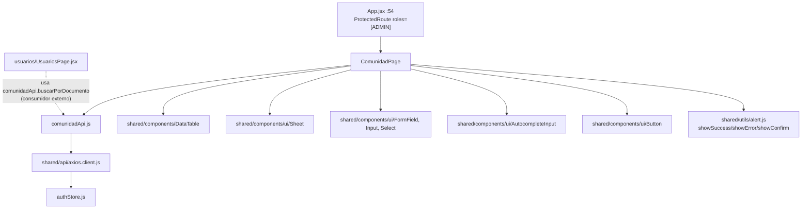
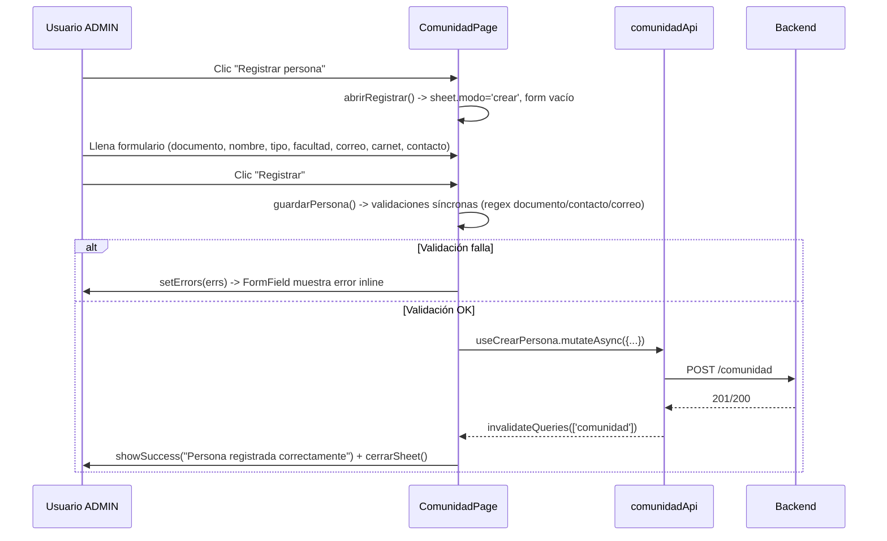
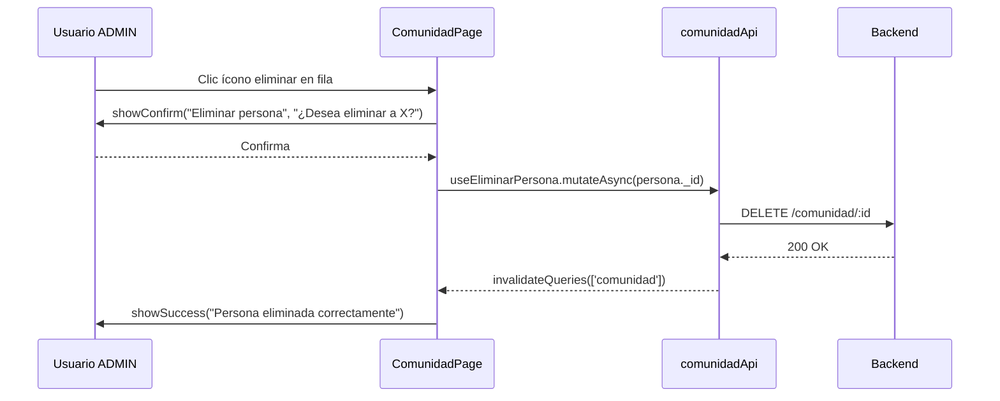

# Feature: Comunidad

## 1. Propósito

Administra el directorio maestro de personas (docentes, estudiantes, empleados) de la universidad: alta, edición y baja de registros con documento, nombre, facultad, correo, ID de carnet NFC y número de contacto. Es la fuente de verdad que otras features consultan por documento/carnet (préstamos de llaves, vinculación de usuarios del sistema, notificaciones).

## 2. Componentes principales

- **`ComunidadPage`** (`src/features/comunidad/ComunidadPage.jsxxx:84`): página única con `DataTable` de personas, botón "Registrar persona" y un `Sheet` lateral compartido para crear/editar (`sheet.modo === 'crear' | 'editar'`). Deriva `facultadesUnicas` (línea 90) desde los datos cargados para alimentar un `AutocompleteInput` de facultad.

Sin sub-componentes propios adicionales — reutiliza `Sheet`, `FormField`, `Input`, `Select`, `DataTable`, `AutocompleteInput` de `shared/components`.

## 3. Diagrama de dependencias

## 4. Servicios API

`comunidadApi` (`src/features/comunidad/comunidadApi.js:4`):

| Endpoint | Método | Hook | Notas |
|---|---|---|---|
| `/comunidad?tipo=` | GET | `useComunidad(tipo)` (línea 13) | sin `refetchInterval` (sin polling) |
| `/comunidad/carnet/:idCarnet` | GET | *(sin hook; llamada directa disponible en `comunidadApi.buscarPorCarnet`)* | usado presumiblemente por lector NFC en otra feature |
| `/comunidad/:documento` | GET | *(sin hook; `comunidadApi.buscarPorDocumento` se invoca directo, no vía React Query)* | consumido por `UsuariosPage.buscarPersona` (línea 190) |
| `/comunidad` | POST | `useCrearPersona` (línea 20) | invalida `['comunidad']` |
| `/comunidad/:id` | PATCH | `useActualizarPersona` (línea 28) | invalida `['comunidad']` |
| `/comunidad/:id` | DELETE | `useEliminarPersona` (línea 36) | invalida `['comunidad']` |

Nota de auditoría: `buscarPorCarnet`/`buscarPorDocumento` están definidos como funciones planas del objeto API (no como hooks de React Query) — se llaman de forma imperativa dentro de `async` handlers en vez de mediante `useQuery`, rompiendo el patrón consistente del resto del archivo. Confirmado: **`ComunidadPage` no tiene polling** (`useComunidad` sin `refetchInterval`).

## 5. Flujos principales

### Registrar persona

### Eliminar persona

## 6. Puntos de inflexión

- **Guard de ruta ADMIN-only**: `/comunidad` está anidada dentro de `<Route element={<ProtectedRoute roles={[ROLES.ADMIN]} />}>` (`src/App.jsxxx:52-57`). Un usuario AUX que navegue a `/comunidad` es redirigido a `/programacion` (`ProtectedRoute.jsx:39-41`) — a diferencia de `novedades`, aquí el control de acceso sí está a nivel de ruta, no solo de UI.
- **Validación de formulario manual con regex** (`guardarPersona`, línea 124-132): documento y contacto deben ser solo dígitos (`/^\d+$/`), correo con regex simple de email; documento es obligatorio solo en modo `crear` (no editable después, campo deshabilitado implícitamente al no mostrarse el `FormField` de documento en modo editar). No usa react-hook-form/zod, a diferencia de `usuarios`.
- **Diferencia crear vs. editar**: en modo `crear` se valida y envía `numero_documento`; en modo `editar` el documento no se toca (`sheet.data._id` se usa como identificador, no el documento).
- **Manejo de error**: catch con `e.response?.data?.message || 'Error al guardar'`/`'Error al eliminar'`, sin reintento automático.

## 7. Dependencias cruzadas

- **`authStore`**: no se consume directamente en `ComunidadPage.jsx` (el guard de rol lo resuelve `ProtectedRoute`, no el propio componente).
- **`ProtectedRoute` con `roles={[ROLES.ADMIN]}`**: ver `src/App.jsxxx:52` y `src/shared/components/ProtectedRoute.jsxxx:39`.
- **Consumido por otras features**: `comunidadApi` tiene 20 llamadas (según CodeGraph) desde `LlavesPage`, `MonitoresPage`, `PrestamosPage`, `ReservasPage` y otros — es una API central de referencia, no exclusiva de esta página. Dentro del alcance de este documento, `UsuariosPage.jsx:7,190` importa `comunidadApi` directamente (no un hook) para `buscarPorDocumento` al vincular un usuario del sistema con una persona de Comunidad.

## 8. Riesgos u observaciones de auditoría

- **Sin tests**: CodeGraph confirma "no covering tests found" para `comunidadApi` y `ComunidadPage`.
- **Inconsistencia de patrón API**: `buscarPorCarnet`/`buscarPorDocumento` no están envueltos en `useQuery`, mientras el resto de operaciones sí sigue el patrón hook — dificulta el cacheo/invalidación consistente y hace que cada consumidor (ej. `UsuariosPage`) deba manejar su propio estado de carga (`buscando`, línea 165) en vez de reusar `isLoading` de React Query.
- **Validación de correo con regex simple** (`/^[^\s@]+@[^\s@]+\.[^\s@]+$/`) es más permisiva que la de `usuarios` (`z.string().email()` de zod) — inconsistencia menor entre features en el rigor de validación de email.
- **`facultadesUnicas` se recalcula en cada render** (línea 90-92) a partir de `personas` sin `useMemo` — impacto de performance mínimo dado el tamaño esperado del dataset, pero es una oportunidad de mejora si la lista de comunidad crece significativamente.
- **API central de alto fan-in sin capa de abstracción adicional**: al ser consumida por 8 features distintas, cualquier cambio de contrato en `comunidadApi` (forma de respuesta, nombres de campo) tiene radio de impacto amplio; no se identificaron tipos compartidos (TypeScript/PropTypes) que documenten el shape de "persona" de forma centralizada.
