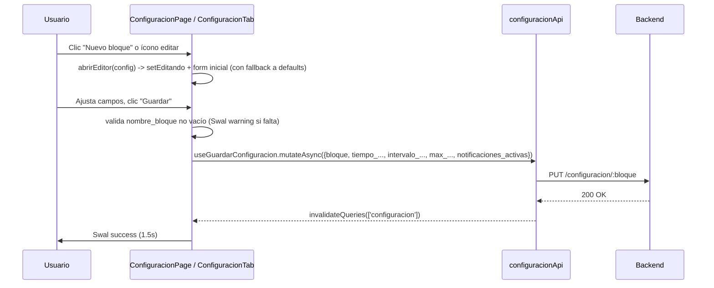
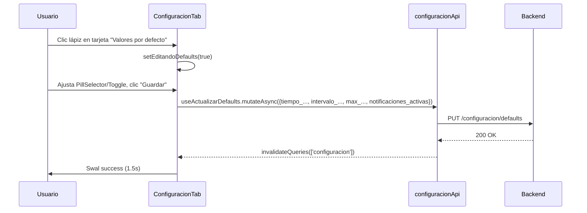

# Feature: Configuracion

## 1. Propósito

Módulo destinado a administrar la política de notificaciones automáticas de devolución de llaves por bloque de aulas (tiempo máximo de préstamo, intervalo entre recordatorios, máximo de recordatorios, activación) y sus valores por defecto. **Nota crítica de alcance**: el componente de página de este feature (`ConfiguracionPage.jsx`) no está enrutado activamente — ver punto 8. La configuración operativa real vive en `src/features/notificaciones/tabs/ConfiguracionTab.jsx`, documentada en `notificaciones.md`.

## 2. Componentes principales

- **`ConfiguracionPage`** (`src/features/configuracion/ConfiguracionPage.jsxxx:18`): página standalone (fuera del sistema de tabs de notificaciones) con formulario de edición inline (`editando` = nombre de bloque o `'__nuevo__'`), lista de tarjetas de configuraciones existentes y un bloque informativo de "valores por defecto" **de solo lectura** (sin edición — a diferencia de su contraparte activa).

## 3. Diagrama de dependencias

```mermaid
graph TD
    ConfiguracionPage["ConfiguracionPage.jsx\n(NO enrutado — código huérfano)"] -.no reachable from App.jsx.-> configuracionApi["configuracionApi.js"]
    ConfiguracionPage --> Button["shared/components/ui/Button"]
    ConfiguracionPage --> FormField["shared/components/ui/FormField, Select"]
    ConfiguracionPage --> Swal["shared/lib/swal"]
    ConfiguracionPage --> bloquesApi["bloquesApi.js\nuseBloques"]

    configuracionApi --> axiosClient["shared/api/axios.client.js"]
    axiosClient --> authStore["authStore.js"]

    ConfiguracionTab["notificaciones/tabs/ConfiguracionTab.jsx\n(RUTA ACTIVA vía /notificaciones)"] --> configuracionApi
    App["App.jsx :49\nNavigate /configuracion -> /notificaciones"] --> NotificacionesPage["NotificacionesPage.jsx"]
    NotificacionesPage --> ConfiguracionTab
```

## 4. Servicios API

`configuracionApi` (`src/features/configuracion/configuracionApi.js:4`) — **este módulo SÍ está activo**, es importado tanto por el `ConfiguracionPage` huérfano como por `ConfiguracionTab.jsx` (la versión enrutada real):

| Endpoint | Método | Hook | Polling |
|---|---|---|---|
| `/configuracion` | GET | `useConfiguraciones` (línea 13) | sin `refetchInterval` |
| `/configuracion/defaults` | GET | `useConfiguracionDefaults` (línea 20) | sin `refetchInterval` |
| `/configuracion/defaults` | PUT | `useActualizarDefaults` (línea 43) | invalida `['configuracion']` — **usado solo por `ConfiguracionTab`, no por `ConfiguracionPage`** |
| `/configuracion/:bloque` | GET | *(sin hook; `configuracionApi.porBloque` sin uso detectado en ninguno de los dos componentes)* | — |
| `/configuracion/:bloque` | PUT | `useGuardarConfiguracion` (línea 27) | invalida `['configuracion']` |
| `/configuracion/:bloque` | DELETE | `useEliminarConfiguracion` (línea 35) | invalida `['configuracion']` |

Sin polling en ninguno de los hooks de este módulo.

## 5. Flujos principales

### Editar/guardar configuración de bloque (idéntico en ambos componentes)



### Editar valores por defecto (SOLO en `ConfiguracionTab`, ausente en `ConfiguracionPage`)



## 6. Puntos de inflexión

- Sin distinción de rol dentro del propio componente `ConfiguracionPage` (no hay `useAuthStore`); el control de acceso, de existir, dependería de la ruta que lo envolviera — pero como se documenta en el punto 8, no hay ninguna ruta activa que lo renderice.
- Validación mínima: solo `nombre_bloque` no vacío antes de guardar; el resto de campos usan `<Select>` con opciones predefinidas (`OPCIONES_TIEMPO_PRESTAMO`, `OPCIONES_INTERVALO`, `OPCIONES_MAX_RECORDATORIOS`) por lo que no requieren validación adicional de rango.
- Manejo de error: catch genérico con `err.response?.data?.message ?? 'No se pudo guardar/eliminar'`.

## 7. Dependencias cruzadas

- **`bloquesApi.useBloques`**: usado para poblar el selector de bloques disponibles al crear una configuración nueva (filtra los que ya tienen configuración).
- **No usa `authStore` ni `ProtectedRoute` con roles** directamente en el componente.
- **`configuracionApi` es compartido con el feature `notificaciones`** (`ConfiguracionTab.jsx` lo importa desde `@/features/configuracion/configuracionApi`, cruzando el límite de carpeta feature-first) — la capa API de este feature está activa y es correcta; solo el componente de página quedó huérfano.

## 8. Riesgos u observaciones de auditoría — CÓDIGO HUÉRFANO CONFIRMADO

**`ConfiguracionPage.jsx` no está enrutado activamente.** Verificación:

- `src/App.jsxxx` no importa `ConfiguracionPage` en ningún punto (los imports en las líneas 4-19 no incluyen `features/configuracion/ConfiguracionPage`).
- La única ruta relacionada, `/configuracion` (`src/App.jsxxx:49`), es un `<Navigate to="/notificaciones" replace />` explícito — redirige incondicionalmente, nunca renderiza `ConfiguracionPage`.
- La funcionalidad real y activa de configuración de notificaciones vive en `src/features/notificaciones/tabs/ConfiguracionTab.jsx:203`, montada como pestaña dentro de `NotificacionesPage` (`src/features/notificaciones/NotificacionesPage.jsxxx:56`).

**Comparación de alcance — ¿duplicado o versión anterior?** `ConfiguracionTab.jsx` es una **superversión** de `ConfiguracionPage.jsx`, no un duplicado exacto:

| Aspecto | `ConfiguracionPage.jsx` (huérfano) | `ConfiguracionTab.jsx` (activo) |
|---|---|---|
| CRUD de configuración por bloque | Sí (`abrirEditor`, `handleGuardar`, `handleEliminar` — lógica casi idéntica línea por línea) | Sí (misma lógica) |
| Edición de valores por defecto | **No** — solo los muestra en modo lectura (líneas 93-103) | **Sí** — `useActualizarDefaults`, `editandoDefaults`, formulario dedicado (líneas 209, 293-310) |
| Selectores de valores | `<Select>` HTML plano con opciones fijas | `PillSelector` custom con opción "Personalizado" (input numérico) — más flexible |
| Toggle de activación | `<input type="checkbox">` inline | Componente `Toggle` dedicado con mejor affordance visual |
| Tamaño | 213 líneas | 417 líneas |

Conclusión: `ConfiguracionPage.jsx` es una **versión anterior/simplificada** que fue reemplazada por `ConfiguracionTab.jsx` al integrar la configuración como pestaña de Notificaciones en lugar de página independiente. No fue eliminado del árbol de código tras la migración.

**Riesgos concretos de este hallazgo:**

1. **Deuda técnica activa**: 213 líneas de JSX/lógica de negocio que no se ejecutan nunca en producción pero se mantienen en el repositorio, apareciendo en búsquedas, en cobertura de análisis estático, y potencialmente confundiendo a nuevos desarrolladores que busquen "dónde se edita la configuración".
2. **Riesgo de doble mantenimiento silencioso**: si un desarrollador reproduce un bug reportado en producción (que usa `ConfiguracionTab`) pero edita por error `ConfiguracionPage.jsx` (mismo nombre de funciones: `abrirEditor`, `handleGuardar`, `handleEliminar`, mismas constantes `OPCIONES_TIEMPO_PRESTAMO`/`OPCIONES_INTERVALO`/`OPCIONES_MAX_RECORDATORIOS`), el fix nunca llegará a producción.
3. **Recomendación de auditoría**: eliminar `ConfiguracionPage.jsx` del árbol de código (la capa `configuracionApi.js` debe conservarse, está activa) o, si se prevé reintroducir configuración como página independiente, documentar explícitamente la intención y archivar el componente actual como referencia versionada fuera de `src/features/`.
4. **Sin tests en ningún caso**: CodeGraph reporta "no covering tests found" tanto para `configuracionApi` como para `ConfiguracionTab`.
