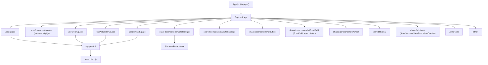
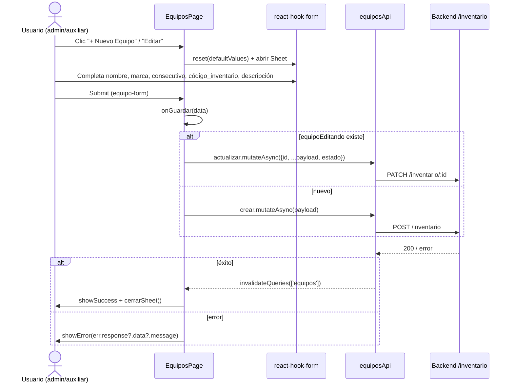
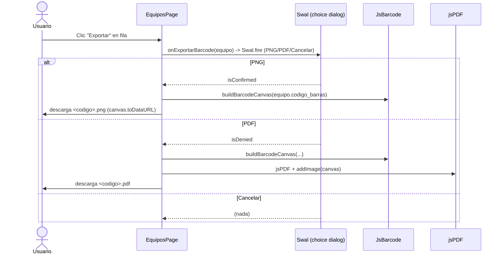

# Subsistema: Equipos (Inventario)

## 1. Propósito

Gestiona el inventario de equipos audiovisuales/tecnológicos de la universidad: alta, edición, baja y generación de códigos de barras (PNG/PDF) para etiquetado físico. Cruza el inventario con los préstamos abiertos para mostrar en tiempo real si un equipo está `activo` o `en_prestamo`, y quién lo tiene.

## 2. Componentes principales

- **`EquiposPage`** (`src/features/equipos/EquiposPage.jsx:45`) — página única del dominio. Combina tabla (`DataTable`), formulario en `Sheet` (crear/editar) con `react-hook-form`, y acciones de exportación de código de barras vía `jsbarcode` + `jspdf`. No hay paneles hijos adicionales; toda la lógica vive en este único componente de ~365 líneas.

## 3. Diagrama de dependencias

No hay dependencia de stores globales (zustand); el estado es 100% local (`useState`) + React Query.

## 4. Servicios API

`equiposApi` (`src/features/equipos/equiposApi.js:4-12`), todos sobre `/inventario`:

| Método | Endpoint | Hook expuesto | Notas |
|---|---|---|---|
| `listar` | `GET /inventario` | `useEquipos()` (línea 14) | `queryKey: ['equipos']`, sin `refetchInterval` (sin polling) |
| `disponibles` | `GET /inventario/disponibles` | `useEquiposDisponibles()` (línea 21) | `queryKey: ['equipos','disponibles']` — **no se usa en `EquiposPage.jsx`**, ver riesgos |
| `crear` | `POST /inventario` | `useCrearEquipo()` (línea 28) | invalida `['equipos']` |
| `actualizar` | `PATCH /inventario/:id` | `useActualizarEquipo()` (línea 36) | invalida `['equipos']` |
| `eliminar` | `DELETE /inventario/:id` | `useEliminarEquipo()` (línea 44) | invalida `['equipos']` |
| `buscarBarcode` | `GET /inventario/barcode/:codigo` | sin hook, llamado directo desde `PrestamosPage.jsx:225` | consumido cross-feature |
| `buscarPorTexto` | `GET /inventario/buscar?q=` | sin hook, llamado directo desde `PrestamosPage.jsx:372` | consumido cross-feature |

Ningún query de este archivo tiene `refetchInterval`; la actualización de estado "en préstamo" depende de `usePrestamosAbiertos` (definido en `prestamosApi.js`), que sí pollea cada 30s (ver `prestamos.md`), por lo que `EquiposPage` hereda ese refresco indirectamente.

## 5. Flujos principales

### Registrar / editar equipo

### Exportar código de barras (PNG/PDF)

## 6. Puntos de inflexión

- **Estado operativo derivado, no persistido**: `equiposConEstado` (`EquiposPage.jsx:55-77`) es un `useMemo` que cruza `equipos` con `prestamosAbiertos` filtrando `eq.estado_equipo === 'entregado'` para marcar `en_prestamo`. Este cálculo se repite de forma casi idéntica en `PrestamosPage.jsx` (`equipoPrestadoEnAbiertos`, línea 209-215) — misma lógica, dos implementaciones independientes (ver Riesgos).
- **Estado de equipo (`activo/inactivo/mantenimiento`)** solo es editable cuando `equipoEditando` existe (línea 337) — al crear, siempre nace `activo`; no hay control de si nace en otro estado.
- **Sin validación de duplicados en frontend**: `consecutivo` y `codigo_inventario` solo tienen `required` en el campo consecutivo; la unicidad depende enteramente del backend, y el error se muestra genérico vía `err.response?.data?.message`.
- **Generación de barcode depende de `equipo.codigo_barras`** — campo que no se ingresa en el formulario (no hay campo `codigo_barras` en el form), por lo que se asume generado por el backend al crear el equipo.

## 7. Dependencias cruzadas

- **equiposApi ↔ prestamosApi**: relación bidireccional real.
  - `EquiposPage` importa `usePrestamosAbiertos` de `prestamos/prestamosApi.js` para pintar el estado "en préstamo" (`EquiposPage.jsx:13`).
  - `PrestamosPage` importa `equiposApi` (objeto plano, no el hook) para `buscarBarcode` y `buscarPorTexto` al armar el carrito de préstamo (`PrestamosPage.jsx:6,225,372`).
  - `useCrearPrestamo`/`useRegistrarDevolucion` (en `prestamosApi.js`) invalidan explícitamente `['equipos']` al éxito — asegurando que `EquiposPage` se refresque tras un préstamo/devolución.
- **DataTable compartido** (`src/shared/components/DataTable.jsx:29`): usado igual que en `prestamos`, `comunidad`, `historial`, `llaves` (13 usos totales según CodeGraph). `EquiposPage` lo usa con `searchable` y `exportable` (exporta a `.xlsx` vía `xlsx` importado dinámicamente dentro del propio `DataTable`).
- **Sheet compartido** (`shared/components/ui/Sheet.jsx`) para el formulario lateral de alta/edición — mismo patrón que otras páginas de gestión (ver posible replicar en `llaves`, no verificado en este alcance).

## 8. Riesgos u observaciones de auditoría

- **Lógica de "equipo en préstamo" duplicada**: la misma regla de negocio (`estado_equipo === 'entregado'` ⇒ equipo ocupado) está implementada por separado en `EquiposPage.jsx:55-77` y en `PrestamosPage.jsx:209-215` (`equipoPrestadoEnAbiertos`). Cualquier cambio de regla debe tocar dos archivos; candidato a extraer a un hook compartido (p. ej. `useEquiposEnPrestamo`).
- **`useEquiposDisponibles` no tiene consumidores** (`equiposApi.js:21-26`) — código muerto o hook pensado para un flujo aún no implementado en la UI auditada (posible uso futuro en `PrestamosPage`, que en su lugar reimplementa el filtro de disponibilidad a mano vía `buscarBarcode`/`buscarPorTexto` + `equipoPrestadoEnAbiertos`).
- **Manejo de error uniforme pero genérico**: todos los catch (`onGuardar`, `onEliminar`, exportaciones) muestran `err.response?.data?.message` o un mensaje fijo, sin diferenciar por código de estado HTTP (contrasta con `PrestamosPage`, que sí distingue 409/404).
- **Componente monolítico**: `EquiposPage.jsx` mezcla estado de tabla, formulario, generación de PDF/PNG y diálogos de confirmación en un solo archivo de 365 líneas sin subcomponentes — afecta legibilidad y testabilidad (CodeGraph reporta 0 tests cubriendo `EquiposPage`).
- **Sin tests**: CodeGraph confirma "no covering tests found" para `EquiposPage`, `equiposApi` y `DataTable`.
- **Botones de acción sin `aria-*` ni confirmación consistente**: "Editar" no pide confirmación (correcto), pero "Exportar" abre un diálogo SweetAlert2 de 3 vías mezclando confirm/deny/cancel — patrón poco convencional para una acción no destructiva.
