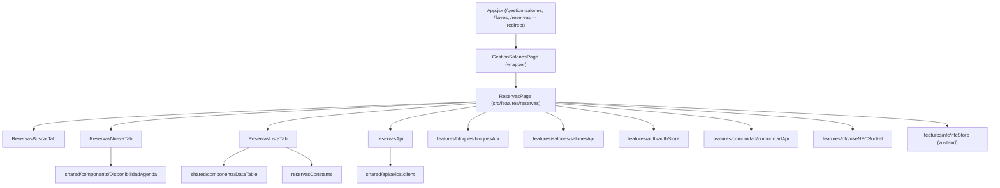
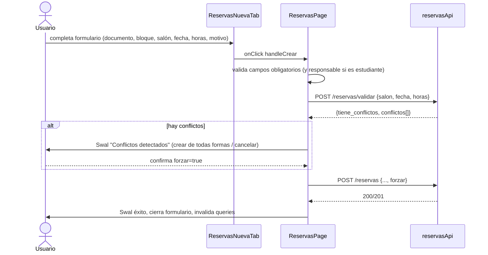
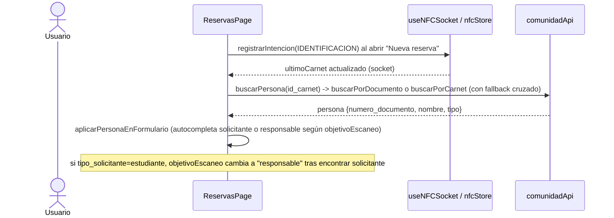
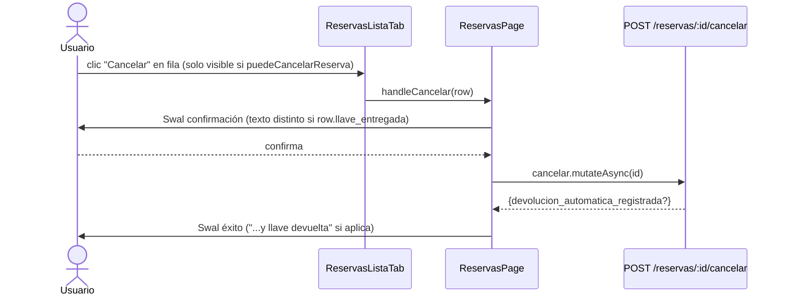

# Gestión de Salones (Reservas Individuales)

## 1. Propósito

Cubre la reserva puntual (no semestral) de salones: búsqueda de disponibilidad, creación/edición de reservas individuales con captura de solicitante/responsable por NFC o documento, y listado/gestión de reservas existentes con cancelación. La ruta `/gestion-salones` es solo un wrapper; toda la implementación real vive en `src/features/reservas/`.

## 2. Componentes principales

- **`GestionSalonesPage`** (`salones/GestionSalonesPage.js -> src/features/gestion-salones/GestionSalonesPage.jsx-salones/GestionSalonesPage.jsx:3`) — wrapper de 5 líneas que renderiza directamente `ReservasPage` sin lógica propia.
- **`ReservasPage`** (`src/features/reservas/ReservasPage.jsxxx:29`) — componente contenedor real (492 líneas): gestiona estado global de la página (formulario, filtros, edición, integración NFC), orquesta las tres pestañas y expone handlers (`handleCrear`, `handleCancelar`, `handleIniciarEdicion`, `handleGuardarEdicion`, `buscarPersona`, etc.) que pasa por props a los tabs.
- **`ReservasBuscarTab`** (`src/features/reservas/ReservasBuscarTab.jsxxx:12`) — pestaña "Buscar salón disponible": formulario de fecha/hora/tipo de silletería/capacidad, resultados agrupados por bloque, botón "Reservar" que precarga `ReservasNuevaTab`.
- **`ReservasNuevaTab`** (`src/features/reservas/ReservasNuevaTab.jsxxx:11`) — pestaña "Nueva reserva" / edición: formulario con captura NFC de solicitante y (si es estudiante) responsable, selección de bloque/salón, y panel de disponibilidad (`DisponibilidadAgenda`). Soporta modo edición completo y modo edición restringida (`en_curso`, solo permite modificar hora fin).
- **`ReservasListaTab`** (`src/features/reservas/ReservasListaTab.jsxxx:52`) — pestaña "Reservas": tabla filtrable con `DataTable`, badges de estado, acciones editar/cancelar condicionadas por fecha/estado, y `Sheet` de detalle.
- **`reservasApi.js` / `reservasConstants.js`** — capa de datos y utilidades puras (fechas, estilos de estado).

## 3. Diagrama de dependencias

## 4. Servicios API

`src/features/reservas/reservasApi.js:4`:

| Endpoint | Hook | Notas |
|---|---|---|
| `GET /reservas` | `useReservas(filters)` | query, `queryKey: ['reservas', params]` |
| `POST /reservas` | `useCrearReserva()` | invalida `reservas`, `reservas.salones-disponibles`, `reservas.disponibilidad` |
| `POST /reservas/:id/aprobar` | `useAprobarReserva()` | **exportado pero sin ningún caller en el código** (ver §8) |
| `POST /reservas/:id/rechazar` | `useRechazarReserva()` | **exportado pero sin ningún caller en el código** (ver §8) |
| `POST /reservas/:id/cancelar` | `useCancelarReserva()` | invalida `reservas`, `salones-disponibles`, `disponibilidad`; respuesta puede incluir `devolucion_automatica_registrada` |
| `GET /reservas/disponibilidad` | `useDisponibilidad(salon, fecha)` | query, `enabled` solo si hay salón y fecha; alimenta `DisponibilidadAgenda` |
| `POST /reservas/validar` | `reservasApi.validar` | llamada directa (no hook) usada antes de crear/editar para detectar choques de horario |
| `GET /reservas/salones-disponibles` | `useSalonesDisponibles(params)` | query, `enabled` solo con fecha+horas completas |
| `PATCH /reservas/:id` | `useEditarReserva()` | invalida `reservas`, `disponibilidad` |

No hay `refetchInterval`; el único polling del subsistema proviene de `useNFCSocket`/`nfcStore` (fuera de alcance de este documento) para el estado de lectura de carnet.

## 5. Flujos principales

### 5.1 Crear reserva individual con validación de choque de horario

### 5.2 Captura de solicitante por NFC o documento

### 5.3 Cancelar reserva con llave ya entregada

## 6. Puntos de inflexión

- **Modo edición completo vs "en_curso"** (`ReservasPage.jsx:294-322`, `ReservasNuevaTab.jsx:27-28,85-113`): `handleIniciarEdicion` calcula `isEnCurso(row)` (`reservasConstants.js:31`); si la reserva ya está en curso, `ReservasNuevaTab` deshabilita todos los campos salvo hora de fin (`isReadonly`), y `handleGuardarEdicion` envía solo `{id, hora_fin, motivo}` en vez del payload completo.
- **Reintento tras conflicto 409 al editar** (`ReservasPage.jsx:324-357`): si `PATCH /reservas/:id` responde 409, se muestra confirmación para reintentar con `forzar: true`; si el segundo intento también falla, se muestra error final — patrón de 2 niveles de reintento manual, no automático.
- **`tipo_solicitante` condiciona campos de responsable**: tanto en creación como en autocompletado NFC, si la persona encontrada es `estudiante`, se exige documento/nombre de un profesor responsable adicional (`ReservasPage.jsx:219-231`, `ReservasNuevaTab.jsx:181-215`).
- **Reserva "Entrega de llave al momento" vs reclamo por NFC** (`ReservasNuevaTab.jsx:256-270`): toggle `entregar_llave`, solo visible al crear (oculto en modo edición, `editModo === null`); condiciona el flujo posterior de retiro de llave (dominio de `llaves`, fuera de alcance).
- **Filtrado de salones libres por bloque** (`ReservasPage.jsx:85-95`): `porBloque` agrupa resultados de `useSalonesDisponibles` y permite filtrar la vista sin nueva llamada API; el filtro por tipo de silletería/capacidad (`salonesLibresFiltrados`) se aplica en cliente sobre el resultado ya traído del backend.
- **Estados sin transición de aprobación en UI**: `reservasConstants.js:14-21` define 6 estados (`pendiente`, `aprobada`, `rechazada`, `cancelada`, `completada`, `no_reclamada`) pero ninguna pantalla de este subsistema permite pasar de `pendiente` a `aprobada`/`rechazada` — ver hallazgo en §8.

## 7. Dependencias cruzadas

- **`llaves`**: no se importa `llavesApi` directamente en `reservas/`, pero el campo `entregar_llave` del formulario y `llave_entregada`/`devolucion_automatica_registrada` en las respuestas indican que el backend coordina la entrega/devolución de llave al crear/cancelar una reserva — acoplamiento de datos, no de código, con el dominio de llaves.
- **Catálogos**: `useBloques` (`features/bloques/bloquesApi`) y `useSalones` (`features/salones/salonesApi`) alimentan los selectores de bloque/salón tanto en la búsqueda como en el formulario de creación.
- **`comunidadApi`**: usado para `buscarPorDocumento`/`buscarPorCarnet` con fallback cruzado (si falla la primera búsqueda por tipo de identificador detectado, intenta con el otro método) — mismo patrón replicado en `reservas_semestrales`.
- **`authStore`**: se lee `usuario.rol` para `isAdmin` (`ReservasPage.jsx:59`) pero la variable **no se usa en ningún condicional visible del archivo** tras su declaración — indicio de código muerto o de una funcionalidad de admin removida sin limpiar la lectura del store (ver §8).
- **`DisponibilidadAgenda`** (`shared/components/DisponibilidadAgenda.jsx`) — componente compartido reutilizado también por `reservas_semestrales` para representar franjas ocupadas/libres de un salón.

## 8. Riesgos u observaciones de auditoría

- **Wrapper y redirecciones duplicadas confirmadas**: `GestionSalonesPage.jsx` (`salones/GestionSalonesPage.js -> src/features/gestion-salones/GestionSalonesPage.jsx-salones/GestionSalonesPage.jsx:1-5`) es un wrapper de 5 líneas que solo renderiza `ReservasPage` de `src/features/reservas/`. Además, `App.jsx` define `/llaves` y `/reservas` como `Navigate replace` hacia `/gestion-salones` (según contexto ya confirmado por el orquestador), mientras el sidebar solo enlaza `/gestion-salones` con el label "Reservas Individuales". Esto deja: (a) una carpeta `gestion-salones` sin lógica propia que solo añade una capa de indirección, (b) dos rutas legacy (`/llaves`, `/reservas`) mantenidas únicamente por compatibilidad de enlaces antiguos, sin indicación en el código de cuándo pueden retirarse.
- **Endpoints de aprobación/rechazo sin uso**: `useAprobarReserva` y `useRechazarReserva` (`reservasApi.js:35-49`) llaman a `POST /reservas/:id/aprobar` y `/rechazar` respectivamente, pero no existe ningún componente en el árbol de `reservas/` (ni en el resto del repo, confirmado por búsqueda global) que los invoque. O bien el flujo de aprobación fue removido de la UI dejando código muerto, o el backend crea reservas ya aprobadas automáticamente y estos endpoints quedaron obsoletos — requiere confirmación con backend/producto.
- **`isAdmin` no utilizado**: `ReservasPage.jsx:59` calcula `isAdmin` desde `authStore` pero no aparece referenciado en ningún JSX condicional del archivo — candidato a código muerto o a una feature de permisos incompleta.
- **Lógica duplicada entre `ReservasListaTab` y `reservasConstants`**: `ReservasListaTab.jsx:11-50` redefine localmente `puedeCancelarReserva`, `_fechaFromRow` e `isEnCurso`, casi idénticas a `_fechaHoraFromRow`/`isEnCurso` ya exportadas por `reservasConstants.js:23-40` (que sí se importa en el mismo archivo solo para `ESTADOS`). Mantenimiento futuro de la regla de "franja vigente" requiere tocar dos lugares en sincronía.
- **Componente contenedor grande con prop drilling**: `ReservasPage.jsx` (492 líneas) mantiene ~15 piezas de estado y pasa más de 15 props a `ReservasNuevaTab` — no hay contexto ni store local para el formulario, todo se propaga por props explícitas entre `ReservasPage` → tabs.
- **Manejo de error**: consistente en usar `Swal.fire` con `err.response?.data?.message` como fallback de mensaje genérico; sin diferenciación de errores de red vs. de validación de negocio, ni telemetría/logging visible en el cliente.
- **Duplicación de lógica NFC/búsqueda de persona** con `reservas_semestrales`: `buscarPersona`, `aplicarPersonaEnFormulario` y `handleBuscarPorNombre` en `ReservasPage.jsx` son prácticamente idénticas a las mismas funciones en `ReservasSemestralesPage.jsx` (ver `reservas-semestrales.md` §8) — candidatas a extraerse en un hook compartido (`useBuscarPersonaNFC` o similar) en `shared/hooks`.
- **Sin cobertura de pruebas**: `ReservasPage`, `ReservasBuscarTab`, `ReservasNuevaTab`, `ReservasListaTab` y `reservasApi` no tienen pruebas automatizadas (confirmado por CodeGraph), a pesar de manejar dinero-cero pero sí disponibilidad crítica de espacios físicos y coordinación con hardware NFC.
