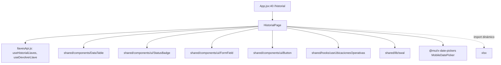
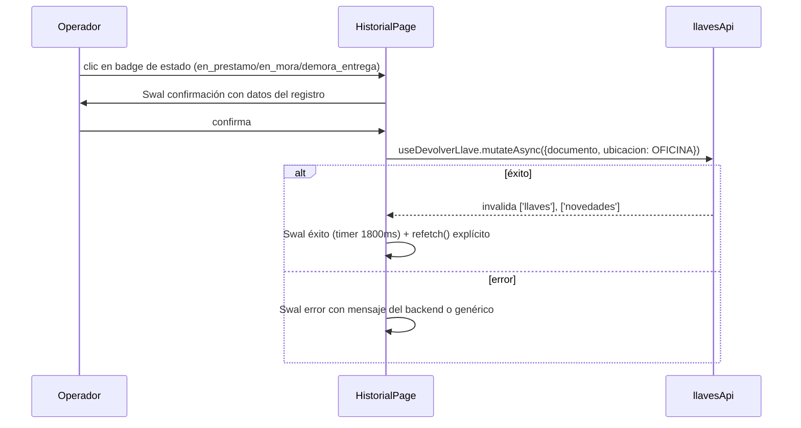
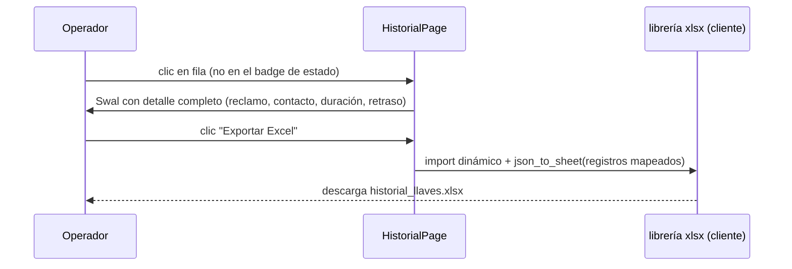

# Historial — Registro de entrega de llaves

## 1. Propósito

Página en `/historial` (`src/App.jsxxx:40`, etiquetada en el sidebar como "Entrega de Llaves") que lista el historial completo de préstamos de llave por fecha/estado, permite ver el detalle de cada registro, registrar devoluciones pendientes directamente desde la tabla y exportar a Excel en el cliente.

## 2. Componentes principales

| Símbolo | Archivo | Responsabilidad |
|---|---|---|
| `HistorialPage` | `src/features/historial/HistorialPage.jsxxx:14` | Única exportación del módulo. Filtros (fecha/estado), tabla, modal de detalle, devolución inline y exportación a `.xlsx`. |
| `abrirDetalles` | `HistorialPage.jsx:30` | Abre un `Swal.fire` con el detalle completo del registro (reclamo, contacto, duración, retraso). |
| `handleDevolucion` | `HistorialPage.jsx:60` | Confirma y ejecuta la devolución de un registro `en_prestamo`/`en_mora`/`demora_entrega` directamente desde la tabla de historial. |
| `handleExport` | `HistorialPage.jsx:127` | Exporta los registros visibles a Excel usando `xlsx` (import dinámico), sin llamar al backend. |

## 3. Diagrama de dependencias

## 4. Servicios API

Vía `llavesApi.js` (no define endpoints propios):

| Hook | Endpoint | refetch/polling |
|---|---|---|
| `useHistorialLlaves(filters)` (`llavesApi.js:52`) | `GET /llaves/historial` con `params = { fecha, estado }` | Sin `refetchInterval`; se refresca manualmente vía `refetch()` tras una devolución (`HistorialPage.jsx:82`) o al cambiar `filters` (React Query re-ejecuta por cambio de `queryKey`) |
| `useDevolverLlave()` (`llavesApi.js:70`) | `POST /llaves/devolver/:documento` | Mutación; invalida `['llaves']` y `['novedades']` en `onSuccess`, y además se llama `refetch()` explícito local tras el `await` |

No hay eventos WebSocket escuchados directamente en este archivo — la actualización en tiempo real de devoluciones por NFC ocurre en `NFCPage`/`LlavesPage`, no aquí; `HistorialPage` es puramente REST + acción manual.

Filtro por defecto: `fecha` inicializado a la fecha actual (`new Date().toISOString().slice(0,10)`, `HistorialPage.jsx:15`), `estado` vacío (todos).

## 5. Flujos principales

### 5.1 Devolución manual desde el historial

### 5.2 Consulta de detalle y exportación

## 6. Puntos de inflexión

- **La ubicación de devolución está hardcodeada a `UBICACIONES.OFICINA`** en `handleDevolucion` (`HistorialPage.jsx:80`), a diferencia de `LlavesPage`/`NFCPage`, que permiten elegir ubicación de devolución (`devolucionLlavesOptions` vía `useUbicacionesOperativas`). Esto es una asimetría de UX: desde el historial no se puede devolver a `PORTERIA_SUPERIOR` u otra ubicación configurada.
- **`e.stopPropagation()` en el botón de estado** (`HistorialPage.jsx:115`) evita que el clic en "Devolver" dispare también `onRowClick` (que abriría el modal de detalle) — necesario porque ambas acciones comparten la misma fila de `DataTable`.
- **Exportación 100% cliente**: no usa `llavesApi.exportarHistorial` (endpoint de exportación server-side ya definido pero sin consumidor, ver `llaves.md` §8), sino que repite la lógica de formateo de columnas en el cliente con `xlsx`. Cualquier cambio en las columnas de la tabla (`COLS`) debe replicarse manualmente en el mapeo de `handleExport` — ya están ligeramente desincronizados (p. ej. `handleExport` incluye `Quién Reclamó`, `Nombre Reclamó`, `Correo Reclamó`, `Contacto Reclamó`, que no son columnas visibles en `COLS`).
- **No hay rama admin vs auxiliar**: a diferencia de `LlavesPage` (que oculta tabs `adminOnly`), `HistorialPage` no consulta `useAuthStore`/`ROLES` — el historial es visible igual para todos los roles autenticados que lleguen a la ruta.

## 7. Dependencias cruzadas

`HistorialPage.jsx` es consumidor de `llavesApi.js` (`useHistorialLlaves`, `useDevolverLlave`), compartiendo el mismo módulo API que `nfc`, `programacion`, `novedades` y `notificaciones` (ver tabla completa en `llaves.md` §7). No es consumido por ninguna otra feature.

## 8. Riesgos u observaciones de auditoría

1. **Ubicación de devolución fija a "Oficina"** sin posibilidad de override desde esta pantalla (§6) — inconsistente con el resto del dominio que sí permite elegir. Si el flujo real requiere devolver en portería desde el módulo de historial, actualmente no es posible sin pasar por `LlavesPage` (huérfana) o `NFCPage`.
2. **Desincronización entre columnas visibles (`COLS`) y columnas exportadas (`handleExport`)**: el export incluye más campos de los que la tabla muestra (datos de "quién reclamó"), lo que puede sorprender a un auditor que compare pantalla vs. archivo descargado.
3. **No usa el endpoint de exportación del backend** (`llavesApi.exportarHistorial`) pese a que existe — duplica lógica de formateo y depende de que `registros` (ya paginado/filtrado por `filters`) contenga todos los campos necesarios; si el backend cambia la forma de los campos de `historial`, ambos lugares (tabla y export) deben actualizarse a mano.
4. **Filtro de fecha por defecto es "hoy"**: si un operador no cambia el filtro, no ve historial de días anteriores por defecto, lo cual puede generar la falsa impresión de que "no hay registros" para quien no note el filtro de fecha precargado.
5. **Sin manejo de reconexión/error específico de red** más allá del `try/catch` de `handleDevolucion`; no hay estado de carga distinto para "sin conexión" vs. "error del backend" (ambos caen en el mismo `Swal.fire({icon:'error', ...})`).
