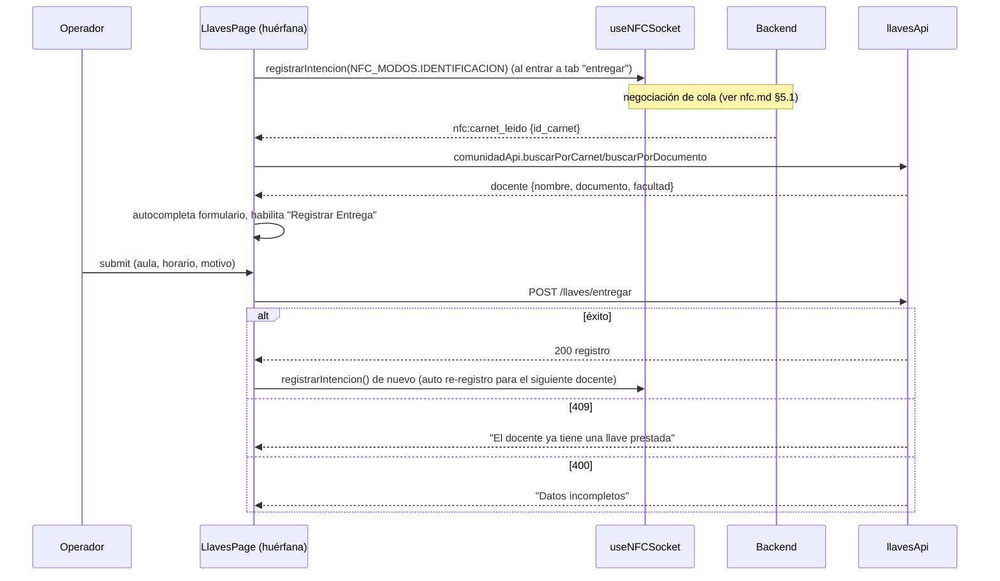

# Llaves — API de dominio y UI legacy huérfana

## 1. Propósito

`src/features/llaves/` contiene el módulo API de dominio (`llavesApi.js`) para el ciclo de vida de préstamos de llaves físicas de salón (entrega, devolución, historial, procesamiento NFC), consumido activamente por varias otras features. También contiene dos componentes de UI (`LlavesPage.jsx`, `NotificacionesTab.jsx`) que **no están conectados a ninguna ruta activa** y representan una versión anterior de la funcionalidad, hoy repartida entre `NFCPage`, `HistorialPage`, `ProgramacionPage`, `NovedadesPage` y `notificaciones/tabs/EnviarTab.jsx`.

## 2. Componentes principales

| Símbolo | Archivo | Estado | Responsabilidad |
|---|---|---|---|
| `llavesApi` (objeto) + hooks (`useLlavesPendientes`, `useTodosPendientes`, `useLlavesHoy`, `useHistorialLlaves`, `useEntregarLlave`, `useDevolverLlave`) | `src/features/llaves/llavesApi.js` | **Activo** | Módulo API central: endpoints REST + hooks React Query reutilizados por todo el dominio de llaves. |
| `LlavesPage` | `src/features/llaves/LlavesPage.jsxxx:122` | **Huérfano** (no importado en `App.jsx`) | UI original de "Préstamos Individuales de Llaves": tabs para entregar (con identificación NFC del docente) y ver pendientes individuales con botón de devolución. |
| `DevolucionBtn` | `src/features/llaves/LlavesPage.jsxxx:69` | Huérfano (interno) | Botón que abre un `Swal` con selector de ubicación de devolución y llama `useDevolverLlave`. |
| `NotificacionesTab` | `src/features/llaves/NotificacionesTab.jsxxx:57` | **Huérfano** (no importado en ningún archivo) | Tab de envío de notificaciones de devolución por correo a docentes con llaves pendientes, con selección múltiple y sheet de composición de mensaje. |

## 3. Diagrama de dependencias

```mermaid
graph TD
    subgraph "Activo"
        llavesApi["llavesApi.js"]
        NFCPage --> llavesApi
        HistorialPage --> llavesApi
        ProgramacionPage --> llavesApi
        NovedadesPage --> llavesApi
        EnviarTab["notificaciones/tabs/EnviarTab.jsx"] --> llavesApi
    end

    subgraph "Huérfano — sin ruta en App.jsx"
        LlavesPage -.-> llavesApi
        LlavesPage -.-> useNFCSocket["nfc/useNFCSocket"]
        LlavesPage -.-> useNFCStore["nfc/nfcStore"]
        LlavesPage -.-> comunidadApi
        LlavesPage -.-> useSalones["salones/salonesApi"]
        NotificacionesTab -.-> llavesApi
        NotificacionesTab -.-> notificacionesApi["notificaciones/notificacionesApi"]
        NotificacionesTab -.-> configuracionApi
    end

    style LlavesPage stroke-dasharray: 5 5,opacity:0.6
    style NotificacionesTab stroke-dasharray: 5 5,opacity:0.6
```

## 4. Servicios API

Todos definidos en `src/features/llaves/llavesApi.js:4-26`:

| Método | Endpoint | Uso |
|---|---|---|
| `pendientes()` | `GET /llaves/pendientes` | Llaves pendientes del usuario/contexto actual — `useLlavesPendientes` (`refetchInterval: 30000`) |
| `todosPendientes()` | `GET /llaves/pendientes/todos` | Todas las pendientes (vista admin/notificaciones) — `useTodosPendientes` (`refetchInterval: 30000`) |
| `hoy()` | `GET /llaves/dia` | Llaves del día — `useLlavesHoy` (`refetchInterval: 30000`) |
| `historial(params)` | `GET /llaves/historial` | Historial filtrado — `useHistorialLlaves` (sin polling) |
| `entregar(data)` | `POST /llaves/entregar` | Registrar préstamo — `useEntregarLlave` (invalida `['llaves']` y `['programacion']`) |
| `devolver(payload)` | `POST /llaves/devolver/:documento` | Devolución por documento del docente, con `ubicacion` y `novedad` opcional en el body — `useDevolverLlave` (invalida `['llaves']` y `['novedades']`) |
| `procesarNFC(payload)` | `POST /llaves/procesar-nfc` | Definido, sin llamadores en frontend (ver `nfc.md` §8) |
| `confirmarAnticipado(data)` | `POST /llaves/confirmar-anticipado` | Confirma reclamo anticipado — usado desde `NFCPage.jsx:42` |
| `devolverPorId(id, ubicacion)` | `POST /llaves/devolver-registro/:id` | Devuelve una llave específica por id de registro (selección manual) — usado desde `NFCPage.jsx:139` |
| `exportarHistorial(params)` | `GET /llaves/historial/exportar` (blob) | Definido, exportación server-side; `HistorialPage.jsx` implementa su propia exportación cliente con `xlsx` (ver `historial.md`) en vez de usar este método |

`useEntregarLlave` y `useDevolverLlave` son mutaciones React Query estándar (`useMutation` + `invalidateQueries` en `onSuccess`).

## 5. Flujos principales

### 5.1 Entrega individual con identificación NFC (LlavesPage, huérfana)

### 5.2 Devolución manual con selección de ubicación (LlavesPage / DevolucionBtn)

```mermaid
sequenceDiagram
    participant User as Operador
    participant Btn as DevolucionBtn
    participant API as llavesApi

    User->>Btn: clic "Devolver" en fila de pendiente
    Btn->>User: Swal con <select> de ubicaciones de devolución
    User->>Btn: confirma ubicación
    Btn->>API: POST /llaves/devolver/:documento {ubicacion}
    API-->>Btn: invalida ['llaves'], ['novedades']
```

## 6. Puntos de inflexión

- **`LlavesPage` cambia el modo de intención NFC según el tab activo** (`LlavesPage.jsx:192-200`): `NFC_MODOS.IDENTIFICACION` en "entregar" (para leer carnet e identificar docente) vs. `NFC_MODOS.AUTO` en "pendientes" (para devolución automática por lectura, sin paso de identificación manual). El `useEffect` cancela la intención anterior en el cleanup al cambiar de tab.
- **Devolución automática por NFC en tab "pendientes"** (`LlavesPage.jsx:214-229`): si `ultimoResultado.tipo === 'devolucion'`, se invalida la query de llaves directamente sin más interacción; si es `error`/`sin_clase`, se muestra `showError`. No hay manejo explícito de `seleccion_devolucion` en este componente (a diferencia de `ResultadoCard` en `NFCPage`), lo que sugiere que la lógica de selección múltiple fue añadida después y solo se completó en `NFCPage`, dejando `LlavesPage` desactualizado.
- **Doble intento de búsqueda de docente** (`buscarDocente`, `LlavesPage.jsx:253-290`): si el identificador es numérico, intenta `buscarPorDocumento` y hace fallback a `buscarPorCarnet` si falla, y viceversa si no es numérico — heurística para aceptar tanto documento como código de carnet desde el mismo input.
- **`NotificacionesTab` filtra por presencia de correo** para habilitar checkbox/selección (`row.correo`, `LlavesPage.jsx` no aplica; ver `NotificacionesTab.jsx:185`), y calcula el conteo de recordatorios por bloque de aula contra `configuracionApi` (`encontrarConfig`, `NotificacionesTab.jsx:46-55`) para mostrar el progreso hacia el máximo permitido.

## 7. Dependencias cruzadas

`llavesApi.js` es el módulo API compartido real del dominio de llaves. Consumidores confirmados:

| Feature | Qué importa | Para qué |
|---|---|---|
| `historial/HistorialPage.jsx:3` | `useHistorialLlaves`, `useDevolverLlave` | Listado filtrable del historial y devolución manual desde el historial (ver `historial.md`) |
| `nfc/NFCPage.jsx:4` | `llavesApi` (objeto completo) | `confirmarAnticipado`, `devolverPorId` tras eventos WebSocket |
| `programacion/ProgramacionPage.jsx:21` | `useEntregarLlave` | Entrega de llave asociada a una clase programada |
| `novedades/NovedadesPage.jsx:9` | `useTodosPendientes` | Cruce de novedades con llaves pendientes |
| `notificaciones/tabs/EnviarTab.jsx:15` | `useTodosPendientes` | **Reemplazo funcional de `NotificacionesTab.jsx`**: misma idea (selección + envío de recordatorio), pero integrada en `NotificacionesPage` con soporte adicional para reservas no reclamadas (`useReservasNoReclamadas`, `useDescartarNotificacionReserva`) |

## 8. Riesgos u observaciones de auditoría

1. **Código muerto confirmado**: `src/features/llaves/LlavesPage.jsxxx` y `src/features/llaves/NotificacionesTab.jsxxx` no aparecen importados en `src/App.jsxxx:1-21` ni en ningún archivo activo del árbol de rutas (verificado con grep recursivo sobre `src/`, sin coincidencias fuera de `src/features/llaves/`). Las rutas `/llaves` y `/reservas` redirigen a `/gestion-salones` (`App.jsx:36-37`), y no existe ninguna ruta que monte `LlavesPage`. `NotificacionesTab` tampoco es importado ni siquiera por `LlavesPage`. Ambos parecen ser remanentes de una iteración anterior de la UI, reemplazados por `NFCPage` + `HistorialPage` (entrega/devolución) y `notificaciones/tabs/EnviarTab.jsx` (envío de recordatorios, con soporte extendido para reservas).
2. **Riesgo de divergencia silenciosa**: como `LlavesPage` sigue importando y usando `llavesApi` y `useNFCSocket`/`useNFCStore` reales, cualquier cambio de contrato en esos módulos (p. ej. renombrar un evento NFC o cambiar la forma del payload de `devolucion`) puede romper `LlavesPage` sin que ningún test o build lo detecte, porque nunca se ejecuta en producción. Si se decide eliminar el archivo, no hay impacto funcional; si se decide reactivar, requiere auditoría de paridad con `NFCPage`/`HistorialPage` primero (ver punto de inflexión sobre `seleccion_devolucion` no manejado).
3. **Bug de import faltante en `NotificacionesTab.jsx`**: se usa el ícono `AlertTriangle` en la columna `correo` (`NotificacionesTab.jsx:200`) pero solo se importan `Mail, Send` de `lucide-react` (`NotificacionesTab.jsx:21`). Esto lanzaría `ReferenceError: AlertTriangle is not defined` en tiempo de ejecución al renderizar cualquier fila sin correo — otra señal de que el archivo está abandonado y no se ha vuelto a compilar/ejecutar en la práctica. El reemplazo funcional (`EnviarTab.jsx:26`) sí importa `AlertTriangle` correctamente.
4. **`exportarHistorial` (server-side, blob) no se usa**: `HistorialPage.jsx` reimplementa la exportación en el cliente con la librería `xlsx` en vez de consumir este endpoint — inconsistencia de patrón, no un bug, pero redundancia entre backend y frontend para la misma funcionalidad.
5. **Manejo de errores de `entregar` por código HTTP** (`LlavesPage.jsx:322-332`) está duplicado conceptualmente en cualquier otro consumidor de `useEntregarLlave` (p. ej. `ProgramacionPage`); al no estar centralizado en el hook, cada página debe reimplementar el mapeo 409/400/genérico.
6. **Sin tests** para `llavesApi.js`, `LlavesPage.jsx` ni `NotificacionesTab.jsx` (confirmado por CodeGraph: blast radius sin cobertura señalada para los símbolos explorados).
