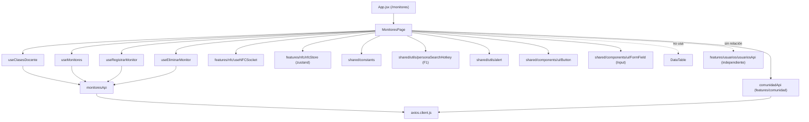
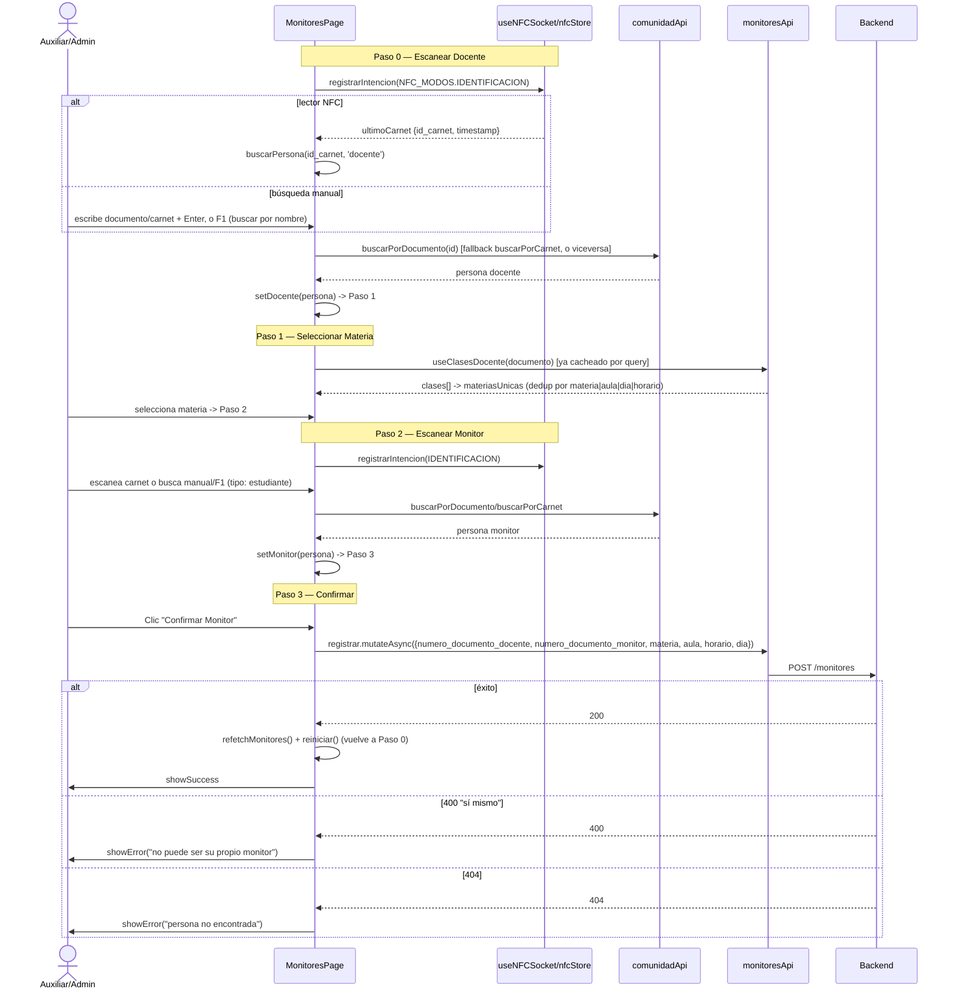

# Subsistema: Monitores (Registro de Monitores)

## 1. Propósito

Wizard de 4 pasos para registrar auxiliares/monitores académicos asociados a un docente y una materia/horario específicos, usando identificación por carnet NFC (lector físico vía socket) o búsqueda manual por documento/nombre. Etiquetado en el sidebar como "Registro de Monitores"; ruta `/monitores`.

## 2. Componentes principales

- **`MonitoresPage`** (`src/features/monitores/MonitoresPage.jsx:16`) — único componente de página, contiene todo el wizard y la lista de monitores del docente activo. ~410+ líneas.
- **`StepIndicator`** (línea 388, interno al mismo archivo) — indicador visual de los 4 pasos (Docente → Materia → Monitor → Confirmar).
- **`NfcIndicator`** (línea 358, interno) — feedback visual del estado del lector NFC (buscando / en cola / listo / conectando).
- **`PersonaCard`** (línea 408, interno) — tarjeta de persona (docente/monitor) en variante compacta y completa.

Los tres subcomponentes están definidos en el mismo archivo (no exportados ni co-localizados en archivos propios), a diferencia de `prestamos` que sí separa `PrestamosDetallePanel` en su propio archivo.

## 3. Diagrama de dependencias

**Único módulo del alcance auditado que usa el store NFC en tiempo real** (`useNFCStore`, zustand): consume `ultimoCarnet`, `intencionActiva`, `enCola`, `posicionCola`. No usa `DataTable` (no hay tabla paginada; la lista de monitores es un listado simple con `.map`).

## 4. Servicios API

`monitoresApi` (`src/features/monitores/monitoresApi.js:4-9`), todos sobre `/monitores`:

| Método | Endpoint | Hook expuesto | `enabled` / polling |
|---|---|---|---|
| `listar` | `GET /monitores?documento_docente=` | `useMonitores(documentoDocente)` (línea 11) | `enabled: !!documentoDocente` — no dispara hasta escanear/buscar un docente; sin `refetchInterval` |
| `clasesDocente` | `GET /monitores/clases/:documento` | `useClasesDocente(documento)` (línea 22) | `enabled: !!documento`; sin polling |
| `registrar` | `POST /monitores` | `useRegistrarMonitor()` (línea 30) | invalida `['monitores']` |
| `eliminar` | `DELETE /monitores/:id` | `useEliminarMonitor()` (línea 38) | invalida `['monitores']` |

No hay `refetchInterval` en ningún query de este módulo; el refresco de la lista tras registrar/eliminar se hace tanto por invalidación de React Query como por un `refetch()` manual explícito (`refetchMonitores()`, líneas 159 y 180) — doble mecanismo de refresco redundante (ver riesgos).

## 5. Flujos principales

### Registrar monitor (wizard completo)

## 6. Puntos de inflexión

- **Identificación dual (NFC en tiempo real vs. manual)**: a diferencia de `prestamos`, aquí el escaneo NFC es un listener activo (`useEffect` sobre `ultimoCarnet`, líneas 49-58) que dispara automáticamente `buscarPersona()` cuando cambia el timestamp del carnet — es el único flujo del alcance con integración NFC real vía socket/zustand.
- **Heurística de identificador ambiguo**: `buscarPersona()` (línea 98-138) decide si el identificador es "documento" (`/^\d+$/`) o "carnet" y prueba el endpoint correspondiente con fallback al otro — mismo patrón exacto replicado en `PrestamosPage.buscarPersona()` (código duplicado entre features, no compartido).
- **Bloqueo de auto-préstamo**: el backend rechaza con 400 + mensaje conteniendo `"sí mismo"` si el docente intenta registrarse a sí mismo como monitor; el frontend detecta esto por matching de substring en el mensaje de error (línea 164: `msg?.includes('sí mismo')`) en vez de un código de error estructurado — acoplamiento frágil a texto de backend.
- **F1 dual-contexto**: igual que en `prestamos`, el atajo F1 (línea 87-96) cambia de comportamiento según el paso actual (busca docente o monitor por nombre), usando `abrirBuscadorPersonaPorNombre` del mismo módulo compartido `personaSearchHotkey`.
- **Registro por materia específica, no por docente genérico**: un mismo par docente-monitor puede registrarse varias veces si corresponde a materias/horarios distintos — el wizard no impide re-registrar el mismo monitor para otra clase (correcto para el negocio, pero no hay deduplicación visual explícita más allá de la lista final).

## 7. Dependencias cruzadas

- **Independiente de `usuariosApi`**: se confirmó que `MonitoresPage.jsx` no importa nada de `features/usuarios/` (CodeGraph no reporta arista `MonitoresPage → usuariosApi`; el archivo solo referencia `comunidadApi`). `usuariosApi` (`src/features/usuarios/usuariosApi.js:4`) es consumido en cambio por `PerfilPage` — dominio de sesión/perfil del usuario logueado, no de personas de dominio académico. Los "monitores" y "docentes" resueltos aquí vienen del padrón de `comunidadApi`, no de la tabla de usuarios del sistema.
- **monitoresApi ↔ comunidadApi**: `monitoresApi` no expone búsqueda de personas; toda la resolución de identidad (docente/monitor) pasa por `comunidadApi.buscarPorDocumento`/`buscarPorCarnet`, el mismo servicio transversal usado por `prestamos`.
- **Sin relación con `equiposApi`/`prestamosApi`**: este subsistema es completamente independiente del inventario y préstamos — no hay imports cruzados ni invalidación de queries compartida (`['monitores']` no se toca desde `equipos` ni `prestamos`, y viceversa).
- **No usa `DataTable`**: única página del alcance auditado sin tabla paginada/buscable compartida; la lista de monitores existentes es un `.map` simple sin paginación ni búsqueda (potencial problema de UX si un docente tiene muchos monitores registrados históricamente, aunque probablemente el volumen sea bajo).

## 8. Riesgos u observaciones de auditoría

- **Doble refresco redundante**: tras `registrar`/`eliminar`, se llama tanto a `refetchMonitores()` manual (línea 159, 180) como se depende de la invalidación automática de `['monitores']` en el hook de mutación (`monitoresApi.js:34,43`) — ambos mecanismos disparan el mismo refetch, trabajo duplicado sin beneficio funcional claro.
- **Matching de error por substring**: la detección de "docente intenta ser su propio monitor" vía `msg?.includes('sí mismo')` (línea 164) es frágil ante cambios de copy en el backend o i18n futuro — debería usar un código de error estructurado (`error_code: 'SELF_MONITOR'`).
- **Código duplicado de resolución de identidad**: la función `buscarPersona()` (líneas 98-138) es funcionalmente idéntica a su homónima en `PrestamosPage.jsx` (líneas 185-207) — mismo patrón try/catch con fallback documento↔carnet, sin extraer a un hook compartido (p. ej. `useBuscarPersona` en `shared/hooks`).
- **Componente único sin separación de subcomponentes en archivos propios**: `StepIndicator`, `NfcIndicator` y `PersonaCard` están definidos inline en `MonitoresPage.jsx` en vez de en archivos separados — dificulta reutilización (p. ej. `NfcIndicator` podría ser útil en otros flujos con lector NFC) y aumenta el tamaño del archivo principal.
- **Sin tests**: CodeGraph reporta "no covering tests found" para `MonitoresPage` y `monitoresApi`.
- **Sin manejo de carrera entre lector NFC y búsqueda manual**: si el usuario escribe en el input manual mientras el lector NFC recibe una lectura casi simultánea, ambos flujos pueden disparar `buscarPersona()` de forma concurrente sin cancelación mutua (no hay `AbortController` ni deshabilitación del input mientras `buscando === true` más allá del ícono de carga).
