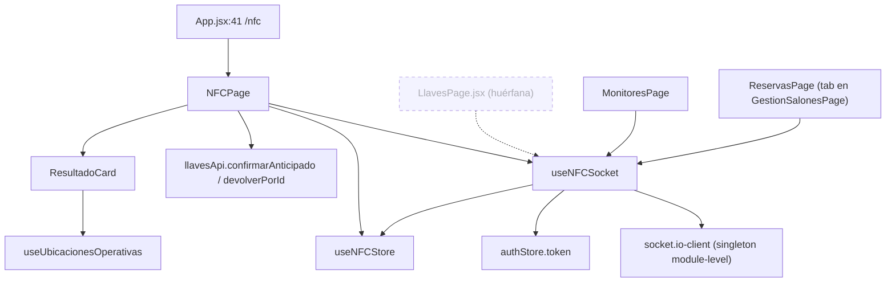
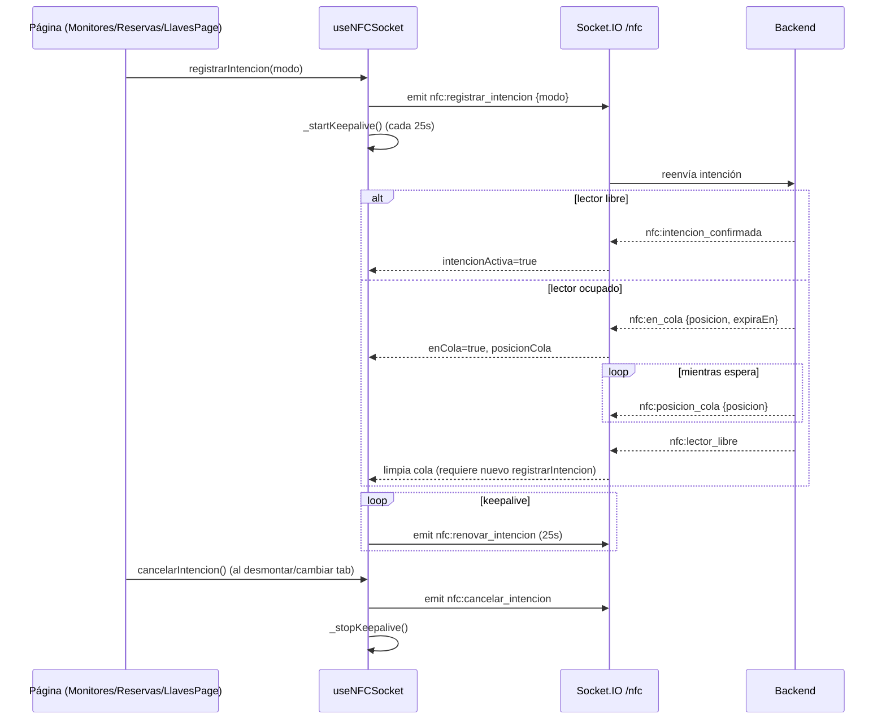
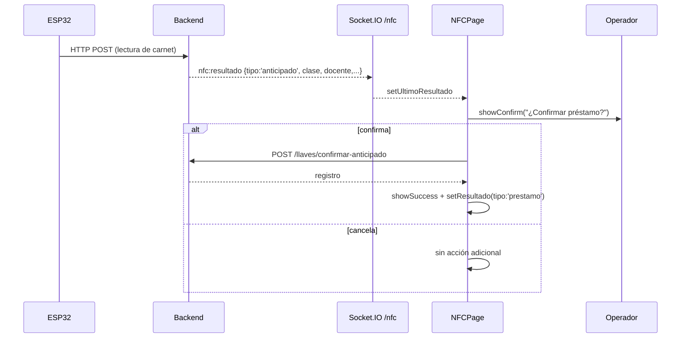
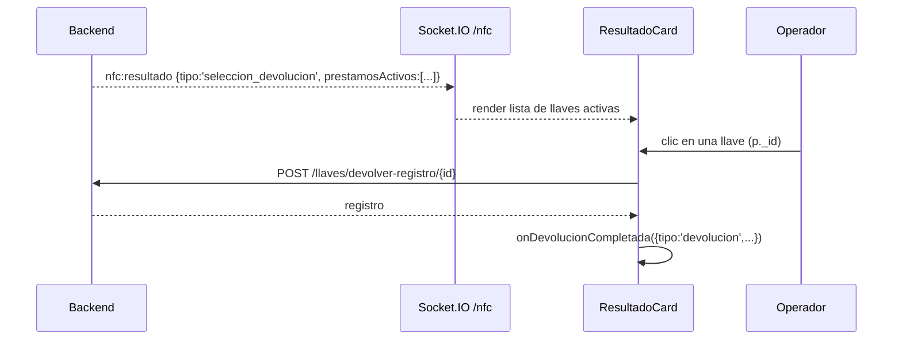

# NFC — Lector compartido y canal WebSocket

> **Módulo retirado.** El feature `nfc` (gateway serie sobre Socket.IO con
> lectores ESP32 compartidos) ya no existe en el código: no hay
> `src/features/nfc/` ni `src/shared/websocket/nfc.gateway.js`. Los lectores
> actuales son RFID USB tipo teclado emulado y cada operador lee su tarjeta en
> su propio navegador; la identificación por carnet vive ahora dentro de
> `llaves` (`procesarLecturaNFC`) y de la búsqueda de persona en `prestamos`.
> Este documento se conserva como referencia histórica.

## 1. Propósito

Consola operativa del lector NFC/ESP32 compartido por el campus: muestra el estado del canal WebSocket, el log de lecturas crudas y reacciona a los resultados que el backend empuja tras procesar una lectura (préstamo, devolución, reclamo anticipado, error). No inicia el lector ni gestiona colas por sí misma: es la única página *montada por ruta* en `/nfc` (`src/App.jsxxx:41`), pero la lógica de negociación de intención/cola vive en `useNFCSocket.js` y es reutilizada por otras páginas (`LlavesPage` huérfana, `MonitoresPage`, `ReservasPage`).

## 2. Componentes principales

| Símbolo | Archivo | Responsabilidad |
|---|---|---|
| `NFCPage` | `src/features/nfc/NFCPage.jsx:12` | Página en `/nfc`. Muestra estado de conexión, error, log de lecturas y `ResultadoCard`. |
| `ResultadoCard` | `src/features/nfc/NFCPage.jsx:116` | Subcomponente que renderiza el resultado según `tipo` (`devolucion`, `seleccion_devolucion`, `prestamo`, `anticipado`, `error`/`sin_clase`). |
| `useNFCSocket` | `src/features/nfc/useNFCSocket.js:10` | Hook que administra la conexión Socket.IO singleton, el protocolo de intención/cola y expone `iniciar/detener/registrarIntencion/cancelarIntencion`. |
| `useNFCStore` | `src/features/nfc/nfcStore.js:3` | Store zustand global (sin `persist`) con el estado del lector: conexión, últimas lecturas, resultado, carnet y estado de intención/cola. |

## 3. Diagrama de dependencias

## 4. Servicios API

**WebSocket** — namespace `/nfc` (`NFC_NAMESPACE`, `src/shared/constants.js:6`), autenticado con `auth: { token }` (`useNFCSocket.js:39`).

Eventos emitidos por el frontend (`src/shared/constants.js:13-30`):
| Evento | Emitido desde | Payload |
|---|---|---|
| `nfc:start` / `nfc:stop` | `iniciar()`/`detener()` (`useNFCSocket.js:156-157`) | — (⚠️ nunca invocados en la app, ver §8) |
| `nfc:registrar_intencion` | `registrarIntencion(modo)` (`useNFCSocket.js:163`) | `{ modo }` — `NFC_MODOS.IDENTIFICACION` o `NFC_MODOS.AUTO` |
| `nfc:cancelar_intencion` | `cancelarIntencion()` (`useNFCSocket.js:169`) | — |
| `nfc:renovar_intencion` | keepalive interno cada 25 s (`KEEPALIVE_INTERVAL_MS`, `useNFCSocket.js:8,145`) | — |

Eventos escuchados (`useNFCSocket.js:53-122`):
| Evento | Efecto en store |
|---|---|
| `connect` / `disconnect` / `connect_error` | `setConnected`, `setActivo(false)`, `resetIntencion()` en disconnect |
| `nfc:status` | `setActivo`, `statusMessage`, `error` opcional |
| `nfc:error` | `setError(mensaje)` |
| `nfc:lectura` | `setUltimaLectura` + `addLectura` (log, tope 50 — `nfcStore.js:18`) |
| `nfc:resultado` | `setUltimoResultado` + `addLectura` (id_carnet) — dispara la UI de `ResultadoCard` |
| `nfc:carnet_leido` | `setUltimoCarnet` — dispara auto-búsqueda de docente en `LlavesPage` |
| `nfc:intencion_confirmada` | `intencionActiva=true`, limpia cola |
| `nfc:en_cola` | `{ posicion, expiraEn }` → `enCola=true` |
| `nfc:posicion_cola` | actualiza `posicionCola`/`expiraEn` |
| `nfc:lector_libre` | limpia estado de cola (el consumidor debe re-registrar intención) |
| `nfc:intencion_reemplazada` / `nfc:intencion_expirada` | limpia intención/cola |

**REST** (vía `llavesApi`, `src/features/llaves/llavesApi.js`):
- `POST /llaves/confirmar-anticipado` — confirma un reclamo anticipado (`llavesApi.confirmarAnticipado`, invocado en `NFCPage.jsx:42`).
- `POST /llaves/devolver-registro/:id` — devuelve una llave específica cuando el docente tiene varias activas (`llavesApi.devolverPorId`, `NFCPage.jsx:139`).
- `POST /llaves/procesar-nfc` (`llavesApi.procesarNFC`) — definido pero **sin llamadores en el frontend** (ver §8); el flujo real es HTTP directo del ESP32 al backend, que reenvía el resultado por WebSocket (comentario en `NFCPage.jsx:19`).

No hay hooks de React Query en este módulo ni `refetchInterval`; todo el estado es reactivo vía WebSocket + zustand.

## 5. Flujos principales

### 5.1 Negociación de cola del lector compartido

### 5.2 Reclamo anticipado y resultado en NFCPage

### 5.3 Devolución con selección manual (múltiples llaves activas)

## 6. Puntos de inflexión

- **Singleton de socket a nivel de módulo** (`let socket = null;`, `useNFCSocket.js:7`): compartido entre todos los componentes que llaman a `useNFCSocket` (NFCPage, MonitoresPage, ReservasPage, LlavesPage). Sobrevive a desmontajes mientras el token no cambie.
- **Keepalive de intención**: cada 25 s se reemite `nfc:renovar_intencion` mientras haya intención activa, para no perder el turno del lector frente al backend (que presumiblemente expira intenciones inactivas — ver `nfc:intencion_expirada`).
- **`NFCPage` es pasiva respecto a la cola**: no llama a `registrarIntencion`/`cancelarIntencion`; solo escucha `nfc:resultado`. La negociación de cola ocurre en los consumidores que sí registran intención (`MonitoresPage`, `ReservasPage`, `LlavesPage`).
- **Reconexión**: si cambia el `token` (`tokenChanged`, `useNFCSocket.js:42-50`), se desconecta y reconecta explícitamente; si el socket ya existe y no cambia el token, solo se reconecta si `!socket.connected`. No hay backoff/reintento configurado explícitamente (se delega en la config por defecto de `socket.io-client`, que sí reintenta automáticamente pero sin feedback visible salvo `statusMessage`/`error` en el evento `connect_error`).
- **Idempotencia por timestamp**: tanto `NFCPage` (`resultadoRef.current`) como `LlavesPage` (`carnetProcesadoRef`, `resultadoProcesadoRef`) usan refs comparando `timestamp` para evitar reprocesar el mismo evento en renders repetidos.

## 7. Dependencias cruzadas

- `llavesApi.js` es consumido por `NFCPage.jsx` (confirmación de anticipado y devolución por id) y transitivamente por `historial`, `programacion`, `novedades`, `notificaciones` (ver `llaves.md`).
- `useNFCSocket`/`useNFCStore` son compartidos con `MonitoresPage` y `ReservasPage` (tab dentro de `GestionSalonesPage`), que replican el mismo patrón de registrar intención por `tab`/mount.
- `useAuthStore` (`src/features/auth/authStore.js`) provee el `token` usado para autenticar el socket.

## 8. Riesgos u observaciones de auditoría

1. **`iniciar()`/`detener()` (eventos `nfc:start`/`nfc:stop`) están definidos pero no se invocan en ningún lugar del frontend** (`useNFCSocket.js:156-157`; verificado por grep sin más coincidencias). `NFCPage.jsx:13` los desestructura pero nunca los llama: son código muerto o functionality delegada enteramente al backend/hardware. Confirmar con backend si el ciclo start/stop del lector se controla desde otro cliente.
2. **`llavesApi.procesarNFC` (`llavesApi.js:16`) no tiene llamadores en el frontend.** El flujo real es HTTP directo ESP32→backend con push por WebSocket (`nfc:resultado`); este método parece vestigial o pensado para un flujo de fallback nunca implementado en UI.
3. **Riesgo de limpieza de listeners cruzada**: el cleanup del `useEffect` (`useNFCSocket.js:124-139`) llama `socket.off(evento)` **sin pasar la función handler**, lo que en Socket.IO/EventEmitter elimina *todos* los listeners de ese evento en el socket compartido, no solo los registrados por la instancia del hook que se desmonta. Como el socket es un singleton de módulo reutilizado por `NFCPage`, `MonitoresPage`, `ReservasPage` y la huérfana `LlavesPage`, si dos consumidores llegaran a coexistir montados simultáneamente (p. ej. un panel embebido o un cambio futuro de layout con paneles paralelos), el desmontaje de uno anularía la escucha del otro. Hoy no se manifiesta porque el router monta una sola página a la vez y React desmonta el árbol saliente antes de montar el entrante, pero es una bomba de tiempo si se añade una vista con dos consumidores concurrentes.
4. **Sin backoff visible ni límite de reintentos configurado explícitamente** para la reconexión; se depende del comportamiento por defecto de `socket.io-client`. El único feedback al usuario es `statusMessage`/`error`, sin indicador de intentos o tiempo transcurrido.
5. **`ResultadoCard` mezcla lógica de red (POST devolución) dentro de un componente de presentación** (`NFCPage.jsx:136-150`) — no usa `useMutation` de React Query como el resto del módulo `llaves`, sino `fetch` manual vía `llavesApi.devolverPorId` con manejo de estado local (`devolviendo`). Inconsistente con el patrón `useDevolverLlave` ya existente en `llavesApi.js:70`.
6. **`NFCPage` no está cubierto por tests** (confirmado por CodeGraph: "⚠️ no covering tests found" en `NFCPage`, `useNFCSocket`, `useNFCStore`).
