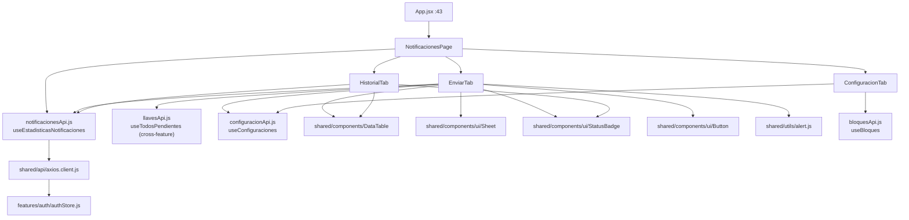
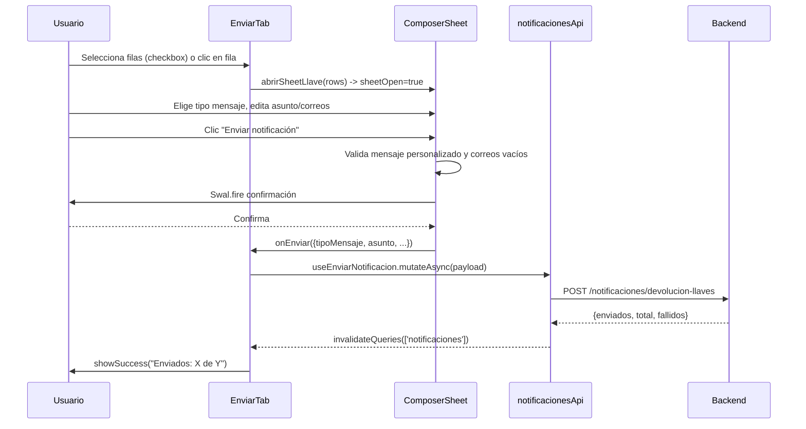
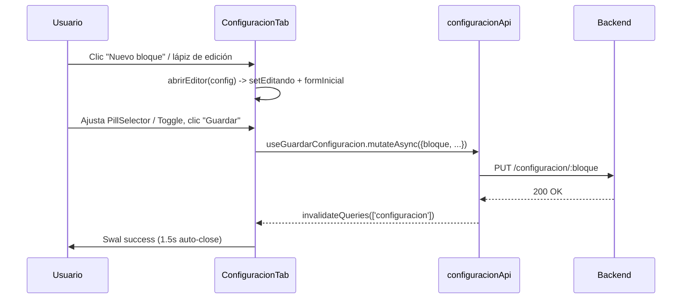

# Feature: Notificaciones

## 1. Propósito

Gestiona el envío manual y el seguimiento de notificaciones por correo electrónico relacionadas con devoluciones de llaves en mora y reservas de salones sin reclamar. Centraliza en una sola página con pestañas el envío, el historial de correos enviados/fallidos y la configuración de tiempos/políticas de recordatorio por bloque de aulas.

## 2. Componentes principales

- **`NotificacionesPage`** (`src/features/notificaciones/NotificacionesPage.jsx:14`): shell con navegación por pestañas (`enviar`, `historial`, `configuracion`), estado local `activeTab`. Muestra un badge con el conteo de pendientes (`stats.pendientes`, línea 16-17) en la pestaña "Historial".
- **`EnviarTab`** (`src/features/notificaciones/tabs/EnviarTab.jsx:284`): dos secciones — préstamos de llaves pendientes (mora) y reservas sin reclamar — cada una con `DataTable`, selección múltiple por checkbox y un `ComposerSheet` (línea 90) compartido para redactar/confirmar el envío.
- **`HistorialTab`** (`src/features/notificaciones/tabs/HistorialTab.jsx:28`): tabla de registros de envío con filtros (estado, tipo, búsqueda), tarjetas de estadísticas (enviados/pendientes/fallidos) y acciones de reenviar/descartar.
- **`ConfiguracionTab`** (`src/features/notificaciones/tabs/ConfiguracionTab.jsx:203`): CRUD de configuración por bloque (tiempo máximo de préstamo, intervalo de recordatorio, máximo de recordatorios, activar/desactivar) más edición de valores por defecto globales (`useActualizarDefaults`, línea 209). Usa `PillSelector` (línea 19) y `Toggle` (línea 80) como sub-componentes locales en vez de `<select>` planos.

## 3. Diagrama de dependencias

## 4. Servicios API

`notificacionesApi` (`src/features/notificaciones/notificacionesApi.js:4`):

| Endpoint | Método | Hook | Polling |
|---|---|---|---|
| `/notificaciones/devolucion-llaves` | POST | `useEnviarNotificacion` (línea 15) | — |
| `/notificaciones/reservas-manual` | POST | `useEnviarNotificacionReservas` (línea 23) | — |
| `/reservas?estado=no_reclamada` | GET | `useReservasNoReclamadas` (línea 31) | `staleTime: 30_000` |
| `/notificaciones/historial` | GET | `useHistorialNotificaciones` (línea 43) | sin `refetchInterval` (manual vía botón "Actualizar") |
| `/notificaciones/contadores-recordatorios` | GET | `useContadoresRecordatorios` (línea 50) | `refetchInterval: 5 * 60 * 1000` (5 min) |
| `/notificaciones/estadisticas` | GET | `useEstadisticasNotificaciones` (línea 58) | `refetchInterval: 60_000` (1 min) |
| `/notificaciones/reenviar/:id` | POST | `useReenviarNotificacion` (línea 74) | — |
| `/notificaciones/descartar/:id` | POST | `useDescartarNotificacion` (línea 82) | — |
| `/notificaciones/descartar-por-reserva/:reservaId` | POST | `useDescartarNotificacionReserva` (línea 90) | invalida `['notificaciones']` y `['reservas']` |

Todas las mutaciones invalidan `queryKey: ['notificaciones']` en `onSuccess`. Confirmado: **sí hay polling** — dos hooks con `refetchInterval` (estadísticas cada 60s, contadores cada 5min), usados en `NotificacionesPage` y `EnviarTab` respectivamente, lo que mantiene el badge de pendientes y los contadores de recordatorios semi-en-vivo sin WebSockets.

## 5. Flujos principales

### Enviar notificación de devolución de llave

### Cambiar estado / eliminar configuración de bloque

## 6. Puntos de inflexión

- **Rol**: no hay guard de `ProtectedRoute` con `roles` en `/notificaciones` (línea `src/App.jsx:43`) — accesible para cualquier usuario autenticado (ADMIN y AUX), a diferencia de comunidad/usuarios.
- **Validación de formulario en `ComposerSheet`** (`EnviarTab.jsx:107-122`): mensaje personalizado no puede estar vacío; todo destinatario debe tener correo (original o editado inline) antes de habilitar el envío — validación manual con `showError`, no usa zod/react-hook-form.
- **Correos editables inline**: `correosEditados` (estado local por id) permite corregir un correo faltante o incorrecto justo antes de enviar sin tocar el registro en Comunidad.
- **Cálculo de estado de notificación automática** (`estadoNotificacion`, `EnviarTab.jsx:58-87`): lógica de negocio compleja en el componente — deriva bloque desde el prefijo alfabético del aula, cruza con `configs` de `configuracionApi`, y calcula minutos restantes vs. `tiempo_maximo_prestamo_minutos`. Es puramente informativa (badge), no dispara el envío real (eso lo hace un scheduler backend).
- **Manejo de error**: todos los `catch` extraen `err.response?.data?.message` con fallback genérico; no hay reintento automático, solo re-disparo manual del botón.
- **Reservas no reclamadas pendientes**: al abrir detalle (`HistorialTab.abrirDetalles`, línea 57) con `tipo_notificacion === 'reserva_no_reclamada'` y `estado_envio === 'pendiente'`, el modal ofrece 3 acciones (enviar ahora / descartar / cerrar) vía `showDenyButton` de SweetAlert2 — patrón de UI poco convencional (tres salidas de un solo diálogo).

## 7. Dependencias cruzadas

- **`llavesApi.useTodosPendientes`** (`src/features/llaves/llavesApi.js:36`, `refetchInterval: 30000`): importado directamente en `EnviarTab.jsx:15` para listar préstamos de llaves en mora que aún no tienen notificación enviada. El análisis detallado de `llavesApi` está fuera de este alcance (ver `llaves.md`).
- **`configuracionApi.useConfiguraciones`**: usado tanto por `EnviarTab` (indicador de estado) como por `ConfiguracionTab` (CRUD) — mismo módulo API compartido entre dos features (`notificaciones` y `configuracion`).
- **`bloquesApi.useBloques`**: usado por `ConfiguracionTab` para poblar el selector de bloques disponibles al crear configuración nueva.
- No usa `authStore` directamente en este feature (a diferencia de `novedades`, que sí verifica rol ADMIN).

## 8. Riesgos u observaciones de auditoría

- **Sin tests**: CodeGraph confirma "no covering tests found" para los 4 símbolos principales (`HistorialTab`, `EnviarTab`, `notificacionesApi`, `ConfiguracionTab`).
- **Duplicación de lógica entre `ConfiguracionTab.jsx` y `ConfiguracionPage.jsx`** (huérfano, ver `configuracion.md`): ambos implementan `handleGuardar`/`handleEliminar` casi idénticos contra el mismo `configuracionApi`; `ConfiguracionTab` es la versión activa y más completa (agrega edición de defaults y selectores tipo pill). Riesgo de mantenimiento si alguien edita el archivo equivocado.
- **`EnviarTab.jsx` es un archivo grande** (~630 líneas) que mezcla: función pura de cálculo de tiempo (`calcularTiempoTranscurrido`), lógica de negocio (`estadoNotificacion`), un sub-componente completo (`ComposerSheet`) y el componente de página con dos secciones independientes (llaves + reservas) con estado duplicado (`seleccionadosLlaves`/`seleccionadosReservas`). Candidato a dividir en 3 archivos.
- **HTML embebido en `Swal.fire({ html: ... })`** en `NovedadesPage`/`HistorialTab`/`ConfiguracionPage` (patrón repetido en varias features): construye markup vía template strings interpolando datos del backend sin sanitización explícita (riesgo de XSS si el backend permitiera contenido no confiable en `destinatario_nombre`, `error_envio`, etc.).
- **Doble definición de `ASUNTO_LLAVE_DEFAULT`/`ASUNTO_RESERVA_DEFAULT`** y de las opciones de configuración (`OPCIONES_TIEMPO_PRESTAMO`, etc.) aparecen replicadas literalmente entre `ConfiguracionPage.jsx` y `ConfiguracionTab.jsx` — evidencia adicional de que uno es copia del otro.
- **Botón "Actualizar" manual en `HistorialTab`** junto con la ausencia de `refetchInterval` en `useHistorialNotificaciones` implica que el historial no se actualiza solo salvo por invalidación de queries tras una mutación (enviar/reenviar/descartar) — comportamiento correcto pero merece documentarse para no asumir polling donde no existe.
