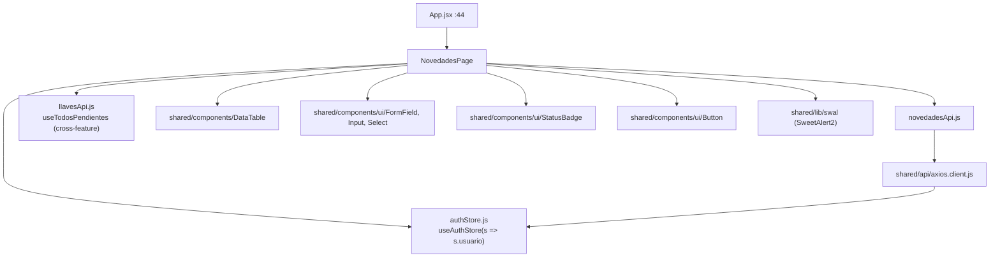
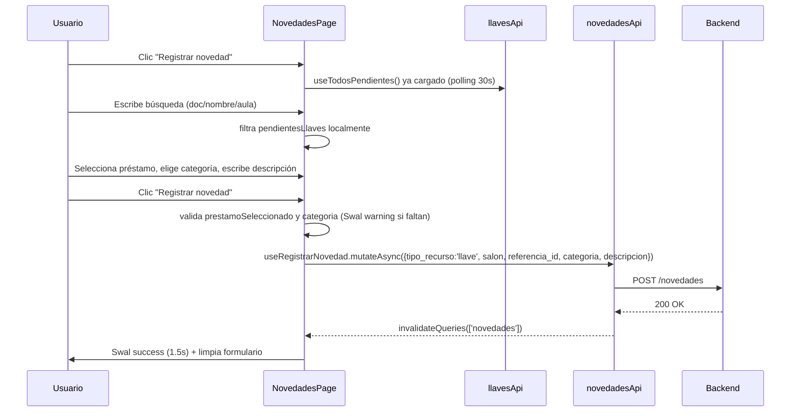

# Feature: Novedades

## 1. Propósito

Permite registrar y gestionar incidencias (daño físico, no funciona, pérdida, demora en entrega, etc.) reportadas sobre llaves o equipos. Ofrece un flujo de registro manual vinculado a un préstamo de llave activo, un tablero filtrable de novedades y, para ADMIN, la capacidad de cambiar el estado del ciclo de vida de cada novedad (abierta → en_revision → resuelta/cerrada).

## 2. Componentes principales

- **`NovedadesPage`** (`src/features/novedades/NovedadesPage.jsxxx:34`): componente único (sin sub-tabs) que combina: panel de registro manual colapsable, tarjetas de estadísticas por estado, filtros (tipo, estado, categoría, búsqueda) y `DataTable` con las novedades. Toda la lógica de UI (formularios, modales) vive en este único archivo (~366 líneas).

No hay componentes hijos propios del feature; usa exclusivamente primitivos compartidos (`DataTable`, `FormField`, `Input`, `Select`, `Button`, `StatusBadge`).

## 3. Diagrama de dependencias

## 4. Servicios API

`novedadesApi` (`src/features/novedades/novedadesApi.js:4`):

| Endpoint | Método | Hook | Polling |
|---|---|---|---|
| `/novedades` | GET | `useNovedades(params)` (línea 12) | `refetchOnMount: 'always'`, `refetchInterval: 60_000` |
| `/novedades/:id` | GET | *(no expuesto por hook; `obtener` está en el objeto `novedadesApi` pero sin hook)* | — |
| `/novedades` | POST | `useRegistrarNovedad` (línea 21) | — |
| `/novedades/:id/estado` | PATCH | `useActualizarEstadoNovedad` (línea 29) | — |
| `/novedades/estadisticas` | GET | `useEstadisticasNovedades` (línea 37) | `refetchOnMount: 'always'` (sin `refetchInterval`) |

Confirmado: **hay polling** en `useNovedades` (`refetchInterval: 60_000`, cada minuto), igual que en notificaciones — patrón consistente en la app para vistas de "bandeja" que necesitan reflejar cambios recientes sin WebSockets. Todas las mutaciones invalidan `queryKey: ['novedades']`.

## 5. Flujos principales

### Registrar novedad sobre préstamo activo

### Cambiar estado (solo ADMIN)

```mermaid
sequenceDiagram
    participant Admin as Usuario ADMIN
    participant NP as NovedadesPage
    participant NA as novedadesApi
    participant BE as Backend

    Admin->>NP: Clic en badge de estado (columna "estado", solo si isAdmin y estado != cerrada)
    NP->>Admin: Swal.fire con <select> de estado + <textarea> de resolución
    Admin-->>NP: Guardar (preConfirm captura valores del DOM)
    NP->>NA: useActualizarEstadoNovedad.mutateAsync({id, estado, resolucion})
    NA->>BE: PATCH /novedades/:id/estado
    BE-->>NA: 200 OK
    NA-->>NP: invalidateQueries(['novedades'])
    NP->>Admin: Swal success (1.5s)
```

## 6. Puntos de inflexión

- **Rama admin vs. no-admin** (`NovedadesPage.jsx:52,160-170`): `isAdmin = usuario?.rol === ROLES.ADMIN` determina si la columna "Estado" es clicable (abre editor) o solo un badge de solo lectura. La ruta `/novedades` en sí **no** tiene guard de rol (`src/App.jsxxx:44`, sin `roles={[ROLES.ADMIN]}`) — el control de acceso a la edición de estado ocurre a nivel de UI, no de ruta, por lo que la restricción depende exclusivamente de que el backend también valide el rol en `PATCH /novedades/:id/estado` (no verificado en este análisis, fuera de alcance frontend).
- **Filtrado combinado**: los filtros de tabla (`tipo_recurso`, `estado`, `categoria`, `busqueda`) se envían como `params` directamente al backend vía `useNovedades(filters)`, mientras que el filtrado de "préstamos pendientes" en el formulario de registro (`pendientesFiltrados`, línea 54) es 100% client-side sobre los datos ya cargados de `llavesApi`.
- **Sin validación de formulario declarativa**: usa `if` manuales + `Swal.fire({icon:'warning'})` en vez de react-hook-form/zod (a diferencia de `usuarios` y parte de `comunidad`).
- **Manejo de error**: catch genérico con `err.response?.data?.message ?? 'No se pudo registrar/actualizar'`, sin reintento.

## 7. Dependencias cruzadas

- **`llavesApi.useTodosPendientes`** (`src/features/llaves/llavesApi.js:36`): igual que en `notificaciones/EnviarTab`, se importa directamente para poblar el buscador de "préstamo activo" al registrar una novedad de tipo llave. Nota: `NovedadesPage` solo soporta registrar novedades de `tipo_recurso: 'llave'` desde el formulario manual — el tipo `'equipo'` existe en filtros y en las opciones de tabla, pero no hay UI de registro para equipos en este componente (posible registro solo vía otro flujo, ej. desde `EquiposPage`, fuera de este alcance).
- **`authStore.useAuthStore`**: único consumo directo del store de autenticación en este feature, exclusivamente para leer `usuario.rol` y derivar `isAdmin`.
- No usa `configuracionApi` ni `comunidadApi`.

## 8. Riesgos u observaciones de auditoría

- **Sin tests**: CodeGraph reporta "no covering tests found" para `NovedadesPage` y `novedadesApi`.
- **Control de acceso solo en UI, no en ruta**: a diferencia de `comunidad` y `usuarios` (protegidos con `ProtectedRoute roles={[ROLES.ADMIN]}`), la capacidad de cambiar estado en `/novedades` depende únicamente de ocultar el botón condicionalmente (`isAdmin && v !== 'cerrada'`, línea 160). Un usuario AUX con conocimiento del endpoint podría invocar `PATCH /novedades/:id/estado` directamente si el backend no re-valida el rol — riesgo de autorización que debe confirmarse en el backend.
- **Tipo `'equipo'` sin flujo de registro manual visible**: la UI de novedades solo permite registrar sobre préstamos de llaves (`tipo_recurso: 'llave'` hardcodeado en `handleRegistrarNovedad`, línea 69); si existe un flujo equivalente para equipos en otra página, debería enlazarse/documentarse para evitar la percepción de funcionalidad faltante.
- **`abrirDetalles`/`handleCambiarEstado` usan `document.getElementById` dentro de `preConfirm` de SweetAlert2** (línea 109-112) — acopla la lógica de React a manipulación directa del DOM, patrón fuera del modelo declarativo de React y frágil ante cambios de markup del modal.
- **Componente único y extenso** (366 líneas) sin separación entre "formulario de registro", "estadísticas" y "tabla+filtros" — mismo patrón de over-concentración visto en otras páginas de la app (ver `notificaciones.md`).
