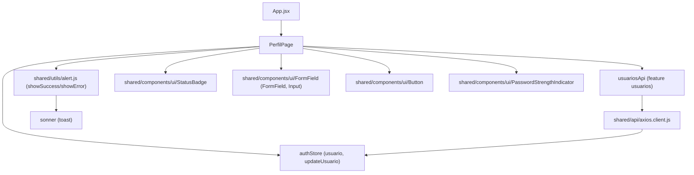
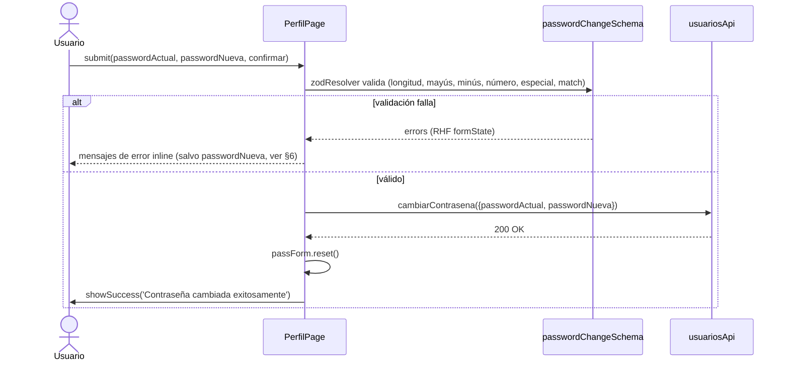

# Perfil

## 1. Propósito

Permite a cualquier usuario autenticado (cualquier rol) ver y editar sus datos personales (nombre, email, contacto) y cambiar su propia contraseña, sin necesidad de permisos de administrador. Es la única pantalla de autoservicio de cuenta en la aplicación.

## 2. Componentes principales

- **`PerfilPage`** (`src/features/perfil/PerfilPage.jsx:28`): página única con dos formularios independientes (`react-hook-form`) en un layout de dos columnas: "Editar información" y "Cambiar contraseña". No tiene subcomponentes propios.
- **`passwordChangeSchema`** (`PerfilPage.jsx:13-26`): esquema `zod` con reglas de complejidad (min. 8 caracteres, mayúscula, minúscula, número, carácter especial) y `refine` para validar que `passwordNueva === confirmar`.
- El formulario de "Editar información" **no tiene esquema de validación** (`useForm({ defaultValues: {...} })` sin `resolver`, línea 31-33) — envía lo que sea que el usuario escriba.

## 3. Diagrama de dependencias



## 4. Servicios API

`PerfilPage` no define su propio `perfilApi.js` — reutiliza `usuariosApi` de la feature `usuarios` (`src/features/usuarios/usuariosApi.js:4-12`):

| Método | Ruta | Hook/uso |
|---|---|---|
| PATCH | `/usuarios/perfil` | `usuariosApi.editarPerfil(data)`, invocado directo (sin hook de mutation) en `onEditarPerfil` (`PerfilPage.jsx:36-44`) |
| PATCH | `/usuarios/contrasena` | `usuariosApi.cambiarContrasena({passwordActual, passwordNueva})`, invocado directo en `onCambiarContrasena` (`PerfilPage.jsx:46-54`) |

A diferencia de otras features del catálogo, **no se usan los hooks de React Query** (`useMutation`) que sí expone `usuariosApi.js` para otras operaciones (`useCrearUsuario`, `useCambiarEstadoUsuario`, `useVincularComunidad`) — aquí se llama `usuariosApi.editarPerfil`/`cambiarContrasena` como promesas planas dentro de funciones `async` locales. No hay invalidación de queryKeys (`['usuarios']`) tras editar el propio perfil, y no hay `refetchInterval`/polling.

## 5. Flujos principales

### Editar información de perfil

```mermaid
sequenceDiagram
    actor Usuario
    participant PP as PerfilPage
    participant API as usuariosApi
    participant Store as authStore

    Usuario->>PP: submit(nombre, email, contacto)
    PP->>API: editarPerfil(data)
    API-->>PP: res.data.data.usuario
    PP->>Store: updateUsuario(usuario)
    PP->>Usuario: showSuccess('Perfil actualizado correctamente')
    Note over PP,API: sin resolver zod; sin invalidación de React Query
```

### Cambiar contraseña



## 6. Puntos de inflexión

- **Error de `passwordNueva` no se renderiza**: el `FormField` del campo "Nueva contraseña" (`PerfilPage.jsx:123-126`) no recibe la prop `error={passForm.formState.errors.passwordNueva?.message}` — a diferencia de `passwordActual` (línea 120) y `confirmar` (línea 127), que sí la pasan. El usuario solo ve el feedback visual del `PasswordStrengthIndicator` (barra + lista de reglas pendientes), nunca el mensaje de error de zod para ese campo específico.
- **`PasswordStrengthIndicator` infrautilizado**: el componente soporta una prop `confirmPassword` para mostrar en vivo si "las contraseñas coinciden" (`PasswordStrengthIndicator.jsx:17,60-70`), pero `PerfilPage` solo le pasa `password` (línea 125) — la validación de coincidencia solo se ve al hacer submit, vía el error de `confirmar`.
- **Sin optimistic UI ni invalidación de cache**: tras `editarPerfil`, el único efecto en estado global es `updateUsuario(res.data.data.usuario)` sobre `authStore`; no se toca ninguna queryKey de React Query (relevante si `UsuariosPage`, que sí usa `useUsuarios()`, estuviera montada en paralelo — quedaría desactualizada).
- **Formulario de edición sin validación de formato**: `email`/`contacto` no tienen `type` de validación real más allá de `type="email"`/`type="tel"` en el `<Input>` (validación de navegador, no de la app).

## 7. Dependencias cruzadas

- Depende de `authStore` para leer `usuario` y escribir cambios vía `updateUsuario` — mismo patrón de acoplamiento a la store global que el resto de la app (ver `auth.md`).
- Depende de `usuariosApi`, que pertenece formalmente a la feature `usuarios` (usada también por `UsuariosPage` para el CRUD de administración). Esto acopla `perfil` a un módulo de otra feature en lugar de tener su propio `perfilApi.js`.
- Comparte primitivos de UI (`FormField`, `Button`, `StatusBadge`, `PasswordStrengthIndicator`) con `LoginPage` (auth) y `UsuariosPage` (usuarios) — el schema de contraseña (`passwordChangeSchema`) está duplicado conceptualmente respecto a las reglas de `PASSWORD_RULES` en `PasswordStrengthIndicator.jsx:5-11` (mismas 5 reglas, definidas dos veces con regex independientes).
- Ruta `/perfil` (`App.jsx:46`) está fuera del bloque restringido a `ROLES.ADMIN` — accesible a cualquier rol autenticado, coherente con su propósito de autoservicio.

## 8. Riesgos u observaciones de auditoría

- **Bug de UX**: falta el prop `error` en el `FormField` de "Nueva contraseña" — los errores de validación de esa contraseña (min. 8, mayúscula, minúscula, número, especial) nunca se muestran como texto de error, solo de forma indirecta vía la barra de fuerza.
- **Duplicación de reglas de contraseña**: las mismas 5 reglas de complejidad están codificadas por separado en `passwordChangeSchema` (zod, `PerfilPage.jsx:15-21`) y en `PASSWORD_RULES` (`PasswordStrengthIndicator.jsx:5-11`). Cambiar una política de contraseña requiere editar ambos lugares de forma sincronizada.
- **Inconsistencia de patrón**: es la única página de escritura en el alcance auditado que no usa `useMutation` de React Query pese a que `usuariosApi.js` expone el patrón para otras operaciones — no hay `isPending` para deshabilitar los botones "Guardar cambios"/"Cambiar contraseña" durante el request, ni manejo de reintentos.
- **`showError` con mismo formato para todo tipo de error**: igual que en otras features, `e.response?.data?.message` es el único diferenciador; no hay rama especial para 401 (contraseña actual incorrecta) vs. errores de red.
- No hay indicador de carga (`isSaving`, `isPending`) visible durante el submit de ninguno de los dos formularios — solo se conoce el resultado al recibir éxito/error.
