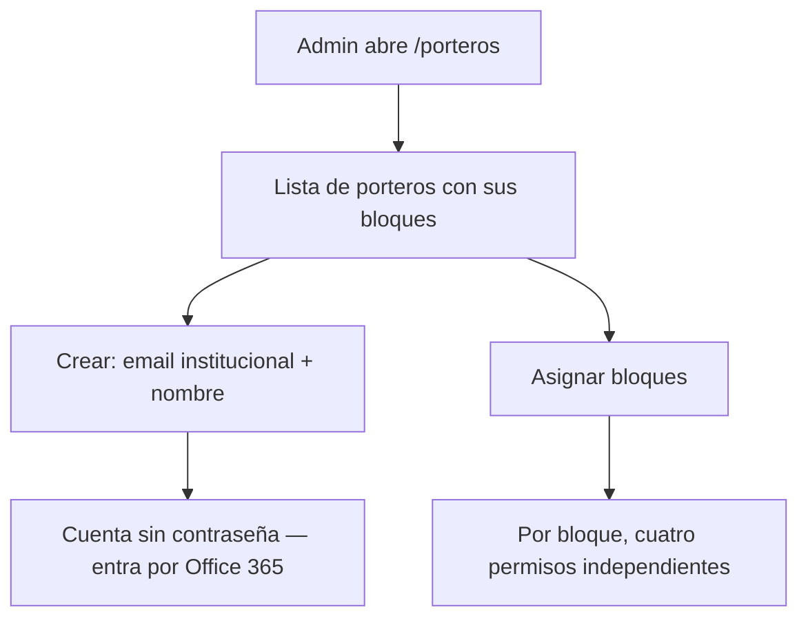

# Feature `porteros`

## 1. Propósito

Pantalla de administración de las cuentas con rol `porteria` y de sus permisos por bloque. Es la cara visible del gate de autorización que reemplazó a `ubicaciones_operativas` en la migración 009 — ver [`porteros` en backend](../backend/porteros.md).

Ruta `/porteros`, restringida a ADMIN.

## 2. Componentes y API

`PorterosPage.jsx` + `porterosApi.js`.

| Hook / llamada | Endpoint |
|---|---|
| listar | `GET /api/porteros` |
| crear | `POST /api/porteros` |
| asignar bloques | `PUT /api/porteros/:usuarioId/bloques` |
| eliminar | `DELETE /api/porteros/:usuarioId` |
| mis bloques | `GET /api/porteros/mis-bloques` |

`mis-bloques` lo consume el propio usuario portería, no esta pantalla: responde a cualquier autenticado y devuelve vacío si no tiene el rol.

## 3. Flujo



Los cuatro permisos por bloque:

```
permite_identificacion
permite_prestamo_llaves
permite_devolucion_llaves
permite_recepcion_equipos
```

## 4. Puntos de inflexión

- **Sin contraseña**: los porteros se crean solo con correo institucional. El alta valida el dominio contra `isDominioAutorizado`; no hay campo de password porque el login es exclusivamente Office 365.
- **Recepción, no préstamo**: el permiso de equipos es de recepción. Portería nunca puede prestar equipos, solo recibirlos — la restricción vive en `prestamo.service.js` y el nombre de la columna lo refleja desde la migración 012.
- **Cada cuenta es un puesto físico**, no una persona. Eso sostiene la regla de que la llave entregada por una portería solo la devuelve esa misma cuenta.
- **Permiso vacío es permiso denegado**: los cuatro flags arrancan en `false`. Crear el portero no le habilita nada hasta asignarle bloques.

## 5. Riesgos y observaciones

- **El control de acceso a la pantalla depende de `ProtectedRoute`**; la UI no repite la verificación de rol dentro del componente.
- **Sin tests.**
- **Eliminar un portero con historial falla** por las FK `ON DELETE RESTRICT` de `portero_bloques` y por `gestionado_por_usuario_id` en los registros de llaves. La UI no anticipa ese caso: el camino correcto es desactivar la cuenta.
