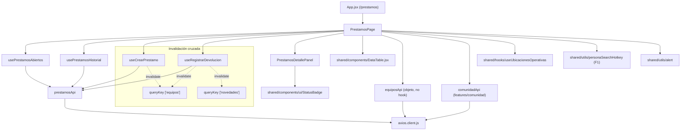
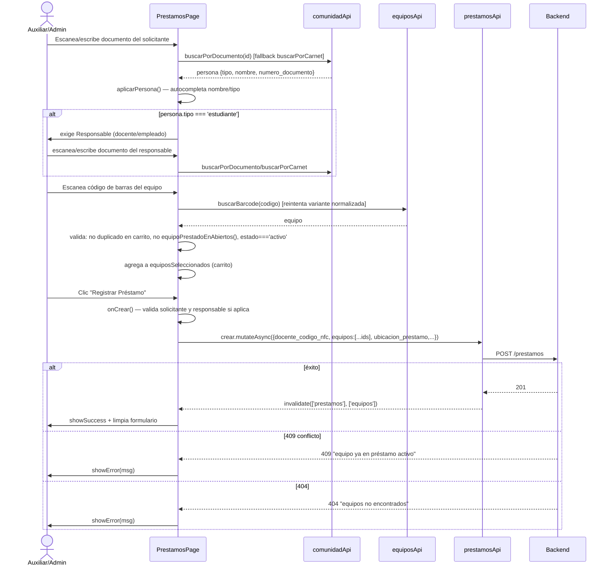
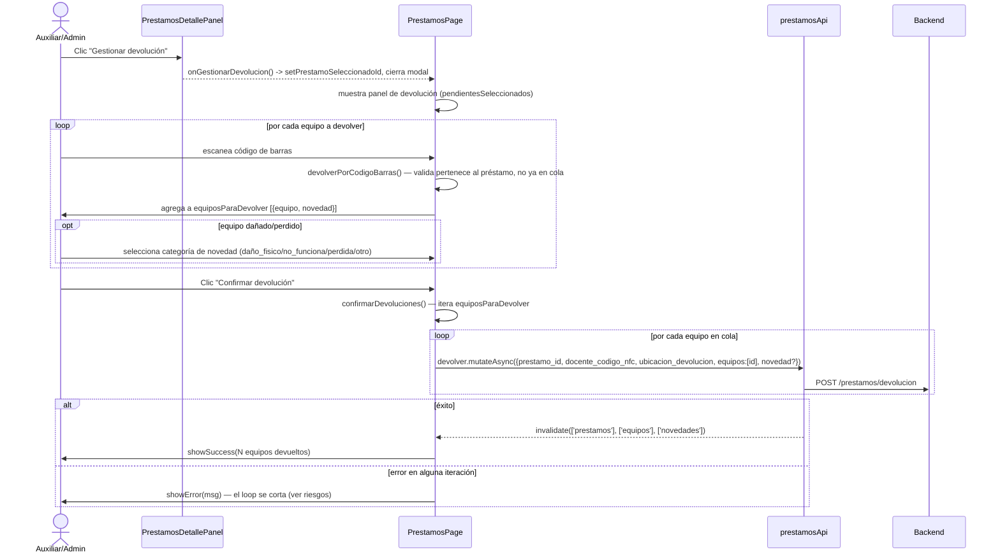

# Subsistema: Préstamos de Equipos

## 1. Propósito

Gestiona el ciclo completo de préstamo y devolución de equipos de inventario a docentes, estudiantes y empleados: registro de solicitante (con responsable obligatorio si es estudiante), carrito de equipos vía escaneo de código de barras o búsqueda por texto, devolución parcial/total con registro de novedades (daño, pérdida, etc.), e historial de préstamos cerrados.

## 2. Componentes principales

- **`PrestamosPage`** (`src/features/prestamos/PrestamosPage.jsx:44`) — página principal, ~880 líneas. Contiene: formulario de registro de préstamo (carrito + búsqueda de persona), tabs Activos/Historial con `DataTable`, y panel de devolución parcial por escaneo con cola de novedades por equipo. Es el componente más grande y con más estado local del subsistema auditado (más de 15 `useState`).
- **`PrestamosDetallePanel`** (`src/features/prestamos/PrestamosDetallePanel.jsx:31`) — panel de solo-lectura (modal vía `createPortal`) que muestra el detalle de un préstamo: solicitante, responsable, ubicación, auxiliar, tiempos transcurridos por artículo, y botón "Gestionar devolución" que delega el flujo real de vuelta a `PrestamosPage`.

## 3. Diagrama de dependencias

**No hay uso de zustand/NFC socket en este flujo** — a diferencia de `monitores`, `PrestamosPage` no importa `useNFCSocket`/`useNFCStore`; el campo `docente_codigo_nfc` es solo el nombre histórico del campo que recibe el backend, alimentado por búsqueda manual/escaneo-como-texto contra `comunidadApi`, no por el store NFC en tiempo real.

## 4. Servicios API

`prestamosApi` (`src/features/prestamos/prestamosApi.js:4-11`), todos sobre `/prestamos`:

| Método | Endpoint | Hook expuesto | refetchInterval |
|---|---|---|---|
| `listar` | `GET /prestamos` | usado por `usePrestamosAbiertos` y `usePrestamosHistorial` | — |
| `activos` | `GET /prestamos/activos` | `usePrestamosActivos()` (línea 13) | **30000ms** — no se usa en `PrestamosPage` (ver riesgos) |
| `porDocente` | `GET /prestamos/docente/:nfc` | sin hook expuesto en este archivo | — |
| `crear` | `POST /prestamos` | `useCrearPrestamo()` (línea 43) | invalida `['prestamos']` + `['equipos']` |
| `agregarEquipo` | `POST /prestamos/:id/equipos` | sin hook | — |
| `devolucion` | `POST /prestamos/devolucion` | `useRegistrarDevolucion()` (línea 54) | invalida `['prestamos']` + `['equipos']` + `['novedades']` |

Hooks de lectura efectivamente usados en `PrestamosPage`:
- `usePrestamosAbiertos()` (línea 21) — `queryKey: ['prestamos','abiertos']`, filtra client-side por `estado in [activo, parcialmente_devuelto]`, **`refetchInterval: 30000`**.
- `usePrestamosHistorial()` (línea 31) — `queryKey: ['prestamos','historial']`, filtra `estado === 'completamente_devuelto'` y ordena por fecha descendente, **`refetchInterval: 60000`**.

Ambos hooks llaman al mismo endpoint `GET /prestamos` y filtran en el `select` de React Query — es decir, dos queries distintas (cachés separadas) para el mismo recurso backend, cada una con su propio polling.

## 5. Flujos principales

### Registrar préstamo

### Devolución parcial por escaneo

## 6. Puntos de inflexión

- **Responsable obligatorio para estudiantes**: `onCrear()` (línea 272-311) bloquea el registro si `solicitante_tipo === 'estudiante'` y no hay `responsable_codigo`/`responsable_nombre` completos — única regla de rol-dependiente-de-dato (no de rol de usuario autenticado) del subsistema.
- **Validación de disponibilidad triple**: tanto al escanear (`agregarPorCodigoBarras`, línea 217) como al buscar por texto (`agregarEquipoDirecto`, línea 255) se repiten las mismas tres validaciones: no duplicado en carrito, no `equipoPrestadoEnAbiertos()`, `estado === 'activo'` — la validación de disponibilidad es 100% client-side antes de enviar; el backend puede rechazar igualmente con 409 (doble capa, correcto pero redundante en código).
- **Normalización de código escaneado** (`normalizarCodigoEscaneado`, línea 147-155): limpia comillas/caracteres de lectores de barras que a veces inyectan basura, y prueba tanto el crudo como el normalizado (`posiblesCodigos`, línea 157-161) contra el backend — tolerancia a errores de hardware de escaneo.
- **Auto-envío por debounce en inputs de escaneo** (líneas 390-418): tanto el carrito de préstamo como la cola de devolución usan `useEffect` + `setTimeout(120ms)` para disparar automáticamente la búsqueda cuando cambia el valor del input, comparando contra un `ref` de "último escaneado" para evitar duplicados — patrón pensado para lectores de barras que actúan como teclado (keystroke injection), no clic manual.
- **Confirmación de devolución sin transacción**: `confirmarDevoluciones()` (línea 341-361) hace un `for...of` con `await devolver.mutateAsync(...)` por cada equipo; si falla a mitad de la cola, los equipos ya procesados quedan devueltos pero los restantes no, y el usuario solo ve un `showError` genérico sin saber cuáles fueron exitosos (ver riesgos).
- **Filtro `F1` de búsqueda por nombre dual-objetivo**: `objetivoF1` (línea 116-122) decide dinámicamente si F1 busca "solicitante" o "responsable" según el estado del formulario, usando un `ref` (`objetivoF1Ref`) para que el listener de teclado no quede con closure obsoleto — mismo patrón (`abrirBuscadorPersonaPorNombre`) reutilizado en `monitores`.

## 7. Dependencias cruzadas

- **prestamosApi → equiposApi**: fuerte y bidireccional (ver también `equipos.md`).
  - `PrestamosPage` importa el objeto `equiposApi` directo (no vía hook) para `buscarBarcode` (línea 225) y `buscarPorTexto` (línea 372), evitando pasar por React Query para estas búsquedas puntuales — decisión consciente (no necesitan caché) pero inconsistente con el resto del código que sí usa hooks.
  - `useCrearPrestamo` y `useRegistrarDevolucion` invalidan `['equipos']` para que `EquiposPage` refleje el nuevo estado "en préstamo" inmediatamente.
  - `equipoPrestadoEnAbiertos()` (línea 209-215) reimplementa localmente la misma regla que `EquiposPage.jsx:55-77` usa para pintar `en_prestamo` — lógica de negocio duplicada entre features (ver también riesgo en `equipos.md`).
- **prestamosApi ↔ comunidadApi**: `PrestamosPage` depende de `comunidadApi.buscarPorDocumento`/`buscarPorCarnet` (línea 7, usado en `buscarPersona`) para resolver solicitante y responsable — mismo servicio que usa `MonitoresPage` para resolver docente/monitor, confirmando que `comunidadApi` es el servicio transversal de identidad de personas en todo el sistema (no exclusivo de "comunidad" como feature visible).
- **No hay relación con `llavesApi` ni con el módulo NFC real** dentro de este alcance — se verificó con grep que `PrestamosPage.jsx` y `PrestamosDetallePanel.jsx` no importan `useNFCSocket`, `useNFCStore` ni nada de `features/llaves`. El nombre de campo `docente_codigo_nfc` es heredado del modelo de datos backend pero alimentado por búsqueda manual/carnet-como-texto.
- **DataTable compartido**: dos instancias en la misma página (`columns` para activos, `historialColumns` para historial), ambas con `onRowClick` abriendo el mismo `PrestamosDetallePanel` vía `detallePrestamoId`.
- **`useUbicacionesOperativas`** (`shared/hooks/useUbicacionesOperativas`): hook compartido consumido para poblar selects de ubicación de préstamo/devolución — no auditado en profundidad (fuera de alcance), pero es punto de acoplamiento con configuración global de sedes/salones.

## 8. Riesgos u observaciones de auditoría

- **Devolución en lote sin atomicidad**: el loop en `confirmarDevoluciones()` (línea 341-361) ejecuta N llamadas POST secuenciales sin rollback ni reporte parcial — si la llamada 2 de 5 falla, el usuario no sabe qué equipos sí se devolvieron. Riesgo funcional real en el flujo más sensible del subsistema (afecta disponibilidad de inventario).
- **`usePrestamosActivos()` (prestamosApi.js:13-19) no tiene consumidores** en el código auditado — hook con `refetchInterval: 30000` definido pero no usado por `PrestamosPage` (que usa `usePrestamosAbiertos`, un query distinto sobre el mismo endpoint base `/prestamos` vs `/prestamos/activos`). Candidato a código muerto o duplicación de intención con `usePrestamosAbiertos`.
- **Dos queries para el mismo recurso**: `usePrestamosAbiertos` y `usePrestamosHistorial` llaman ambas a `GET /prestamos` (línea 24, 34) y filtran client-side, en vez de pedir al backend `/prestamos?estado=activo` — implica traer siempre el dataset completo de préstamos (histórico incluido) en cada poll de 30s/60s, lo que puede degradar con el crecimiento de datos.
- **Componente `PrestamosPage.jsx` sobredimensionado**: ~880 líneas, +15 `useState`, mezcla formulario de creación, tabs, modal de detalle y panel de devolución en un único archivo — alta complejidad ciclomática, sin tests (CodeGraph: "no covering tests found" en `PrestamosPage`, `PrestamosDetallePanel`, `prestamosApi`).
- **Duplicación de `tiempoTranscurrido`**: la función está definida de forma idéntica en `PrestamosPage.jsx:12-24` y en `PrestamosDetallePanel.jsx:4-16` — copy-paste en vez de extraer a `shared/utils`.
- **Manejo de error inconsistente entre flujos**: `onCrear()` distingue 409/404 con mensajes específicos; `confirmarDevoluciones()` y `agregarPorCodigoBarras()` usan mensajes genéricos de fallback. No hay una capa central de mapeo de errores HTTP → mensaje de usuario.
- **Validación de "estudiante" hardcodeada por string**: comparaciones como `persona.tipo === 'estudiante'` y arrays `['docente','empleado']` están repetidas en múltiples puntos del archivo (líneas 165, 172, 277) en vez de una constante/enum compartido.
