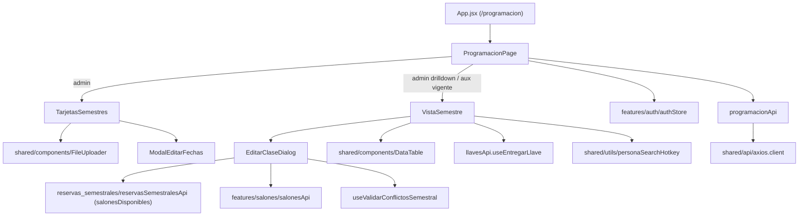
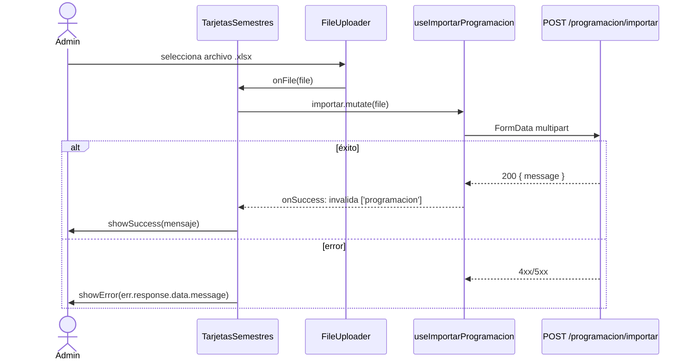
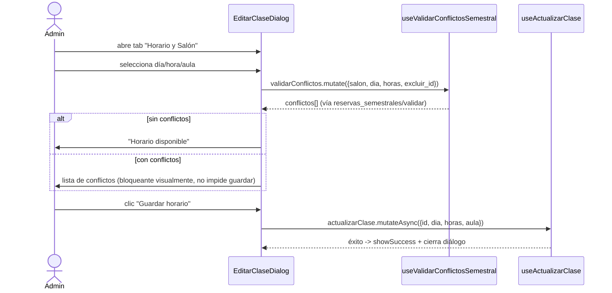
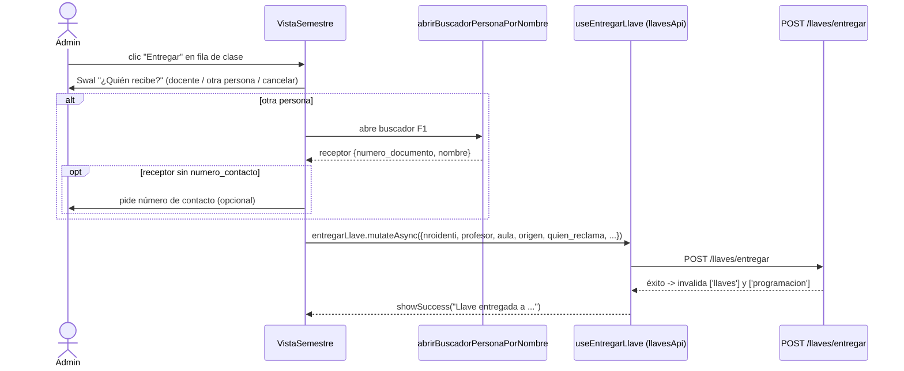

# Programación Académica

## 1. Propósito

Gestiona la carga y consulta de la programación de clases universitarias (importada desde Excel), la vinculación de grupos "fantasma" (secciones que comparten cupo/horario con otra materia) y las reservas semestrales asociadas a un semestre académico. Ofrece dos vistas según rol: administración completa (drilldown por semestre, importación, edición) y consulta de solo lectura del semestre vigente para auxiliares.

## 2. Componentes principales

- **`ProgramacionPage`** (`src/features/programacion/ProgramacionPage.jsxxx:759`) — punto de entrada de la ruta `/programacion`. Bifurca por rol: si no es admin, renderiza directamente `VistaSemestre` con el semestre vigente (`src/features/programacion/ProgramacionPage.jsxxx:780-789`); si es admin, alterna entre `TarjetasSemestres` (listado) y `VistaSemestre` (drilldown) según `semestreSeleccionado` (`src/features/programacion/ProgramacionPage.jsxxx:793-812`).
- **`TarjetasSemestres`** (`src/features/programacion/ProgramacionPage.jsxxx:630`) — vista admin de tarjetas por semestre, con importación de Excel vía `FileUploader`, eliminación y edición de fechas de semestre.
- **`ModalEditarFechas`** (`src/features/programacion/ProgramacionPage.jsxxx:557`) — formulario embebido para editar `fecha_inicio`/`fecha_fin` de un semestre.
- **`VistaSemestre`** (`src/features/programacion/ProgramacionPage.jsxxx:71`) — componente central: tabla de clases (por día o completa), tabla de reservas semestrales del semestre, entrega de llave desde la tabla, importación/exportación Excel de reservas semestrales, modal de detalle de registro y disparador de `EditarClaseDialog`.
- **`EditarClaseDialog`** (`src/features/programacion/EditarClaseDialog.jsxxx:30`) — modal de 3 pestañas (Información, Fantasmas, Horario y Salón) para editar una clase existente, vincular/desvincular grupos fantasma y reasignar horario/salón con validación de conflictos.

## 3. Diagrama de dependencias

## 4. Servicios API

`src/features/programacion/programacionApi.js:4` expone `programacionApi` (objeto de llamadas axios) y hooks React Query:

| Endpoint | Hook | Método |
|---|---|---|
| `GET /programacion` | `useProgramacion(semestre)` | query |
| `GET /programacion/dia/:dia` | `useProgramacionDia(dia, semestre)` | query, `enabled: !!dia` |
| `GET /programacion/semestres` | `useSemestres()` | query |
| `GET /programacion/semestres/vigente` | `useSemestreVigente()` | query |
| `DELETE /programacion/semestres/:codigo` | `useEliminarSemestre()` | mutation |
| `PATCH /programacion/semestres/:codigo/fechas` | `useActualizarFechasSemestre()` | mutation, invalida `programacion.semestres` y `reservas-semestrales` |
| `POST /programacion/importar` (multipart) | `useImportarProgramacion()` | mutation |
| `GET /programacion/exportar` (blob) | `programacionApi.exportar` | llamada directa (no hook) |
| `GET /programacion/semestres/:codigo/reservas-semestrales` | `useReservasSemestrales(codigo)` | query |
| `POST /programacion/semestres/:codigo/reservas-semestrales/importar` (multipart) | `useImportarReservasSemestrales()` | mutation |
| `DELETE /programacion/semestres/:codigo/reservas-semestrales` | `useEliminarReservasSemestrales()` | mutation |
| `GET /programacion/semestres/:codigo/reservas-semestrales/exportar` (blob) | `programacionApi.exportarSemestrales` | llamada directa |
| `DELETE /programacion/reservas-semestrales/:id` | `useEliminarReservaIndividual(codigoSemestre)` | mutation |
| `PATCH /programacion/:id` | `useActualizarClase()` | mutation |
| `GET /programacion/validar-fantasma` | `programacionApi.validarFantasma` | llamada directa (debounce 400ms en `EditarClaseDialog`) |
| `POST /programacion/:id/vincular-fantasma` | `useVincularFantasma()` | mutation |
| `DELETE /programacion/:id/desvincular-fantasma` | `useDesvincularFantasma()` | mutation |

No hay `refetchInterval`/polling en este subsistema; todas las queries son bajo demanda o invalidadas por mutaciones. `EditarClaseDialog` además consume `reservasSemestralesApi.salonesDisponibles` (`src/features/programacion/EditarClaseDialog.jsxxx:89`) para listar salones libres al reasignar horario, con `staleTime: 30000`.

## 5. Flujos principales

### 5.1 Importar Excel de programación (admin)

### 5.2 Editar horario/salón de una clase con validación de conflictos

### 5.3 Entregar llave desde la tabla de clases

## 6. Puntos de inflexión

- **Admin vs auxiliar** (`ProgramacionPage.jsx:780-812`): el auxiliar nunca ve `TarjetasSemestres` ni puede seleccionar semestre — consume directamente `useSemestreVigente()`; si no hay semestre vigente, ve un estado vacío. El admin navega tarjetas → drilldown por semestre.
- **`isAdmin` dentro de `VistaSemestre`** controla: botón "Volver" (`ChevronLeft`), botón "Ver por día"/"Ver completa", importación de reservas semestrales, columna de acciones (editar/eliminar) en la tabla de reservas semestrales, y habilitación del botón "Editar" en el modal de detalle solo para tipos `programacion`/`fantasma`.
- **Filtro por día vs vista completa** (`vistaCompleta`, `ProgramacionPage.jsx:75,100-106`): cuando está activo, la tabla de "clases" combina `completa` (todas) + `todasReservas` (sin filtrar por día); cuando está desactivado, combina `clasesPorDia` + `reservasSemestralesDelDia` que vienen ya filtradas por backend (`useProgramacionDia`).
- **Manejo de error en importación**: usa `showSuccess`/`showError` (wrappers sobre `Swal`, `src/shared/utils/alert.js`), no hay reintento automático; el usuario debe re-seleccionar el archivo manualmente. `FileUploader` no valida extensión/tamaño en este punto (validación delegada al backend vía mensaje de error).
- **Vinculación de fantasmas** (`EditarClaseDialog.jsx:240-274`): validación instantánea con debounce de 400ms contra `/programacion/validar-fantasma`; solo se puede vincular un grupo marcado como `puede: true` por el backend (los no elegibles se muestran deshabilitados con `razon` como tooltip).
- **Sincronización de bloque/salón al editar horario** (`EditarClaseDialog.jsx:98-135`): usa `useRef` (`bloqueIniciado`, `originalSalonRef`) para precargar el bloque/salón original de la clase solo una vez, evitando que el `useEffect` lo sobreescriba en renders posteriores — patrón frágil basado en refs mutables en vez de estado derivado.

## 7. Dependencias cruzadas

- **`llavesApi`**: `ProgramacionPage.jsx:21` importa `useEntregarLlave` de `src/features/llaves/llavesApi.js:59`. Al entregar una llave desde la tabla de clases, se invalida tanto `['llaves']` como `['programacion']` (ver `llavesApi.js:63-66`), acoplando explícitamente el estado de ambos dominios. El análisis detallado de `llavesApi` está en `llaves.md`.
- **`reservas_semestrales/reservasSemestralesApi`**: `EditarClaseDialog.jsx:17` reutiliza `reservasSemestralesApi.salonesDisponibles` y `useValidarConflictosSemestral` para calcular disponibilidad de salón al reasignar horario de una clase de tipo `programacion`/`fantasma` — es decir, la validación de conflictos de horario de "programación" vive físicamente en el módulo `reservas_semestrales`, no en `programacionApi`.
- **`features/salones/salonesApi`**: `EditarClaseDialog.jsx:18` consume `useSalones` para resolver el salón original de la clase cuando aún no hay salones disponibles cargados para la franja.
- **`authStore`**: `ProgramacionPage.jsx:760-761` lee `usuario.rol` para decidir la bifurcación admin/auxiliar (`ROLES.ADMIN`).
- **`abrirBuscadorPersonaPorNombre`** (`shared/utils/personaSearchHotkey`): usado tanto para buscar el docente responsable en `EditarClaseDialog` como para seleccionar el receptor de llave en `VistaSemestre`.

## 8. Riesgos u observaciones de auditoría

- **Archivos sobredimensionados**: `ProgramacionPage.jsx` tiene 813 líneas y agrupa 4 componentes (`VistaSemestre`, `ModalEditarFechas`, `TarjetasSemestres`, `ProgramacionPage`) sin separación en archivos propios; `EditarClaseDialog.jsx` tiene 686 líneas con lógica de 3 dominios distintos (edición de info, gestión de fantasmas, edición de horario/salón) en un solo componente. Dificulta pruebas unitarias y revisión de cambios.
- **Acoplamiento inverso entre módulos**: la edición de horario de clases de "programación" depende del servicio de `reservas_semestrales` para validar disponibilidad de salón (`EditarClaseDialog.jsx:17,89-94`), en vez de que `programacionApi` exponga su propio endpoint de validación — nomenclatura de módulos no refleja la dependencia real.
- **Normalización de texto con caracteres de combinación**: `handleGuardarHorario` (`EditarClaseDialog.jsx:197`) usa un regex `[̀-ͯ]` (rango de diacríticos Unicode) potencialmente frágil/dificil de auditar visualmente; cualquier revisor tendría que decodificar el rango para verificar corrección.
- **Refs mutables para lógica de inicialización** (`bloqueIniciado`, `originalSalonRef`, `claseIdRef` en `EditarClaseDialog.jsx:51-53`): sustituyen estado derivado por banderas manuales sincronizadas en múltiples `useEffect`, aumentando el riesgo de que un cambio futuro rompa el flujo de precarga sin que las pruebas (inexistentes, ver abajo) lo detecten.
- **Sin cobertura de pruebas**: CodeGraph reporta explícitamente "no covering tests found" para `ProgramacionPage`, `EditarClaseDialog`, `programacionApi` y `useSemestreVigente` — módulo de alto impacto (programación académica, llaves, salones) sin red de seguridad automatizada.
- **Manejo de error inconsistente**: se combinan `showSuccess`/`showError` (wrapper de `Swal`) con `Swal.fire` directo dentro del mismo archivo (`ProgramacionPage.jsx`), sin un patrón único de notificación de error/éxito.
- **Exportación de archivos sin manejo de error específico**: `handleExportarSemestre`/`handleExportarReservasSemestrales` (`ProgramacionPage.jsx:243-269`) capturan cualquier error con un mensaje genérico, sin distinguir errores de red vs. errores de negocio del backend.
