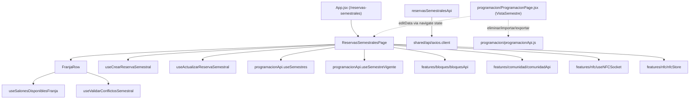
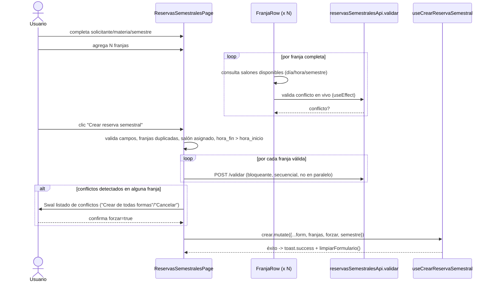
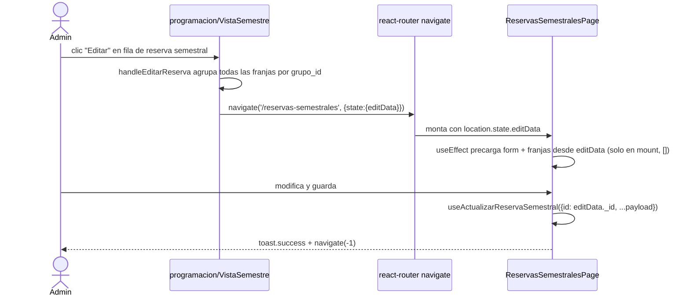

# Reservas Semestrales

## 1. Propósito

Permite crear (y editar) reservas recurrentes de salón válidas durante todo un semestre académico, definidas como una o más "franjas" horarias (día + hora inicio/fin + salón), cada una con posibilidad de motivo y monitor específico. Se integra con `programacion` tanto para el semestre de contexto como para la eliminación/edición disparada desde la tabla administrativa de `VistaSemestre`.

## 2. Componentes principales

- **`ReservasSemestralesPage`** (`src/features/reservas_semestrales/ReservasSemestralesPage.jsx:339`) — página única (829 líneas) que cubre creación y edición (vía `location.state.editData` recibido desde `programacion/ProgramacionPage.jsx:218-234`). Gestiona formulario general (solicitante/responsable/materia/semestre), lista de franjas, captura NFC, y validación/envío.
- **`FranjaRow`** (`src/features/reservas_semestrales/ReservasSemestralesPage.jsx:46`) — subcomponente por franja: selecciona día/hora, consulta salones disponibles para esa combinación (excluyendo salones ya tomados por otras franjas del mismo formulario), valida conflictos de horario en tiempo real, y permite asignar motivo/monitor específicos por franja.
- **`reservasSemestralesApi.js`** — capa de datos y hooks React Query.

No hay pestañas ni tabs; es una única vista de formulario largo. La visualización/gestión de reservas semestrales ya creadas (listar, editar, eliminar) vive fuera de este módulo, en `VistaSemestre` de `programacion` (ver §7).

## 3. Diagrama de dependencias

## 4. Servicios API

`src/features/reservas_semestrales/reservasSemestralesApi.js:4`:

| Endpoint | Hook | Uso real |
|---|---|---|
| `GET /programacion/reservas-semestrales/disponibilidad` | `useDisponibilidadSemestral` | **exportado, sin caller en el repo** |
| `POST /programacion/reservas-semestrales/validar` | `useValidarConflictosSemestral()` | usado en `FranjaRow` y reutilizado por `EditarClaseDialog` (módulo `programacion`) |
| `POST /programacion/reservas-semestrales` | `useCrearReservaSemestral()` | invalida `['reservas-semestrales']` (prefijo, afecta también queries de `programacionApi`) |
| `GET /programacion/reservas-semestrales/todas` | `useTodasReservasSemestrales()` | **exportado, sin caller en el repo** |
| `DELETE /programacion/reservas-semestrales/grupo/:grupo_id` | `useCancelarGrupoSemestral()` | **exportado, sin caller en el repo** |
| `GET /programacion/reservas-semestrales/salones-disponibles` | `useSalonesDisponiblesFranja(...)` | usado en `FranjaRow`; también reutilizado directamente (sin hook) en `EditarClaseDialog` de `programacion` |
| `GET /programacion/reservas-semestrales/salones-disponibles` | `useSalonesDisponiblesSemestral(params)` | **exportado, sin caller en el repo** |
| `PUT /programacion/reservas-semestrales/:id` | `useActualizarReservaSemestral()` | invalida `['reservas-semestrales']` |

No hay `refetchInterval`. `useSalonesDisponiblesFranja` usa `staleTime: 30000`.

## 5. Flujos principales

### 5.1 Crear reserva semestral con múltiples franjas

### 5.2 Editar reserva semestral (entrada desde `programacion`)

## 6. Puntos de inflexión

- **Modo creación vs edición** (`modoEdicion = !!editData`, línea 345): controla si el selector de semestre está deshabilitado (`disabled={modoEdicion}`, línea 691), el texto de botones, y si se navega hacia atrás en vez de limpiar el formulario al finalizar.
- **Salones ya tomados por otras franjas del mismo formulario** (`FranjaRow`, líneas 58-76): `salonesUsadosPorOtras` filtra en cliente los salones que se solapan en día/horario con **otras franjas del mismo formulario en edición**, evitando que el usuario asigne el mismo salón dos veces en horarios que chocan dentro de una sola reserva semestral, antes incluso de llamar al backend.
- **Validación de conflictos secuencial, no paralela** (`handleGuardar`, líneas 560-574): el `for...of` con `await` valida cada franja una por una contra el backend; con muchas franjas esto es lento y cualquier error de red en una franja individual se ignora silenciosamente (`catch { /* continuar */ }`), pudiendo dejar pasar conflictos no detectados.
- **Franjas duplicadas y solapamiento se validan solo en cliente** (líneas 536-553): duplicados exactos (mismo día+hora_inicio+hora_fin) y ausencia de salón se bloquean antes de tocar el backend; el choque de horario real (contra otras reservas ya existentes) sí depende de la respuesta del backend vía `/validar`.
- **`excluirGrupoId`** (línea 556): en modo edición, se excluye el propio `grupo_id` de las validaciones de conflicto y de la búsqueda de salones disponibles, para no marcar como "ocupado" un salón que la propia reserva en edición ya tiene asignado.
- **Reset de campos dependientes**: cambiar día, hora_inicio u hora_fin de una franja limpia automáticamente salón/bloque de esa franja (`FranjaRow`, líneas 173,185,195); análogamente, la búsqueda de monitor y el checkbox "motivo específico" son opcionales por franja y sobrescriben el motivo/monitor general del formulario solo si están activos.

## 7. Dependencias cruzadas

- **`programacionApi`**: `ReservasSemestralesPage.jsx:10` importa `useSemestres` y `useSemestreVigente` directamente de `features/programacion/programacionApi.js` para poblar el selector de semestre y preseleccionar el vigente en modo creación (línea 392-396).
- **`programacion/ProgramacionPage.jsx` (VistaSemestre)**: es la única puerta de entrada para **editar o eliminar** una reserva semestral ya creada — `handleEditarReserva`/`handleEliminarReserva` en `VistaSemestre` (`ProgramacionPage.jsx:211-234, 185-209`) construyen el `editData` y navegan a esta página, o llaman directamente a `programacionApi.eliminarReservaIndividual`/`eliminarReservasSemestrales`. **`ReservasSemestralesPage` en sí misma no tiene ninguna acción de eliminar/cancelar** pese a exportar `useCancelarGrupoSemestral` sin usar (ver §8).
- **`EditarClaseDialog`** (módulo `programacion`): reutiliza `reservasSemestralesApi.salonesDisponibles` y `useValidarConflictosSemestral` para su propio flujo de edición de horario de clases "programación"/"fantasma" — acoplamiento bidireccional entre ambos módulos.
- **`comunidadApi`, `useNFCSocket`, `nfcStore`**: mismo patrón de búsqueda de persona por documento/carnet con fallback cruzado que en `reservas/ReservasPage.jsx` (ver §8, duplicación).
- **Query key compartida `['reservas-semestrales']`**: tanto `reservasSemestralesApi.js` (`useCrearReservaSemestral`, `useActualizarReservaSemestral`, `useCancelarGrupoSemestral`) como `programacionApi.js` (`useReservasSemestrales(codigo)` con key `['reservas-semestrales', codigo]`) usan el mismo prefijo de query key; `invalidateQueries({queryKey:['reservas-semestrales']})` sin `exact:true` invalida ambas por defecto en React Query v5, lo cual es el comportamiento deseado pero depende de una convención de nombres no documentada ni compartida explícitamente entre archivos.

## 8. Riesgos u observaciones de auditoría

- **Cuatro hooks exportados sin ningún uso en el repositorio**: `useDisponibilidadSemestral`, `useTodasReservasSemestrales`, `useCancelarGrupoSemestral` y `useSalonesDisponiblesSemestral` (`reservasSemestralesApi.js:32,42,60,76`) no tienen ningún caller confirmado por búsqueda global. En particular, la ausencia de uso de `useCancelarGrupoSemestral` es notable: no existe forma de cancelar un **grupo completo** de franjas semestrales de una sola vez desde la UI; la eliminación real ocurre franja por franja vía `programacionApi.eliminarReservaIndividual`, llamada desde `programacion/VistaSemestre`, no desde este módulo. Indica una funcionalidad de backend planeada pero no conectada al frontend, o código muerto tras un cambio de diseño no limpiado.
- **Página monolítica de 829 líneas**: `ReservasSemestralesPage.jsx` combina estado de formulario general, lista dinámica de franjas, lógica NFC completa, y el subcomponente `FranjaRow` con su propia lógica de disponibilidad/conflictos — el archivo más grande de los tres subsistemas auditados, sin separación en componentes/hooks reutilizables.
- **Duplicación exacta de lógica NFC/búsqueda de persona con `reservas/ReservasPage.jsx`**: `aplicarPersonaEnFormulario`, `buscarPersona` y `handleBuscarPorNombre` (líneas 447-506) son casi idénticas letra por letra a las funciones homónimas en `src/features/reservas/ReservasPage.jsx:150-216`. Es la duplicación más clara detectada en todo el subsistema auditado — candidata directa a extraerse a un hook compartido en `shared/hooks` (p. ej. `useBuscarPersonaConNFC`).
- **Validación de conflictos secuencial con silenciamiento de errores** (`handleGuardar`, línea 573: `catch { /* continuar */ }`): si el endpoint de validación falla por red para una franja, esa franja se trata como "sin conflictos" y se permite continuar, lo que puede crear reservas con choques de horario no detectados por un fallo transitorio de red en vez de un rechazo explícito.
- **Tres sistemas de notificación distintos usados en el mismo flujo**: `Swal.fire` para validaciones y confirmaciones, `toast` (sonner) para éxito/error final de crear/actualizar — inconsistente con `programacion`/`reservas`, que usan mayormente `Swal`/`showSuccess`/`showError`. No hay un estándar único de feedback al usuario en todo el subsistema de programación y reservas.
- **Sin cobertura de pruebas**: `ReservasSemestralesPage` y `reservasSemestralesApi` no tienen pruebas automatizadas (confirmado por CodeGraph), a pesar de ser el módulo con la lógica de validación de conflictos más compleja (múltiples franjas, exclusión de grupo propio, salones ya usados en el mismo formulario).
- **`useEffect` de precarga de `editData` con dependencias vacías** (`ReservasSemestralesPage.jsx:362-389`, `[]`): si `editData` cambiara tras el montaje (por ejemplo, navegación repetida sin desmontar), el formulario no se resincronizaría; el patrón asume que la página siempre se monta de nuevo por cada edición, dependencia implícita del comportamiento de React Router no garantizada explícitamente en el código.
