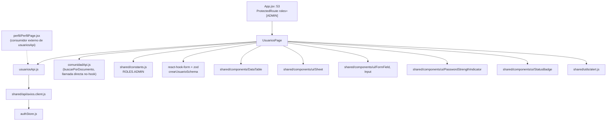
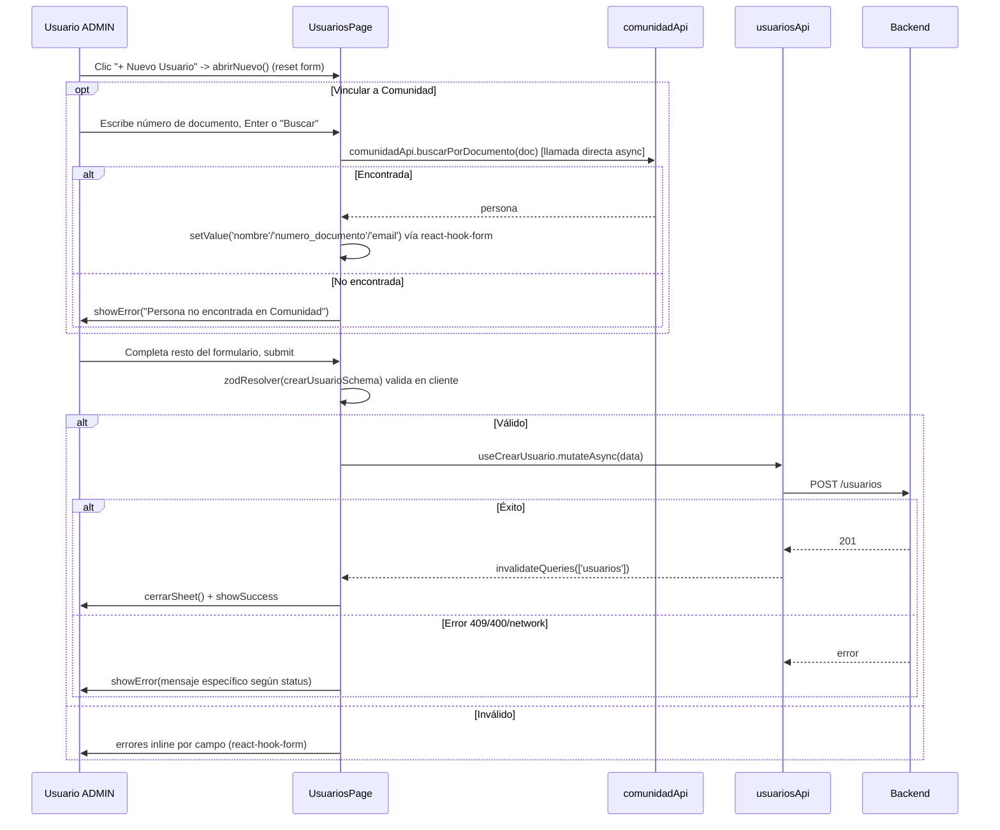
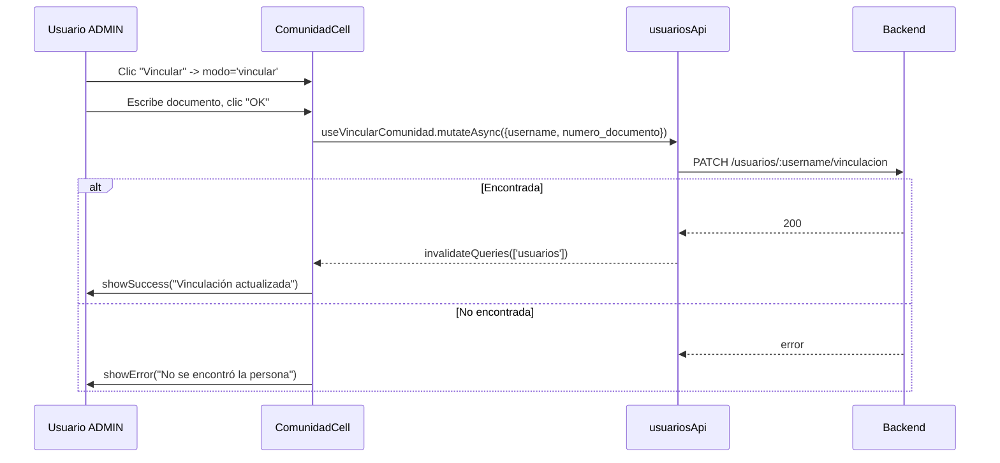

# Feature: Usuarios

## 1. Propósito

Administra las cuentas de acceso al sistema AulaSync (usuario/contraseña, rol, estado activo/inactivo) y su vinculación opcional con un registro de la Comunidad (docente/estudiante/empleado). Es un módulo exclusivo de ADMIN para dar de alta operadores del sistema (admin/auxiliares de programación) y asociarlos a una persona real para trazabilidad.

## 2. Componentes principales

- **`UsuariosPage`** (`src/features/usuarios/UsuariosPage.jsx:161`): página única con `DataTable` de usuarios y `Sheet` lateral de creación con formulario validado por `react-hook-form` + `zod` (`crearUsuarioSchema`, línea 24). Incluye búsqueda y auto-vinculación opcional a una persona de Comunidad antes de crear el usuario.
- **`ComunidadCell`** (línea 53): celda de tabla con estado local de 3 modos (mostrar vinculado / mostrar botón "Vincular" / modo edición con input) — permite vincular o desvincular un usuario existente a una persona de Comunidad sin abrir el `Sheet` de creación.
- **`EstadoToggle`** (línea 39): celda clicable que alterna `activo` de un usuario mediante `useCambiarEstadoUsuario.mutate` directo (sin confirmación previa).

## 3. Diagrama de dependencias

## 4. Servicios API

`usuariosApi` (`src/features/usuarios/usuariosApi.js:4`):

| Endpoint | Método | Hook | Notas |
|---|---|---|---|
| `/usuarios` | GET | `useUsuarios` (línea 14) | sin `refetchInterval` (sin polling) |
| `/usuarios` | POST | `useCrearUsuario` (línea 21) | invalida `['usuarios']` |
| `/usuarios/:username/estado` | PATCH | `useCambiarEstadoUsuario` (línea 29) | invalida `['usuarios']`; body `{activo}` |
| `/usuarios/perfil` | PATCH | *(sin hook en este módulo; `editarPerfil` consumido desde `PerfilPage`, fuera de alcance)* | — |
| `/usuarios/contrasena` | PATCH | *(ídem, `cambiarContrasena`, consumido por `PerfilPage`)* | — |
| `/usuarios/:username/vinculacion` | PATCH | `useVincularComunidad` (línea 37) | invalida `['usuarios']`; body `{numero_documento}` (vacío = desvincular) |

`comunidadApi.buscarPorDocumento` (llamada directa, no hook) usada en `buscarPersona` (línea 186-203) para autocompletar nombre/documento/correo al crear un usuario vinculado.

Sin polling en ningún hook de este módulo.

## 5. Flujos principales

### Crear usuario (con vinculación opcional a Comunidad)

### Vincular/desvincular usuario existente a Comunidad (inline en tabla)

## 6. Puntos de inflexión

- **Guard de ruta ADMIN-only**: `/usuarios` está dentro de `<Route element={<ProtectedRoute roles={[ROLES.ADMIN]} />}>` (`src/App.jsx:53`). Igual que `comunidad`, es control a nivel de ruta (redirección a `/programacion` si el rol no coincide), no solo de UI.
- **Validación robusta con zod** (`crearUsuarioSchema`, líneas 24-37): único feature de los 5 auditados que usa react-hook-form + zod en vez de validación manual. Password exige mayúscula, minúscula, número y carácter especial además de 8 caracteres mínimo.
- **Manejo de error diferenciado por status HTTP** (`onCrear`, líneas 205-223): distingue 409 (usuario/correo duplicado), 400 (datos inválidos), ausencia de `err.response` (sin conexión) y fallback genérico — el más granular de los 5 features auditados.
- **`EstadoToggle` no pide confirmación** antes de activar/desactivar un usuario (a diferencia de "eliminar persona" en Comunidad, que sí usa `showConfirm`) — un clic accidental desactiva inmediatamente la cuenta.
- **Sin selector de rol en el formulario de creación**: `fields` (línea 153-159) no incluye un campo `rol`; el esquema zod tampoco lo valida. El rol del usuario creado debe asignarse por defecto en el backend o no es configurable desde esta UI — posible funcionalidad faltante o delegada a otro flujo no cubierto en este análisis.

## 7. Dependencias cruzadas

- **`comunidadApi.buscarPorDocumento`**: llamada directa (no `useQuery`) para autocompletar datos de persona al crear/vincular usuario — mismo patrón imperativo detectado en `comunidad.md` punto 8.
- **`ROLES` de `shared/constants.js`**: usado solo para renderizar el badge de rol (`v === ROLES.ADMIN ? 'Admin' : 'Auxiliar'`, línea 136-138), no para lógica de acceso dentro del componente (el guard vive en `ProtectedRoute`).
- **`ProtectedRoute roles={[ROLES.ADMIN]}`**: `src/App.jsx:53`.
- **Consumido externamente**: `usuariosApi` es usado también por `PerfilPage.jsx` (edición de perfil propio y cambio de contraseña) — fuera del alcance de este documento pero relevante para el radio de impacto de cambios en `usuariosApi.js`.

## 8. Riesgos u observaciones de auditoría

- **Sin tests**: CodeGraph confirma "no covering tests found" para `UsuariosPage` y `usuariosApi`.
- **Ausencia de asignación de rol en el alta de usuario**: si el backend asigna un rol por defecto (ej. auxiliar) a todo usuario creado desde esta UI, no hay forma de crear un ADMIN adicional desde el frontend — riesgo operativo a confirmar con el equipo backend/producto.
- **`EstadoToggle` sin confirmación**: cambio de estado de una cuenta (potencialmente bloqueando el acceso de un operador) ocurre con un solo clic, sin diálogo de confirmación, inconsistente con el patrón de confirmación usado para acciones destructivas en `comunidad`/`novedades`.
- **Llamada API imperativa fuera de React Query** (`comunidadApi.buscarPorDocumento` en `buscarPersona`): maneja su propio estado de carga (`buscando`) y no se beneficia de cache/reintentos de React Query; mismo patrón de inconsistencia señalado en `comunidad.md`.
- **`ComunidadCell` mezcla 3 responsabilidades de UI en un solo componente** (mostrar vinculado / botón vincular / formulario inline) con `modo` como discriminador — funcional pero podría beneficiarse de separación en sub-componentes para legibilidad, dado que ya está anidado dentro de una definición de columna de tabla.
- **Password policy solo validada en cliente vía zod**: no se confirmó (fuera de alcance frontend) si el backend re-valida la misma política de contraseña; si no lo hace, es una dependencia de seguridad en validación client-side evadible con llamadas directas a la API.
