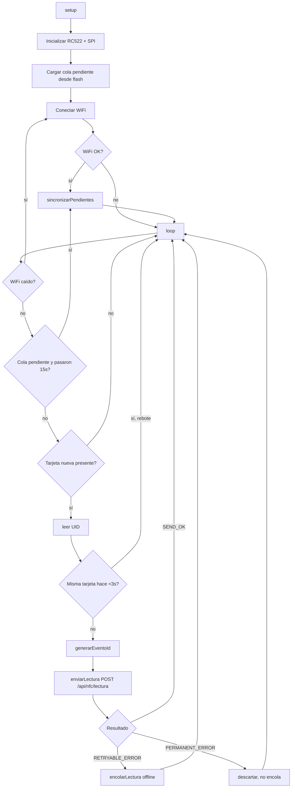

# AulaSyncLectores — Firmware ESP32 + RC522

Repo: `AulaSyncLectores` (rama `main`; sin rama `develop`). Único artefacto: `ESP32_RFID.ino`.

## Propósito

Firmware de los dispositivos de campo (portería, aulas) que leen tarjetas NFC/RFID y notifican la lectura al backend de AulaSync vía HTTP. Es el origen físico de todo el flujo de préstamo/devolución de llaves.

## Hardware

ESP32 + lector MFRC522 (RC522) por SPI: SDA→GPIO5, SCK→GPIO18, MOSI→GPIO23, MISO→GPIO19, RST→GPIO22, 3.3V (no 5V).

## Diagrama de flujo



## Contrato HTTP con el backend

```
POST {SERVER_URL}/api/nfc/lectura
Headers: Content-Type: application/json, X-Device-Key: <ESP32_DEVICE_KEY>
Body: { "id_carnet": "<UID hex>", "ubicacion": "<DEVICE_LOCATION>", "evento_id": "<ubicacion-uid-millis-random>" }
```

- Autenticación por clave estática compartida (`X-Device-Key`), no JWT — ver `AulaSyncBackend/src/features/nfc/nfc.middleware.js` (`crypto.timingSafeEqual`).
- `evento_id` es la clave de idempotencia que el backend usa contra la colección `nfc_eventos` para deduplicar reintentos.

## Puntos de inflexión (lógica no obvia)

1. **Antirrebote (debounce) de 3s** por UID — evita que una misma pasada de tarjeta genere múltiples eventos (línea ~125).
2. **Clasificación de errores HTTP** — `enviarLectura()`: 2xx = OK; 4xx (excepto 408/429) = error permanente (no se reintenta, se descarta); cualquier otro caso (5xx, timeout, sin WiFi, 408/429) = reintentable y se encola.
3. **Cola offline persistida en flash** (`Preferences`, namespace `aulasync`) — hasta 25 eventos, formato serializado `eventoId|uid|reintentos` separados por `\n`. Sobrevive reinicios del dispositivo.
4. **Cola llena** → se descarta el evento más antiguo (FIFO) para hacer espacio al nuevo.
5. **Reintentos con tope** — máx. 5 reintentos por evento antes de descartarlo definitivamente; se reintenta la cola completa cada 15s cuando hay WiFi.
6. **Validación de prefijo de ubicación al resincronizar** (`sincronizarPendientes`) — si el `evento_id` almacenado no empieza con `DEVICE_LOCATION-`, se descarta (protección ante cambio de configuración del dispositivo entre reinicios).
7. **Compatibilidad de formato legado** en `parsearPendiente` — soporta el formato antiguo `evento|uid` sin contador de reintentos.

## Riesgos / observaciones de auditoría

- Credenciales WiFi y `DEVICE_KEY` están hardcodeadas en el `.ino` (líneas 34-39) — cualquiera con acceso físico al dispositivo o al binario puede extraerlas. Aceptable para un despliegue controlado, pero es un vector de exposición si se pierde/roba un dispositivo.
- `SERVER_URL` apunta a una IP fija de LAN (`192.168.1.100`) — no hay descubrimiento dinámico ni HTTPS (HTTP plano), por lo que la clave de dispositivo viaja sin cifrar en la red local.
- No hay mecanismo de rotación de `DEVICE_KEY` ni de identificación individual por dispositivo (todos los ESP32 comparten la misma clave), por lo que el backend no puede distinguir qué dispositivo físico envió una lectura más allá del campo `ubicacion`.
