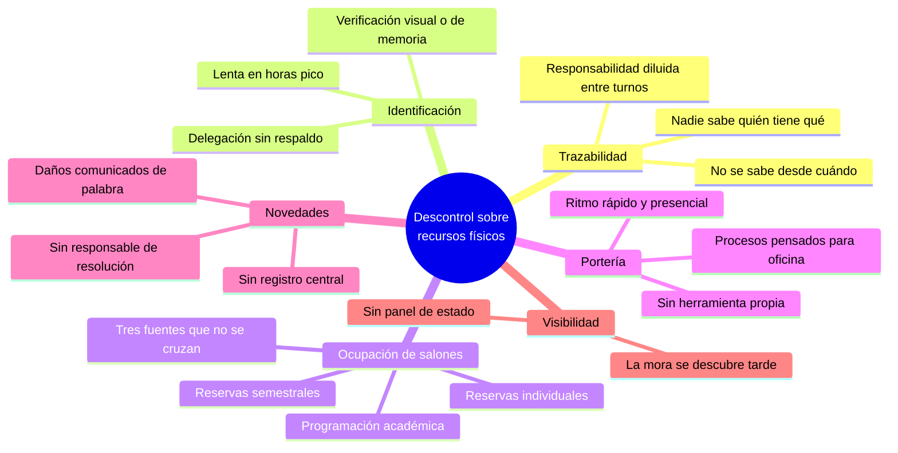
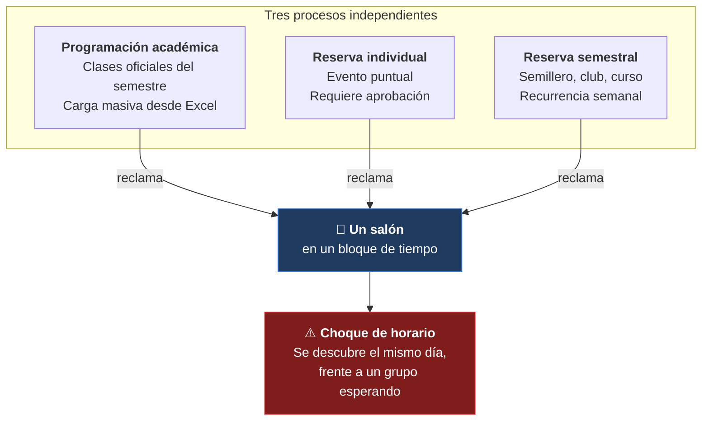

# 1. Descripción del problema

## Contexto

La universidad depende del uso compartido de un recurso físico limitado y valioso: los salones, junto con las llaves que dan acceso a ellos y los equipos (videobeams, bafles, computadores, cables de red, etc.) que se prestan para usarlos. Ese recurso hoy se coordina entre varias personas y varios procesos al mismo tiempo — coordinación académica, personal de oficina, porteros en distintas entradas — sin una única fuente de verdad que todos puedan consultar.

## Problemas concretos en la operación diaria

### 1. No hay trazabilidad confiable de quién tiene qué, ni desde cuándo

Cuando una llave o un equipo no vuelve a tiempo, nadie tiene una forma rápida de saber quién lo tiene, hace cuánto se entregó, ni si ya está en mora. La responsabilidad sobre el recurso físico se diluye entre varias personas y turnos.

### 2. Identificar a quien reclama o devuelve algo es lento y depende de la memoria o el papeleo

Confirmar que un docente es quien dice ser, o que un estudiante está autorizado a reclamar la llave de un profesor, hoy requiere preguntar, buscar en listados o confiar en el reconocimiento visual — no hay una forma rápida y confiable de verificar identidad en el momento del préstamo.

### 3. Los salones se reservan por varias vías distintas que no se hablan entre sí

Una clase oficial programada por la universidad, una reserva individual para un evento, y una reserva recurrente semanal (un semillero, un club, un curso extracurricular) compiten por el mismo salón y el mismo horario, pero se gestionan por separado. El resultado es que un salón puede aparecer "disponible" en un proceso y "ocupado" en otro para el mismo bloque de tiempo — el choque solo se descubre cuando ya es tarde para resolverlo con calma.

### 4. El personal de portería no tiene una herramienta pensada para su trabajo

Quienes están físicamente en la entrada de un bloque, entregando y recibiendo llaves y equipos todo el día, dependen de procesos pensados para oficina — no de algo diseñado para su ritmo de trabajo, que es rápido, repetitivo y presencial.

### 5. Los daños, pérdidas y novedades no quedan registrados de forma sistemática

Cuando un equipo se devuelve dañado o incompleto, o una llave presenta un problema (una cerradura floja, por ejemplo), esa información depende de que alguien la comunique manualmente y de que otra persona la recuerde y le dé seguimiento — no hay un registro central de qué necesita atención ni quién es responsable de resolverlo.

### 6. No hay una visión unificada del estado de los recursos

No existe un lugar donde alguien —coordinación académica, oficina, o incluso el propio docente— pueda ver de un vistazo qué llaves y equipos están prestados, cuáles están por vencer su tiempo de préstamo, y cuáles ya están en mora.

## Por qué el proceso manual deja de ser sostenible

Estos problemas no son de un solo momento del día ni de una sola persona — se acumulan a lo largo de cientos de préstamos y devoluciones diarias, entre distintos turnos, distintas puertas y distintos roles, y ese volumen es justamente lo que hace que un proceso manual o fragmentado deje de ser sostenible.

## Mapa del problema

## Las tres fuentes de ocupación que hoy no se cruzan

El conflicto de horarios es el problema estructural más costoso, porque se descubre cuando ya no hay tiempo de resolverlo. Estas son las tres vías que compiten por el mismo salón y el mismo bloque de tiempo:

## Impacto por rol

| Rol | Qué le duele hoy |
|---|---|
| **Portero** | Entrega y recibe todo el día sin una herramienta a su ritmo; identifica personas de memoria; no puede dejar constancia rápida de un daño. |
| **Auxiliar** | Persigue llaves y equipos que no vuelven; no tiene forma de saber qué está en mora sin preguntar; recibe novedades de palabra. |
| **Administrador** | No tiene visión unificada; descubre los choques de horario cuando ya ocurrieron; no puede auditar quién procesó qué. |
| **Docente** | No sabe si su salón está libre; depende de que alguien recuerde que delegó su llave a un monitor. |
| **Estudiante / monitor** | Debe probar que está autorizado a reclamar la llave de un profesor, sin un respaldo formal que lo acredite. |

## Alcance del problema que aborda Llavero

En alcance:

- Préstamo y devolución de **llaves** de salón.
- Préstamo y devolución de **equipos** audiovisuales y de cómputo.
- **Identificación** de la comunidad universitaria por credencial (carnet).
- **Delegación** de llaves de docente a monitor.
- Consolidación de las **tres fuentes de ocupación** de salones en una vista compartida.
- Registro y seguimiento de **novedades** sobre llaves y equipos.
- **Notificación** automática de vencimiento y mora.

Fuera de alcance:

- Control de acceso físico electrónico (cerraduras inteligentes). El sistema registra la entrega de una llave física, no abre puertas.
- Inventario contable o gestión de activos fijos de la universidad.
- Sistema académico de matrícula. La programación se **importa** desde el sistema fuente, no se produce aquí.
- Directorio de personas. La comunidad se **sincroniza** desde el ETL institucional, no se administra aquí.

## Documentos relacionados

- [1.1 Visión](./1.1%20Vision.md)
- [1.2 Mapa de Impactos](./1.2%20Mapa%20de%20Impactos.md)
