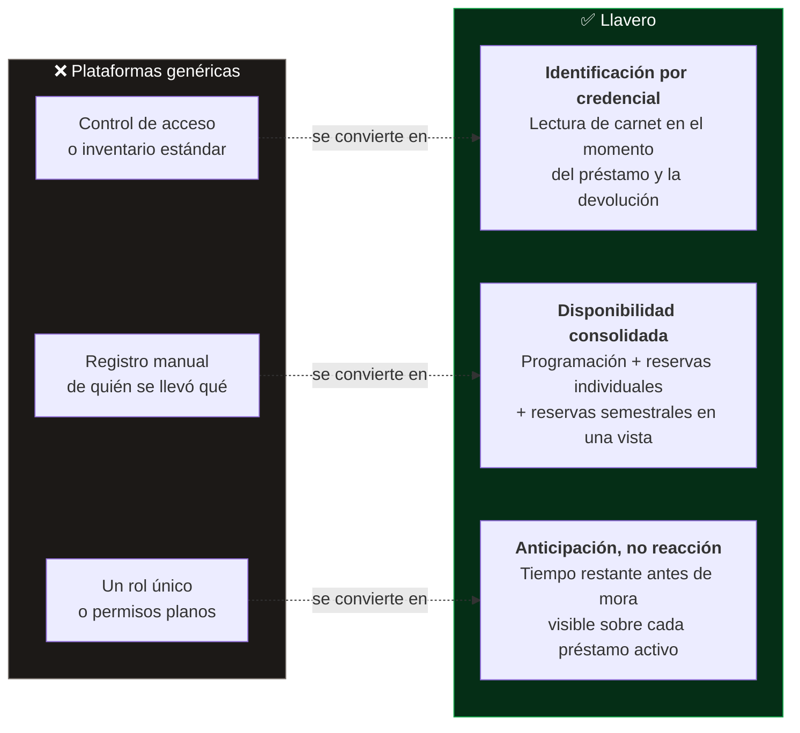
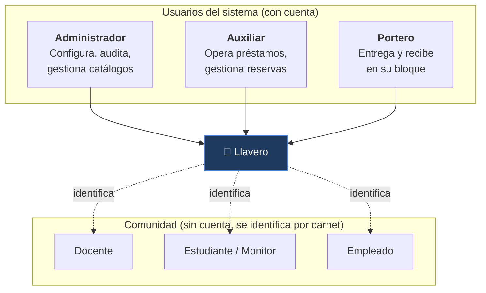

# 1.1 Visión

## Declaración de visión

En la gestión diaria de salones, llaves y equipos de la universidad se han evidenciado falencias en el control de préstamos y devoluciones, lo que conlleva a pérdida de trazabilidad, demoras en la disponibilidad de espacios académicos y riesgo de pérdida o daño de equipos sin un responsable identificado.

**Llavero** es una aplicación web para centralizar y automatizar el préstamo, la devolución y el control de llaves y equipos universitarios por medio de identificación por credencial y reglas claras de acceso por rol, incrementando la trazabilidad y la seguridad sobre los recursos físicos y mitigando las pérdidas y los conflictos de horario entre clases y reservas.

A diferencia de plataformas genéricas de control de acceso o inventario, nuestro producto se trata de una solución a la medida para la operación real de portería, oficina y coordinación académica de la universidad, mediante flujos diseñados específicamente para cada rol — Administrador, Auxiliar y Portero — y la forma en que cada uno trabaja en el día a día.

A diferencia de sistemas que ofrecen simplemente un registro manual de quién se llevó qué, esta propuesta incluye una vista de disponibilidad compartida entre programación académica, reservas individuales y reservas semestrales, además de un indicador de tiempo restante antes de mora sobre cada préstamo activo, que permiten a quienes administran los espacios anticiparse a los problemas en lugar de solo reaccionar cuando ya ocurrieron. De este modo, se puede brindar un control operativo continuo y confiable sobre los recursos físicos de la universidad, asegurando que cada llave y cada equipo prestado tenga siempre un responsable claro y un tiempo de devolución visible para todos los involucrados.

## Visión en formato estructurado

| Elemento | Contenido |
|---|---|
| **Para** | La coordinación académica, el personal de oficina y el personal de portería de la universidad |
| **Quienes** | Necesitan controlar el préstamo y la devolución de llaves de salón y equipos, y saber en todo momento qué espacios están ocupados |
| **El producto** | **Llavero**, una aplicación web de gestión de recursos físicos universitarios |
| **Que** | Centraliza el préstamo, la devolución y el control de llaves y equipos mediante identificación por credencial y reglas de acceso por rol |
| **A diferencia de** | Plataformas genéricas de control de acceso o de inventario |
| **Nuestro producto** | Está construido a la medida de la operación real de la universidad: cada rol tiene el flujo que corresponde a su trabajo, y la ocupación de salones se consolida en una sola vista que cruza las tres fuentes que hoy no se hablan |

## Los tres diferenciadores

### 1. Identificación por credencial, no por memoria

La persona se identifica con su carnet en el momento exacto del préstamo o la devolución. El sistema resuelve por sí solo quién es, qué clase tiene programada en ese momento, y si está autorizada a reclamar la llave de otro (delegación docente → monitor). Se elimina el reconocimiento visual y la búsqueda en listados.

### 2. Disponibilidad consolidada entre tres fuentes

La programación académica oficial, las reservas individuales y las reservas semestrales dejan de ser tres procesos ciegos entre sí. La ocupación de un salón se calcula cruzando las tres, de modo que un choque de horario se detecta **antes** de confirmar, no el día de la clase.

### 3. Anticipación en lugar de reacción

Cada préstamo activo lleva un indicador de tiempo restante antes de entrar en mora, y el sistema notifica automáticamente al responsable con recordatorios escalonados. Quien administra los espacios ve venir el problema en lugar de enterarse cuando ya ocurrió.

## Objetivos medibles

| Objetivo | Cómo lo hace posible el sistema |
|---|---|
| **Todo recurso prestado tiene un responsable identificado** | Cada préstamo referencia a una persona de la comunidad, la ubicación y el usuario que lo gestionó |
| **Todo préstamo tiene un tiempo de devolución visible** | Estado calculado (`en_prestamo`, `en_mora`, `demora_entrega`, `entregado`) sobre el tiempo máximo configurable por bloque |
| **Ningún choque de horario se descubre el día de la clase** | Restricción de exclusión en base de datos sobre solapamiento de reservas, más vista de ocupación consolidada |
| **Toda operación queda auditada** | Se registra qué usuario gestionó cada entrega y devolución, y desde qué ubicación |
| **Los daños dejan de perderse de palabra** | Novedades adjuntables en el momento de la devolución, con estado y responsable de resolución |
| **Portería trabaja a su ritmo** | Rol propio con permisos acotados por bloque y por operación |

## Alcance de usuarios

Distinción central del modelo: **los usuarios del sistema y la comunidad universitaria son dos poblaciones distintas.** Un docente no tiene cuenta ni contraseña — se identifica físicamente con su carnet. Solo Administrador, Auxiliar y Portero inician sesión.

## Documentos relacionados

- [1. Descripción del Problema](./1.%20Descripcion%20del%20Problema.md)
- [1.2 Mapa de Impactos](./1.2%20Mapa%20de%20Impactos.md)
- [2.2 Requerimientos](../2.%20Dise%C3%B1o%20estrat%C3%A9gico/2.2%20Requerimientos.md)
