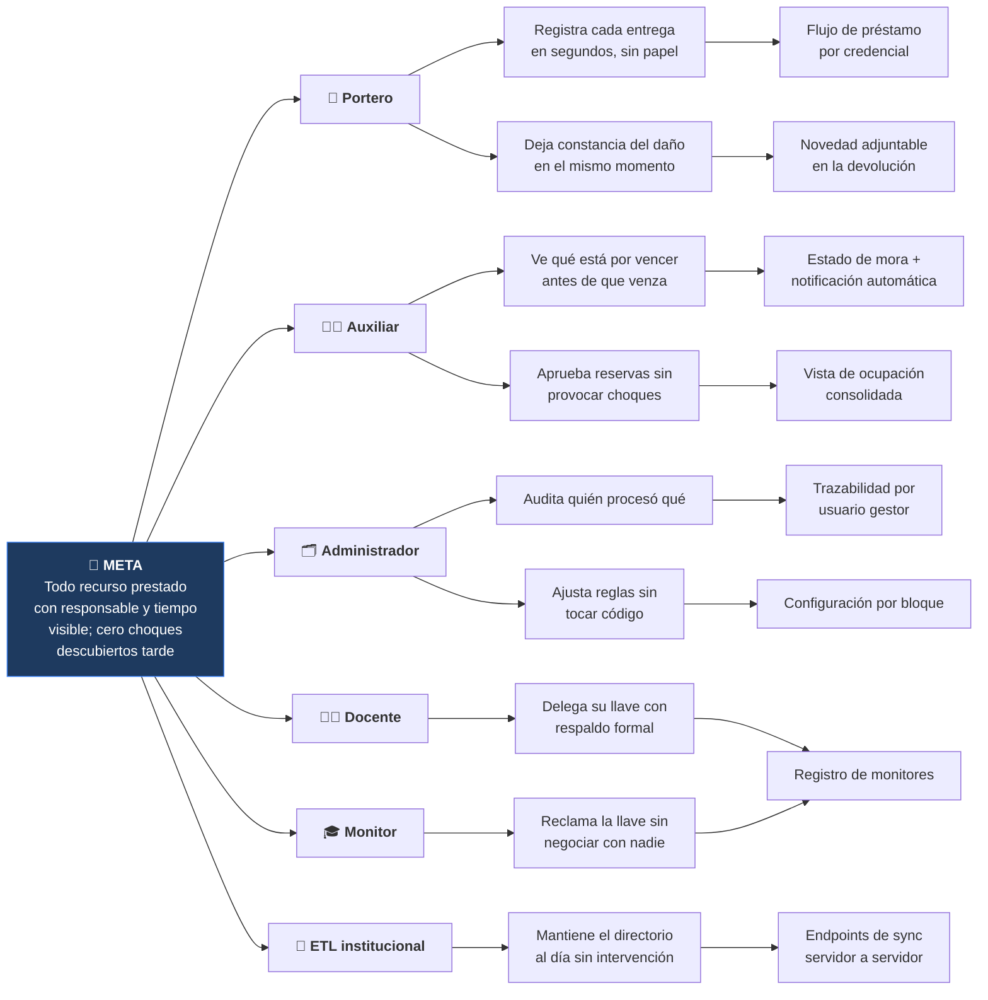
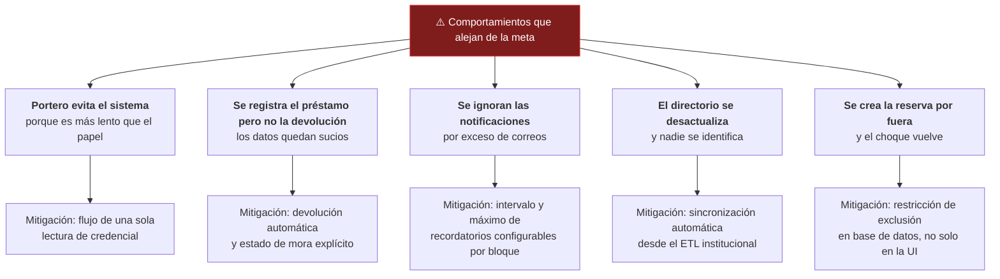

# 1.2 Mapa de Impactos

Técnica de *Impact Mapping*: se parte de una **meta** medible, se identifican los **actores** que pueden acercarla o alejarla, los **impactos** (cambios de comportamiento) que se busca provocar en cada uno, y por último los **entregables** que habilitan esos impactos.

La regla de lectura es de izquierda a derecha: `¿Por qué? → ¿Quién? → ¿Cómo? → ¿Qué?`. Los entregables nunca son el punto de partida.

## Meta

> **Que todo recurso físico prestado en la universidad tenga, en todo momento, un responsable identificado y un tiempo de devolución visible — y que ningún choque de horario se descubra el día de la clase.**

## Mapa general

## Detalle por actor

### Portero

Actor **primario**. Es quien más veces al día toca el sistema.

| Impacto buscado | Entregable que lo habilita |
|---|---|
| Registra cada entrega en segundos, sin papel ni búsqueda manual | Flujo de préstamo iniciado por lectura de credencial, que resuelve solo la persona, su clase del momento y su rol |
| Deja constancia de un daño en el mismo momento de recibirlo | Novedad adjuntable dentro del flujo de devolución, sin salir a otra pantalla |
| Opera únicamente lo que le corresponde en su puerta | Permisos por bloque y por operación (`portero_bloques`) |
| Consulta lo que él mismo procesó | Historial acotado al propio usuario |

> **Nota de alcance verificada en código:** el portero **presta y recibe llaves**, pero en equipos **solo recibe devoluciones, no presta**. No tiene acceso al directorio de comunidad ni a la gestión de monitores.

### Auxiliar

| Impacto buscado | Entregable que lo habilita |
|---|---|
| Ve qué préstamos están por vencer antes de que venzan | Indicador de tiempo restante y estado calculado sobre cada préstamo activo |
| Aprueba reservas sin provocar choques de horario | Vista de ocupación consolidada + validación de solapamiento en base de datos |
| Deja de perseguir devoluciones por teléfono | Cola de notificaciones automáticas con recordatorios escalonados |
| Gestiona reservas al mismo nivel que el administrador | Permisos de creación, aprobación y rechazo sobre reservas individuales y semestrales |

### Administrador

| Impacto buscado | Entregable que lo habilita |
|---|---|
| Audita quién procesó cada operación y desde dónde | `gestionado_por_usuario_id` y `ubicacion_*` en préstamos, devoluciones y registros de llaves |
| Ajusta las reglas de negocio sin tocar código | Configuración por bloque: tiempo máximo de préstamo, intervalo de recordatorio, máximo de recordatorios |
| Carga la programación de un semestre completo de una vez | Importador de Excel con resolución tolerante de docentes y salones |
| Decide la resolución de cada novedad | Ciclo de vida de novedades con estado monotónico (`abierta → en_revision → resuelta`) |

### Docente

Actor **secundario**: no usa el sistema directamente, pero su comportamiento determina si la meta se cumple.

| Impacto buscado | Entregable que lo habilita |
|---|---|
| Delega su llave a un monitor con respaldo formal, no de palabra | Registro de monitores vinculado a una fila concreta de programación |
| Devuelve a tiempo porque el sistema se lo recuerda | Correo de vencimiento y recordatorios escalonados |
| Sabe si su salón está libre antes de pedirlo | Vista de disponibilidad consultable |

### Monitor / Estudiante

| Impacto buscado | Entregable que lo habilita |
|---|---|
| Reclama la llave del docente sin tener que convencer a nadie en la puerta | Autorización verificable por credencial contra el registro de monitores |

### ETL institucional

Actor **sistema**: no es una persona, pero alimenta el sistema y puede alejarlo de la meta si falla.

| Impacto buscado | Entregable que lo habilita |
|---|---|
| Mantiene el directorio de comunidad al día sin intervención manual | `POST /api/comunidad/sync/estudiantes` y `/sync/empleados`, autenticados por API key servidor a servidor |
| Falla de forma visible, no silenciosa | Rate limiting y respuestas tipificadas en los endpoints de sincronización |

## Impactos negativos que hay que evitar

El *impact mapping* también sirve para nombrar lo que **alejaría** de la meta. Estos riesgos condicionan el diseño:

## Trazabilidad meta → entregable → módulo

| Entregable | Módulo del sistema |
|---|---|
| Flujo de préstamo por credencial | `features/llaves` |
| Novedad adjuntable en la devolución | `features/novedades` |
| Estado de mora + notificación automática | `features/notificaciones` + `notificacion.scheduler` |
| Vista de ocupación consolidada | `features/ocupacion` (frontend) sobre `programacion` + `reservas` + `reservas_semestrales` |
| Trazabilidad por usuario gestor | Columna `gestionado_por_usuario_id` en llaves, préstamos y devoluciones |
| Configuración por bloque | `features/configuracion` |
| Registro de monitores | `features/monitores` |
| Permisos por bloque y operación | `features/porteros` |
| Endpoints de sincronización | `features/comunidad` |

## Documentos relacionados

- [1. Descripción del Problema](./1.%20Descripcion%20del%20Problema.md)
- [1.1 Visión](./1.1%20Vision.md)
- [2.2 Requerimientos](../2.%20Dise%C3%B1o%20estrat%C3%A9gico/2.2%20Requerimientos.md)
