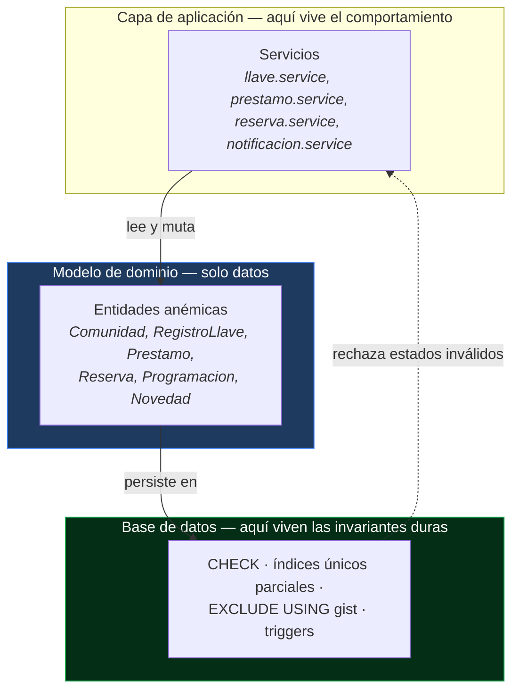
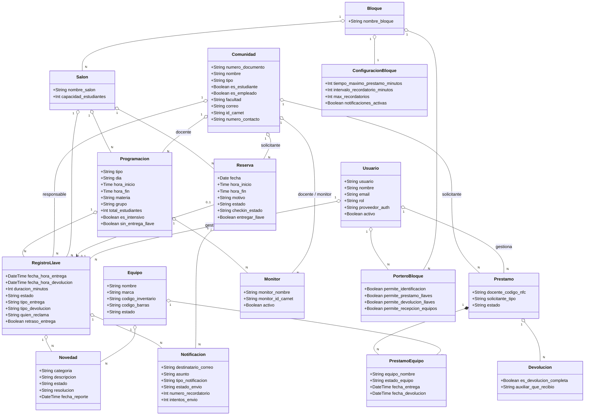
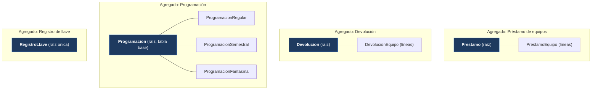
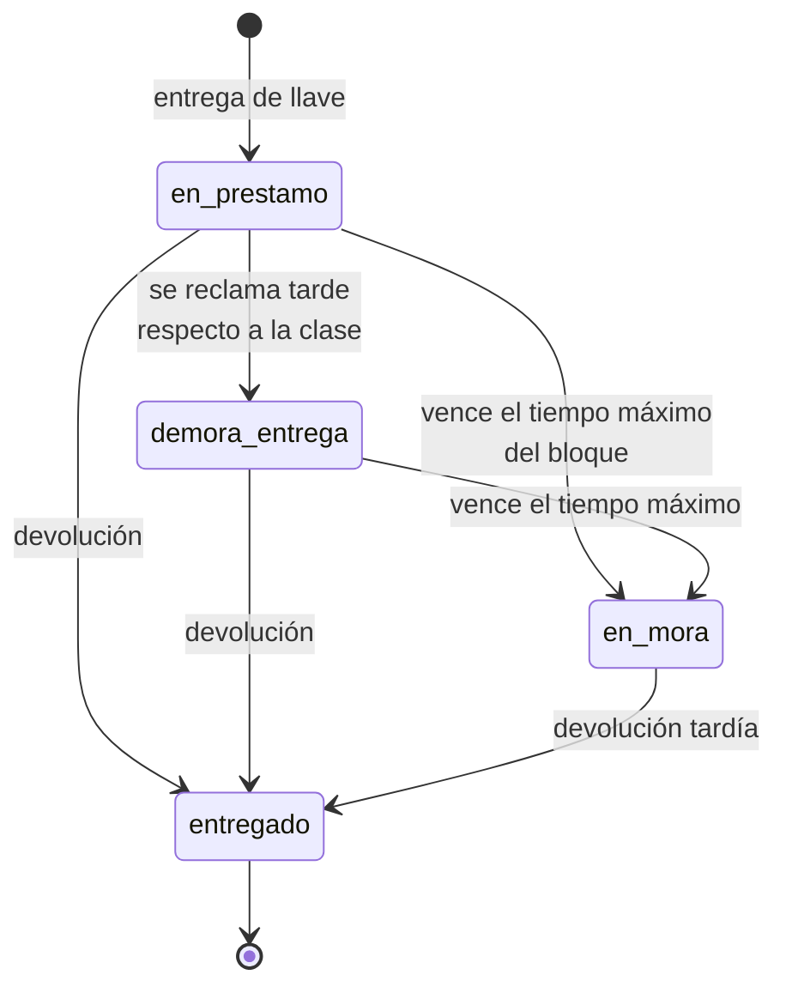
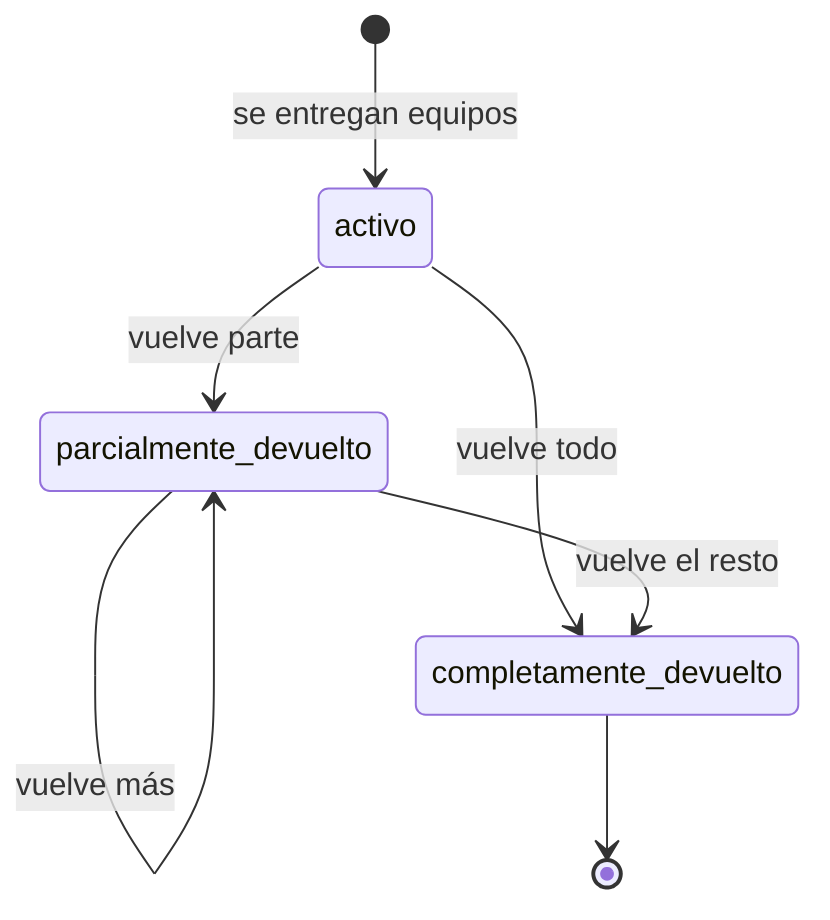
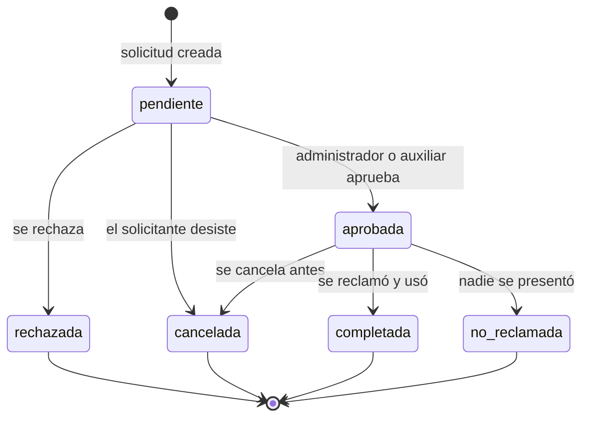
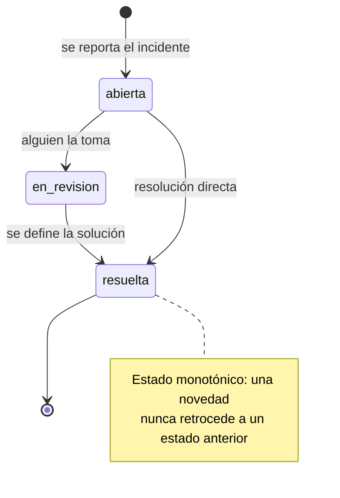

# 2.1 Modelo de Dominio Anémico

## Qué significa "anémico" aquí

Un **modelo de dominio anémico** es aquel en el que las entidades son contenedores de datos (atributos, sin comportamiento de negocio) y toda la lógica vive en una capa de servicios que las manipula desde afuera.

Llavero es deliberadamente anémico:

- Las **entidades** son filas de PostgreSQL leídas y escritas por repositorios Knex. No son objetos con métodos: son estructuras de datos planas.
- El **comportamiento** vive en los servicios (`*.service.js`), que orquestan las reglas de negocio.
- Las **invariantes duras** no se delegan al código de aplicación: viven en la base de datos como `CHECK`, índices únicos parciales, restricciones de exclusión y triggers.

> **Decisión de diseño explícita.** Se eligió empujar las invariantes críticas a la base de datos en vez de confiarlas al servicio. Motivo: hay tres vías de escritura sobre los mismos salones (programación, reservas individuales, reservas semestrales) y una validación en código solo protege al proceso que la ejecuta. Una restricción `EXCLUDE USING gist` protege contra cualquier escritor, incluida una migración de datos o una consulta manual.

## Lenguaje ubicuo

Términos del dominio, tal como los usan las personas de la universidad y tal como aparecen en el código:

| Término | Significado | Dónde vive |
|---|---|---|
| **Comunidad** | Persona de la universidad: docente, estudiante o empleado. No tiene cuenta de sistema; se identifica por documento o carnet. | `comunidad` |
| **Usuario** | Cuenta que inicia sesión: administrador, auxiliar o portero. Población distinta de la comunidad. | `usuarios` |
| **Bloque** | Edificio o pabellón. Agrupa salones y define el ámbito de permisos de un portero. | `bloques` |
| **Salón** | Espacio físico dentro de un bloque. Es lo que se ocupa y aquello a lo que da acceso una llave. | `salones` |
| **Programación** | Clase oficial del semestre, importada desde el sistema académico. | `programaciones` |
| **Reserva** | Solicitud puntual de un salón para una fecha y franja concretas. Requiere aprobación. | `reservas` |
| **Reserva semestral** | Ocupación recurrente durante todo el semestre (semillero, club, curso extracurricular). | `programaciones_semestrales` |
| **Registro de llave** | Un préstamo de llave: quién la tiene, desde cuándo, en qué estado. | `registros_llaves` |
| **Préstamo** | Un préstamo de equipos. Cabecera con una o más líneas de equipo. | `prestamos` + `prestamo_equipos` |
| **Devolución** | Acto de recibir equipos de vuelta. Puede ser parcial. | `devoluciones` + `devolucion_equipos` |
| **Monitor** | Estudiante autorizado por un docente para reclamar su llave en una clase concreta. | `monitores` |
| **Novedad** | Incidente sobre una llave o un equipo: daño, pérdida, no funciona, demora. | `novedades` |
| **Ubicación operativa** | Punto físico de atención (oficina, portería superior, portería inferior). Etiqueta la transacción. | `ubicaciones_operativas` |
| **Mora** | Estado de un préstamo cuyo tiempo máximo ya venció sin devolución. | Estado calculado |

## Diagrama del modelo de dominio

Entidades del dominio con sus atributos significativos. Se omiten las columnas universales (`id`, `created_at`, `updated_at`, `deleted_at`), presentes en todas.

## Agregados y sus fronteras

Aunque el modelo es anémico, sí hay fronteras de consistencia claras. Estas son las unidades que se escriben en una sola transacción:

**Programación** merece explicación: usa herencia *table-per-type*. Una fila base en `programaciones` más exactamente una fila en la tabla del subtipo correspondiente. Las tres subtablas no son hijos independientes sino la composición 1:1 de una misma entidad lógica, y por eso el repositorio siempre las escribe y borra en la misma transacción.

## Ciclos de vida (máquinas de estado)

El comportamiento del dominio se expresa sobre todo como transiciones de estado. Estas son las cuatro relevantes.

### Registro de llave

### Préstamo de equipos

### Reserva de salón

### Novedad

## Invariantes del dominio

Reglas que el sistema garantiza, y dónde se garantizan. La columna "Dónde" importa: lo que vive en la base de datos protege contra cualquier escritor.

| Invariante | Dónde se garantiza |
|---|---|
| Dos reservas activas no pueden solaparse en el mismo salón | Base de datos — `EXCLUDE USING gist` sobre `(salon_id, fecha, rango horario)` |
| Un equipo no puede estar entregado en dos préstamos a la vez | Base de datos — índice único parcial sobre `equipo_id WHERE estado_equipo = 'entregado'` |
| Una persona no puede tener dos llaves del mismo salón el mismo día y horario | Base de datos — índice único parcial `(comunidad_id, salon_id, dia_entrega, horario)` |
| Una novedad refiere a una llave o a un equipo, nunca a ambos | Base de datos — `CHECK (num_nonnulls(llave_id, equipo_id) <= 1)` |
| No se puede eliminar un padre con hijos vivos | Base de datos — trigger `block_soft_delete_with_active_children` |
| Un recordatorio no se envía dos veces | Base de datos — índice único parcial `(llave_id, tipo_notificacion, numero_recordatorio)` |
| El rol de un usuario es uno de los cuatro definidos | Base de datos — `CHECK` sobre `usuarios.rol` |
| Un préstamo entra en mora al vencer el tiempo del bloque | Aplicación — `notificacion.scheduler` cada 5 minutos |
| Un monitor solo puede reclamar la llave de la clase asignada | Aplicación — `llave.context.js` resuelve el rol contra `monitores` |
| El correo debe pertenecer a un dominio autorizado | Aplicación — `isDominioAutorizado` en `auth.constants.js` |

## Consecuencias de la elección anémica

| Ventaja | Costo |
|---|---|
| El esquema es la fuente de verdad; ningún camino de escritura puede saltarse las invariantes duras | La lógica queda repartida entre servicio y esquema: hay que leer ambos para entender una regla |
| Los servicios son fáciles de leer: son procedimientos explícitos | Riesgo de servicios que crecen sin límite si no se dividen por caso de uso |
| Encaja con la naturaleza del problema, que es sobre todo registro y consulta, no cálculo complejo | Si el dominio se vuelve más rico, migrar a un modelo con comportamiento será costoso |
| Los repositorios Knex son delgados y predecibles | Se pierde el tipado fuerte del dominio: las filas son objetos planos |

## Documentos relacionados

- [2.2 Requerimientos](./2.2%20Requerimientos.md)
- [4.1 Modelo de Datos](../4.%20Dise%C3%B1oTacticoDetallado/4.1%20Modelo%20de%20Datos.md)
- [4.2 Diagrama de clases](../4.%20Dise%C3%B1oTacticoDetallado/4.2%20Diagrama%20de%20clases.md)
