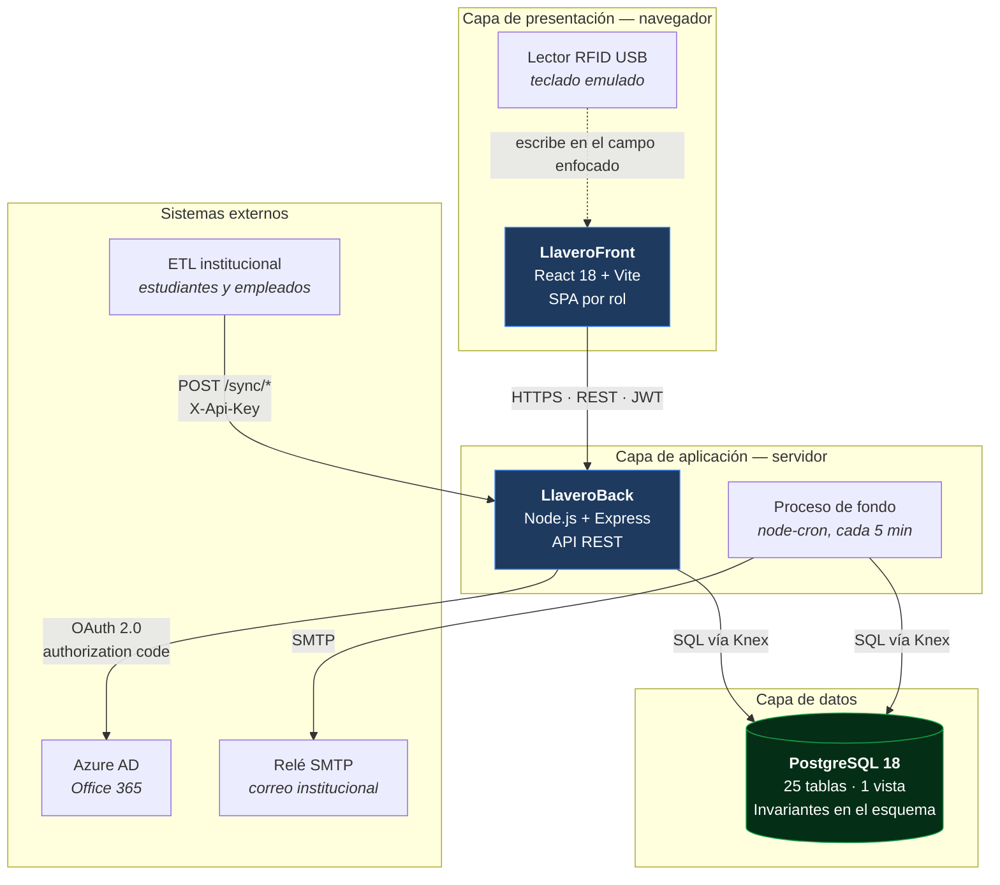
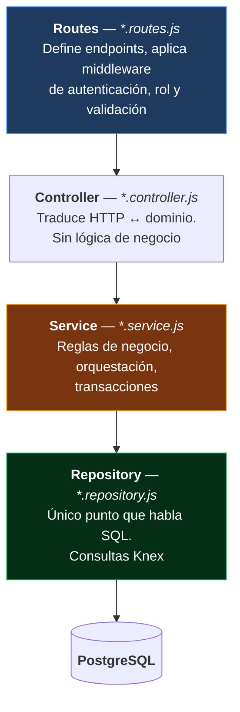
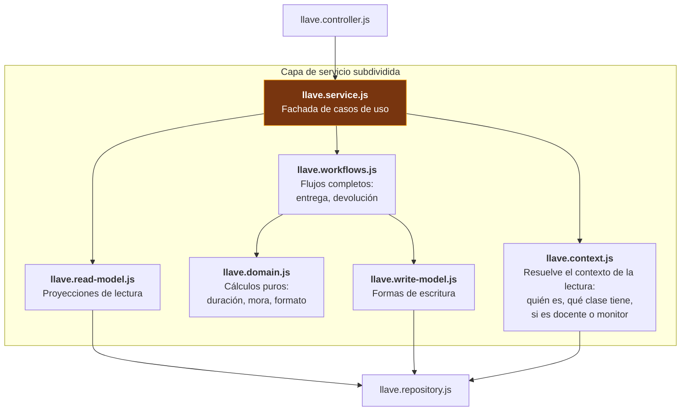
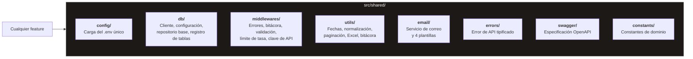
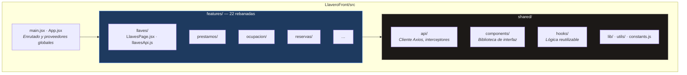
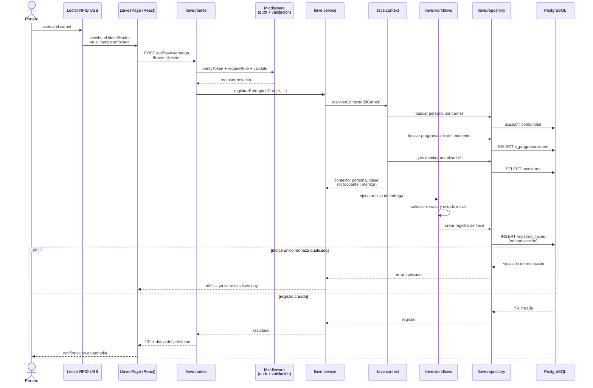
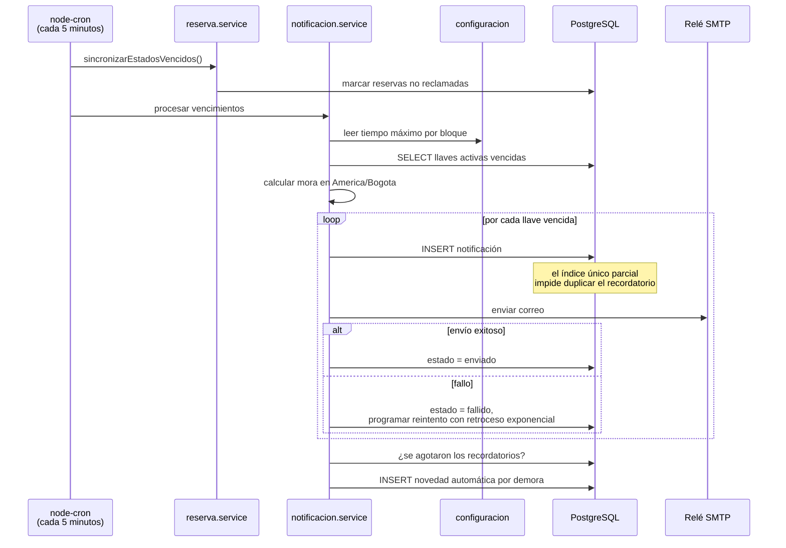
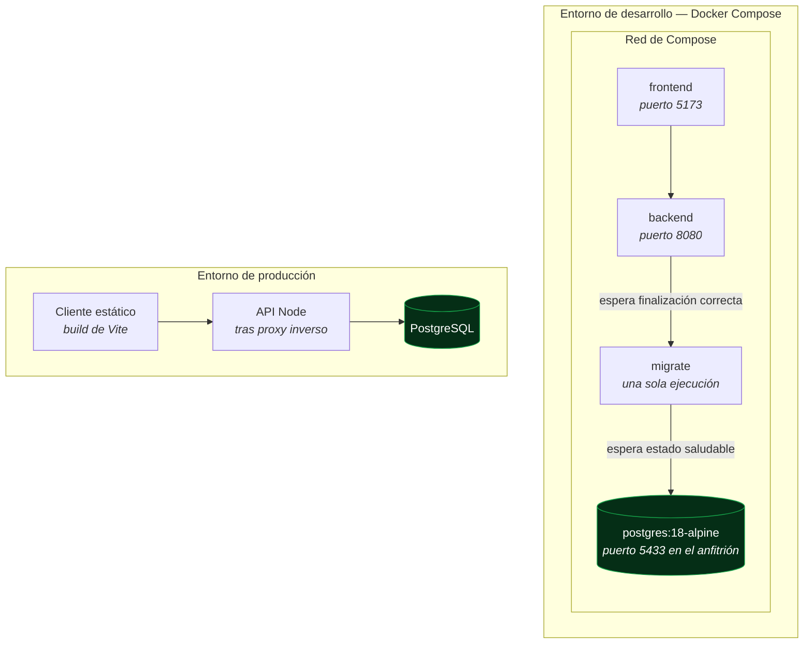

# 3.1 Arquitectura de Referencia

## Estilo arquitectónico

Llavero es una **aplicación web cliente-servidor de tres capas**, con el código organizado por **rebanadas verticales de funcionalidad** (*feature slicing*) en lugar de por capas técnicas horizontales.

Decisión central: la unidad de organización es la funcionalidad, no la capa. Todo lo que compone "llaves" —ruta, controlador, servicio, repositorio— vive en una sola carpeta. No hay una carpeta global de controladores ni una de modelos.

> **Nota de estado del proyecto.** Este diagrama refleja la arquitectura **vigente**. Dos componentes fueron retirados y no deben aparecer en documentación nueva: el firmware ESP32 de campo con lector RC522, y la pasarela NFC por Socket.IO sobre puerto serie. La lectura de credencial hoy es local a cada navegador mediante lectores RFID USB de tipo teclado emulado. La base de datos MongoDB fue reemplazada por completo por PostgreSQL.

## Capas lógicas del backend

Cada funcionalidad respeta la misma secuencia de capas. La dependencia siempre apunta hacia abajo: una capa nunca conoce a la que está sobre ella.

| Capa | Responsabilidad | Prohibido |
|---|---|---|
| **Routes** | Declarar el endpoint, encadenar middleware de autenticación, rol y validación. | Contener lógica |
| **Controller** | Extraer datos de la petición, invocar el servicio, dar forma a la respuesta HTTP. | Consultar la base de datos, decidir reglas |
| **Service** | Aplicar reglas de negocio, coordinar varios repositorios, abrir transacciones. | Conocer objetos `req` y `res` |
| **Repository** | Traducir a SQL mediante Knex. | Contener reglas de negocio |

### Cuando una funcionalidad crece: el caso de llaves

`features/llaves` es la funcionalidad más compleja del sistema y por eso subdivide su capa de servicio. Es la excepción documentada al patrón de cuatro archivos:

Motivo de la subdivisión: la resolución del contexto de una lectura de credencial (identificar la persona, encontrar su clase del momento, decidir si actúa como docente titular o como monitor delegado) es lógica sustancial e independiente del flujo de entrega. Mantenerlas separadas evita un servicio monolítico.

## Preocupaciones transversales

Todo lo que no pertenece a una funcionalidad concreta vive en `src/shared/`. Ninguna funcionalidad reimplementa estas piezas.

| Preocupación | Solución | Ubicación |
|---|---|---|
| Configuración | Un único `.env` en la raíz del monorepo, resuelto desde la ruta del módulo y no desde el directorio de trabajo | `shared/config/env.js` |
| Manejo de errores | Error tipificado más manejador global al final de la cadena de middleware | `shared/errors`, `shared/middlewares/error.handler.js` |
| Validación de entrada | Esquemas Zod aplicados como middleware antes del controlador | `shared/middlewares/validate.middleware.js` |
| Autenticación | Verificación de JWT y comprobación de rol como middleware componible | `features/auth/auth.middleware.js` |
| Límite de tasa | Cuatro limitadores distintos: autenticación, refresco, lectura de credencial y sincronización | `shared/middlewares/rate.limiter.js` |
| Bitácora | Registro por petición más registrador con espacio de nombres por módulo | `shared/middlewares/request.logger.js`, `shared/utils/logger.js` |
| Acceso a datos | Cliente Knex único y repositorio base con operaciones comunes | `shared/db/` |
| Correo | Servicio con plantillas separadas por tipo de mensaje | `shared/email/` |
| Documentación de API | OpenAPI generado desde anotaciones en las rutas | `shared/swagger/` |

## Arquitectura del frontend

El frontend replica la organización por funcionalidad y añade el patrón **contenedor-presentación**: las páginas orquestan, los componentes presentan.

Cada funcionalidad del frontend agrupa su página, sus componentes propios y su módulo de API (`*Api.js`), que es el único punto que conoce las rutas del backend para esa funcionalidad.

| Preocupación | Solución |
|---|---|
| Estado del servidor | TanStack Query — caché, revalidación y estados de carga |
| Estado del cliente | Zustand — sesión y preferencias |
| Formularios | React Hook Form con validación Zod, compartiendo esquema con el backend |
| Interfaz | Radix UI como base accesible, Tailwind para estilos, MUI para calendario y selección de fechas |
| Enrutado | React Router, con rutas protegidas según el rol |
| Notificaciones al usuario | Sonner y SweetAlert2 |
| Exportación | `xlsx` para Excel, `jspdf` y `jsbarcode` para etiquetas |

## Flujo de referencia: préstamo de llave por credencial

Recorrido completo, del lector físico a la base de datos. Es el caso de uso más frecuente del sistema.

## Flujo de referencia: proceso automático de fondo

Es el mecanismo que hace posible el diferenciador de "anticipación en lugar de reacción".

## Pila tecnológica

| Capa | Tecnología | Motivo de la elección |
|---|---|---|
| **Cliente** | React 18, Vite 5 | Ecosistema maduro, arranque y recarga rápidos en desarrollo |
| **Estado del servidor** | TanStack Query | Elimina el código repetitivo de caché e invalidación |
| **Interfaz** | Radix UI, Tailwind, MUI | Accesibilidad de base sin imponer estética; MUI solo para calendario y fechas |
| **Servidor** | Node.js 24, Express 4 | Un solo lenguaje en todo el proyecto; ecosistema conocido por el equipo |
| **Acceso a datos** | Knex | Constructor de consultas con migraciones versionadas, sin la indirección de un ORM completo |
| **Base de datos** | PostgreSQL 18 | Restricciones de exclusión, índices parciales, trigramas y `unaccent`: las invariantes viven en el esquema |
| **Validación** | Zod | Un mismo esquema sirve en cliente y servidor |
| **Autenticación** | `jsonwebtoken`, `jose`, `bcryptjs` | JWT propio más flujo OAuth contra Azure AD |
| **Correo** | Nodemailer | Envío por el relé SMTP institucional |
| **Tareas programadas** | node-cron | Suficiente para un proceso periódico único; sin infraestructura de colas |
| **Documentación de API** | swagger-jsdoc, swagger-ui-express | La especificación se genera desde las anotaciones de cada ruta |
| **Entorno local** | Docker Compose | Base de datos, migraciones, API y cliente con un solo comando |

## Vista de despliegue

Tres decisiones del entorno de desarrollo que conviene conocer:

1. **El puerto del anfitrión es 5433, no 5432.** La máquina de desarrollo ya ejecuta un PostgreSQL propio en 5432 y publicar sobre él fallaría al enlazar.
2. **El servicio de migración es una etapa aparte.** Esperar a que PostgreSQL acepte conexiones no prueba que el esquema exista; sobre un volumen nuevo el backend arrancaría contra tablas vacías. La migración corre hasta completarse y el backend depende de su código de salida.
3. **Un único `.env` en la raíz.** Se monta el repositorio completo en `/repo` dentro de los contenedores para que el backend y Vite resuelvan el mismo archivo que se usa al ejecutar en el anfitrión. Compose inyecta `PGHOST=postgres` como variable de entorno, y como `dotenv` nunca sobrescribe variables ya presentes, el archivo sigue siendo válido para procesos que corren fuera de los contenedores.

## Decisiones arquitectónicas registradas

| Decisión | Alternativa descartada | Motivo |
|---|---|---|
| Organización por funcionalidad | Organización por capa técnica | Un cambio de negocio toca una carpeta, no cinco |
| Invariantes duras en el esquema | Validación solo en el servicio | Hay tres vías de escritura sobre los mismos salones; una validación en código solo protege al proceso que la ejecuta |
| Modelo de dominio anémico | Modelo rico con comportamiento | El dominio es sobre todo registro y consulta; un modelo rico añadiría indirección sin beneficio |
| Constructor de consultas (Knex) | ORM completo | Consultas explícitas y migraciones versionadas, sin capa de mapeo que ocultar |
| Borrado lógico universal | Borrado físico | El historial de préstamos es evidencia de responsabilidad; nada debe desaparecer |
| Herencia por tabla de subtipo en programación | Tabla única con discriminador | Cada subtipo tiene atributos propios; una tabla única quedaría llena de columnas nulas |
| Instantánea de datos en préstamos | Solo llave foránea al catálogo | La historia de un préstamo no debe cambiar si luego se edita el equipo maestro |
| UUID v7 generado por la aplicación | Secuencia de enteros o UUID v4 | Ordenable por tiempo, y la aplicación conoce el identificador antes de insertar |
| Lector RFID de teclado emulado | Firmware ESP32 con pasarela por socket | Elimina un servicio, un dispositivo y un protocolo; cada usuario lee en su propio navegador |

## Documentos relacionados

- [2.1 Modelo de Dominio Anémico](../2.%20Dise%C3%B1o%20estrat%C3%A9gico/2.1%20Modelo%20Dominio%20An%C3%A9mico.md)
- [2.2 Requerimientos](../2.%20Dise%C3%B1o%20estrat%C3%A9gico/2.2%20Requerimientos.md)
- [4.3 Diagrama de Paquetes](../4.%20Dise%C3%B1oTacticoDetallado/4.3%20Diagrama%20de%20Paquetes.md)
- [4.4 Diagrama de Componentes](../4.%20Dise%C3%B1oTacticoDetallado/4.4%20Diagrama%20de%20Componentes.md)
