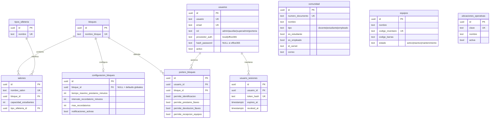
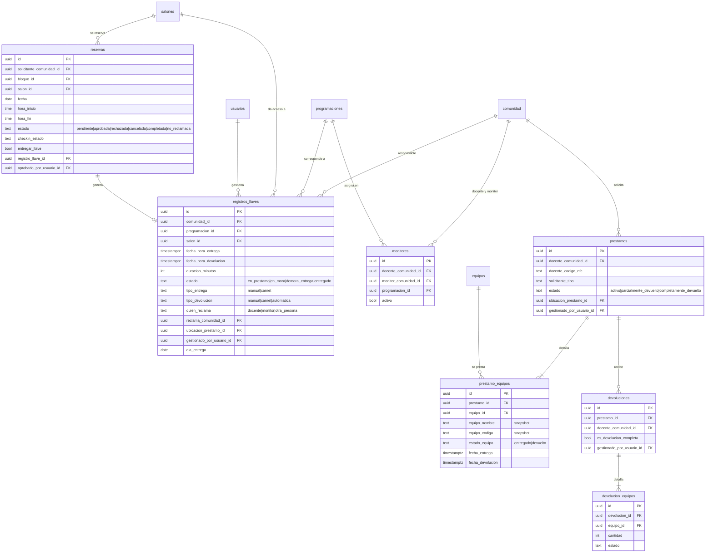
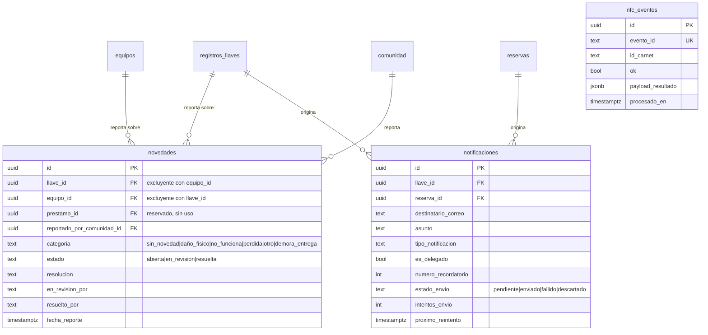
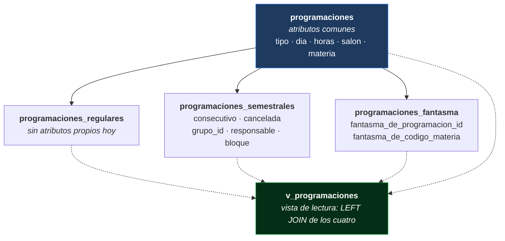
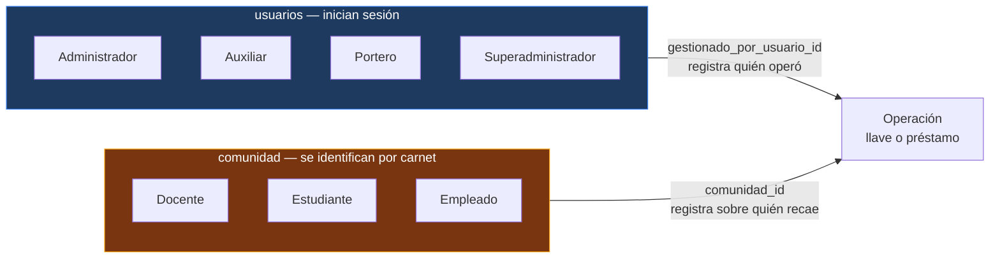

# 4.1 Modelo de Datos

Modelo físico de datos del sistema Llavero sobre PostgreSQL 18. **25 tablas** y **1 vista**, definidas por 21 migraciones Knex versionadas en `LlaveroBack/migrations/`.

El DDL completo y ejecutable está en [4.5 DDL.sql](./4.5%20DDL.sql).

---

## Convenciones transversales

Estas reglas aplican a **todas** las tablas de negocio. Conocerlas evita repetirlas en cada descripción.

### Columnas universales

```sql
id          uuid PRIMARY KEY               -- UUID v7 generado por la aplicación
created_at  timestamptz NOT NULL DEFAULT now()
updated_at  timestamptz NOT NULL DEFAULT now()
deleted_at  timestamptz NULL               -- borrado lógico: NULL = fila viva
```

**UUID v7 generado por la aplicación**, no por la base de datos. Es ordenable por tiempo (a diferencia de v4) y la aplicación conoce el identificador antes de insertar, lo que simplifica las escrituras de cabecera y línea en una misma transacción.

### Reglas del esquema

| Regla | Implementación | Por qué |
|---|---|---|
| **Ninguna llave foránea borra en cascada** | `ON DELETE RESTRICT` en todo el esquema, sin excepción | El historial de préstamos es evidencia de responsabilidad. Nada desaparece por efecto colateral |
| **Borrado lógico universal** | Columna `deleted_at` | Una llave devuelta hace un año sigue siendo auditable |
| **Índices únicos parciales** | `... WHERE deleted_at IS NULL` | Una fila eliminada lógicamente libera el slot único sin desaparecer del historial |
| **Marca de modificación automática** | Trigger `trg_set_updated_at` | El código de aplicación no puede olvidarla |
| **Protección de padres con hijos vivos** | Trigger `trg_block_soft_delete` | Impide eliminar un bloque que aún tiene salones activos |

### Extensiones requeridas

| Extensión | Uso |
|---|---|
| `unaccent` | Búsqueda de personas insensible a tildes |
| `pg_trgm` | Búsqueda difusa por trigramas sobre nombres |
| `btree_gist` | Restricción de exclusión que impide el solapamiento de reservas |

### Funciones del esquema

| Función | Propósito |
|---|---|
| `set_updated_at()` | Mantiene `updated_at` en cada actualización |
| `block_soft_delete_with_active_children(...)` | Rechaza el borrado lógico de una fila con hijos vivos. Recibe pares tabla/columna variables |
| `immutable_unaccent(text)` | Envoltorio inmutable de `unaccent`, requerido para poder indexar por él |

> **Detalle no obvio de `immutable_unaccent`.** Su cuerpo está calificado por esquema y con conversión explícita a `regdictionary`: `SELECT public.unaccent('public.unaccent'::regdictionary, $1)`. Al usarse dentro de una expresión de índice, PostgreSQL incorpora el cuerpo con un `search_path` restringido, y una llamada sin calificar falla con *"function unaccent(unknown, text) does not exist during inlining"* aunque la llamada directa funcione.

---

## Diagrama entidad-relación

Se omiten las columnas universales para no saturar el diagrama.

### Núcleo: catálogos e identidad



### Programación académica

```mermaid
erDiagram
    programacion_semestres ||--o{ programaciones : "agrupa"
    programaciones ||--o| programaciones_regulares : "subtipo"
    programaciones ||--o| programaciones_semestrales : "subtipo"
    programaciones ||--o| programaciones_fantasma : "subtipo"
    salones ||--o{ programaciones : "ocupa"
    comunidad ||--o{ programaciones : "dicta"

    programacion_semestres {
        uuid id PK
        text codigo UK
        int anio
        text periodo "1|2"
        date fecha_inicio
        date fecha_fin
        int total_registros
    }
    programaciones {
        uuid id PK
        text tipo "regular|semestral|fantasma"
        uuid semestre_id FK
        uuid docente_id FK "nullable"
        text docente_nombre "snapshot"
        text dia
        time hora_inicio
        time hora_fin
        uuid salon_id FK "nullable"
        text aula "snapshot"
        text materia
        text grupo
        bool es_intensivo
        bool sin_entrega_llave
    }
    programaciones_regulares {
        uuid programacion_id PK_FK
    }
    programaciones_semestrales {
        uuid programacion_id PK_FK
        int consecutivo
        bool cancelada
        uuid grupo_id "agrupa la serie"
        text tipo_solicitante
        uuid responsable_id FK
        uuid bloque_id FK
    }
    programaciones_fantasma {
        uuid programacion_id PK_FK
        uuid fantasma_de_programacion_id FK
        text fantasma_de_codigo_materia
    }
```

### Operación: llaves, equipos y reservas



### Soporte: novedades, notificaciones y eventos



---

## Catálogo de tablas

| # | Tabla | Propósito |
|---|---|---|
| 1 | `bloques` | Edificios o pabellones. Agrupan salones y delimitan permisos de portería |
| 2 | `tipos_silleteria` | Clasificación del mobiliario de un salón |
| 3 | `salones` | Espacios físicos. Es lo que se ocupa y a lo que da acceso una llave |
| 4 | `configuracion_bloques` | Reglas por bloque: tiempo máximo, recordatorios |
| 5 | `ubicaciones_operativas` | Puntos físicos de atención. Etiquetan la transacción |
| 6 | `comunidad` | Directorio de personas. Sujeto de negocio, no usuario del sistema |
| 7 | `equipos` | Inventario de equipos prestables |
| 8 | `usuarios` | Cuentas que inician sesión |
| 9 | `usuario_sesiones` | Tokens de refresco activos, almacenados como hash |
| 10 | `portero_bloques` | Permisos de un portero, por bloque y por operación |
| 11 | `programacion_semestres` | Metadatos de cada semestre cargado |
| 12 | `programaciones` | Tabla base de programación, con los atributos comunes |
| 13 | `programaciones_regulares` | Subtipo: clase oficial |
| 14 | `programaciones_semestrales` | Subtipo: ocupación recurrente del semestre |
| 15 | `programaciones_fantasma` | Subtipo: grupo derivado de otro |
| 16 | `registros_llaves` | Préstamos de llave. Tabla operativa central |
| 17 | `monitores` | Autorizaciones de docente a estudiante |
| 18 | `prestamos` | Cabecera de préstamo de equipos |
| 19 | `prestamo_equipos` | Línea de préstamo, con instantánea del equipo |
| 20 | `devoluciones` | Cabecera de devolución. Puede ser parcial |
| 21 | `devolucion_equipos` | Línea de devolución |
| 22 | `reservas` | Solicitudes puntuales de salón |
| 23 | `novedades` | Incidentes sobre llaves o equipos |
| 24 | `notificaciones` | Cola de correo con reintentos y control de duplicados |
| 25 | `nfc_eventos` | Registro de lecturas de credencial, con control de idempotencia |

**Vista:** `v_programaciones` — une la tabla base con sus tres subtipos mediante `LEFT JOIN`, de modo que los repositorios leen sin reconstruir la unión en cada consulta.

---

## Decisiones de modelado que conviene entender

### 1. Herencia por tabla de subtipo en programación

Una programación es una fila en `programaciones` **más** exactamente una fila en la tabla de su subtipo.



Se eligió sobre una tabla única con discriminador porque cada subtipo tiene atributos propios: una tabla única quedaría llena de columnas nulas para dos de cada tres filas.

> **Detalle deliberado:** las tres subtablas **no** llevan el trigger que impide el borrado lógico con hijos vivos. No son hijos independientes sino la composición 1:1 de una misma entidad lógica. El repositorio siempre elimina primero la fila del subtipo y luego la base, en la misma transacción; añadir la protección haría imposible eliminar cualquier programación aun respetando ese orden.

### 2. Instantáneas junto a llaves foráneas

Varias tablas guardan **a la vez** una llave foránea y una copia del texto:

| Tabla | Llave foránea | Instantánea |
|---|---|---|
| `programaciones` | `docente_id`, `salon_id` | `docente_nombre`, `aula` |
| `prestamo_equipos` | `equipo_id` | `equipo_nombre`, `equipo_codigo`, `equipo_marca` |
| `registros_llaves` | `comunidad_id`, `salon_id` | `docente_nombre`, `aula` |

Dos motivos distintos:

- **En programación, tolerancia a la ingesta.** El importador de Excel puede referenciar docentes o salones que no existen en el catálogo. Resuelve la llave foránea cuando puede y la deja nula cuando no, conservando el texto original. Así la carga de un semestre completo nunca falla por huecos en el directorio.
- **En préstamos, inmutabilidad histórica.** La historia de un préstamo no debe cambiar si después se edita el equipo maestro. Lo que se entregó aquel día se entregó con aquel nombre y aquel código.

### 3. Invariantes que viven en el esquema

Estas restricciones protegen contra **cualquier** escritor, incluida una consulta manual o una migración de datos.

| Restricción | Definición | Qué impide |
|---|---|---|
| `ex_reservas_no_overlap` | `EXCLUDE USING gist (salon_id =, fecha =, tsrange(...) &&) WHERE estado IN ('pendiente','aprobada')` | Dos reservas activas solapadas en el mismo salón |
| `ux_prestamo_equipos_equipo_activo` | `UNIQUE (equipo_id) WHERE estado_equipo = 'entregado'` | Prestar un equipo ya entregado |
| `ux_registros_llaves_dedupe_dia_horario` | `UNIQUE (comunidad_id, salon_id, dia_entrega, horario)` | Duplicar el préstamo de la misma llave el mismo día y horario |
| `ck_novedades_recurso_exclusivo` | `CHECK (num_nonnulls(llave_id, equipo_id) <= 1)` | Una novedad que apunte a llave y equipo a la vez |
| `ux_notificaciones_dedupe_llave` | `UNIQUE (llave_id, tipo_notificacion, numero_recordatorio)` | Enviar dos veces el mismo recordatorio |
| `ux_notificaciones_dedupe_reserva` | `UNIQUE (reserva_id, tipo_notificacion)` | Duplicar el aviso de reserva no reclamada |
| `ux_nfc_eventos_evento_id` | `UNIQUE (evento_id)` | Procesar dos veces la misma lectura de credencial |

> **Límite conocido del control de duplicados de llaves.** En un índice único de PostgreSQL, dos valores nulos se consideran distintos entre sí. Si `comunidad_id` o `salon_id` no se resuelven —porque la persona o el aula no están en el catálogo— la protección **no aplica** a esa fila. Es una consecuencia aceptada del diseño tolerante a la ingesta.

### 4. La configuración global y el problema de la llave foránea nula

`configuracion_bloques.bloque_id` es **anulable**, a propósito. Existe una fila de valores por defecto que no pertenece a ningún bloque, y una llave foránea obligatoria no puede representar "ningún bloque". El índice único la trata como un espacio propio:

```sql
CREATE UNIQUE INDEX ux_configuracion_bloques_bloque_id
  ON configuracion_bloques (COALESCE(bloque_id::text, '__defaults__'))
  WHERE deleted_at IS NULL;
```

Así se conserva la invariante de "como máximo una fila de valores por defecto" y a la vez cada bloque real mantiene su llave foránea correcta.

### 5. Dos poblaciones de personas, deliberadamente separadas



No hay llave foránea entre `usuarios` y `comunidad`. Son poblaciones distintas con ciclos de vida distintos: la comunidad se sincroniza desde el ETL institucional, los usuarios se administran dentro del sistema. Un docente **no** tiene cuenta.

### 6. La evolución del rol de portería

`ubicaciones_operativas` ya no autoriza operaciones; quedó como registro histórico. Antes, la ubicación llegaba en el cuerpo de la petición y cualquiera podía elegirla. Hoy la autorización se resuelve por **rol más bloque** a través de `portero_bloques`, y la ubicación solo etiqueta la transacción.

Junto con ese cambio se añadió `gestionado_por_usuario_id` a `registros_llaves`, `prestamos` y `devoluciones`: antes solo se guardaba la ubicación, sin referencia a **quién** procesó la operación.

---

## Índices por propósito

| Propósito | Índices representativos |
|---|---|
| **Búsqueda de personas** | `idx_comunidad_nombre_trgm` (GIN con trigramas sobre `immutable_unaccent(nombre)`), `idx_comunidad_id_carnet` |
| **Filtrado operativo** | `idx_registros_llaves_estado`, `idx_prestamos_estado`, `idx_reservas_estado`, `idx_novedades_estado` |
| **Consulta temporal** | `idx_registros_llaves_fecha_hora_entrega`, `idx_reservas_fecha`, `idx_notificaciones_fecha_envio` |
| **Navegación de relaciones** | Un índice por cada llave foránea de consulta frecuente |
| **Programación** | Índices compuestos `(semestre_id, tipo)`, `(semestre_id, dia)`, `(tipo, dia)` |
| **Cola de envío** | `idx_notificaciones_estado_envio_reintento` sobre `(estado_envio, proximo_reintento)` |
| **Auditoría** | `idx_registros_llaves_gestionado_por`, `idx_prestamos_gestionado_por`, `idx_devoluciones_gestionado_por` |

---

## Historial de migraciones

| Migración | Qué introduce |
|---|---|
| `001` | Extensiones, funciones y triggers base |
| `002` | Catálogos: bloques, silletería, salones, configuración, ubicaciones, comunidad, equipos |
| `003` | Usuarios y sesiones |
| `004` | Programación con herencia por subtipo y vista de lectura |
| `005` | Registros de llaves y monitores |
| `006` | Préstamos y devoluciones de equipos |
| `007` | Reservas, eventos de credencial, notificaciones y novedades |
| `008` | Autenticación por Office 365 y rol de superadministrador |
| `009` | Rol de portería, permisos por bloque y trazabilidad de gestor |
| `010`–`012` | Ajustes de estados de novedad y renombrado de permiso |
| `013` | Comunidad: persona simultáneamente estudiante y empleado |
| `014`–`015` | Control de duplicados por horario y devolución automática |
| `016` | Trazabilidad de revisión y resolución de novedades |
| `017` | Un equipo no puede estar entregado dos veces |
| `018` | Restricción de exclusión contra solapamiento de reservas |
| `019`–`020` | Programación intensiva y exenta de entrega de llave |
| `021` | Recreación de la vista de programaciones |

---

## Documentos relacionados

- [2.1 Modelo de Dominio Anémico](../2.%20Dise%C3%B1o%20estrat%C3%A9gico/2.1%20Modelo%20Dominio%20An%C3%A9mico.md)
- [4.2 Diagrama de clases](./4.2%20Diagrama%20de%20clases.md)
- [4.5 DDL.sql](./4.5%20DDL.sql)
