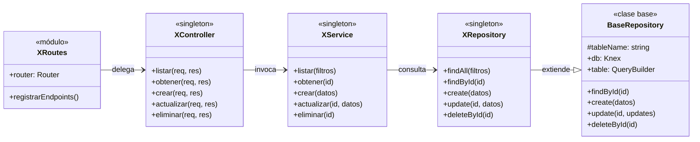
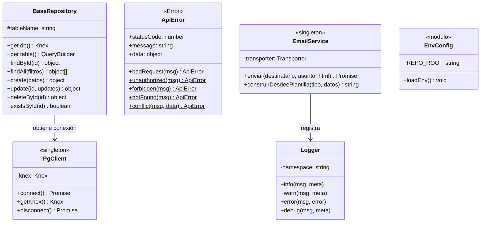
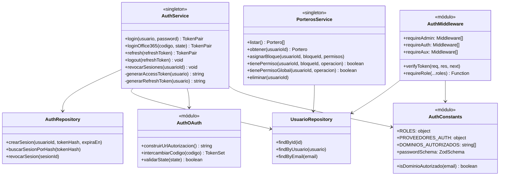
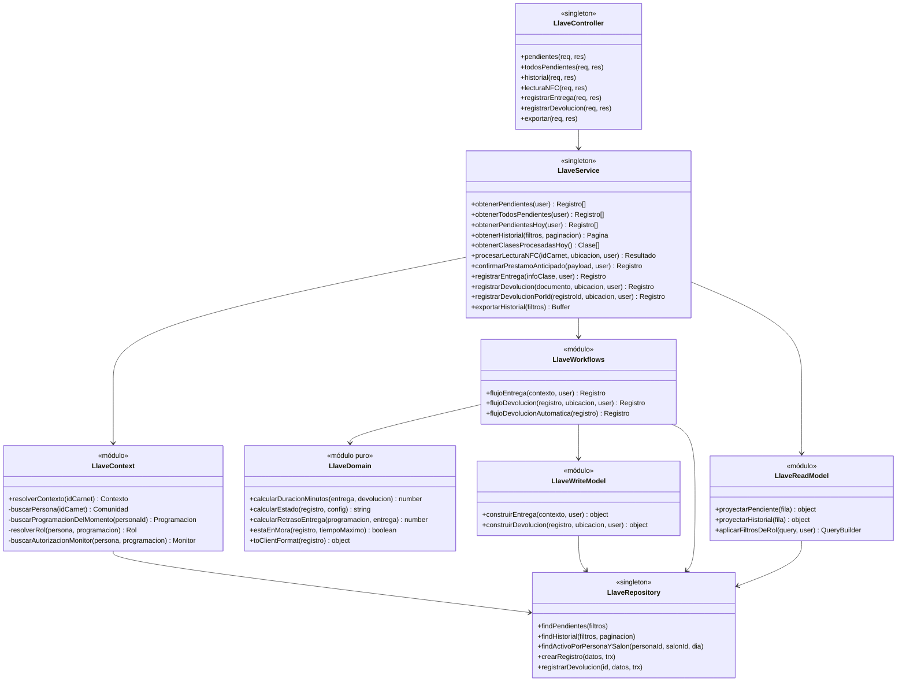
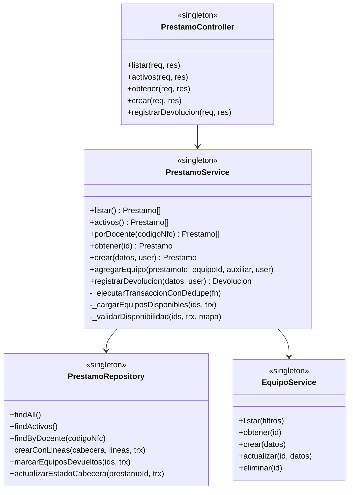
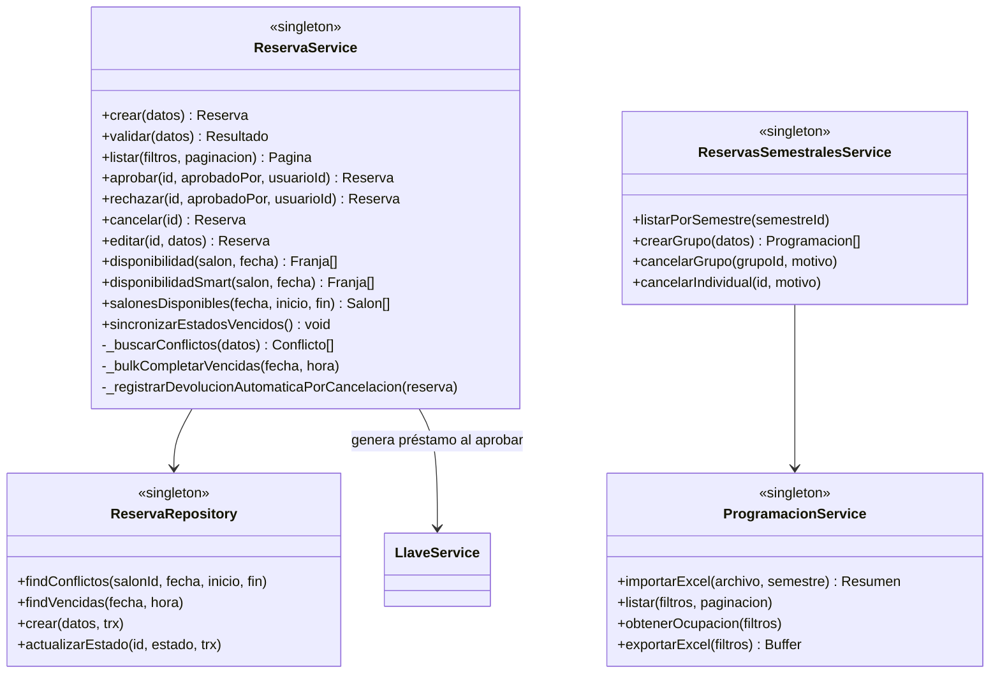
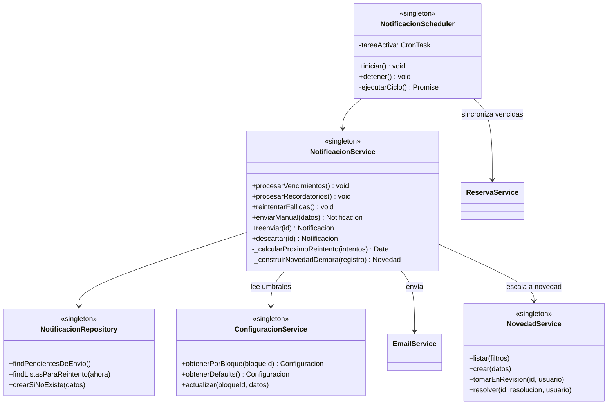
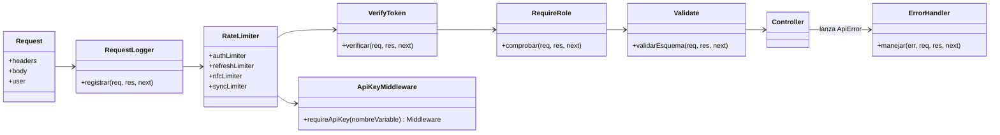

# 4.2 Diagrama de Clases

Estructura de clases del backend. El sistema sigue un **modelo de dominio anémico**: las entidades son estructuras de datos planas y el comportamiento vive en servicios. Por eso este documento describe sobre todo las clases de **servicio** y **repositorio**, no las de dominio.

Convención de todo el backend: cada servicio y cada repositorio se exporta como **una única instancia** (`module.exports = new XService()`), no como clase. Son singletons sin estado propio más allá de sus dependencias.

---

## Patrón estructural por funcionalidad

Toda funcionalidad repite las mismas cuatro clases y la misma dirección de dependencia.

### Contrato de responsabilidades

| Clase | Conoce | No debe conocer |
|---|---|---|
| `XRoutes` | Express, middleware, controlador | Reglas de negocio |
| `XController` | `req`, `res`, servicio | Knex, SQL, tablas |
| `XService` | Repositorios, otros servicios, transacciones | `req`, `res`, HTTP |
| `XRepository` | Knex, nombres de tabla | Reglas de negocio |

---

## Infraestructura compartida

| Clase | Responsabilidad |
|---|---|
| `BaseRepository` | Operaciones CRUD comunes. Aplica borrado lógico y genera UUID v7 al crear |
| `PgClient` | Conexión Knex única para todo el proceso |
| `ApiError` | Error tipificado con código HTTP. Construido por métodos estáticos de fábrica |
| `Logger` | Registro con espacio de nombres por módulo |
| `EmailService` | Envío por SMTP con plantillas separadas por tipo |
| `EnvConfig` | Carga del `.env` único, resuelto desde la ruta del módulo y no desde el directorio de trabajo |

> **Detalle de `BaseRepository.update`:** no estampa `updated_at`. Esa columna la mantiene un trigger de base de datos, de modo que ningún camino de escritura pueda olvidarla.

---

## Autenticación y autorización

`requireRole` es una **fábrica de middleware**: recibe los roles admitidos y devuelve el middleware que los comprueba. Eso permite componer atajos legibles en las rutas (`requireAdmin`, `requireAux`) sin repetir la comprobación.

`PorterosService` distingue dos formas de comprobar permisos:

- `tienePermiso(usuarioId, bloqueId, operacion)` — para llaves, que sí están ligadas a un bloque.
- `tienePermisoGlobal(usuarioId, operacion)` — para equipos, que en el modelo de datos actual no pertenecen a ningún bloque. Basta con tener el permiso habilitado en al menos uno.

---

## Llaves: la funcionalidad con servicio subdividido

`features/llaves` es la única que divide su capa de servicio, por el peso de su lógica.

| Módulo | Por qué existe por separado |
|---|---|
| `llave.context.js` | Resolver quién es la persona, qué clase le corresponde en ese momento y si actúa como docente titular o monitor delegado es lógica sustancial e independiente del flujo de entrega |
| `llave.domain.js` | Cálculos puros y sin efectos: duración, mora, retraso, formato de salida. Es la parte trivialmente comprobable |
| `llave.workflows.js` | Secuencias completas de entrega y devolución, incluida la transacción |
| `llave.read-model.js` | Proyecciones de lectura. Aquí vive el filtrado por rol, que acota al portero a lo que él mismo gestionó |
| `llave.write-model.js` | Construye las formas de escritura, separando el "qué se guarda" del "cómo se decide" |

---

## Préstamos de equipos

Los métodos con prefijo `_` son internos del servicio. `_validarDisponibilidad` comprueba en la aplicación lo que el índice único parcial `ux_prestamo_equipos_equipo_activo` garantiza en la base de datos: es una comprobación temprana para dar un mensaje claro, no la garantía en sí.

---

## Reservas

`_buscarConflictos` cruza las **tres** fuentes de ocupación: programación académica, reservas individuales y reservas semestrales. Es la implementación del diferenciador de disponibilidad consolidada descrito en la visión.

`sincronizarEstadosVencidos` es el punto de entrada que invoca el proceso de fondo cada 5 minutos.

---

## Notificaciones y proceso de fondo

`crearSiNoExiste` se apoya en el índice único parcial de la tabla: intenta insertar y trata la violación de restricción como "ya existe". Es control de duplicados a nivel de base de datos, no una comprobación previa susceptible de condición de carrera.

`_calcularProximoReintento` implementa el retroceso exponencial sobre `intentos_envio`.

---

## Middleware como cadena componible

Dos caminos de autenticación excluyentes:

- **Sesión de usuario** — `verifyToken` seguido de `requireRole`. Es el camino del navegador.
- **Servidor a servidor** — `requireApiKey('COMUNIDAD_SYNC_API_KEY')`. Es el camino del ETL institucional. No hay sesión ni usuario.

---

## Mapa completo de servicios

| Servicio | Funcionalidad | Colabora con |
|---|---|---|
| `AuthService` | Inicio de sesión, tokens, sesiones | `UsuarioRepository`, `AuthOAuth` |
| `UsuarioService` | Gestión de cuentas | `UsuarioRepository` |
| `PorterosService` | Permisos por bloque y operación | `PorterosRepository` |
| `ComunidadService` | Directorio y sincronización desde el ETL | `ComunidadRepository` |
| `ProgramacionService` | Importación de Excel, consulta, exportación | `ProgramacionRepository`, `ExcelParser` |
| `ReservasSemestralesService` | Reservas recurrentes por grupo | `ProgramacionService` |
| `LlaveService` | Préstamo y devolución de llaves | `LlaveContext`, `LlaveWorkflows`, `LlaveRepository` |
| `MonitorService` | Autorizaciones de docente a estudiante | `MonitorRepository` |
| `PrestamoService` | Préstamo y devolución de equipos | `PrestamoRepository`, `EquipoService` |
| `EquipoService` | Inventario | `EquipoRepository` |
| `ReservaService` | Reservas puntuales y disponibilidad | `ReservaRepository`, `LlaveService` |
| `NovedadService` | Incidentes y su seguimiento | `NovedadRepository` |
| `NotificacionService` | Cola de correo, recordatorios, escalado | `EmailService`, `ConfiguracionService`, `NovedadService` |
| `ConfiguracionService` | Reglas por bloque | `ConfiguracionRepository` |
| `SalonService`, `BloqueService`, `TipoSilleteriaService`, `UbicacionService` | Catálogos | Sus repositorios |

---

## Documentos relacionados

- [2.1 Modelo de Dominio Anémico](../2.%20Dise%C3%B1o%20estrat%C3%A9gico/2.1%20Modelo%20Dominio%20An%C3%A9mico.md)
- [4.1 Modelo de Datos](./4.1%20Modelo%20de%20Datos.md)
- [4.3 Diagrama de Paquetes](./4.3%20Diagrama%20de%20Paquetes.md)
